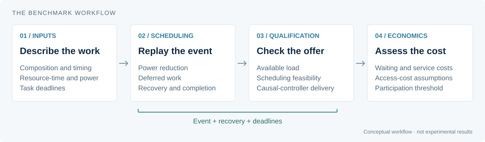
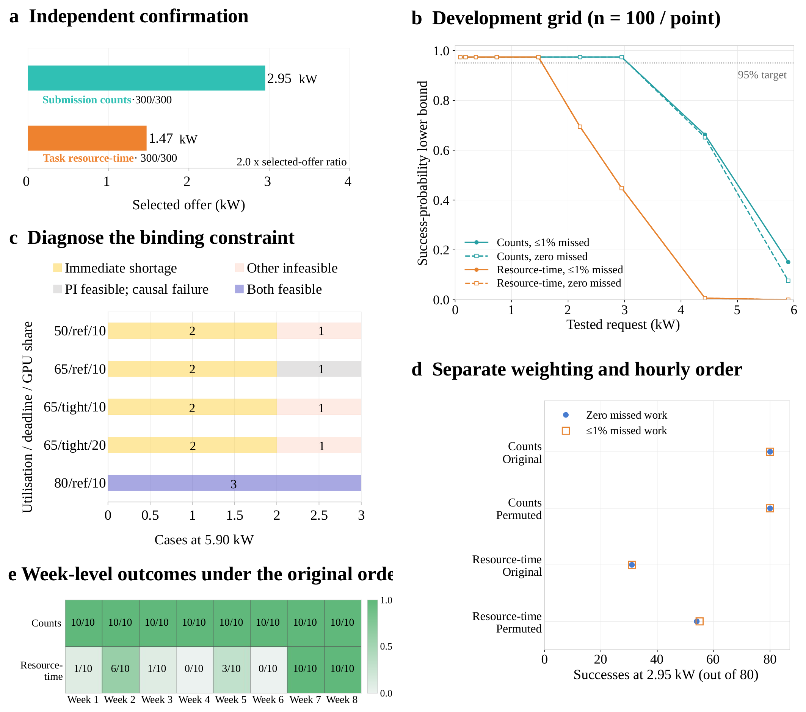
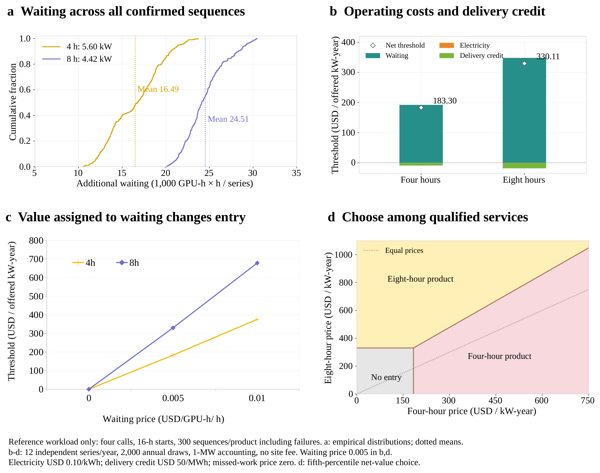

<p align="center">
  
</p>

<h1 align="center">AIDRBench</h1>

<p align="center"><strong>Reliable demand response from AI data centres</strong></p>

<p align="center">
  <a href="paper/v0.27/latex/main.pdf">Paper</a> ·
  <a href="paper/v0.27/latex/supplement.pdf">Supplementary information</a> ·
  <a href="docs/getting-started.md">Installation</a> ·
  <a href="docs/figures.md">Results</a> ·
  <a href="docs/GITHUB_V027.md">Data availability</a>
</p>

<p align="center">
  <a href="https://github.com/daxiang415/AIDRBench/actions/workflows/ci.yml"></a>
  
</p>

AIDRBench evaluates power-reduction commitments from AI data centres under workload and service constraints. It combines workload replay, hardware-calibrated power models and scheduling to assess delivery during demand-response events, subsequent recovery and task completion.

The study examines how workload representation changes the capacity that can be offered, distinguishes supply shortages from scheduling and controller limitations, and evaluates participation costs for qualified response products. The repository provides the implementation, experiment configurations, source tables and figure-generation scripts accompanying the paper.

## Overview



Qualification considers the full event-and-recovery sequence, not just the reduction during an event. Capacity and cost estimates are conditional on the workload distribution, baseline, service criteria and economic assumptions documented in the [paper](paper/v0.27/latex/main.pdf).

## Installation

Use Python 3.12 and a full Git clone. Commands for PowerShell are in the [Windows guide](WINDOWS_START_HERE.md).

```bash
git clone https://github.com/daxiang415/AIDRBench.git
cd AIDRBench
python3.12 -m venv .venv
.venv/bin/python -m pip install -c requirements-certificate.txt -e ".[control,analysis,dev,paper]"
.venv/bin/python tools/aidr.py doctor
```

For figure reproduction only, install `.[paper]` instead of the full set of optional dependencies. CPU execution is sufficient for the supplied figure scripts and software tests. GPU power measurements require the corresponding hardware.

## Reproduce figures and run checks

The supplementary figure scripts read the included panel-level CSV files:

```bash
.venv/bin/python tools/aidr.py redraw --figures S5
```

Omit `--figures S5` to generate all ten supplementary figures. Outputs are written to `paper/v0.27/figures/supplement/MY_REDRAW/`; reference figures are not overwritten. [Figure data and commands](docs/figures.md) cover both main and supplementary figures.

Verify the checkout and run the test suite:

```bash
.venv/bin/python tools/aidr.py check --hashes
.venv/bin/python tools/aidr.py test
```

Figure reproduction uses existing source tables. It is separate from rerunning the experiments, which requires additional production inputs described under [data availability](docs/GITHUB_V027.md).

## Results

<table>
<tr>
<td width="50%"><a href="paper/v0.27/figures/main/01_FIGURES/AIDRBench_Figure_3.png"></a></td>
<td width="50%"><a href="paper/v0.27/figures/main/01_FIGURES/AIDRBench_Figure_6.png"></a></td>
</tr>
<tr>
<td><strong>Workload representation and delivery.</strong> Response capacity and failure modes under different workload descriptions.</td>
<td><strong>Participation economics.</strong> Waiting exposure, cost thresholds and response-product choices.</td>
</tr>
</table>

[All main figures and source tables](docs/figures.md) · [Supplementary figures](paper/v0.27/figures/supplement/README.md)

## Repository structure

| Path | Contents |
| --- | --- |
| `src/aidrbench/` | Benchmark implementation |
| `configs/` | Model and experiment configurations |
| `tests/` | Unit tests and regression checks |
| `manuscript/source_data/` | Source tables and supporting evidence |
| `manuscript/revisions/` | Study drivers and research protocols |
| `paper/v0.27/` | Paper, supplementary information and figure resources |
| `docs/` | Installation and reproducibility documentation |

## Data availability

Panel-level data, compact result tables, calibration evidence and test fixtures are included. Bulk production workloads, complete hourly trajectories and per-scenario recovery inputs are not distributed in this checkout. Full-study replay requires those inputs; see [reproducibility scope](docs/GITHUB_V027.md).

The repository accompanies manuscript v0.27. A software licence and archival DOI have not yet been assigned.

## Issues

For questions or reproducibility problems, [open an issue](https://github.com/daxiang415/AIDRBench/issues) with the commit, operating system, Python version, command and relevant output.
