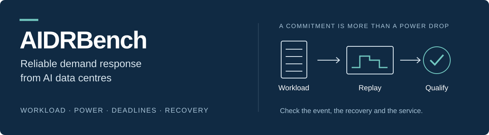

<p align="center">
  
</p>

<p align="center">
  <a href="paper/v0.27/latex/main.pdf">Paper</a> ·
  <a href="paper/v0.27/latex/supplement.pdf">Supplement</a> ·
  <a href="docs/getting-started.md">Getting started</a> ·
  <a href="docs/figures.md">Figure gallery</a> ·
  <a href="docs/GITHUB_V027.md">Data &amp; reproducibility</a>
</p>

<p align="center">
  <a href="https://github.com/daxiang415/AIDRBench/actions/workflows/ci.yml"></a>
  
  
</p>

# AIDRBench

**How much power can an AI data centre reliably offer to the grid without missing its workload deadlines?**

AIDRBench studies demand-response commitments through workload replay, power modelling and service-constrained scheduling. It checks the reduction during an event **and the work that must be completed afterwards**, then evaluates the cost of participating.

The repository contains the research code, manuscript, source tables and editable figures. Reading the paper and redrawing its figures do not require a GPU or access to the original research server.

## Choose a starting point

| Your task | Start here | What you need |
| --- | --- | --- |
| Understand the study | [Paper](paper/v0.27/latex/main.pdf) · [visual walkthrough](docs/figures.md) | A PDF reader |
| Redraw a figure | [Figure-editing guide](docs/getting-started.md#redraw-a-figure) | Python 3.12 and plotting dependencies |
| Edit the manuscript | [LaTeX source](paper/v0.27/latex/main.tex) · [build instructions](docs/getting-started.md#build-the-paper) | XeLaTeX or Tectonic |
| Work with the benchmark | [Code and tests](docs/getting-started.md#work-with-the-research-code) | Python 3.12, development dependencies and a full Git clone |
| Reproduce the full study | [Available data and limits](docs/GITHUB_V027.md) | The separately held production inputs, in addition to this repository |

## From workload to a qualified offer


An observed power reduction is not automatically a reliable commitment. The analysis separates insufficient available load, scheduling infeasibility and causal-controller failure. Participation costs are evaluated for separately qualified reference products, rather than treating every apparent reduction as a saleable service.

## Try the figure workflow

Clone the repository and create an isolated environment. The commands below are for Linux/macOS; the [Windows guide](WINDOWS_START_HERE.md) uses PowerShell without requiring environment activation.

```bash
git clone https://github.com/daxiang415/AIDRBench.git
cd AIDRBench
python3.12 -m venv .venv
.venv/bin/python -m pip install -c requirements-certificate.txt -e ".[paper]"
.venv/bin/python tools/aidr.py doctor
.venv/bin/python tools/aidr.py redraw --figures S5
```

The redraw uses the included CSV tables and writes to `paper/v0.27/figures/supplement/MY_REDRAW/`. It does not overwrite the reference figures or run the underlying simulations. Omit `--figures S5` to redraw all ten supplementary figures.

For a checkout check that needs no third-party packages:

```bash
python tools/aidr.py check --hashes
```

## A look at the results

<table>
<tr>
<td width="50%"><a href="paper/v0.27/figures/main/01_FIGURES/AIDRBench_Figure_3.png"></a></td>
<td width="50%"><a href="paper/v0.27/figures/main/01_FIGURES/AIDRBench_Figure_6.png"></a></td>
</tr>
<tr>
<td><strong>Workload realism and delivery.</strong> What changes when task resource-time information and timing are retained?</td>
<td><strong>Participation economics.</strong> How do waiting costs and access costs affect the choice of response product?</td>
</tr>
</table>

These are the existing v0.27/R8 paper figures, not new results. The [gallery](docs/figures.md) links all six main figures to their editable files and panel data. Definitions, sample sizes and qualifications are given in the [paper](paper/v0.27/latex/main.pdf) and [supplement](paper/v0.27/latex/supplement.pdf).

## Repository map

```text
paper/v0.27/latex/              Paper, supplement, and included figure PDFs
paper/v0.27/figures/main/       Six main figures, PowerPoint/SVG, and panel data
paper/v0.27/figures/supplement/  Ten supplementary figures and CSV redraw scripts
manuscript/source_data/         Compact scientific evidence
manuscript/revisions/           Study drivers and revision protocols
src/aidrbench/                  Benchmark library
configs/                       Model and experiment configurations
tests/                         Automated checks
tools/aidr.py                   Common editing and verification commands
docs/                          Guides, gallery, and reproducibility notes
```

See [the file index](MAINLINE_FILES.md) for the current manuscript sources. Historical exports are retained for provenance; they are not alternative starting points.

## Scope and project status

The scientific manuscript remains **v0.27**, with **R8 main artwork**. This documentation update does not change the research models, selected offers, plotted data or paper figures. The included tables support figure regeneration; full production-scale replay also needs raw workloads and recovery inputs that are not distributed here.

A software licence and archival identifier have not yet been finalised. Author, funding and other submission declarations remain pending; no publication or release DOI is claimed. See [release scope](docs/GITHUB_V027.md) and [submission status](manuscript/submission-readiness.md).

For a reproducibility question, [open an issue](https://github.com/daxiang415/AIDRBench/issues) with your operating system, Python version, exact command and error output.
