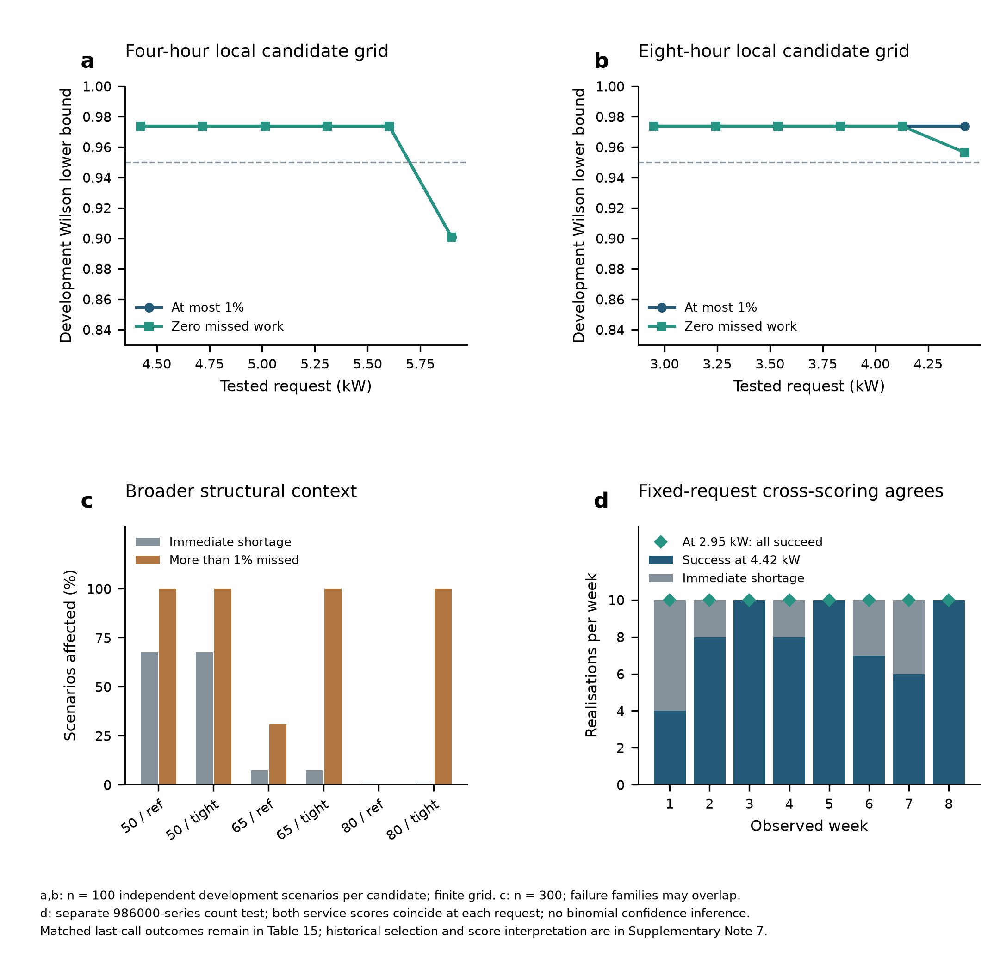
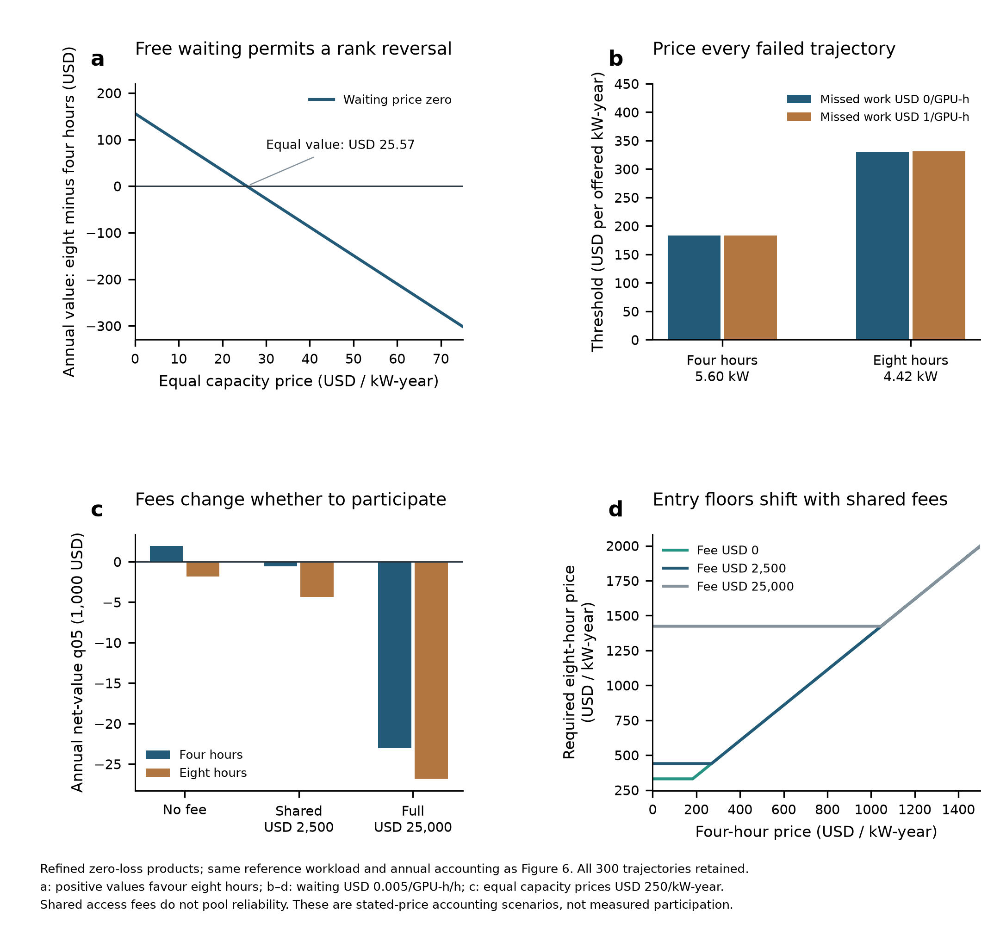

本稿逐段对应英文正文与补充材料 v0.25（2026-09-10）。现有证据按工作量权重、小时顺序与承诺决策重新组织；未新增模拟或重新选择报价。

<!-- S20_001 -->
# Supplementary Information

# 补充材料

<!-- S20_002 -->
## Workload timing limits reliable demand response from AI data centres

## 工作量的时间分布限制人工智能数据中心的可靠需求响应

<!-- S20_003 -->
[AUTHOR NAMES]

[作者姓名待定]

<!-- S20_004 -->
## Reader guide

## 阅读指南

<!-- S20_005 -->
Read the commitment evidence in sequence: independent duration qualification (Table 18), matched workload weights and hourly order (Table 20), strict task-window diagnosis (Table 19), and physical operating exposure and conditional prices (Table 21). The remaining tables provide workload assumptions, structural controls and complete design provenance. Source Data retain frozen inputs, every successful and failed trajectory, direct plotting tables and replay code. Supplementary Note 7 distinguishes the historical designs from the reference products used in the main text.

按以下顺序阅读承诺证据：独立时长资格检验（表 18）、配对工作量权重与小时顺序（表 20）、严格任务时间窗诊断（表 19），以及物理运行暴露和条件价格（表 21）。其余表提供工作负载假设、结构对照与完整设计溯源。源数据保留冻结输入、每条成功和失败轨迹、直接绘图表与重放代码。补充说明 7 区分历史设计与正文采用的参考产品。

<!-- S20_006 -->
| Question | Methods | Displays |
|---|---|---|
| Work composition and power | 1–3 | Fig. 1; Supplementary Fig. 2; Tables 1–3 |
| Single-event offers | 4–5 | Fig. 2; Table 4 |
| Reference repeated offers | 6 | Fig. 3a; Supplementary Fig. 3a,b; Table 18 |
| Workload weights and hourly order | 6 | Fig. 3c,d; Fig. 4a,b; Table 20 |
| Supply and strict-window diagnosis | 6 | Fig. 3b; Fig. 4; Table 19 |
| Structural and call-history controls | 6 | Supplementary Fig. 3c; Tables 5, 10–16 |
| PV, allocation and power controls | 7–8 | Fig. 5; Supplementary Fig. 4; Tables 6, 8 |
| Physical exposure and participation | 9 | Fig. 6; Supplementary Fig. 5; Table 21 |
| Price assumptions and design provenance | 9; Note 7 | Tables 7, 9, 12, 17; Supplementary Fig. 3d |

| 问题 | 方法 | 图表 |
|---|---|---|
| 工作构成与功率 | 1–3 | 图 1；补充图 2；表 1–3 |
| 单次事件报价 | 4–5 | 图 2；表 4 |
| 参考重复报价 | 6 | 图 3a；补充图 3a,b；表 18 |
| 工作量权重与小时顺序 | 6 | 图 3c,d；图 4a,b；表 20 |
| 供给与严格时间窗诊断 | 6 | 图 3b；图 4；表 19 |
| 结构与调用历史对照 | 6 | 补充图 3c；表 5、10–16 |
| 光伏、分配与功率对照 | 7–8 | 图 5；补充图 4；表 6、8 |
| 物理暴露与参与 | 9 | 图 6；补充图 5；表 21 |
| 价格假设与设计溯源 | 9；说明 7 | 表 7、9、12、17；补充图 3d |

<!-- S20_007 -->
## Supplementary Notes

## 补充说明

<!-- S20_008 -->
### 1. Eligibility is an operating permission

### 1. 可延后资格是一项运行授权

<!-- S20_009 -->
The source audit multiplies each released execution span's requested GPU-equivalents by its uncapped duration. It retains development, other and unknown work in the denominator. Counting records would assign 79.45% to offline inference, whereas requested resource time assigns 21.52%; these are different estimands. Low priority identifies a candidate class of work, not a production deadline or permission to postpone service. At 5–20% eligibility, the common permission multiplier preserves the relative contributions of low-priority training and offline inference. The 40% case expands permission beyond that pool, while 60% explicitly changes business composition. None is a measurement of deployed demand-response eligibility.

源审计将每个公开执行区段申请的 GPU 等效数量乘以未截尾持续时间，分母保留开发、其他和未知工作。按记录数量统计，离线推理占 79.45%；按申请资源时间则为 21.52%，两者估计对象不同。低优先级只识别候选工作类别，不给出生产截止时间或推迟服务的权限。在 5%–20% 资格下，共同获准系数保留低优先级训练与离线推理的相对贡献。40% 将授权扩大至该候选池之外，60% 则显式改变业务构成。任何一档都不是已部署需求响应资格的测量值。

<!-- S20_010 -->
### 2. Planning and qualification answer different questions

### 2. 规划与资格检验回答不同问题

<!-- S20_011 -->
The aggregate PI programme maximised R under cumulative class-release and class-deadline constraints. These are necessary aggregate conditions, but are a relaxation when job windows cross: work executed for an earlier, later-deadline job can satisfy a cumulative due-work inequality for a different job. Its retained optima therefore define relaxed planning envelopes, not generally job-feasible capacities. Their second order statistic among 100 scenarios is a 95%/95% tolerance statistic of that relaxed quantity, with achieved confidence 0.96292.33 It does not guarantee feasible work scheduling. Controller offers instead use completed queue simulations on independent seeds; their joint delivery-and-service probability is assessed by a one-sided 95% Wilson lower bound, required to reach 0.95.34,35 The strict-window feasibility diagnostics use each work group’s own release and deadline.

累计 PI 程序在累计类别释放量与累计类别到期量约束下最大化 R。这些是必要的汇总条件，但当作业时间窗交叉时构成放松：为一个较早释放、较晚到期的作业完成的工作，可能满足另一个作业的累计到期不等式。因此，保留的最优值给出放松模型的规划界限，并非一般都能满足实际作业时间窗的容量。100 个情景中的第二顺序统计量，是该放松量在 95%/95% 条件下的容忍统计量，实际达到的置信度为 0.96292。33 它不保证存在可行作业调度。控制器报价则来自独立种子上的完整队列模拟；交付与服务联合概率用单侧 95% Wilson 下界评价，要求达到 0.95。34,35 以下新增可行性诊断使用每个工作组自身的释放时间与期限。

<!-- S20_012 -->
### 3. Service standards and call history must be tested together

### 3. 服务标准与调用历史必须共同检验

<!-- S20_013 -->
Four calls in one evolving queue are not four independent observations. The matched fresh comparison runs each call alone at the same clock time, then asks whether all four isolated calls passed. Both conditions therefore have the same all-four-success endpoint. Their difference estimates the consequence of call history within the specified model and schedule. A development-selected repeated candidate receives its own independent test. If no tested candidate qualifies, this is a search-grid outcome, not evidence that all positive capacities are impossible. Complete hourly series, including failures and clearance after the last call, are retained.

同一个演化队列中的四次调用不是四个独立观测。配对的新事件比较在相同时刻分别单独运行每次调用，然后检查四次是否全部通过。因此两种条件使用相同的“四次全成功”终点，其差异估计指定模型与安排下的调用历史影响。开发选出的重复候选另外接受独立检验。若测试候选均不合格，这是搜索网格的结果，不能证明一切正容量都不可能。完整小时序列保留失败轨迹及最后调用后的清空过程。

<!-- S21_note3 -->
The follow-up distinguishes electrical non-compliance from computing loss. The original observation selected the active window with the smallest achieved peak-relief fraction. That ranking need not select the smallest allowable power ceiling, so clipping only against its ceiling can violate another overlapping window. Keeping a ceiling for each observed call repairs this omission. The same-request paired comparison isolates this change within the MPC implementation; the greedy diagnostic asks whether the gain requires the MPC proposal. Stronger electrical guards can withhold capacity from urgent jobs, so deadline failures are reported separately. Qualified revised offers, rather than failure counts alone, provide the operational result.

后续研究区分电力不合格与计算损失。原观测选择已实现峰值减负比例最小的存续窗口，但按此排序不一定找到最低的允许功率上限，因此仅按所选窗口限功率可能违反另一个重叠窗口。为每次已观察到的调用保留上限能够纠正这个遗漏。同请求配对比较在 MPC 实现内部识别这一改变；贪心诊断则检查收益是否依赖 MPC 提议动作。更强的电力约束可能减少紧急作业可用的计算容量，因此期限失败单独报告。运行结论来自通过检验的新承诺，而不仅是失败计数。

<!-- S23_note3 -->
The new structural test begins after that repair. Tightened deadlines and low instantaneous eligible power are separate failure mechanisms; a scenario may fail both. Zero total missed work is a stricter endpoint than a 1% allowance and receives its own development selection. In every new same-clock final-call contrast, the electrical outcome was identical with or without preceding calls. This prevents attributing all programme failure to damaged recovery. Chronological and permuted production submissions change temporal structure without changing class totals; neither ordering is asserted to be universally harder.

新结构检验从修复完成后开始。紧期限与瞬时可参与功率不足是不同的失败机制，同一情景可以同时出现。总期限违约工作为零比 1% 容忍度更严格，需要单独在开发集选择。所有新增相同时刻末次调用对照中，有无先前调用的电力结果均相同，因此不能把全部方案失败归因于恢复受损。生产提交的原序与置乱改变时间结构而不改变类别总量；不能宣称其中一种顺序普遍更难。

<!-- S20_014 -->
### 4. PV hosting and utilisation have different denominators

### 4. 光伏承载与利用率采用不同分母

<!-- S20_015 -->
Hosting maximises PV nameplate at the unchanged GPU installation. The reported all-scenario boundary is the minimum of the 100 scenario capacities within each operating mode. Its gain is min(flexible) minus min(rigid), not the minimum or mean of paired differences. Fixed-PV utilisation instead divides locally used PV energy by available generation from a 500-kW installation. Its effect is reported in percentage points with paired bootstrap intervals. All current renewable programmes impose zero missed GPU-hours. They use full future information and a separately optimised dispatch; their benefit is not attributed to the causal demand-response controller.

承载优化在 GPU 设施规模不变时最大化光伏额定容量。全情景边界为每种运行方式下 100 个情景容量的最小值，其增量是 min(灵活) 减 min(刚性)，不是配对差异的最小值或均值。固定光伏利用率则以 500 kW 装置的可发电量为分母、本地使用电量为分子，效应按百分点及配对自助区间报告。当前所有可再生能源优化均要求未按期完成 GPU 小时为零。这些优化采用完整未来信息及单独优化的调度，不能把收益归给因果需求响应控制器。

<!-- S20_016 -->
### 5. Controls separate allocation from eligibility

### 5. 对照区分分配与资格

<!-- S20_017 -->
The primary f-to-f GPU allocation rule maintains similar mean utilisation as eligibility changes. It does not make the five cases a pure one-factor experiment. At fixed 10% eligibility, the allocation controls move the flexible GPU fraction from 10% to 20% and 30%, retaining total work, hardware, releases and deadlines. The power controls retain the same allocation but change only unmeasured rigid-class active power to 150 or 225 W per GPU. Every control is tested at the original 10% configuration's selected requests; offers are not reselected after observing its results. The controls therefore compare planning potential and transfer of a fixed offer, not separately optimised controller capacities.

主体采用工作比例与 GPU 分配比例相匹配的规则，使资格变化时平均利用率相近，但这不意味着五档是纯单因素实验。在固定 10% 资格下，分配对照将灵活 GPU 比例由 10% 调至 20% 和 30%，保持总工作量、硬件、释放与截止时间。功率对照保留相同分配，只将未测刚性类别的活动功率改为每 GPU 150 W 或 225 W。各对照均采用原 10% 配置选出的请求，观察结果后不重选承诺。因此它们比较规划潜力与固定承诺的迁移表现，而非各自单独优化的控制器容量。

<!-- S20_018 -->
### 6. Cost thresholds are conditional participation screens

### 6. 成本门槛是有条件的参与筛选

<!-- S20_019 -->
The physical ledger pairs each controlled trajectory with its own no-response baseline. Positive extra backlog accumulates waiting exposure; delayed work during events and permanently missed work remain separate quantities. Each hour is counted once across a repeated programme. Performance revenue credits only non-negative reduction capped at the request. Fixed annual site costs are applied once after proportional accounting at a 1-MW operating peak. A small offer can therefore have a high price per offered kilowatt even when its total delayed work is small. The 95th percentile of annual net cost is a risk-screening choice, not a confidence limit or observed tariff. Unqualified offers remain unqualified even if their conditional cost is low.

物理账本把每条受控轨迹与自身无响应基准配对。正的额外积压累计等待暴露；事件期间推迟工作与永久未按期完成工作保持区分。重复方案中每小时只计一次。履约收入只计非负、且以上报请求封顶的削减量。在按运行峰值比例缩放到 1 MW 会计尺度之后，每年站点固定费用只计一次。因此，即使推迟工作总量较小，小容量承诺仍可能有较高的每承诺千瓦价格。年度净成本的第 95 百分位是一种风险筛选选择，不是置信限或观察到的电价。未通过资格检验的承诺不会因条件成本较低而变成合格承诺。

<!-- S23_note6 -->
The new decomposition confirms that approximately 95% of the reference single-event threshold is a fixed-site allocation. Operating components are attributed at the rank of total net cost so that they add back exactly. A shared fee changes the value relative to opting out, but a common fee cancels between two participating products. Product choice must compare annual net values at stated duration-specific prices, with only independently qualified choices eligible. The figures retain zero/low fees and operating costs separately to expose these different decisions.

新增分解确认，参考单次事件门槛约 95% 是固定场站分摊。运行项在总净成本的排序位置上归因，确保相加后准确还原总数。共享费用改变相对不参与的价值，而两个参与产品共同承担的费用在相互比较时抵消。产品选择必须在指定的分时长价格下比较年度净值，并只允许独立合格的选择参与。图中分别保留零/低费用与运行成本，以区分这些决策。

<!-- S25_note7_heading -->
### 7. Design provenance and interpretation of superseded comparisons

### 7. 设计溯源与被替代比较的解释

<!-- S25_note7_text -->
Tables 14 and 17 retain the structural study’s coarse-grid selections and prices; Tables 18 and 21 report the locally refined reference products on new development and confirmation seeds. At 4.423682 kW, the zero-miss development count was 98/100 in the former study and 99/100 in the latter, crossing the fixed Wilson selection threshold. The resulting historical 4.42-to-2.95-kW selection change is not evidence of a stable physical capacity penalty. Both standards select 5.603331 and 4.423682 kW for the reference four- and eight-hour products in Table 18; their capacity ratio is 19/15, rather than the coarse-grid ratio of 1.5. The eight-hour selection is at the tested grid ceiling and does not bracket a continuous maximum.

表 14、17 保留结构研究的粗网格选择及价格；表 18、21 报告采用新开发与确认种子的局部加密参考产品。在 4.423682 kW 下，前一研究的零漏期开发计数为 98/100，后一研究为 99/100，跨过了固定 Wilson 选择门槛。因此，历史上从 4.42 降至 2.95 kW 的选择变化，不是稳定物理容量惩罚的证据。表 18 中，两种标准均为参考四小时与八小时产品选择 5.603331 和 4.423682 kW，容量比为 19/15，而非粗网格的 1.5。八小时选择位于测试网格上端，并未夹定连续最大值。

<!-- S25_note7_scores -->
The 986000-series chronological submission-count test is distinct from the 990000-series matched weight/order test. In the former, 4.423682 kW succeeds in 63/80 realisations under either service score, and all 17 failures encounter immediate shortage; 2.949122 kW succeeds in 80/80 under both (Supplementary Fig. 3d; Table 16). Thus, changing the score at a fixed request does not explain the difference between those requests. The matched 990000-series results in Table 20 compare weights and hourly order without pooling either series or selecting an external offer. The cumulative PI model retained in Figs. 2 and 5 and Tables 4 and 8 is a relaxation for crossing job windows (Note 2), whereas the strict-window diagnoses in Table 19 use work-group execution edges. This distinction does not alter the independent causal queue trajectories or the separate edge-based PV optimiser.

986000 系列的原序提交次数测试，与 990000 系列的配对权重／顺序测试不同。前者在 4.423682 kW 下按任一服务评分均成功 63/80，全部 17 次失败遇到即时不足；2.949122 kW 按两种评分均成功 80/80（补充图 3d；表 16）。因此，固定请求后改变评分，不能解释两个请求之间的差异。表 20 的 990000 配对结果比较权重和小时顺序，既不合并两个系列，也不选择外部报价。图 2、5 和表 4、8 保留的累计 PI 模型，在作业时间窗交叉时属于放松（说明 2）；表 19 的严格时间窗诊断则采用工作组执行边。这一区别不改变独立因果队列轨迹，也不改变采用独立执行边的光伏优化器。

<!-- S20_020 -->
## Supplementary Methods

## 补充方法

<!-- S20_021 -->
### 1. Source audit and permissions

### 1. 来源审计与授权

<!-- S20_022 -->
The local jobs_summary.parquet contained 40,522,321 execution-span records. Streaming batches of one million rows were aggregated by workload class and priority, using requested GPU-equivalents times the original duration. The total was 254,980,926.33 requested GPU-h. The audit checked the stored raw work against this product and retained all classes. The source SHA-256 was `95c91a8035197e15f29e9c1d15a9147d07b2a6959b2bb08322cb9f033b029124`. The [production study](https://www.usenix.org/system/files/osdi26-li-suyi.pdf) and [official schema](https://github.com/alibaba/clusterdata/blob/master/cluster-trace-gpu-v2026/docs/schema.md) define the infrastructure scope and execution-span fields. The reported infrastructure excludes dedicated hyperscale foundation-model pretraining clusters.

本地 jobs_summary.parquet 含 40,522,321 条执行区段记录。按每批 100 万行流式读取，以申请 GPU 等效数量乘原始持续时间，按工作类别和优先级聚合，总计 254,980,926.33 申请 GPU 小时。审计核对存储的原始工作量与该乘积一致，并保留所有类别。源 SHA-256 为 `95c91a8035197e15f29e9c1d15a9147d07b2a6959b2bb08322cb9f033b029124`。[生产研究](https://www.usenix.org/system/files/osdi26-li-suyi.pdf)和[官方字段说明](https://github.com/alibaba/clusterdata/blob/master/cluster-trace-gpu-v2026/docs/schema.md)界定基础设施范围及执行区段字段。该基础设施不包括专用的超大规模基础模型预训练集群。

<!-- S20_023 -->
Let s_c be the source resource-time share and l_c the low-priority batch share of class c, each relative to all offered work. For f ≤ L = Σl_c = 0.2202814, eligible work is l_c f/L. For L < f ≤ B = s_training + s_offline = 0.4094199, it is l_c + (s_c − l_c)(f − L)/(B − L). The 60% case transfers f − B = 0.1905801 from online to offline inference and makes all training and offline inference eligible. Other classes remain in the source denominator and are rigid. Full-precision shares are provided in case_definitions.json; rounding in Table 2 does not drive simulations.

令 s_c 为类别 c 的源资源时间份额，l_c 为其低优先级批处理份额，二者分母均为全部投入工作。当 f ≤ L = Σl_c = 0.2202814 时，合格工作为 l_c f/L。当 L < f ≤ B = s_training + s_offline = 0.4094199 时，为 l_c + (s_c − l_c)(f − L)/(B − L)。60% 情景将 f − B = 0.1905801 从在线转为离线推理，并使全部训练和离线推理获得资格。其他类别保留在源分母中且为刚性。完整精度份额见 case_definitions.json，表 2 的舍入数不用于驱动模拟。

<!-- S20_024 -->
### 2. Paired scenarios and baseline gate

### 2. 配对情景与无响应门槛

<!-- S20_025 -->
Development used seeds 930000–930099 and confirmation used 960000–960299. Within each seed, a single 60%-case job template supplied the releases, deadlines and class records. Scaling only the class GPU-hours produced the remaining cases; record counts and timing were held identical. The template sampled existing low-priority training/offline job shapes, including for the explicitly hypothetical 40% and 60% cases. Total offered work was 374.4 GPU-h/h for 168 h, followed by 48 h without new arrivals. The flexible GPU count was round(576f), and rigid utilisation was 374.4(1 − f)/(576 − round(576f)). Every no-response scenario had to satisfy service and PCC limits before downstream analysis.

开发种子为 930000–930099，确认种子为 960000–960299。每个种子使用一份 60% 情景的共同作业模板提供释放、截止时间和类别记录，仅缩放各类别 GPU 小时生成其余配置，记录数及时间完全一致。模板抽取既有低优先级训练/离线作业形状，40% 和 60% 这两项明确假设的情景也沿用这些形状。总投入工作为每小时 374.4 GPU 小时，持续 168 小时，之后 48 小时无新到达。灵活 GPU 数为 round(576f)，刚性利用率为 374.4(1 − f)/(576 − round(576f))。所有无响应情景均须先通过服务与 PCC 限制，才进入下游分析。

<!-- S20_026 -->
Training deadlines were 2–6 times runtime, clipped to 6–48 h; offline-inference deadlines were 1.5–4 times runtime, clipped to 2–24 h. These are synthetic service rules. Single events began at one of 24 hours between 63 and 140, sampled before testing; exact starts are stored with each scenario. Community demand used a 75:25 residential/office mixed-3A profile, scaled to an 800-kW peak. A common 1,100-kW import rating and no-export rule applied to all cases. Initial development baselines under a 1,000-kW rating exceeded it in three cases at seed 930096; the common rating was raised before PI optimisation or offer selection, and the initial gate results were preserved.

训练截止时间为运行时长的 2–6 倍，限制在 6–48 小时；离线推理为 1.5–4 倍，限制在 2–24 小时。这些均为合成服务规则。单次事件在第 63 至 140 小时之间的 24 个候选时刻中抽样，测试前固定，各情景保存精确起点。社区需求采用住宅/办公 75:25 的混合 3A 曲线，缩放到 800 kW 峰值。所有情景采用共同的 1,100 kW 进口限制并禁止反送。在初始 1,000 kW 限制下，开发种子 930096 的三项配置无响应基准超限，因此在 PI 优化或选值前提高共同容量，并保存了初始门槛结果。

<!-- S20_027 -->
### 3. Power conversion, queues and observations

### 3. 功率换算、队列与观测

<!-- S20_028 -->
Each workload ran in one- and four-GPU conditions with three repeats. After a 5-s warm-up, read-only nvidia-smi telemetry sampled board power and utilisation every second for 20 s. Repeats 1–2 supplied calibration and repeat 3 was held out. For each four-GPU repeat, readings were averaged first over time within each GPU, then across GPUs. The resulting run means were the independent units. Student t 95% intervals used the two calibration means per active class; prediction error used only the held-out repeat (Supplementary Table 1).

每种负载分别在单 GPU 和四 GPU 条件下运行，每种条件重复三次。预热 5 s 后，以只读 nvidia-smi 遥测每秒采样板卡功率和利用率，持续 20 s。重复 1–2 用于校准，重复 3 留出检验。对于每次四 GPU 运行，先对每块 GPU 的时间序列取平均，再在 GPU 之间取平均。所得运行均值才是独立单位。各运行类别的 Student t 95% 区间使用两次校准运行均值计算；预测误差仅使用留出运行（补充表 1）。

<!-- S20_029 -->
Facility power retained the execution class,

设施功率计算保留作业执行类别：

$$
P^{\mathrm{DC}}_t=P_{\mathrm{fixed}}+\sum_c e_cX_{c,t},
$$

<!-- S20_031 -->
In this expression, $X_{c,t}$ is flexible work executed in class c during interval t, measured in GPU-h. Its coefficient is $e_c=\mathrm{PUE}(p_c-p_{\mathrm{idle}})/(1000\Delta t)$, in kW per GPU-h. Board powers p are measured in W and $\Delta t=1$ h. Subtracting idle power ensures that scheduled work contributes only incremental active power. Fixed facility power contains rigid-pool draw, flexible-pool idle draw and node overhead, all multiplied by PUE = 1.20.

式中，$X_{c,t}$ 表示时段 t 内执行的 c 类灵活工作，单位为 GPU-h。其系数为 $e_c=\mathrm{PUE}(p_c-p_{\mathrm{idle}})/(1000\Delta t)$，单位为 kW/GPU-h。板卡功率 p 以 W 计，$\Delta t=1$ h。扣除空闲功率后，调度工作只贡献新增的活动功率。固定设施功率包含刚性池用电、灵活池空闲用电和节点开销，各项均乘以 PUE = 1.20。

<!-- S20_032 -->
Jobs were stored by class and remaining deadline at one-hour resolution, up to 48 h. The labels {0, 1, 2, 3, 6, 12, 24, 48} h grouped this state for reporting and observation; they were not the queue's internal time resolution. Execution followed earliest deadline first, could not precede release and could not exceed cumulative arrivals. Work remaining when its deadline expired was counted as missed. Controlled and no-response queues received identical arrivals.

作业按类别和剩余截止时间存储，内部时间分辨率为 1 h，最长为 48 h。{0、1、2、3、6、12、24、48} h 标签用于对状态进行报告和观测汇总，并不是队列内部的时间分辨率。执行按最早截止时间优先安排，既不能早于作业到达，也不能超过累计到达工作量。截止时仍未完成的工作记为逾期。受控队列和无响应队列接收完全相同的到达工作。

<!-- S20_033 -->
Idle board power was 13.935625 W per GPU and node overhead was assumed to be 300 W. Online, development, other and unknown work used 300.022174 W per active rigid GPU as an engineering proxy, with 150- and 225-W controls. Rigid power was fixed at its class-weighted mean. Online latency was not separately simulated, so preserving batch deadlines is not a measured online-serving SLO test. The controller retained the existing 63-feature firm_v5 observation interface; its six-hour forecasts and queue features were causally masked. The stored compute_debt_kwh field describes the whole controlled queue. Exported excess_queue_energy_kwh explicitly subtracts the matched no-response value.

每 GPU 空闲板卡功率为 13.935625 W，节点开销假定为 300 W。在线、开发、其他和未知工作采用每活动刚性 GPU 300.022174 W 的工程代理，另设 150 W 和 225 W 对照。刚性功率固定为类别加权均值，没有单独模拟在线延迟，因此保持批处理截止时间不等于实测在线服务 SLO 测试。控制器保留既有 63 维 firm_v5 观测接口，其六小时预测及队列特征按因果信息进行掩蔽。存储的 compute_debt_kwh 描述整个受控队列；导出的 excess_queue_energy_kwh 显式减去配对无响应值。

<!-- S20_034 -->
### 4. Success criteria and statistics

### 4. 成功标准与统计

<!-- S20_035 -->
Successful demand response required both electrical delivery and acceptable computing service. For each fixed capacity, duration, notice and controller, an episode received one binary outcome after all six criteria below were evaluated. Delivery was the non-negative reduction in point-of-common-coupling power relative to the matched baseline, capped at the request. A high mean could not compensate for an hour below the interval threshold. Peak relief was evaluated over the event and its 24-h recovery window.

需求响应成功要求同时满足电力交付和计算服务条件。对于固定的容量、时长、通知时间及控制器，每个情景在评估下列六项判据后得到一个成功或失败结果。交付量为相对于匹配基线的非负公共连接点功率削减，并以请求值封顶。较高的平均交付不能抵消某个小时低于逐时阈值的情况。削峰效果在事件及其后 24 h 恢复窗口内评估。

<!-- S20_036 -->
| Criterion | Headline threshold | Operational interpretation |
|---|---:|---|
| Mean delivery | ≥0.95 | mean capped baseline-relative reduction across all event intervals divided by R |
| Minimum interval delivery | ≥0.95 | every event hour delivers at least 0.95R |
| Deadline-miss fraction | ≤0.01 | expired eligible GPU-hour work divided by total arriving eligible work |
| Rebound ratio | ≤0.25 | largest post-event excess PCC load divided by peak event reduction |
| Event-and-recovery peak relief | ≥0.50 | baseline peak minus controlled peak over the event plus 24-h recovery window, divided by R |
| Terminal-backlog fraction | ≤0.02 | positive controlled-minus-baseline backlog at the end of the 48-h tail divided by total eligible arrivals |

| 标准 | 主要阈值 | 运行含义 |
|---|---:|---|
| 平均交付 | ≥0.95 | 所有事件时段内、相对基线且经封顶的削减量均值除以 R |
| 最小时段交付 | ≥0.95 | 每个事件小时的交付量均至少为 0.95R |
| 截止时间未完成比例 | ≤0.01 | 到期未完成的 GPU-hour 工作量除以提供的工作量 |
| 反弹比 | ≤0.25 | 事件后最大超额 PCC 负荷除以事件峰值削减量 |
| 事件及恢复窗口削峰 | ≥0.50 | 在事件及其后 24 h 恢复窗口内，基线峰值减受控峰值，再除以 R |
| 终端积压比例 | ≤0.02 | 48 h 尾段结束时受控减基线积压的正值除以总到达工作量 |

期限违约与期末积压比例的分母均为全部到达的可参与工作 GPU 小时量。

<!-- S20_037 -->
Failure attribution retained combined labels rather than assigning only the first failed criterion. Mean and interval failures could occur together, and delivery failures could coincide with rebound or window-relief failures. Recovery-time non-resolution was a separate diagnostic, not an additional certificate criterion.

失败归因保留组合标签，而不是仅记录首先失败的标准。平均交付与区间交付可以同时失败，交付失败也可以伴随反弹或窗口峰值缓解失败。恢复时间未能在窗口内确定属于独立诊断，不是额外的容量认证标准。

<!-- S023_zero_methods -->
The structural study additionally required zero total missed eligible work, allowing only 10−7 GPU-h for numerical round-off. Both response and no-response trajectories had to satisfy that zero criterion; all electrical and terminal-backlog thresholds were unchanged. The 0.1% allowance was a secondary reported endpoint without offer selection. Baseline failures remained failures rather than exclusions. Earlier selected offers were also rescored at zero loss, explicitly as a retrospective check.

结构研究还检验了全部可参与工作的总期限违约量为零的要求，仅允许 10−7 GPU-h 的数值舍入容差。响应与无响应轨迹都必须满足该零违约标准；电力与期末积压门槛保持不变。0.1% 容忍度作为次要报告终点，不用于选择报价。基线不合格计为失败，不予剔除。此前选出的报价也进行了零损失重评分，并明确标为回顾性核对。

<!-- S20_038 -->
For 100 PI optima, binomial inversion selected the second order statistic at q = 0.95 and confidence 0.95. For controller testing, a one-sided 95% Wilson interval used z = 1.6448536. Development and confirmation applied the same lower-bound threshold of 0.95. Each condition contained 100 development or 300 confirmation seeds; extra notices and calls did not create additional independent seeds. Notice comparisons used exact paired McNemar tests with Holm correction across 20 contrasts. Repeated-minus-fresh differences used 10,000 paired bootstrap resamples of 300 seeds. Renewable mean differences used 10,000 paired resamples of 100 seeds. These intervals and qualifications are pointwise, apart from the declared notice-test correction.

对 100 个 PI 最优值，二项分布反演在 q = 0.95、置信度 0.95 时选取第二顺序统计量。控制器检验的单侧 95% Wilson 区间使用 z = 1.6448536，开发与确认采用相同的 0.95 下界门槛。各条件含 100 个开发或 300 个确认种子；额外通知和调用不增加独立种子数。通知比较使用配对精确 McNemar 检验，对 20 项比较作 Holm 校正。重复减新事件的差异采用 300 个种子的 10,000 次配对自助重采样，可再生能源均值差异采用 100 个种子的 10,000 次配对重采样。除声明的通知检验校正外，区间与资格均为逐项结论。

<!-- S20_039 -->
### 5. Causal controller and development correction

### 5. 因果控制器与开发阶段修正

<!-- S20_040 -->
The six-hour robust MPC retained its historical-arrival uncertainty envelope, objective weights and release-only queue information. Development exposed a dimensional mismatch in the former recovery guard: it allowed an overshoot of 0.25R, whereas rebound was evaluated relative to actual peak delivery, which could be as low as 0.95R. The revised guard uses 0.25 × 0.95R, along with the existing event-and-window-relief envelopes. When float32 conversion would cross an electrical limit, actions are rounded towards zero. All success criteria remain unchanged. Regression checks cover the delivered-power rebound denominator, event-boundary rounding and unchanged actions outside event/recovery windows. This is a new controller version, not a reinterpretation of the original locked certificate.

六小时鲁棒 MPC 保留其历史到达不确定性包络、目标权重和仅含已释放作业的队列信息。开发阶段发现原恢复保护中的换算不一致：允许反弹 0.25R，但评估以实际最大削减量为分母，而该值可能低至 0.95R。修正后的保护采用 0.25 × 0.95R，并保留事件及窗口峰值削减限制。当 float32 转换将越过电气边界时，动作向零舍入。所有成功标准不变。回归检查覆盖实际交付分母、事件边界舍入，以及事件/恢复窗口之外动作不变。这是新的控制器版本，不能重新解释为原锁定证书。

<!-- S20_041 -->
Each duration tested 50%, 75%, 90% and 100% of its development Relaxed PI statistic. The largest candidate meeting the development Wilson criterion was frozen before confirmation. After the final controller correction, 300 previously unexamined seeds were reserved for confirmation; earlier original-controller and intermediate development outputs were retained as diagnostics. No confirmation outcome was used to choose a smaller replacement offer.

各时长检验开发 放松 PI 统计量的 50%、75%、90% 和 100%，将满足开发 Wilson 标准的最大候选在确认前冻结。最终控制器修正后，保留此前未查看的 300 个种子用于确认；更早原控制器和中间开发输出保存为诊断。不使用确认结果另选较小替代承诺。

<!-- S20_042 -->
### 6. Repeated programmes

### 6. 重复方案

<!-- S20_043 -->
For the original controller study (confirmation seeds 960000–960299): Four event starts were 63 + j(H + G), j = 0, 1, 2, 3, for (H,G) = (4,8) or (8,12) hours. Development tested 25%, 50%, 75% and 100% of the selected single-event offer without assuming monotonic success. Confirmation tested the prespecified original single offer repeated, plus four single-call counterfactuals at matching clock times. The protocol additionally provided for testing a development-selected repeated offer if one qualified; none did. The no-response reference was the same full-capacity schedule in every paired comparison. The experiment covers two declared programmes, not every recovery gap or a continuous-year guarantee.

对于原控制器研究（确认种子 960000–960299）：四次事件起点为 63 + j(H + G)，j = 0、1、2、3，其中 (H,G) 为 (4,8) 或 (8,12) 小时。开发检验所选单次承诺的 25%、50%、75% 和 100%，不假定成功率单调。确认检验重复使用的预设原单次承诺，并配有四个相同时刻的单调用反事实。协议还规定，如开发选出重复候选则另外确认；实际没有候选通过开发门槛。每项配对比较都使用相同的全容量无响应参考调度。实验覆盖两种声明的方案，未穷尽所有恢复间隔，也不构成连续全年保证。

<!-- S21_recovery_methods -->
For the follow-up, H and G were (4,8), (8,8), (8,12) and (8,16) h, with the same first start at hour 63. After a later call ends, the preceding 24-h recovery remains active for max(0, 24 − H − G) h. This overlap is zero for H = 8 h and G = 16 h, although changing G also changes the clock alignment of later calls. Final recovery ends no later than hour 167, before arrivals stop at hour 168. Every replay then retains the full 216-h horizon, including the clearance tail. No gap comparison isolates spacing from time-of-day effects.

后续研究采用 (H,G) = (4,8)、(8,8)、(8,12) 和 (8,16) 小时，首次调用仍从第 63 小时开始。后一次调用结束后，前一次的 24 小时恢复仍持续 max(0, 24 − H − G) 小时；当 H = 8、G = 16 小时时，这段重叠为零。不过改变 G 也会改变后续调用的钟点。最终恢复最晚在第 167 小时结束，早于第 168 小时到达停止。每次回放仍保留完整 216 小时时域，包括清空尾段。间隔比较并未将间隔本身与时刻效应分离。

<!-- S21_recovery_guard -->
For an observed call j, let B_j(t) be the greatest baseline PCC power observed so far in its event-and-recovery window, and R_j its request. The wrapper constrains the current proposal by every live ceiling B_j(t) − 0.5R_j. It also preserves the active-event delivery ceiling and the rebound ceiling baseline(t) + 0.25 × 0.95R_j during recovery. With fixed PCC demand F(t) and flexible full-allocation contribution A(t), the additional allocation cap is clip[(min_j(B_j(t) − 0.5R_j) − F(t))/A(t), 0, 1]. Actions are rounded towards the feasible side. The controller learns a call’s remaining duration only from the current observation and expires it after its 24-h recovery. Running baseline peaks can be lower than their eventual values, making this causal guard conservative. A target below F(t) cannot be made feasible by clipping, and electrical clipping alone does not guarantee job deadlines.

对于已观察到的调用 j，以 B_j(t) 表示其事件及恢复窗口内截至当前已观察到的最大基准 PCC 功率，R_j 表示请求。包装器对当前提议动作同时施加所有存续上限 B_j(t) − 0.5R_j，并保留事件交付上限，以及恢复期间的反弹上限 baseline(t) + 0.25 × 0.95R_j。若固定 PCC 需求为 F(t)，灵活工作全额分配时的功率贡献为 A(t)，则新增分配上限为 clip[(min_j(B_j(t) − 0.5R_j) − F(t))/A(t), 0, 1]。动作向可行侧舍入。控制器仅通过当前观测获知调用的剩余时长，并在 24 小时恢复结束后删除该调用。运行中的基准峰值可能低于最终峰值，使这一因果约束偏保守。若目标低于 F(t)，限幅不能使其可行；电力限幅本身也不保证作业期限。

<!-- S21_recovery_design -->
The extension reused 100 previously examined development seeds (930000–930099); four of these also informed an exploratory pilot. The frozen protocol then enumerated 10,100 development replays: five workload configurations, two MPC versions, four programmes, a full-only four-hour candidate and 50%, 75% and 100% eight-hour candidates, plus 100 full-request greedy diagnostics at 10% eligibility and (8,12). The largest candidate with one-sided 95% Wilson lower bound at least 0.95 was selected. The frozen selection scheduled 13,800 replays on 300 new confirmation seeds (970000–970299). For each configuration, method and programme, confirmation tested the selected offer or the full-request comparator if none was selected. Full-request comparisons for both MPC versions at (8,12) and the greedy diagnostic were additionally retained. No confirmation result was pooled with the earlier 960000–960299 set or used for reselection. Every full series, including all failures, was analysed.

扩展复用了 100 个已检查过的开发种子（930000–930099），其中四个还用于探索性试跑。随后冻结的协议列出了 10,100 次开发回放：五档工作配置、两种 MPC、四种调用安排，四小时仅检验全额候选，八小时检验 50%、75%、100% 候选，另加 10% 工作资格、(8,12) 安排下的 100 次全额贪心诊断。选择单侧 95% Wilson 下界至少为 0.95 的最大候选。冻结选值安排了 300 个新确认种子（970000–970299）上的 13,800 次回放。每个配置、方法和安排确认所选承诺；若未选出候选则确认全额比较方案。另外保留两种 MPC 在 (8,12) 下的全额比较和贪心诊断。确认结果不与此前 960000–960299 集合合并，也不用于重新选值。包括全部失败在内的每条完整序列均纳入分析。

<!-- S21_recovery_stats -->
The primary intervention contrast is the full-request original versus per-call-recovery MPC at 10% eligibility and (8,12). Paired success differences use 10,000 resamples of complete seeds; exact McNemar tests receive Holm correction across all controller contrasts reported in the source table. Non-exclusive failure families and paired rescue/loss counts are also retained. Qualification is pointwise for each frozen candidate. A selected candidate that fails confirmation would remain failed, with no test-set replacement. The illustrated trace is the lowest development seed for which the full-request original fails and the revised MPC passes; this transparent illustrative selection is separate from inference on all confirmation seeds.

主要干预比较为 10% 工作资格、(8,12) 安排下的全额原 MPC 与逐次恢复约束 MPC。配对成功率差异采用 10,000 次完整种子重采样；精确 McNemar 检验在源表报告的全部控制器比较中进行 Holm 校正。同时保留可以重叠的失败类别，以及配对挽救和损失计数。每个冻结候选分别进行资格检验；若确认失败，则保留失败结论，不从测试集中另选替代容量。示例轨迹按规则选择全额原方案失败而新 MPC 成功的最小开发种子。这种透明的说明性选择与使用全部确认种子的统计推断分开。

<!-- S023_structural_methods -->
At fixed 10% work eligibility and 576 GPUs, offered utilisation was total work divided by installed GPU-hours, set to 50%, 65% or 80%. Deadline slack was unchanged or halved with a one-hour floor; flexible GPU allocation was 10%, with 20% controls at 65% and 80% utilisation under tight deadlines. The final event started at hour 111 plus a seeded uniform integer from 0 to 23; preceding starts were spaced backwards by 16 or 24 h. All eight variants tested eight-hour calls, and the reference also tested four-hour calls at 16-h spacing. A fresh eight-hour final call at the same time removed the preceding calls. All recovery windows ended during 168 h of arrivals, followed by a 48-h clearance tail. Development seeds 984000–984099 and confirmation seeds 985000–985299 supplied 7,600 and 13,200 complete replays, respectively. Two pilot seeds were excluded.

固定 10% 工作可参与和 576 个 GPU 后，将工作供给利用率定义为总工作量除以已安装 GPU 小时数，设为 50%、65% 或 80%。期限余量保持参考值或减半，下限为一小时；灵活 GPU 分配为 10%，并在 65% 和 80% 利用率的紧期限情景中增加 20% 分配对照。最后一次事件从第 111 小时加一个由种子确定、在 0–23 间均匀抽取的整数开始；此前事件依次向前相隔 16 或 24 h。八个变体均检验八小时调用，参考条件还检验 16 h 开始间隔的四小时调用。相同时刻的孤立八小时末次调用移除前三次事件。所有恢复窗口均在 168 h 到达阶段内结束，随后有 48 h 清空尾段。开发种子 984000–984099 与确认种子 985000–985299 分别产生 7,600 和 13,200 次完整重放；两个试运行种子不纳入分析。

<!-- S023_temporal_methods -->
For the external timing stress test, hourly submission counts from the Alibaba 2020 GPU trace28 supplied eight consecutive 168-h blocks. Counts set the hourly weights of synthetic class-specific work, preserving each class total and reference deadlines. The paired alternative permuted complete hourly blocks within the same week. Ten synthetic realisations per week crossed both orderings and 10%/20% GPU allocations with five frozen programme–request combinations, giving 1,600 replays without retuning. Results are reported by observed week and descriptively across 80 realisations per condition; they are not 80 independent production weeks.

外部时序压力检验采用 Alibaba 2020 GPU 轨迹的每小时提交计数，28 提供连续八个 168 h 区块。计数决定各类别合成工作的逐小时权重，同时保留各类总工作量与参考期限。配对替代条件在同一周内置乱完整小时块。每周十次合成实现，交叉两种顺序、10%/20% GPU 分配与五个冻结的“方案—请求”组合，共 1,600 次重放，不重新调参。结果按真实周报告，并对每条件 80 次实现作描述性汇总；它们不等于 80 个独立生产周。

<!-- S023_stats -->
Structural contrasts resampled 300 complete paired scenario seeds 5,000 times. Exact McNemar tests were Holm-adjusted over the 36 binary structural contrasts; the 16 additional matched-target electrical contrasts formed a separate family. The zero-loss and 1% offer tests each retained the pointwise one-sided 95% Wilson lower-bound criterion of 0.95. Multiple successful selections do not create a simultaneous confidence guarantee. Submission-order comparisons retained the observed week as the external sampling unit and were not assigned binomial certificates from pooled synthetic realisations.

结构对照对 300 个完整配对情景种子进行 5,000 次重抽样。精确 McNemar 检验在 36 个二元结构对照之间使用 Holm 校正；额外 16 个末次调用电力对照构成单独的检验族。零损失与 1% 报价检验均保留逐点单侧 95% Wilson 概率下界不低于 0.95 的规则。多个选择成功不构成同时置信保证。提交顺序比较保留真实周作为外部抽样单位，不把合并的合成实现赋予二项资格证明。

<!-- S23_supply_method -->
A necessary supply diagnostic compared each active hour’s matched baseline PCC power minus community load and idle-plus-rigid data-centre power with 0.95 times the request. If the former was smaller, even zero flexible execution could not meet the interval requirement. This lower-envelope test identifies immediate shortage but does not prove feasibility when passed. Deadline and terminal criteria were scored over the whole 216-h episode. Last-call electrical scoring excluded those global service quantities, matched the final clock exactly and used the fresh run’s reindexed event 0. All 16 paired differences were zero. Programme-wide criteria were not substituted for local electrical outcomes.

必要供给诊断逐一比较事件小时中“匹配基线 PCC 功率减去社区负荷及数据中心空闲加刚性功率”与请求的 0.95 倍。前者较小时，即使灵活工作执行量为零，也无法满足逐时交付要求。该下包络检验识别即时不足，通过时并不证明可行。期限及期末标准按完整 216 h 运行阶段评分。末次调用的电力评分排除这些全局服务量，严格对齐末次时刻，并使用孤立运行重新编号后的事件 0。全部 16 个配对差值均为零，不能用整个方案的判定替代局部电力结果。

<!-- S23_temporal_detail -->
The timing input was the processed Alibaba 2020 job-submission table (714,903 GPU jobs), using trace hours 168–1511 inclusive. The eight 168-h weeks supplied hourly counts; each week’s class-specific synthetic total was normalised to the unchanged offered work. A whole-hour permutation preserved the marginal hourly volumes and the exact class–deadline totals. Seeds 986000 + 100w + r, for week w = 0,…,7 and realisation r = 0,…,9, generated paired inputs. Frozen tests used request fractions 0.5, 0.75 and 1 at eight-hour/16-h spacing, and 0.5 and 1 at eight-hour/24-h spacing. No external result selected a new fraction. Submission counts preserve one observed temporal feature; they do not supply real GPU-hour volumes, deadlines or job dependencies. All 320 timing input variants passed the baseline service gate.

时序输入为处理后的 Alibaba 2020 作业提交表，共 714,903 个 GPU 作业，使用轨迹第 168–1511 小时（含端点）。八个 168 h 周提供逐小时计数，各周各类合成总量归一至不变的供给工作量。完整小时置乱保留小时量的边际分布及精确的“类别—期限”总量。种子为 986000 + 100w + r，其中周 w = 0,…,7、实现 r = 0,…,9，生成配对输入。冻结检验在八小时/16 h 开始间隔采用请求比例 0.5、0.75、1，在八小时/24 h 采用 0.5、1。没有根据外部结果选择新比例。提交计数保留了一种真实时间特征，不提供真实 GPU 小时量、期限或作业依赖。全部 320 个时序输入变体通过基线服务门槛。

<!-- S024_refinement -->
Local refinement fixed the reference workload and controller and tested fractions 0.50–0.75 for H8P16 and 0.75–1.00 for H4P16, in steps of 0.05 of the unchanged 5.898243186-kW request. H denotes duration and P start spacing. Seeds 988000–988099 supplied development; endpoint-specific selections were frozen before seeds 989000–989299 supplied confirmation. Only selected candidates and prespecified coarse comparators entered confirmation, with no reselection. The grid ceiling for eight hours was selected under both standards, so the test did not bracket a continuous maximum. Earlier seeds were not pooled with these data.

局部加密固定参考工作负载与控制器，在原有 5.898243186 kW 请求基础上，H8P16 测试 0.50–0.75，H4P16 测试 0.75–1.00，步长均为 0.05。H 表示时长，P 表示开始间隔。开发使用种子 988000–988099；分终点的选择在确认种子 989000–989299 运行前冻结。确认只检验选中候选与预先指定的粗网格对照，之后不重新选值。两种标准均选中八小时网格上端，因此测试没有夹定连续最大值。早期种子未与本次数据合并。

<!-- S024_pi_methods -->
Perfect-information diagnostics fixed each request and its four event clocks, baseline and 24-h recovery windows. Non-negative execution variables existed only between each class/release/deadline work group’s own release and deadline; execution, misses and terminal work conserved every group. Constraints retained GPU and PCC limits, 95% hourly and capped-mean delivery, 25% rebound relative to actual peak event reduction, 50% full-window peak relief and the original terminal allowance. Binary peak selectors represented the rebound denominator exactly. HiGHS solved the resulting mixed-integer feasibility problem. Thirty-three prespecified structural cases comprised five configurations, three previously used seeds and two service standards, plus three reference 4.42-kW checks; five affected external weeks supplied an additional first-shortage diagnostic each. These mechanism-selected cases were not prevalence samples. All 11 feasible witnesses passed independent work-group and electrical checks. A 90-s unresolved solve was retained and resolved as infeasible after extending only its time limit to 600 s. Full-information feasibility was not treated as causal realizability.

完美信息诊断固定每个请求及其四个事件时刻、基线和 24 h 恢复窗。只有在每个类别—释放时间—期限工作组自身的允许时段内，才建立非负执行变量；执行、漏期及期末工作对每组守恒。约束保留 GPU 与 PCC 限制、95% 逐时及截顶平均交付、相对事件实际峰值减负的 25% 反弹、完整窗口 50% 峰值削减，以及原期末积压容忍度。二进制峰值选择变量精确表示反弹分母，由 HiGHS 求解相应混合整数可行性问题。预先指定的 33 个结构条件包括五种配置、三个已用种子、两个服务标准，以及三个参考 4.42 kW 检查；另从五个受影响的外部周各取首个短缺实现作诊断。这些按机制选择的条件不用于估计发生率。全部 11 个可行见证通过独立工作组与电力约束检查。一次 90 s 未解决的求解保留原记录，仅将时限延长至 600 s 后判为不可行。完美信息可行未被当作因果可实现。

<!-- S024_workload_methods -->
The resource-time transfer test reconstructed each processed job’s GPU-seconds as the sum of requested GPU-equivalents × task launch-to-completion duration across its terminated positive-resource tasks.28 All 714,903 processed jobs matched the raw task reconstruction; multiplying total requested GPUs by job submission-to-completion time instead differed for 131,379 jobs. The test retained trace hours 168–1511, whose processed time origin is 542,323 s after the raw origin. Within each week, either job counts or submitted task resource-time set hourly weights; each class’s weekly work total was normalised to the reference total. Identical synthetic job classes, deadlines, community traces, event clocks and paired whole-hour permutations were used at each seed (990000 + 100w + r; eight weeks × ten realisations). Fixed 2.95- and 4.42-kW requests gave 640 complete replays. All 320 no-response input variants passed zero-loss service; no failed variant was excluded. Aggregate counts are descriptive. Allocated resource-time is not a sensor measurement of busy GPU time, and the test retains divisible work and synthetic service rules.

资源时间适用测试将每个处理后作业的 GPU 秒数，重建为其已完成且资源量为正的各任务之“请求 GPU 当量 × 任务启动至完成时长”之和。28 全部 714,903 个处理后作业均与原始任务重建一致；若改用总请求 GPU 数乘以作业提交至完成时长，则有 131,379 个作业不一致。测试保留轨迹小时 168–1511；处理后的时间原点相对原始原点偏移 542,323 s。各周分别采用任务次数或提交任务资源时间作为逐时权重，每个类别的周工作总量归一到参考总量。每个种子使用相同的合成任务类别、期限、社区轨迹、事件时刻及配对完整小时置乱（种子 990000 + 100w + r；八周各十次实现）。固定 2.95 与 4.42 kW 请求共形成 640 次完整重放。全部 320 个无响应输入变体通过零损失服务，无失败变体被排除。合计数为描述性结果。已分配资源时间不等于传感器测得的 GPU 忙碌时间，测试仍保留可分割工作与合成服务规则。

<!-- S20_044 -->
### 7. Renewable planning

### 7. 可再生能源规划

<!-- S20_045 -->
Each configuration used its actual power model at scale one. PV hosting maximised rated PV capacity with curtailment ≤5%, zero deadline misses, terminal backlog ≤2%, imports ≤1,100 kW and no exports. Fixed-PV operation used 500 kW and lexicographic objectives: service, local PV use, grid import, then battery throughput. PV-use tolerance was 10−5 kWh. BESS had 100-kW charge/discharge power, 200-kWh energy, charge and discharge efficiency 0.95, and initial/terminal state of charge 50%. Binary exclusivity prohibited simultaneous charge and discharge. The first 100 confirmation seeds were paired across rigid/flexible operation and both BESS conditions. All feasibility statuses and missed work were retained; an all-scenario capacity is not reported from a filtered subset.

每种配置均在尺度一使用自己的功率模型。光伏承载最大化额定容量，要求弃光 ≤5%、截止时间损失为零、末期积压 ≤2%、进口 ≤1,100 kW 且禁止反送。固定光伏运行使用 500 kW，按服务、本地光伏利用、电网进口、电池吞吐依次作词典序优化，光伏利用容差为 10−5 kWh。储能充放电功率 100 kW、容量 200 kWh，充放电效率均为 0.95，初始/末期荷电状态 50%。二元互斥禁止同时充放电。前 100 个确认种子在刚性/灵活运行及两种储能条件之间配对。保留全部可行性状态与未完成工作，不从筛选后的子集报告全情景容量。

<!-- S20_046 -->
HiGHS 1.15.1 retained its default relative MIP gap 10−4 and absolute gap 10−6; only solver thread count was changed. The lexicographic lock on PV use is distinct from the primary optimisation gap. Small signed BESS utilisation contrasts can lie within this numerical resolution (roughly 0.01 percentage points when most PV is used). They are retained rather than clipped to zero, but are not interpreted as a physical loss or a resolved benefit. Bootstrap intervals describe scenario sampling only. The numerical-precision audit records the solver version and options.

HiGHS 1.15.1 保留默认相对 MIP 间隙 10−4 和绝对间隙 10−6，只改变求解线程数。光伏利用的词典序锁定与第一阶段优化间隙不同。储能利用率的微小正负差异可能落在这一数值分辨尺度内（当大部分光伏被使用时约为 0.01 个百分点）。数据保留这些差异，不将其裁为零，也不解释为物理损失或已分辨的收益。自助区间只描述情景抽样，数值精度审核记录求解器版本与选项。

<!-- S20_047 -->
### 8. Orthogonal sensitivity controls

### 8. 正交敏感性对照

<!-- S20_048 -->
Four controls around 10% eligibility were specified before their outcomes were examined: flexible GPU allocation 20% or 30%, and rigid-class active-power proxy 150 or 225 W. Other inputs, seed identities and event times were unchanged. Each control had 300 no-response gates, 100 PI scenarios at both durations, 300 fixed-offer tests at both durations, and 100 paired renewable scenarios. Its economic ledger used the same fixed requests. These selected controls and the five eligibility scenarios do not constitute a global sensitivity analysis over simultaneous variation in all model parameters.

在查看结果前，围绕 10% 资格声明四个对照：灵活 GPU 分配 20% 或 30%，刚性类别活动功率代理 150 W 或 225 W。其余输入、种子和事件时刻不变。各对照含 300 项无响应门槛、两个时长各 100 个 PI 情景、两个时长各 300 个固定承诺测试，以及 100 个配对可再生能源情景。经济账本采用相同固定请求。这些选定对照与五档资格情景不构成所有模型参数同时变化的全局敏感性分析。

<!-- S20_049 -->
### 9. Complete ledgers and economic sensitivity

### 9. 完整账本与经济敏感性

<!-- S20_050 -->
From the first event through episode end, delay exposure was the sum of positive paired excess backlog times the one-hour interval. Incremental energy was the signed controlled-minus-baseline PCC energy. Deferred work summed positive execution shortfalls during event hours; it did not automatically imply lost work. Each repeated series contributed every hour once. The source tables retain incremental deadline misses and terminal backlog even when a programme fails.

从首次事件到情景结束，延迟暴露为正的配对额外积压乘一小时时长后求和；增量能耗为有符号的受控减基准 PCC 电量。推迟工作为事件各小时正的执行短缺之和，并不自动代表工作损失。每个重复序列中每小时只计一次。源表保留增量截止时间损失与末期积压，即使方案失败也不剔除。

<!-- S20_051 -->
Single-event annual draws sampled 50 complete confirmation episodes; repeated draws sampled 12 complete four-call series. Two thousand common bootstrap draws were used at each price setting. Physical quantities and the offer were multiplied by 1000 divided by each configuration's own operating peak; the US$25,000 annual site charge was then added once. The required payment was max(0, the 95th percentile of net annual cost divided by offered accounting kW). Prices were US$0.10/kWh for electricity, US$50/MWh for capped delivered energy and US$0.005/GPU-h/h for waiting. All 300 trajectories were retained regardless of success.

单次年度抽样选择 50 个完整确认情景；重复年度抽样选择 12 个完整四调用序列。各价格设置采用相同的 2,000 次自助抽样。物理量和承诺同乘以 1000 除以各配置自身运行峰值，然后仅添加一次每年 25,000 美元站点费。所需补偿为 max(0，年度净成本的第 95 百分位除以会计承诺千瓦)。电价为每 kWh 0.10 美元，封顶交付电量每 MWh 50 美元，等待每 GPU 小时每小时 0.005 美元。保留全部 300 条轨迹，不按成功筛选。

<!-- S20_052 -->
Reserve costs annualised 0.15 abstract reserved PCC-side kW per offered kW, at US$2,500 per reserved kW, 8% discount, four-year life, 10% salvage and 3% annual operation and maintenance. This is not a GPU procurement quotation or wear model. Separate assumed displaced-value exposures of US$0.25 and 0.50 per deferred GPU-h were evaluated; only the former is the main illustration. Sensitivity grids covered waiting prices 0, 0.001, 0.005 and 0.01; fixed site costs 10,000, 25,000 and 50,000; displaced values 0, 0.25, 0.5 and 1; missed-work prices 0, 0.25 and 1; and reserve lives 3–6 years. Contract-specific non-performance penalties were not priced. The original price-source register is retained in the archive; these inputs remain scenarios rather than observed operator accounts.

预留成本按每承诺千瓦对应 0.15 个抽象 PCC 侧预留千瓦年化，每预留千瓦 2,500 美元、折现率 8%、寿命四年、残值 10%、年运维 3%。这不是 GPU 采购报价或磨损模型。另评估每推迟 GPU 小时 0.25 和 0.50 美元的假定挤占价值，正文只用前者作示例。敏感性网格包括等待价格 0、0.001、0.005、0.01，站点固定费 10,000、25,000、50,000，挤占价值 0、0.25、0.5、1，未完成工作价格 0、0.25、1，以及预留寿命 3–6 年。未给合同特定的不履约罚金定价。原价格来源登记表保存在归档中；这些输入仍是情景，不是观察到的运营商账目。

<!-- S21_economics -->
Recovery-extension costs use the same full-series ledger, twelve independent series per year and 2,000 common annual draws on the new confirmation set. All 300 series enter each calculation, irrespective of success. The crossed grid uses waiting prices 0, 0.005 and 0.01, annual site costs US$10,000, 25,000 and 50,000 and displaced values US$0, 0.25 and 0.50 per deferred GPU-h. Reserved-headroom costs retain the stated four-year reference assumptions. This extension does not rerun the original missed-work-price or reserve-life screens. Source tables identify development selection and independent qualification separately, so a low-cost failed comparator cannot be mistaken for an offerable choice.

恢复扩展使用相同的完整序列账本，每年十二组独立序列，并在新确认集上进行 2,000 次共同年度抽样。每次计算都纳入全部 300 组序列，无论成功与否。交叉网格采用等待价格 0、0.005、0.01，年度场地成本 10,000、25,000、50,000 美元，以及每延后 GPU 小时 0、0.25、0.50 美元的被挤出价值。预留容量保留所述四年参考假设。本扩展未重新运行原有的错过期限工作价格或预留寿命分析。源表分别标明开发选值与独立资格，避免将价格低的失败比较方案误认为可报价选择。

<!-- S023_cost_method -->
The fee decomposition used common annual draws and the same linear-interpolation weights at the total net-cost 95th percentile for every component; it did not add marginal component quantiles. Additional screens crossed site fees US$0, 1,000, 2,500, 5,000, 10,000 and 25,000, waiting prices US$0, 0.005 and 0.01 per GPU-h/h, and missed-work prices US$0 and 1 per GPU-h. Sharing a US$25,000 fee among ten or five resources gave US$2,500 or 5,000 without a diversification benefit. For qualified product j with accounting capacity K_j and annual net operating cost O_j at its 95th percentile, the fifth-percentile net value was P_j K_j − O_j − F. Duration-price boundaries compared these values and the zero value of not participating. They are algebraic consequences of the stated ledgers and prices, not estimated market tariffs.

费用分解采用共同年度抽样，对每一成本项使用总净成本第 95 百分位对应的相同线性插值权重，不能相加各项自身的边际分位数。新增筛选交叉场站费用 0、1,000、2,500、5,000、10,000 和 25,000 美元，等待价格每 GPU-h 每小时 0、0.005 和 0.01 美元，以及每 GPU-h 期限违约工作价格 0 和 1 美元。25,000 美元由十个或五个资源分摊，分别为 2,500 或 5,000 美元，不附加分散风险收益。对合格产品 j，若核算容量为 K_j、年度净运行成本第 95 百分位为 O_j，其净值第五百分位为 P_j K_j − O_j − F。时长价格边界比较这些净值及不参与的零净值。它们是指定账本与价格的代数结果，不是估计的市场价格。

<!-- S20_053 -->
## Supplementary Figures

## 补充图

<!-- S20_054 -->
### Supplementary Figure 1 | Study inputs and evidence flow

### 补充图 1 | 研究输入与证据流程

<!-- S20_056 -->
**a,** Source composition and declared permission define a paired job template, hardware allocation and hourly deadline queues in the community PCC model. **b,** Development selects requests before independent confirmation; complete trajectories supply the cost ledger. PV and BESS optimisation is a separate full-information branch. Arrows describe model inputs and analysis dependencies, not estimated causal effects.

**a，**源构成和声明授权共同定义社区 PCC 模型中的配对作业模板、硬件分配与小时级截止队列。**b，**开发先选请求，再独立确认；完整轨迹提供成本账本。光伏与储能优化属于单独的完全信息分支。箭头表示模型输入和分析依赖，不是估计的因果效应。

<!-- S20_057 -->
### Supplementary Figure 2 | Four-GPU board-power calibration

### 补充图 2 | 四 GPU 板卡功率校准

<!-- S20_059 -->
**a,** All 30 per-board run averages from one- and four-GPU training and offline inference. Filled points are fitting runs 1–2; open points are held-out run 3. Boards in one run are not independent replicates. **b,** Active-power estimates and 95% Student-t intervals from two independent four-GPU run means per class. Held-out overall MAE is 3.80 W/GPU. Node overhead and online-serving power were not measured by this calibration.

**a，**单 GPU 与四 GPU 训练及离线推理的全部 30 个逐板卡运行均值。实心点为拟合运行 1–2，空心点为留出运行 3。同次运行中的板卡不是独立重复。**b，**各类两个独立四 GPU 运行均值所得的活动功率估计及 95% Student-t 区间。整体留出 MAE 为每 GPU 3.80 W。本校准未测量节点开销或在线服务功率。

<!-- S20_060 -->
### Supplementary Figure 3 | Candidate resolution and structural context

### 补充图 3 | 候选分辨率与结构背景

<!-- S20_062 -->
**a,b,** Development one-sided 95% Wilson lower bounds for every four- and eight-hour local candidate (100 scenarios each, both service standards). The dashed line is the selection threshold of 0.95; the selected eight-hour grid ceiling is not a bracketed maximum. **c,** Full-request structural controls show instantaneous shortages and >1% deadline failures as potentially overlapping categories (300 scenarios). **d,** Chronological submission-count cross-scoring from the 986000-series study: stacked segments show successes and immediate shortages at 4.42 kW, and markers show 2.95-kW successes. Both service scores coincide at each request. Eight observed weeks have ten synthetic realisations each; counts are descriptive. Historical design interpretation is in Note 7; matched last-call outcomes, all of which coincide, remain in Table 15 and Source Data.

**a,b，** 每个四小时与八小时局部候选的开发单侧 95% Wilson 下界（各 100 个情景，两种服务标准）。虚线为 0.95 选择门槛；选中的八小时网格上端不代表夹定最大值。**c，** 全额请求结构对照中的即时不足与超过 1% 的期限违约，为可能重叠的类别（300 个情景）。**d，** 986000 系列研究的原序提交次数交叉评分：堆叠部分为 4.42 kW 的成功与即时不足，标记为 2.95 kW 成功数。每个请求的两种服务评分重合。八个观察周各有十次合成实现，计数为描述性结果。历史设计解释见说明 7；全部重合的末次调用配对结果保留在表 15 与源数据。

<!-- S20_063 -->
### Supplementary Figure 4 | PV benefits and fixed-request controls

### 补充图 4 | 光伏收益与固定请求对照

<!-- S20_065 -->
**a,** Flexible minus rigid all-scenario PV hosting capacity across the five eligibility scenarios, with and without BESS; each capacity is the minimum over 100 scenarios. **b,** Paired gain in utilisation of a fixed 500-kW PV system; points are means and whiskers are 95% paired bootstrap intervals. The intervals cover sampling, not optimisation error; small storage contrasts remain unresolved at solver precision. **c,** Four- and eight-hour success at unchanged primary single-event requests across allocation and rigid-power controls, with one-sided 95% Wilson lower bounds from 300 scenarios. **d,** Corresponding gains in all-scenario PV hosting over 100 paired scenarios. Panels c,d retain 10% eligibility and vary only GPU allocation or the stated rigid-power proxy. PV schedules use full information and zero missed work; hosting differences are differences of minima, not mean effects or confidence intervals.

**a，** 五档工作参与比例下，有无储能时灵活运行减刚性运行的全情景光伏接纳容量；各容量为 100 个情景中的最小值。**b，** 固定 500 kW 光伏系统利用率的配对增益；点为均值，须为 95% 配对自助法区间。区间涵盖抽样而非优化误差；微小储能差异在求解精度下仍未分辨。**c，** 分配与刚性功率对照在不变主要单次报价下的四小时与八小时成功情况，附 300 个情景的单侧 95% Wilson 下界。**d，** 相应的全情景光伏接纳增益，采用 100 个配对情景。c,d 保持 10% 工作参与，仅改变 GPU 分配或声明的刚性功率代理。光伏调度使用完整信息且零漏期；接纳差异是两个最小值之差，不是均值效应或置信区间。

<!-- S20_066 -->
### Supplementary Figure 5 | Waiting valuation and access fees change product choice

### 补充图 5 | 等待估值与接入费用改变产品选择

<!-- S20_068 -->
**a,** Difference between product-specific fifth-percentile annual net values, eight minus four hours, at equal capacity prices with zero waiting price and zero access fee; zero marks indifference between participating products. **b,** Refined zero-loss product thresholds with zero or US$1/GPU-h missed-work valuation at reference waiting price and zero fee. The zero-loss qualification permits occasional failed scenarios, whose ledgers remain priced. **c,** Fifth-percentile annual net values at US$250 per kW-year, reference waiting price and zero, shared or full access fees. **d,** Eight-hour price required to match both four-hour participation and opting out at those access fees. All products use the new 300-seed confirmation ledgers, 10% eligibility, 65% offered utilisation, reference deadlines and 16-h start spacing. Annual accounting and energy prices match Fig. 6; fees are common across duration products and do not imply reliability pooling.

**a，** 在相同容量价格、零等待价格和零接入费下，八小时减四小时各自年度净值第五百分位之差；零表示两个参与产品价值相同。**b，** 参考等待价格、零场站费下，漏期工作估值为零或每 GPU-h 1 美元时，加密零损失产品的补偿门槛。零损失资格仍允许少量失败情景，其账本保留定价。**c，** 容量价格每 kW 每年 250 美元、参考等待价格以及零、共享或全额接入费下的年度净值第五百分位。**d，** 在上述接入费下，同时达到四小时参与和不参与价值所需的八小时价格。全部产品使用新的 300 种子确认账本，固定 10% 工作可参与、65% 工作供给利用率、参考期限和 16 h 开始间隔。年度核算与能源价格同图 6；不同产品承担相同费用，不意味着组合可靠性。

<!-- S20_069 -->
## Supplementary Tables

## 补充表

<!-- S20_070 -->
### Supplementary Table 1 | Power coefficients and measurement scope

### 补充表 1 | 功率系数与测量范围

<!-- S20_071 -->
| Input | Estimate | Evidence |
|---|---|---|
| Training active power | 259.08 W/GPU | 2 independent fitting runs; 1 held out |
| Offline inference active power | 300.02 W/GPU | 2 independent fitting runs; 1 held out |
| Idle power | 13.935625 W/GPU | Existing calibration |
| Node overhead | 300 W/node | Engineering assumption |
| PUE | 1.2 | Engineering assumption |
| Other rigid active power | 300.022174 W/GPU | Proxy; controls at 150 and 225 W |

| 输入 | 估计值 | 证据 |
|---|---|---|
| 训练活动功率 | 259.08 W/GPU | 2 次独立拟合；1 次留出 |
| 离线推理活动功率 | 300.02 W/GPU | 2 次独立拟合；1 次留出 |
| 空闲功率 | 13.935625 W/GPU | 既有校准 |
| 节点开销 | 300 W/节点 | 工程假设 |
| PUE | 1.2 | 工程假设 |
| 其他刚性活动功率 | 300.022174 W/GPU | 代理；150、225 W 对照 |

<!-- S20_072 -->
### Supplementary Table 2 | Five workload configurations

### 补充表 2 | 五档工作负载配置

<!-- S20_073 -->
| Eligible work (%) | Online work (%) | Eligible training (%) | Eligible offline (%) | Flexible GPUs | Operating peak (kW) |
|---|---|---|---|---|---|
| 5 | 54.50 | 0.26 | 4.74 | 29 | 189.94 |
| 10 | 54.50 | 0.52 | 9.48 | 58 | 193.44 |
| 20 | 54.50 | 1.03 | 18.97 | 115 | 200.10 |
| 40 | 54.50 | 18.51 | 21.49 | 230 | 212.16 |
| 60 | 35.44 | 19.42 | 40.58 | 346 | 226.17 |

| 合格工作 (%) | 在线工作 (%) | 合格训练 (%) | 合格离线 (%) | 灵活 GPU 数 | 运行峰值 (kW) |
|---|---|---|---|---|---|
| 5 | 54.50 | 0.26 | 4.74 | 29 | 189.94 |
| 10 | 54.50 | 0.52 | 9.48 | 58 | 193.44 |
| 20 | 54.50 | 1.03 | 18.97 | 115 | 200.10 |
| 40 | 54.50 | 18.51 | 21.49 | 230 | 212.16 |
| 60 | 35.44 | 19.42 | 40.58 | 346 | 226.17 |

<!-- S20_074 -->
All workload percentages use total offered GPU-hours as denominator. Total work is 374.4 GPU-h/h and installed hardware is 576 GPUs. The 40% case expands batch permission; 60% changes business composition. Mean utilisation is approximately 65% in each primary pool; operating peak is a model coefficient, not an observed event peak.

所有工作百分比均以总投入 GPU 小时为分母。总工作量为每小时 374.4 GPU 小时，硬件为 576 张 GPU。40% 扩大批处理授权，60% 改变业务构成。主体两池平均利用率均约 65%；运行峰值是模型系数，不是观察到的事件峰值。

<!-- S20_075 -->
### Supplementary Table 3 | Evidence partitions and execution provenance

### 补充表 3 | 证据划分与执行来源

<!-- S20_076 -->
| Analysis | Independent seeds | Runs or results |
|---|---|---|
| Primary no-response gates | 100 development + 300 confirmation | 2000 |
| Single development | 100 | 4000 |
| Single confirmation | 300 | 9000 |
| Repeated development | 100 | 4000 |
| Repeated confirmation | 300 | 15000 |
| Fixed-request controls | 300 | 2400 |
| PI optima, including controls | 100 per partition and configuration | 2800 |
| Renewable comparisons, including controls | 100 | 7200 |
| Full controller hourly rows | Repeated rows are dependent | 7430400 |

| 分析 | 独立种子 | 运行或结果数 |
|---|---|---|
| 主体无响应门槛 | 100 个开发 + 300 个确认 | 2000 |
| 单次开发 | 100 | 4000 |
| 单次确认 | 300 | 9000 |
| 重复方案开发 | 100 | 4000 |
| 重复方案确认 | 300 | 15000 |
| 固定请求对照 | 300 | 2400 |
| PI 最优值（含对照） | 每个分区和配置 100 个 | 2800 |
| 可再生能源比较（含对照） | 100 | 7200 |
| 完整控制器小时记录 | 同一种子的多行相互依赖 | 7430400 |

<!-- S21_provenance -->
| Recovery extension | Independent seeds per condition | Complete replays | Hourly rows |
|---|---|---|---|
| Development | 100 reused | 10,100 | 2,181,600 |
| Independent confirmation | 300 new | 13,800 | 2,980,800 |
| Total | Paired across conditions | 23,900 | 5,162,400 |

| 恢复扩展 | 每条件独立种子 | 完整回放数 | 小时行数 |
|---|---|---|---|
| 开发 | 复用 100 个 | 10,100 | 2,181,600 |
| 独立确认 | 新增 300 个 | 13,800 | 2,980,800 |
| 合计 | 条件间配对 | 23,900 | 5,162,400 |

<!-- S20_077 -->
For the original controller study (confirmation seeds 960000–960299): Development seeds are 930000–930099; confirmation seeds are 960000–960299. Repeat-duration runtime checks verify all four- and eight-hour calls. Earlier one-hour repeat diagnostics are excluded. Protocols, controller and runner hashes, scenario identities, all trial outcomes and hourly manifests accompany Source Data. No run count should replace the number of independent seeds in statistical inference.

对于原控制器研究（确认种子 960000–960299）：开发种子为 930000–930099，确认种子为 960000–960299。重复方案通过运行时检查核实所有四小时和八小时调用，更早的一小时重复诊断予以排除。源数据附协议、控制器及运行程序哈希、情景标识、全部试验结果与小时清单。统计推断不能用运行次数替代独立种子数。

<!-- S20_078 -->
### Supplementary Table 4 | Relaxed planning statistics and independent single-event qualification

### 补充表 4 | 放松规划统计量与独立单次事件资格检验

<!-- S20_079 -->
| Eligibility (%) | Duration (h) | Relaxed PI statistic (kW) | Offer (kW) | Success | Wilson lower | Qualifies |
|---|---|---|---|---|---|---|
| 5 | 4 | 2.89 | 2.95 | 295/300 | 0.9662 | Yes |
| 5 | 8 | 2.79 | 2.95 | 292/300 | 0.9533 | Yes |
| 10 | 4 | 5.78 | 5.90 | 295/300 | 0.9662 | Yes |
| 10 | 8 | 5.57 | 5.90 | 292/300 | 0.9533 | Yes |
| 20 | 4 | 11.56 | 11.80 | 295/300 | 0.9662 | Yes |
| 20 | 8 | 11.14 | 11.80 | 292/300 | 0.9533 | Yes |
| 40 | 4 | 21.75 | 22.19 | 295/300 | 0.9662 | Yes |
| 40 | 8 | 20.96 | 22.19 | 292/300 | 0.9533 | Yes |
| 60 | 4 | 33.31 | 34.00 | 295/300 | 0.9662 | Yes |
| 60 | 8 | 32.12 | 34.00 | 292/300 | 0.9533 | Yes |

| 资格 (%) | 时长 (h) | 放松 PI 统计量 (kW) | 承诺 (kW) | 成功 | Wilson 下界 | 合格 |
|---|---|---|---|---|---|---|
| 5 | 4 | 2.89 | 2.95 | 295/300 | 0.9662 | 是 |
| 5 | 8 | 2.79 | 2.95 | 292/300 | 0.9533 | 是 |
| 10 | 4 | 5.78 | 5.90 | 295/300 | 0.9662 | 是 |
| 10 | 8 | 5.57 | 5.90 | 292/300 | 0.9533 | 是 |
| 20 | 4 | 11.56 | 11.80 | 295/300 | 0.9662 | 是 |
| 20 | 8 | 11.14 | 11.80 | 292/300 | 0.9533 | 是 |
| 40 | 4 | 21.75 | 22.19 | 295/300 | 0.9662 | 是 |
| 40 | 8 | 20.96 | 22.19 | 292/300 | 0.9533 | 是 |
| 60 | 4 | 33.31 | 34.00 | 295/300 | 0.9662 | 是 |
| 60 | 8 | 32.12 | 34.00 | 292/300 | 0.9533 | 是 |

<!-- S20_080 -->
PI uses 100 confirmation scenarios; controller testing uses 300. Each offer was fixed on development data. Notice 0, 2 and 6 h is retained separately in Source Data, together with all paired binary outcomes and Holm-adjusted exact McNemar tests. Qualification is pointwise at 95% reliability and 95% one-sided confidence.

PI 使用 100 个确认情景，控制器使用 300 个。各承诺在开发数据上固定。源数据分别保留 0、2、6 小时通知、全部配对二元结果及 Holm 校正的精确 McNemar 检验。资格是可靠性 95%、单侧置信度 95% 下的逐项结论。

<!-- S20_081 -->
### Supplementary Table 5 | Repeated programmes and matched fresh calls

### 补充表 5 | 重复方案及配对新事件

<!-- S20_082 -->
| Eligibility (%) | Call/gap (h) | Fresh/repeated successes | Repeated − fresh (pp), 95% interval | Original repeated lower | Development-selected kW |
|---|---|---|---|---|---|
| 5 | 4/8 | 300/300 | 0.0 [0.0, 0.0] | 0.9911 | None |
| 5 | 8/12 | 297/268 | -9.7 [-13.0, -6.3] | 0.8604 | None |
| 10 | 4/8 | 300/300 | 0.0 [0.0, 0.0] | 0.9911 | None |
| 10 | 8/12 | 297/256 | -13.7 [-17.7, -9.7] | 0.8166 | None |
| 20 | 4/8 | 300/300 | 0.0 [0.0, 0.0] | 0.9911 | None |
| 20 | 8/12 | 297/250 | -15.7 [-19.7, -11.7] | 0.7950 | None |
| 40 | 4/8 | 300/300 | 0.0 [0.0, 0.0] | 0.9911 | None |
| 40 | 8/12 | 297/249 | -16.0 [-20.3, -12.0] | 0.7914 | None |
| 60 | 4/8 | 300/300 | 0.0 [0.0, 0.0] | 0.9911 | None |
| 60 | 8/12 | 297/241 | -18.7 [-23.0, -14.3] | 0.7629 | None |

| 资格 (%) | 调用/间隔 (h) | 新事件/重复成功数 | 重复减新事件 (百分点)，95% 区间 | 原重复承诺下界 | 开发选出 kW |
|---|---|---|---|---|---|
| 5 | 4/8 | 300/300 | 0.0 [0.0, 0.0] | 0.9911 | 无合格开发候选 |
| 5 | 8/12 | 297/268 | -9.7 [-13.0, -6.3] | 0.8604 | 无合格开发候选 |
| 10 | 4/8 | 300/300 | 0.0 [0.0, 0.0] | 0.9911 | 无合格开发候选 |
| 10 | 8/12 | 297/256 | -13.7 [-17.7, -9.7] | 0.8166 | 无合格开发候选 |
| 20 | 4/8 | 300/300 | 0.0 [0.0, 0.0] | 0.9911 | 无合格开发候选 |
| 20 | 8/12 | 297/250 | -15.7 [-19.7, -11.7] | 0.7950 | 无合格开发候选 |
| 40 | 4/8 | 300/300 | 0.0 [0.0, 0.0] | 0.9911 | 无合格开发候选 |
| 40 | 8/12 | 297/249 | -16.0 [-20.3, -12.0] | 0.7914 | 无合格开发候选 |
| 60 | 4/8 | 300/300 | 0.0 [0.0, 0.0] | 0.9911 | 无合格开发候选 |
| 60 | 8/12 | 297/241 | -18.7 [-23.0, -14.3] | 0.7629 | 无合格开发候选 |

<!-- S20_083 -->
For the original controller study (confirmation seeds 960000–960299): Each success count is out of 300 complete programmes and requires all four calls to pass. The comparison reuses the Table 4 single-event offer. A selected repeated offer is the largest qualifying development-grid candidate; its separate confirmation lower bound determines qualification. None denotes no qualifying development candidate, not zero true capacity. All original four-hour repeated offers passed confirmation (300/300; lower 0.9911), whereas the eight-hour originals did not. None passed the separate development selection rule. Paired intervals resample complete seeds.

对于原控制器研究（确认种子 960000–960299）：各成功数分母均为 300 个完整方案，并要求四次全通过。比较复用表 4 的单次承诺。已选重复承诺是满足开发门槛的最大网格候选，其独立确认下界决定是否合格。None 表示开发无合格候选，不是实际容量为零。原四小时重复承诺均通过确认（300/300；下界 0.9911），八小时原承诺则未通过；另行开展的开发选值规则没有选中候选。配对区间按完整种子重采样。

<!-- S20_084 -->
### Supplementary Table 6 | PV hosting and fixed-PV utilisation

### 补充表 6 | 光伏承载与固定光伏利用率

<!-- S20_085 -->
| Eligibility (%) | BESS | Rigid PV kW | Flexible PV kW | Boundary gain kW | Utilisation gain (pp), 95% interval |
|---|---|---|---|---|---|
| 5 | No | 604.21 | 607.03 | 2.82 | 0.0034 [0.0012, 0.0060] |
| 5 | Yes | 672.63 | 675.22 | 2.60 | -0.0002 [-0.0004, 0.0000] |
| 10 | No | 603.55 | 608.95 | 5.40 | 0.0057 [0.0019, 0.0106] |
| 10 | Yes | 672.39 | 677.61 | 5.22 | 0.0000 [-0.0000, 0.0001] |
| 20 | No | 601.56 | 611.92 | 10.36 | 0.0102 [0.0030, 0.0201] |
| 20 | Yes | 671.83 | 681.87 | 10.04 | 0.0000 [-0.0000, 0.0000] |
| 40 | No | 597.97 | 626.96 | 28.99 | 0.0249 [0.0074, 0.0476] |
| 40 | Yes | 669.34 | 697.34 | 28.00 | 0.0008 [-0.0000, 0.0024] |
| 60 | No | 593.74 | 632.69 | 38.95 | 0.0360 [0.0108, 0.0701] |
| 60 | Yes | 665.29 | 703.58 | 38.28 | 0.0072 [-0.0000, 0.0179] |

| 资格 (%) | 储能 | 刚性光伏 kW | 灵活光伏 kW | 边界增量 kW | 利用率增量 (百分点)，95% 区间 |
|---|---|---|---|---|---|
| 5 | 否 | 604.21 | 607.03 | 2.82 | 0.0034 [0.0012, 0.0060] |
| 5 | 是 | 672.63 | 675.22 | 2.60 | -0.0002 [-0.0004, 0.0000] |
| 10 | 否 | 603.55 | 608.95 | 5.40 | 0.0057 [0.0019, 0.0106] |
| 10 | 是 | 672.39 | 677.61 | 5.22 | 0.0000 [-0.0000, 0.0001] |
| 20 | 否 | 601.56 | 611.92 | 10.36 | 0.0102 [0.0030, 0.0201] |
| 20 | 是 | 671.83 | 681.87 | 10.04 | 0.0000 [-0.0000, 0.0000] |
| 40 | 否 | 597.97 | 626.96 | 28.99 | 0.0249 [0.0074, 0.0476] |
| 40 | 是 | 669.34 | 697.34 | 28.00 | 0.0008 [-0.0000, 0.0024] |
| 60 | 否 | 593.74 | 632.69 | 38.95 | 0.0360 [0.0108, 0.0701] |
| 60 | 是 | 665.29 | 703.58 | 38.28 | 0.0072 [-0.0000, 0.0179] |

<!-- S20_086 -->
Each hosting capacity is the minimum over all 100 confirmation scenarios at ≤5% curtailment. Utilisation uses a fixed 500-kW PV installation; means and pointwise paired bootstrap intervals are in percentage points. All current renewable solutions are retained and checked for zero deadline misses. The corresponding conditional mean hosting effects are separately available in Source Data.

各承载容量为弃光 ≤5% 时全部 100 个确认情景的最小值。利用率采用固定 500 kW 光伏，均值及逐项配对自助区间以百分点计。保留全部当前可再生能源解，并核对截止时间损失为零。相应的条件平均承载效应另列于源数据。

<!-- S20_087 -->
### Supplementary Table 7 | Single-event and complete-programme participation screens

### 补充表 7 | 单次与完整方案参与筛选

<!-- S20_088 -->
| Eligibility (%) | Call (h) | Single slack | Single reserve | Single displacement | Repeated original, slack | Repeated confirmation passes |
|---|---|---|---|---|---|---|
| 5 | 4 | 1653.07 | 1769.22 | 1793.29 | 1768.26 | Yes |
| 5 | 8 | 1739.11 | 1855.26 | 2019.54 | 1881.22 | No |
| 10 | 4 | 863.26 | 979.40 | 1003.51 | 978.16 | Yes |
| 10 | 8 | 949.73 | 1065.88 | 1230.15 | 1091.58 | No |
| 20 | 4 | 468.04 | 584.19 | 608.28 | 582.75 | Yes |
| 20 | 8 | 556.08 | 672.23 | 836.42 | 696.75 | No |
| 40 | 4 | 320.26 | 436.41 | 476.98 | 468.71 | Yes |
| 40 | 8 | 435.52 | 551.67 | 747.71 | 639.18 | No |
| 60 | 4 | 235.38 | 351.53 | 386.32 | 366.09 | Yes |
| 60 | 8 | 342.36 | 458.51 | 643.43 | 518.89 | No |

| 资格 (%) | 调用 (h) | 单次空闲 | 单次预留 | 单次挤占 | 重复原承诺，空闲 | 重复确认通过 |
|---|---|---|---|---|---|---|
| 5 | 4 | 1653.07 | 1769.22 | 1793.29 | 1768.26 | 是 |
| 5 | 8 | 1739.11 | 1855.26 | 2019.54 | 1881.22 | 否 |
| 10 | 4 | 863.26 | 979.40 | 1003.51 | 978.16 | 是 |
| 10 | 8 | 949.73 | 1065.88 | 1230.15 | 1091.58 | 否 |
| 20 | 4 | 468.04 | 584.19 | 608.28 | 582.75 | 是 |
| 20 | 8 | 556.08 | 672.23 | 836.42 | 696.75 | 否 |
| 40 | 4 | 320.26 | 436.41 | 476.98 | 468.71 | 是 |
| 40 | 8 | 435.52 | 551.67 | 747.71 | 639.18 | 否 |
| 60 | 4 | 235.38 | 351.53 | 386.32 | 366.09 | 是 |
| 60 | 8 | 342.36 | 458.51 | 643.43 | 518.89 | 否 |

<!-- S20_089 -->
For the original controller study (confirmation seeds 960000–960299): All payments are US$ per offered accounting kW-year at a proportional 1-MW operating peak. Single events use 50 independent calls/year; repeated programmes use 12 independent four-call series/year. The site charge is US$25,000 once yearly. The displacement illustration assumes US$0.25 per deferred GPU-h. The repeated-pass column applies the confirmation Wilson criterion only; the separate development rule selected no repeated candidate. Conditional costs do not change either outcome. All price-grid rows and failed-trajectory service losses are retained in Source Data.

对于原控制器研究（确认种子 960000–960299）：所有补偿单位为每会计承诺 kW 每年的美元，按运行峰值比例缩放到 1 MW。单次为每年 50 个独立调用，重复为每年 12 个独立四调用序列，站点费每年只计一次 25,000 美元。挤占示例假设每推迟 GPU 小时 0.25 美元。重复通过列仅采用确认集 Wilson 标准，另行开展的开发规则没有选出重复候选。条件成本不改变这两项结果。全部价格网格及失败轨迹的服务损失均保留在源数据中。

<!-- S20_090 -->
### Supplementary Table 8 | Orthogonal allocation and rigid-power controls

### 补充表 8 | 正交分配与刚性功率对照

<!-- S20_091 -->
| Control | Hours | Relaxed PI kW | Fixed offer kW | Success | Wilson lower | Slack payment |
|---|---|---|---|---|---|---|
| f10_g20 | 4 | 5.78 | 5.90 | 295/300 | 0.9662 | 948.10 |
| f10_g20 | 8 | 5.57 | 5.90 | 292/300 | 0.9533 | 1028.31 |
| f10_g30 | 4 | 5.78 | 5.90 | 295/300 | 0.9662 | 1031.87 |
| f10_g30 | 8 | 5.57 | 5.90 | 292/300 | 0.9533 | 1112.09 |
| f10_rigid150 | 4 | 5.78 | 5.90 | 295/300 | 0.9662 | 694.54 |
| f10_rigid150 | 8 | 5.57 | 5.90 | 292/300 | 0.9533 | 781.01 |
| f10_rigid225 | 4 | 5.78 | 5.90 | 295/300 | 0.9662 | 778.88 |
| f10_rigid225 | 8 | 5.57 | 5.90 | 292/300 | 0.9533 | 865.36 |

| 对照 | 小时 | 放松 PI 统计量 kW | 固定承诺 kW | 成功 | Wilson 下界 | 空闲补偿 |
|---|---|---|---|---|---|---|
| f10_g20 | 4 | 5.78 | 5.90 | 295/300 | 0.9662 | 948.10 |
| f10_g20 | 8 | 5.57 | 5.90 | 292/300 | 0.9533 | 1028.31 |
| f10_g30 | 4 | 5.78 | 5.90 | 295/300 | 0.9662 | 1031.87 |
| f10_g30 | 8 | 5.57 | 5.90 | 292/300 | 0.9533 | 1112.09 |
| f10_rigid150 | 4 | 5.78 | 5.90 | 295/300 | 0.9662 | 694.54 |
| f10_rigid150 | 8 | 5.57 | 5.90 | 292/300 | 0.9533 | 781.01 |
| f10_rigid225 | 4 | 5.78 | 5.90 | 295/300 | 0.9662 | 778.88 |
| f10_rigid225 | 8 | 5.57 | 5.90 | 292/300 | 0.9533 | 865.36 |

<!-- S20_092 -->
All controls retain 10% eligibility and the same work. g20/g30 change flexible GPU allocation to 20%/30%; rigid150/rigid225 change only unmeasured rigid-class active power to 150/225 W. Payment units and annual assumptions match Table 7. Full renewable and paired economic controls are provided in Source Data.

全部对照保持 10% 资格和相同工作。g20/g30 将灵活 GPU 分配改为 20%/30%；rigid150/rigid225 仅把未测刚性类别活动功率改为 150/225 W。补偿单位及年度假设同表 7。完整可再生能源和配对经济对照见源数据。

<!-- S20_093 -->
### Supplementary Table 9 | Monetary assumptions and sensitivity ranges

### 补充表 9 | 货币假设与敏感性范围

<!-- S20_094 -->
| Input | Reference | Evaluated values |
|---|---|---|
| Delay, US$/GPU-h/h | .005 | 0, .001, .005, .01 |
| Fixed site, US$/year | 25,000 | 0; 1,000; 2,500; 5,000; 10,000; 25,000; 50,000 |
| Displaced value, US$/deferred GPU-h | .25 | 0, .25, .5, 1 |
| Missed work, US$/GPU-h | 0 | 0, .25, 1 |
| Reserve economic life, years | 4 | 3, 4, 5, 6 |
| Electricity, US$/kWh | .10 | Held fixed |
| Delivered energy, US$/MWh | 50 | Held fixed |
| Independent annual draws | 2,000 | Common draws at each price |

| 输入 | 参考值 | 检验值 |
|---|---|---|
| 延迟（美元/GPU 小时/小时） | .005 | 0, .001, .005, .01 |
| 站点固定费（美元/年） | 25,000 | 0; 1,000; 2,500; 5,000; 10,000; 25,000; 50,000 |
| 挤占价值（美元/推迟 GPU 小时） | .25 | 0, .25, .5, 1 |
| 未完成工作（美元/GPU 小时） | 0 | 0, .25, 1 |
| 预留经济寿命（年） | 4 | 3, 4, 5, 6 |
| 用电（美元/kWh） | .10 | 固定 |
| 交付电量（美元/MWh） | 50 | 固定 |
| 独立年度抽样 | 2,000 | 各价格使用相同抽样 |

<!-- S20_095 -->
The main economic comparison uses the reference prices and reports the 95th percentile of net annual cost. Delay/site/displacement prices are crossed; missed-work prices are varied at the reference delay/site setting with no displacement charge; reserve life is varied separately. These are scenario inputs, not empirical distributions or a joint global uncertainty model. No actual GPU procurement price, ageing hazard or contract-specific failure tariff is inferred.

主体经济比较采用参考价格，报告年度净成本第 95 百分位。延迟、站点和挤占价格交叉；未完成工作价格在参考延迟/站点设置且无挤占收费时变化；预留寿命另行变化。这些是情景输入，不是经验分布或联合全局不确定性模型，未据此推断真实 GPU 采购价、老化风险或合同特定违约价格。

<!-- S21_T10 -->
### Supplementary Table 10 | Frozen repeated offers and new independent confirmation

### 补充表 10 | 冻结的重复承诺与新的独立确认

<!-- S21_T10_data -->
| Eligibility (%) | H/G (h) | Controller | Selected fraction | kW | Successes | Wilson lower | Outcome |
|---|---|---|---|---|---|---|---|
| 5 | 4/8 | Per-call MPC | 100% | 2.95 | 300/300 | 0.9911 | Pass |
| 5 | 4/8 | Original | — | — | — | — | Not selected |
| 5 | 8/8 | Per-call MPC | 75% | 2.21 | 300/300 | 0.9911 | Pass |
| 5 | 8/8 | Original | — | — | — | — | Not selected |
| 5 | 8/12 | Per-call MPC | 75% | 2.21 | 300/300 | 0.9911 | Pass |
| 5 | 8/12 | Original | — | — | — | — | Not selected |
| 5 | 8/16 | Per-call MPC | 75% | 2.21 | 299/300 | 0.9852 | Pass |
| 5 | 8/16 | Original | 75% | 2.21 | 299/300 | 0.9852 | Pass |
| 10 | 4/8 | Per-call MPC | 100% | 5.90 | 300/300 | 0.9911 | Pass |
| 10 | 4/8 | Original | — | — | — | — | Not selected |
| 10 | 8/8 | Per-call MPC | 75% | 4.42 | 300/300 | 0.9911 | Pass |
| 10 | 8/8 | Original | — | — | — | — | Not selected |
| 10 | 8/12 | Per-call MPC | 75% | 4.42 | 300/300 | 0.9911 | Pass |
| 10 | 8/12 | Original | — | — | — | — | Not selected |
| 10 | 8/16 | Per-call MPC | 75% | 4.42 | 299/300 | 0.9852 | Pass |
| 10 | 8/16 | Original | 75% | 4.42 | 299/300 | 0.9852 | Pass |
| 20 | 4/8 | Per-call MPC | 100% | 11.80 | 300/300 | 0.9911 | Pass |
| 20 | 4/8 | Original | — | — | — | — | Not selected |
| 20 | 8/8 | Per-call MPC | 75% | 8.85 | 300/300 | 0.9911 | Pass |
| 20 | 8/8 | Original | — | — | — | — | Not selected |
| 20 | 8/12 | Per-call MPC | 75% | 8.85 | 300/300 | 0.9911 | Pass |
| 20 | 8/12 | Original | — | — | — | — | Not selected |
| 20 | 8/16 | Per-call MPC | 75% | 8.85 | 299/300 | 0.9852 | Pass |
| 20 | 8/16 | Original | 75% | 8.85 | 299/300 | 0.9852 | Pass |
| 40 | 4/8 | Per-call MPC | 100% | 22.19 | 300/300 | 0.9911 | Pass |
| 40 | 4/8 | Original | — | — | — | — | Not selected |
| 40 | 8/8 | Per-call MPC | 75% | 16.65 | 300/300 | 0.9911 | Pass |
| 40 | 8/8 | Original | — | — | — | — | Not selected |
| 40 | 8/12 | Per-call MPC | 75% | 16.65 | 300/300 | 0.9911 | Pass |
| 40 | 8/12 | Original | — | — | — | — | Not selected |
| 40 | 8/16 | Per-call MPC | 75% | 16.65 | 299/300 | 0.9852 | Pass |
| 40 | 8/16 | Original | 75% | 16.65 | 299/300 | 0.9852 | Pass |
| 60 | 4/8 | Per-call MPC | 100% | 34.00 | 300/300 | 0.9911 | Pass |
| 60 | 4/8 | Original | — | — | — | — | Not selected |
| 60 | 8/8 | Per-call MPC | 75% | 25.50 | 300/300 | 0.9911 | Pass |
| 60 | 8/8 | Original | — | — | — | — | Not selected |
| 60 | 8/12 | Per-call MPC | 75% | 25.50 | 300/300 | 0.9911 | Pass |
| 60 | 8/12 | Original | — | — | — | — | Not selected |
| 60 | 8/16 | Per-call MPC | 75% | 25.50 | 299/300 | 0.9852 | Pass |
| 60 | 8/16 | Original | 75% | 25.50 | 299/300 | 0.9852 | Pass |

| 工作资格 (%) | H/G (h) | 控制器 | 选出比例 | kW | 成功次数 | Wilson 下界 | 结果 |
|---|---|---|---|---|---|---|---|
| 5 | 4/8 | Per-call MPC | 100% | 2.95 | 300/300 | 0.9911 | Pass |
| 5 | 4/8 | Original | — | — | — | — | Not selected |
| 5 | 8/8 | Per-call MPC | 75% | 2.21 | 300/300 | 0.9911 | Pass |
| 5 | 8/8 | Original | — | — | — | — | Not selected |
| 5 | 8/12 | Per-call MPC | 75% | 2.21 | 300/300 | 0.9911 | Pass |
| 5 | 8/12 | Original | — | — | — | — | Not selected |
| 5 | 8/16 | Per-call MPC | 75% | 2.21 | 299/300 | 0.9852 | Pass |
| 5 | 8/16 | Original | 75% | 2.21 | 299/300 | 0.9852 | Pass |
| 10 | 4/8 | Per-call MPC | 100% | 5.90 | 300/300 | 0.9911 | Pass |
| 10 | 4/8 | Original | — | — | — | — | Not selected |
| 10 | 8/8 | Per-call MPC | 75% | 4.42 | 300/300 | 0.9911 | Pass |
| 10 | 8/8 | Original | — | — | — | — | Not selected |
| 10 | 8/12 | Per-call MPC | 75% | 4.42 | 300/300 | 0.9911 | Pass |
| 10 | 8/12 | Original | — | — | — | — | Not selected |
| 10 | 8/16 | Per-call MPC | 75% | 4.42 | 299/300 | 0.9852 | Pass |
| 10 | 8/16 | Original | 75% | 4.42 | 299/300 | 0.9852 | Pass |
| 20 | 4/8 | Per-call MPC | 100% | 11.80 | 300/300 | 0.9911 | Pass |
| 20 | 4/8 | Original | — | — | — | — | Not selected |
| 20 | 8/8 | Per-call MPC | 75% | 8.85 | 300/300 | 0.9911 | Pass |
| 20 | 8/8 | Original | — | — | — | — | Not selected |
| 20 | 8/12 | Per-call MPC | 75% | 8.85 | 300/300 | 0.9911 | Pass |
| 20 | 8/12 | Original | — | — | — | — | Not selected |
| 20 | 8/16 | Per-call MPC | 75% | 8.85 | 299/300 | 0.9852 | Pass |
| 20 | 8/16 | Original | 75% | 8.85 | 299/300 | 0.9852 | Pass |
| 40 | 4/8 | Per-call MPC | 100% | 22.19 | 300/300 | 0.9911 | Pass |
| 40 | 4/8 | Original | — | — | — | — | Not selected |
| 40 | 8/8 | Per-call MPC | 75% | 16.65 | 300/300 | 0.9911 | Pass |
| 40 | 8/8 | Original | — | — | — | — | Not selected |
| 40 | 8/12 | Per-call MPC | 75% | 16.65 | 300/300 | 0.9911 | Pass |
| 40 | 8/12 | Original | — | — | — | — | Not selected |
| 40 | 8/16 | Per-call MPC | 75% | 16.65 | 299/300 | 0.9852 | Pass |
| 40 | 8/16 | Original | 75% | 16.65 | 299/300 | 0.9852 | Pass |
| 60 | 4/8 | Per-call MPC | 100% | 34.00 | 300/300 | 0.9911 | Pass |
| 60 | 4/8 | Original | — | — | — | — | Not selected |
| 60 | 8/8 | Per-call MPC | 75% | 25.50 | 300/300 | 0.9911 | Pass |
| 60 | 8/8 | Original | — | — | — | — | Not selected |
| 60 | 8/12 | Per-call MPC | 75% | 25.50 | 300/300 | 0.9911 | Pass |
| 60 | 8/12 | Original | — | — | — | — | Not selected |
| 60 | 8/16 | Per-call MPC | 75% | 25.50 | 299/300 | 0.9852 | Pass |
| 60 | 8/16 | Original | 75% | 25.50 | 299/300 | 0.9852 | Pass |

<!-- S21_T10_note -->
The 40 method–programme–workload configurations yielded 25 development selections; 25/25 passed their new independent tests. Per-call MPC denotes MPC with a separate guard for every observed live recovery window. Each success requires all four calls to satisfy every criterion. Fractions are relative to the corresponding selected single-event offer. A dash means no qualifying development candidate, not zero capacity. Results use 100 development and 300 new confirmation seeds per condition; all bounds are pointwise.

40 个方法—调用安排—工作配置组合产生 25 个开发候选，其中 25/25 通过新的独立检验。Per-call MPC 表示为每个已观察到的存续恢复窗口分别保留约束的 MPC。每次成功要求四次调用均满足全部标准。比例相对于对应的单次事件承诺。横线表示未选出合格开发候选，不代表容量为零。每种条件使用 100 个开发种子和 300 个新确认种子；下界均为逐项结果。

<!-- S21_T11 -->
### Supplementary Table 11 | Paired recovery intervention at the full eight-hour request

### 补充表 11 | 八小时全额请求下的配对恢复干预

<!-- S21_T11_data -->
| Eligibility (%) | Revised controller | Original/revised successes | Difference (pp), 95% interval | Window-only rescues | New deadline failures | Holm P |
|---|---|---|---|---|---|---|
| 5 | Per-call MPC | 262/294 | 10.7 [7.3, 14.3] | 32 | 0 | 5.12e-09 |
| 10 | Per-call greedy | 252/294 | 14.0 [10.3, 18.0] | 42 | 0 | 5.91e-12 |
| 10 | Per-call MPC | 252/294 | 14.0 [10.3, 18.0] | 42 | 0 | 5.91e-12 |
| 20 | Per-call MPC | 243/294 | 17.0 [13.0, 21.3] | 51 | 0 | 1.24e-14 |
| 40 | Per-call MPC | 240/294 | 18.0 [13.7, 22.3] | 54 | 0 | 1.67e-15 |
| 60 | Per-call MPC | 224/294 | 23.3 [18.7, 28.0] | 70 | 0 | 2.71e-20 |

| 工作资格 (%) | 新控制器 | 原/新成功次数 | 差异 (百分点)，95% 区间 | 仅窗口失败被挽救数 | 新增期限失败数 | Holm P |
|---|---|---|---|---|---|---|
| 5 | Per-call MPC | 262/294 | 10.7 [7.3, 14.3] | 32 | 0 | 5.12e-09 |
| 10 | Per-call greedy | 252/294 | 14.0 [10.3, 18.0] | 42 | 0 | 5.91e-12 |
| 10 | Per-call MPC | 252/294 | 14.0 [10.3, 18.0] | 42 | 0 | 5.91e-12 |
| 20 | Per-call MPC | 243/294 | 17.0 [13.0, 21.3] | 51 | 0 | 1.24e-14 |
| 40 | Per-call MPC | 240/294 | 18.0 [13.7, 22.3] | 54 | 0 | 1.67e-15 |
| 60 | Per-call MPC | 224/294 | 23.3 [18.7, 28.0] | 70 | 0 | 2.71e-20 |

<!-- S21_T11_note -->
All contrasts use the same full request, eight-hour calls, twelve-hour gaps and 300 paired new seeds. The primary contrast is 10% eligibility with per-call MPC. Intervals resample complete seeds 10,000 times; exact McNemar P values are adjusted across all 16 reported controller contrasts, including unchanged comparisons in Source Data. Window-only rescues require original failure confined to window peak relief and revised success on all criteria. New deadline failures identify seeds without an original deadline failure but with one under the revised controller. These counts are paired classifications, not independent samples or a complete decomposition of every gain and loss.

全部比较使用相同全额请求、八小时调用、十二小时间隔和 300 个新配对种子。主要比较为 10% 工作资格下的逐次恢复约束 MPC。区间采用 10,000 次完整种子重采样；精确 McNemar P 值在报告的全部 16 个控制器比较中校正，包括源数据中没有差异的比较。仅窗口失败被挽救数要求原方案仅因窗口峰值减负不足失败，而新方案全部标准通过。新增期限失败表示原方案没有期限失败而新控制器有期限失败的种子。这些计数是配对分类，不是独立样本，也不是所有收益与损失的完整互斥分解。

<!-- S21_T12 -->
### Supplementary Table 12 | Participation thresholds for development-selected repeated offers

### 补充表 12 | 开发选出的重复承诺的参与门槛

<!-- S21_T12_data -->
| Eligibility (%) | H/G (h) | Controller | kW | Slack | Reserve | Displacement | Confirmation |
|---|---|---|---|---|---|---|---|
| 5 | 4/8 | Per-call MPC | 2.95 | 1774.02 | 1890.17 | 1909.23 | Pass |
| 5 | 8/8 | Per-call MPC | 2.21 | 2461.22 | 2577.37 | 2733.14 | Pass |
| 5 | 8/12 | Per-call MPC | 2.21 | 2424.90 | 2541.05 | 2697.67 | Pass |
| 5 | 8/16 | Per-call MPC | 2.21 | 2401.01 | 2517.16 | 2671.96 | Pass |
| 5 | 8/16 | Original | 2.21 | 2401.01 | 2517.16 | 2671.96 | Pass |
| 10 | 4/8 | Per-call MPC | 5.90 | 983.87 | 1100.02 | 1119.07 | Pass |
| 10 | 8/8 | Per-call MPC | 4.42 | 1408.00 | 1524.14 | 1679.89 | Pass |
| 10 | 8/12 | Per-call MPC | 4.42 | 1371.25 | 1487.40 | 1644.07 | Pass |
| 10 | 8/16 | Per-call MPC | 4.42 | 1348.78 | 1464.93 | 1619.66 | Pass |
| 10 | 8/16 | Original | 4.42 | 1348.78 | 1464.93 | 1619.66 | Pass |
| 20 | 4/8 | Per-call MPC | 11.80 | 588.41 | 704.56 | 723.65 | Pass |
| 20 | 8/8 | Per-call MPC | 8.85 | 881.08 | 997.23 | 1152.92 | Pass |
| 20 | 8/12 | Per-call MPC | 8.85 | 843.51 | 959.66 | 1116.47 | Pass |
| 20 | 8/16 | Per-call MPC | 8.85 | 823.39 | 939.53 | 1094.30 | Pass |
| 20 | 8/16 | Original | 8.85 | 823.39 | 939.53 | 1094.30 | Pass |
| 40 | 4/8 | Per-call MPC | 22.19 | 475.49 | 591.64 | 629.88 | Pass |
| 40 | 8/8 | Per-call MPC | 16.65 | 783.53 | 899.68 | 1104.54 | Pass |
| 40 | 8/12 | Per-call MPC | 16.65 | 764.19 | 880.33 | 1091.70 | Pass |
| 40 | 8/16 | Per-call MPC | 16.65 | 760.33 | 876.47 | 1075.55 | Pass |
| 40 | 8/16 | Original | 16.65 | 760.33 | 876.47 | 1075.55 | Pass |
| 60 | 4/8 | Per-call MPC | 34.00 | 372.58 | 488.73 | 520.16 | Pass |
| 60 | 8/8 | Per-call MPC | 25.50 | 628.07 | 744.21 | 931.51 | Pass |
| 60 | 8/12 | Per-call MPC | 25.50 | 602.82 | 718.96 | 910.81 | Pass |
| 60 | 8/16 | Per-call MPC | 25.50 | 599.38 | 715.53 | 898.97 | Pass |
| 60 | 8/16 | Original | 25.50 | 599.38 | 715.53 | 898.97 | Pass |

| 工作资格 (%) | H/G (h) | 控制器 | kW | 现有余量 | 预留容量 | 挤出价值 | 确认 |
|---|---|---|---|---|---|---|---|
| 5 | 4/8 | Per-call MPC | 2.95 | 1774.02 | 1890.17 | 1909.23 | Pass |
| 5 | 8/8 | Per-call MPC | 2.21 | 2461.22 | 2577.37 | 2733.14 | Pass |
| 5 | 8/12 | Per-call MPC | 2.21 | 2424.90 | 2541.05 | 2697.67 | Pass |
| 5 | 8/16 | Per-call MPC | 2.21 | 2401.01 | 2517.16 | 2671.96 | Pass |
| 5 | 8/16 | Original | 2.21 | 2401.01 | 2517.16 | 2671.96 | Pass |
| 10 | 4/8 | Per-call MPC | 5.90 | 983.87 | 1100.02 | 1119.07 | Pass |
| 10 | 8/8 | Per-call MPC | 4.42 | 1408.00 | 1524.14 | 1679.89 | Pass |
| 10 | 8/12 | Per-call MPC | 4.42 | 1371.25 | 1487.40 | 1644.07 | Pass |
| 10 | 8/16 | Per-call MPC | 4.42 | 1348.78 | 1464.93 | 1619.66 | Pass |
| 10 | 8/16 | Original | 4.42 | 1348.78 | 1464.93 | 1619.66 | Pass |
| 20 | 4/8 | Per-call MPC | 11.80 | 588.41 | 704.56 | 723.65 | Pass |
| 20 | 8/8 | Per-call MPC | 8.85 | 881.08 | 997.23 | 1152.92 | Pass |
| 20 | 8/12 | Per-call MPC | 8.85 | 843.51 | 959.66 | 1116.47 | Pass |
| 20 | 8/16 | Per-call MPC | 8.85 | 823.39 | 939.53 | 1094.30 | Pass |
| 20 | 8/16 | Original | 8.85 | 823.39 | 939.53 | 1094.30 | Pass |
| 40 | 4/8 | Per-call MPC | 22.19 | 475.49 | 591.64 | 629.88 | Pass |
| 40 | 8/8 | Per-call MPC | 16.65 | 783.53 | 899.68 | 1104.54 | Pass |
| 40 | 8/12 | Per-call MPC | 16.65 | 764.19 | 880.33 | 1091.70 | Pass |
| 40 | 8/16 | Per-call MPC | 16.65 | 760.33 | 876.47 | 1075.55 | Pass |
| 40 | 8/16 | Original | 16.65 | 760.33 | 876.47 | 1075.55 | Pass |
| 60 | 4/8 | Per-call MPC | 34.00 | 372.58 | 488.73 | 520.16 | Pass |
| 60 | 8/8 | Per-call MPC | 25.50 | 628.07 | 744.21 | 931.51 | Pass |
| 60 | 8/12 | Per-call MPC | 25.50 | 602.82 | 718.96 | 910.81 | Pass |
| 60 | 8/16 | Per-call MPC | 25.50 | 599.38 | 715.53 | 898.97 | Pass |
| 60 | 8/16 | Original | 25.50 | 599.38 | 715.53 | 898.97 | Pass |

<!-- S21_T12_note -->
Payments are US$ per offered accounting kW-year, at a proportional 1-MW operating peak, twelve independent four-call series per year, US$25,000 annual site cost and US$0.005/GPU-h/h waiting price. Displacement assumes US$0.25 per deferred GPU-h; reserve uses the stated reference capital assumptions. Each estimate uses every complete confirmation trajectory and 2,000 common annual draws. Source Data additionally retain prices for unselected or failed full-request comparators and the crossed price grid. No continuous-year guarantee or observed operator profitability is inferred.

补偿单位为每个报价核算千瓦每年美元，采用 1 MW 运行峰值比例核算、每年十二组独立四调用序列、25,000 美元年度场地成本和每 GPU 小时每小时 0.005 美元等待价格。被挤出价值假设为每延后 GPU 小时 0.25 美元；预留容量使用所述参考资本假设。每项估计均使用全部完整确认轨迹和 2,000 次共同年度抽样。源数据另保留未选出或失败的全额比较方案价格，以及交叉价格网格。这不代表连续全年保证或实测运营者盈利。

<!-- S23_T13 -->
### Supplementary Table 13 | Retrospective zero-deadline-loss check

### 补充表 13 | 回顾性零期限损失核对

<!-- S23_T13_data -->
| Study | Case | Programme | Fraction | Selected | 1% success | Zero success | Zero lower |
|---|---|---|---|---|---|---|---|
| single | f05 | H4 | 1 | Yes | 295/300 | 295/300 | 0.9662 |
| single | f05 | H8 | 1 | Yes | 292/300 | 292/300 | 0.9533 |
| single | f10 | H4 | 1 | Yes | 295/300 | 295/300 | 0.9662 |
| single | f10 | H8 | 1 | Yes | 292/300 | 292/300 | 0.9533 |
| single | f20 | H4 | 1 | Yes | 295/300 | 295/300 | 0.9662 |
| single | f20 | H8 | 1 | Yes | 292/300 | 292/300 | 0.9533 |
| single | f40 | H4 | 1 | Yes | 295/300 | 295/300 | 0.9662 |
| single | f40 | H8 | 1 | Yes | 292/300 | 292/300 | 0.9533 |
| single | f60 | H4 | 1 | Yes | 295/300 | 295/300 | 0.9662 |
| single | f60 | H8 | 1 | Yes | 292/300 | 292/300 | 0.9533 |
| repeated | f05 | H4G8 | 1 | Yes | 300/300 | 300/300 | 0.9911 |
| repeated | f05 | H8G12 | 0.75 | Yes | 300/300 | 300/300 | 0.9911 |
| repeated | f05 | H8G12 | 1 | No | 294/300 | 289/300 | 0.9409 |
| repeated | f05 | H8G16 | 0.75 | Yes | 299/300 | 299/300 | 0.9852 |
| repeated | f05 | H8G8 | 0.75 | Yes | 300/300 | 300/300 | 0.9911 |
| repeated | f10 | H4G8 | 1 | Yes | 300/300 | 300/300 | 0.9911 |
| repeated | f10 | H8G12 | 0.75 | Yes | 300/300 | 300/300 | 0.9911 |
| repeated | f10 | H8G12 | 1 | No | 294/300 | 288/300 | 0.9369 |
| repeated | f10 | H8G16 | 0.75 | Yes | 299/300 | 299/300 | 0.9852 |
| repeated | f10 | H8G8 | 0.75 | Yes | 300/300 | 300/300 | 0.9911 |
| repeated | f20 | H4G8 | 1 | Yes | 300/300 | 300/300 | 0.9911 |
| repeated | f20 | H8G12 | 0.75 | Yes | 300/300 | 300/300 | 0.9911 |
| repeated | f20 | H8G12 | 1 | No | 294/300 | 289/300 | 0.9409 |
| repeated | f20 | H8G16 | 0.75 | Yes | 299/300 | 299/300 | 0.9852 |
| repeated | f20 | H8G8 | 0.75 | Yes | 300/300 | 300/300 | 0.9911 |
| repeated | f40 | H4G8 | 1 | Yes | 300/300 | 300/300 | 0.9911 |
| repeated | f40 | H8G12 | 0.75 | Yes | 300/300 | 300/300 | 0.9911 |
| repeated | f40 | H8G12 | 1 | No | 294/300 | 294/300 | 0.9618 |
| repeated | f40 | H8G16 | 0.75 | Yes | 299/300 | 299/300 | 0.9852 |
| repeated | f40 | H8G8 | 0.75 | Yes | 300/300 | 300/300 | 0.9911 |
| repeated | f60 | H4G8 | 1 | Yes | 300/300 | 300/300 | 0.9911 |
| repeated | f60 | H8G12 | 0.75 | Yes | 300/300 | 300/300 | 0.9911 |
| repeated | f60 | H8G12 | 1 | No | 294/300 | 293/300 | 0.9575 |
| repeated | f60 | H8G16 | 0.75 | Yes | 299/300 | 299/300 | 0.9852 |
| repeated | f60 | H8G8 | 0.75 | Yes | 300/300 | 300/300 | 0.9911 |

| 研究 | 情景 | 方案 | 比例 | 已选 | 1% 成功 | 零损失成功 | 零损失下界 |
|---|---|---|---|---|---|---|---|
| single | f05 | H4 | 1 | Yes | 295/300 | 295/300 | 0.9662 |
| single | f05 | H8 | 1 | Yes | 292/300 | 292/300 | 0.9533 |
| single | f10 | H4 | 1 | Yes | 295/300 | 295/300 | 0.9662 |
| single | f10 | H8 | 1 | Yes | 292/300 | 292/300 | 0.9533 |
| single | f20 | H4 | 1 | Yes | 295/300 | 295/300 | 0.9662 |
| single | f20 | H8 | 1 | Yes | 292/300 | 292/300 | 0.9533 |
| single | f40 | H4 | 1 | Yes | 295/300 | 295/300 | 0.9662 |
| single | f40 | H8 | 1 | Yes | 292/300 | 292/300 | 0.9533 |
| single | f60 | H4 | 1 | Yes | 295/300 | 295/300 | 0.9662 |
| single | f60 | H8 | 1 | Yes | 292/300 | 292/300 | 0.9533 |
| repeated | f05 | H4G8 | 1 | Yes | 300/300 | 300/300 | 0.9911 |
| repeated | f05 | H8G12 | 0.75 | Yes | 300/300 | 300/300 | 0.9911 |
| repeated | f05 | H8G12 | 1 | No | 294/300 | 289/300 | 0.9409 |
| repeated | f05 | H8G16 | 0.75 | Yes | 299/300 | 299/300 | 0.9852 |
| repeated | f05 | H8G8 | 0.75 | Yes | 300/300 | 300/300 | 0.9911 |
| repeated | f10 | H4G8 | 1 | Yes | 300/300 | 300/300 | 0.9911 |
| repeated | f10 | H8G12 | 0.75 | Yes | 300/300 | 300/300 | 0.9911 |
| repeated | f10 | H8G12 | 1 | No | 294/300 | 288/300 | 0.9369 |
| repeated | f10 | H8G16 | 0.75 | Yes | 299/300 | 299/300 | 0.9852 |
| repeated | f10 | H8G8 | 0.75 | Yes | 300/300 | 300/300 | 0.9911 |
| repeated | f20 | H4G8 | 1 | Yes | 300/300 | 300/300 | 0.9911 |
| repeated | f20 | H8G12 | 0.75 | Yes | 300/300 | 300/300 | 0.9911 |
| repeated | f20 | H8G12 | 1 | No | 294/300 | 289/300 | 0.9409 |
| repeated | f20 | H8G16 | 0.75 | Yes | 299/300 | 299/300 | 0.9852 |
| repeated | f20 | H8G8 | 0.75 | Yes | 300/300 | 300/300 | 0.9911 |
| repeated | f40 | H4G8 | 1 | Yes | 300/300 | 300/300 | 0.9911 |
| repeated | f40 | H8G12 | 0.75 | Yes | 300/300 | 300/300 | 0.9911 |
| repeated | f40 | H8G12 | 1 | No | 294/300 | 294/300 | 0.9618 |
| repeated | f40 | H8G16 | 0.75 | Yes | 299/300 | 299/300 | 0.9852 |
| repeated | f40 | H8G8 | 0.75 | Yes | 300/300 | 300/300 | 0.9911 |
| repeated | f60 | H4G8 | 1 | Yes | 300/300 | 300/300 | 0.9911 |
| repeated | f60 | H8G12 | 0.75 | Yes | 300/300 | 300/300 | 0.9911 |
| repeated | f60 | H8G12 | 1 | No | 294/300 | 293/300 | 0.9575 |
| repeated | f60 | H8G16 | 0.75 | Yes | 299/300 | 299/300 | 0.9852 |
| repeated | f60 | H8G8 | 0.75 | Yes | 300/300 | 300/300 | 0.9911 |

<!-- S23_T13_note -->
These are unchanged historical ledgers rescored at total missed work ≤1e−7 GPU-h, without reselection or new reliability samples. All 30 originally selected offers retain their success counts. The five unselected full H8G12 comparators remain comparators; the 10% case falls to 288/300 with lower bound 0.9369. Programme G denotes the gap after the event, unlike P (start spacing) in the new study. Yes/No identifies prior development selection.

这些是原有账本按总期限违约工作 ≤1e−7 GPU-h 重评分，没有重新选值或新增可靠性样本。原 30 个已选报价的成功计数均不变。五个未选的全额 H8G12 请求仍为对照；10% 情景降至 288/300，下界 0.9369。G 指事件结束后的间隙，区别于新研究中表示开始间隔的 P。Yes/No 表示此前开发是否选中。

<!-- S23_T14 -->
### Supplementary Table 14 | Frozen structural selections and independent confirmation

### 补充表 14 | 冻结的结构选择与独立确认

<!-- S23_T14_data -->
| Variant | Programme | Loss rule | kW | Development | Confirmation | Lower |
|---|---|---|---|---|---|---|
| u50d100g10 | H8P16 | 1% | 2.95 | 100/100 | 300/300 | 0.9911 |
| u50d100g10 | H8P16 | zero | 2.95 | 100/100 | 300/300 | 0.9911 |
| u50d100g10 | H8P24 | 1% | 2.95 | 99/100 | 300/300 | 0.9911 |
| u50d100g10 | H8P24 | zero | 1.47 | 100/100 | 300/300 | 0.9911 |
| u50d50g10 | H8P16 | 1% | 1.47 | 100/100 | 300/300 | 0.9911 |
| u50d50g10 | H8P16 | zero | NS | — | — | — |
| u50d50g10 | H8P24 | 1% | NS | — | — | — |
| u50d50g10 | H8P24 | zero | NS | — | — | — |
| u65d100g10 | H4P16 | 1% | 4.42 | 100/100 | 300/300 | 0.9911 |
| u65d100g10 | H4P16 | zero | 4.42 | 100/100 | 300/300 | 0.9911 |
| u65d100g10 | H8P16 | 1% | 4.42 | 100/100 | 299/300 | 0.9852 |
| u65d100g10 | H8P16 | zero | 2.95 | 100/100 | 300/300 | 0.9911 |
| u65d100g10 | H8P24 | 1% | 2.95 | 100/100 | 300/300 | 0.9911 |
| u65d100g10 | H8P24 | zero | 2.95 | 100/100 | 300/300 | 0.9911 |
| u65d50g10 | H8P16 | 1% | 1.47 | 100/100 | 300/300 | 0.9911 |
| u65d50g10 | H8P16 | zero | 1.47 | 99/100 | 300/300 | 0.9911 |
| u65d50g10 | H8P24 | 1% | 1.47 | 100/100 | 300/300 | 0.9911 |
| u65d50g10 | H8P24 | zero | NS | — | — | — |
| u65d50g20 | H8P16 | 1% | 1.47 | 100/100 | 300/300 | 0.9911 |
| u65d50g20 | H8P16 | zero | NS | — | — | — |
| u65d50g20 | H8P24 | 1% | 1.47 | 100/100 | 300/300 | 0.9911 |
| u65d50g20 | H8P24 | zero | NS | — | — | — |
| u80d100g10 | H8P16 | 1% | 5.90 | 99/100 | 298/300 | 0.9801 |
| u80d100g10 | H8P16 | zero | 4.42 | 100/100 | 300/300 | 0.9911 |
| u80d100g10 | H8P24 | 1% | 4.42 | 100/100 | 300/300 | 0.9911 |
| u80d100g10 | H8P24 | zero | 2.95 | 100/100 | 300/300 | 0.9911 |
| u80d50g10 | H8P16 | 1% | 1.47 | 100/100 | 300/300 | 0.9911 |
| u80d50g10 | H8P16 | zero | 1.47 | 100/100 | 300/300 | 0.9911 |
| u80d50g10 | H8P24 | 1% | 1.47 | 100/100 | 300/300 | 0.9911 |
| u80d50g10 | H8P24 | zero | NS | — | — | — |
| u80d50g20 | H8P16 | 1% | 1.47 | 100/100 | 300/300 | 0.9911 |
| u80d50g20 | H8P16 | zero | 1.47 | 100/100 | 300/300 | 0.9911 |
| u80d50g20 | H8P24 | 1% | 1.47 | 100/100 | 300/300 | 0.9911 |
| u80d50g20 | H8P24 | zero | NS | — | — | — |

| 变体 | 方案 | 损失规则 | kW | 开发 | 确认 | 下界 |
|---|---|---|---|---|---|---|
| u50d100g10 | H8P16 | 1% | 2.95 | 100/100 | 300/300 | 0.9911 |
| u50d100g10 | H8P16 | zero | 2.95 | 100/100 | 300/300 | 0.9911 |
| u50d100g10 | H8P24 | 1% | 2.95 | 99/100 | 300/300 | 0.9911 |
| u50d100g10 | H8P24 | zero | 1.47 | 100/100 | 300/300 | 0.9911 |
| u50d50g10 | H8P16 | 1% | 1.47 | 100/100 | 300/300 | 0.9911 |
| u50d50g10 | H8P16 | zero | NS | — | — | — |
| u50d50g10 | H8P24 | 1% | NS | — | — | — |
| u50d50g10 | H8P24 | zero | NS | — | — | — |
| u65d100g10 | H4P16 | 1% | 4.42 | 100/100 | 300/300 | 0.9911 |
| u65d100g10 | H4P16 | zero | 4.42 | 100/100 | 300/300 | 0.9911 |
| u65d100g10 | H8P16 | 1% | 4.42 | 100/100 | 299/300 | 0.9852 |
| u65d100g10 | H8P16 | zero | 2.95 | 100/100 | 300/300 | 0.9911 |
| u65d100g10 | H8P24 | 1% | 2.95 | 100/100 | 300/300 | 0.9911 |
| u65d100g10 | H8P24 | zero | 2.95 | 100/100 | 300/300 | 0.9911 |
| u65d50g10 | H8P16 | 1% | 1.47 | 100/100 | 300/300 | 0.9911 |
| u65d50g10 | H8P16 | zero | 1.47 | 99/100 | 300/300 | 0.9911 |
| u65d50g10 | H8P24 | 1% | 1.47 | 100/100 | 300/300 | 0.9911 |
| u65d50g10 | H8P24 | zero | NS | — | — | — |
| u65d50g20 | H8P16 | 1% | 1.47 | 100/100 | 300/300 | 0.9911 |
| u65d50g20 | H8P16 | zero | NS | — | — | — |
| u65d50g20 | H8P24 | 1% | 1.47 | 100/100 | 300/300 | 0.9911 |
| u65d50g20 | H8P24 | zero | NS | — | — | — |
| u80d100g10 | H8P16 | 1% | 5.90 | 99/100 | 298/300 | 0.9801 |
| u80d100g10 | H8P16 | zero | 4.42 | 100/100 | 300/300 | 0.9911 |
| u80d100g10 | H8P24 | 1% | 4.42 | 100/100 | 300/300 | 0.9911 |
| u80d100g10 | H8P24 | zero | 2.95 | 100/100 | 300/300 | 0.9911 |
| u80d50g10 | H8P16 | 1% | 1.47 | 100/100 | 300/300 | 0.9911 |
| u80d50g10 | H8P16 | zero | 1.47 | 100/100 | 300/300 | 0.9911 |
| u80d50g10 | H8P24 | 1% | 1.47 | 100/100 | 300/300 | 0.9911 |
| u80d50g10 | H8P24 | zero | NS | — | — | — |
| u80d50g20 | H8P16 | 1% | 1.47 | 100/100 | 300/300 | 0.9911 |
| u80d50g20 | H8P16 | zero | 1.47 | 100/100 | 300/300 | 0.9911 |
| u80d50g20 | H8P24 | 1% | 1.47 | 100/100 | 300/300 | 0.9911 |
| u80d50g20 | H8P24 | zero | NS | — | — | — |

<!-- S23_T14_note -->
u is offered utilisation in percent; d100 is reference deadline slack and d50 is halved slack with a one-hour minimum; g is flexible GPU allocation in percent. Eligibility remains 10% and installed hardware remains 576 GPUs. H is duration and P is start spacing, so H8P16 has an 8-h gap. Fractions 0.25, 0.5, 0.75 and 1 multiply the fixed 5.898243186-kW request. All 26 positive endpoint-specific selections passed pointwise confirmation; eight decisions selected no candidate (NS), not zero physical capacity. Bounds are one-sided 95% Wilson limits from 300 new complete scenarios. All 3,200 development/confirmation input variants passed the no-response zero-service gate. The 1% and zero selections are separate and can coincide. These are the earlier coarse-grid selections. The reference four-hour/16-h and eight-hour/16-h products are subsequently refined with new seeds in Table 18.

u 为工作供给利用率百分数；d100 为参考期限余量，d50 为减半且至少一小时；g 为灵活 GPU 分配百分数。工作可参与比例固定 10%，安装硬件固定 576 个 GPU。H 为时长，P 为开始间隔，因此 H8P16 的间隙为 8 h。0.25、0.5、0.75、1 乘以固定 5.898243186 kW 请求。26 个按终点选择的正容量候选全部通过逐点确认，八个决策没有选出候选（NS），不表示物理容量为零。概率界为 300 个新完整情景的单侧 95% Wilson 下界。全部 3,200 个开发/确认输入变体通过无响应零违约服务门槛。1% 与零损失分别选择，可以相同。 此处为早期粗网格选择。参考四小时/16 h 与八小时/16 h 产品随后用新种子加密，见表 18。

<!-- S23_T15 -->
### Supplementary Table 15 | Full-request structural diagnostics

### 补充表 15 | 全额请求的结构诊断

<!-- S23_T15_data -->
| Variant | Programme | Success | Supply shortage | Deadline >1% | Mean missed GPU-h |
|---|---|---|---|---|---|
| u50d100g10 | H8P16 | 0/300 | 203 | 300 | 152.04 |
| u50d100g10 | H8P24 | 80/300 | 155 | 162 | 115.98 |
| u50d50g10 | H8P16 | 0/300 | 203 | 300 | 383.46 |
| u50d50g10 | H8P24 | 0/300 | 155 | 300 | 333.47 |
| u65d100g10 | H4P16 | 288/300 | 12 | 0 | 0.00 |
| u65d100g10 | H8P16 | 190/300 | 22 | 93 | 46.96 |
| u65d100g10 | H8P24 | 190/300 | 22 | 96 | 59.15 |
| u65d50g10 | H8P16 | 0/300 | 22 | 300 | 347.27 |
| u65d50g10 | H8P24 | 0/300 | 22 | 300 | 303.06 |
| u65d50g20 | H8P16 | 0/300 | 22 | 300 | 344.90 |
| u65d50g20 | H8P24 | 0/300 | 22 | 300 | 296.45 |
| u80d100g10 | H8P16 | 298/300 | 2 | 0 | 2.37 |
| u80d100g10 | H8P24 | 245/300 | 3 | 52 | 27.76 |
| u80d50g10 | H8P16 | 0/300 | 2 | 300 | 318.65 |
| u80d50g10 | H8P24 | 0/300 | 3 | 300 | 295.44 |
| u80d50g20 | H8P16 | 0/300 | 2 | 300 | 305.47 |
| u80d50g20 | H8P24 | 4/300 | 3 | 296 | 258.87 |

| 变体 | 方案 | 成功 | 供给不足 | 期限违约 >1% | 平均违约 GPU-h |
|---|---|---|---|---|---|
| u50d100g10 | H8P16 | 0/300 | 203 | 300 | 152.04 |
| u50d100g10 | H8P24 | 80/300 | 155 | 162 | 115.98 |
| u50d50g10 | H8P16 | 0/300 | 203 | 300 | 383.46 |
| u50d50g10 | H8P24 | 0/300 | 155 | 300 | 333.47 |
| u65d100g10 | H4P16 | 288/300 | 12 | 0 | 0.00 |
| u65d100g10 | H8P16 | 190/300 | 22 | 93 | 46.96 |
| u65d100g10 | H8P24 | 190/300 | 22 | 96 | 59.15 |
| u65d50g10 | H8P16 | 0/300 | 22 | 300 | 347.27 |
| u65d50g10 | H8P24 | 0/300 | 22 | 300 | 303.06 |
| u65d50g20 | H8P16 | 0/300 | 22 | 300 | 344.90 |
| u65d50g20 | H8P24 | 0/300 | 22 | 300 | 296.45 |
| u80d100g10 | H8P16 | 298/300 | 2 | 0 | 2.37 |
| u80d100g10 | H8P24 | 245/300 | 3 | 52 | 27.76 |
| u80d50g10 | H8P16 | 0/300 | 2 | 300 | 318.65 |
| u80d50g10 | H8P24 | 0/300 | 3 | 300 | 295.44 |
| u80d50g20 | H8P16 | 0/300 | 2 | 300 | 305.47 |
| u80d50g20 | H8P24 | 4/300 | 3 | 296 | 258.87 |

<!-- S23_T15_note -->
Every row uses the prespecified 5.90-kW comparator, independently of selection. Failure counts are non-exclusive and use 300 complete programmes. Supply shortage means at least one event hour fails the necessary zero-flexible-execution envelope; passing it does not guarantee feasibility. Mean missed work uses the entire episode. The corresponding same-clock final-call electrical outcomes coincide with the fresh-call outcomes in all 16 eight-hour comparisons. Full trial and event tables retain all failure combinations, including 0.1% and zero-loss secondary scores.

每行均为预先指定的 5.90 kW 对照，与是否被选中无关。失败计数可重叠，单位为 300 个完整方案。供给不足指至少一个事件小时不满足灵活工作执行为零时的必要功率包络；通过不保证可行。平均期限违约量按整个运行阶段计。全部 16 个八小时比较中，相同末次时刻的电力结果均与孤立调用一致。完整试验及事件表保留所有失败组合，也保留 0.1% 与零损失评分。

<!-- S23_T16 -->
### Supplementary Table 16 | Observed-order and permuted-hour timing stress

### 补充表 16 | 原序与小时置乱时序压力

<!-- S23_T16_data -->
| Order | GPU % | Programme | kW | 1% success | Zero success |
|---|---|---|---|---|---|
| chronological | 10 | H8P16 | 2.95 | 80/80 | 80/80 |
| chronological | 10 | H8P16 | 4.42 | 63/80 | 63/80 |
| chronological | 10 | H8P16 | 5.90 | 21/80 | 15/80 |
| chronological | 10 | H8P24 | 2.95 | 80/80 | 80/80 |
| chronological | 10 | H8P24 | 5.90 | 30/80 | 29/80 |
| chronological | 20 | H8P16 | 2.95 | 80/80 | 80/80 |
| chronological | 20 | H8P16 | 4.42 | 63/80 | 63/80 |
| chronological | 20 | H8P16 | 5.90 | 22/80 | 17/80 |
| chronological | 20 | H8P24 | 2.95 | 80/80 | 80/80 |
| chronological | 20 | H8P24 | 5.90 | 30/80 | 29/80 |
| permuted | 10 | H8P16 | 2.95 | 80/80 | 80/80 |
| permuted | 10 | H8P16 | 4.42 | 76/80 | 70/80 |
| permuted | 10 | H8P16 | 5.90 | 14/80 | 2/80 |
| permuted | 10 | H8P24 | 2.95 | 80/80 | 80/80 |
| permuted | 10 | H8P24 | 5.90 | 23/80 | 21/80 |
| permuted | 20 | H8P16 | 2.95 | 80/80 | 80/80 |
| permuted | 20 | H8P16 | 4.42 | 76/80 | 71/80 |
| permuted | 20 | H8P16 | 5.90 | 16/80 | 4/80 |
| permuted | 20 | H8P24 | 2.95 | 80/80 | 80/80 |
| permuted | 20 | H8P24 | 5.90 | 20/80 | 19/80 |

| 顺序 | GPU % | 方案 | kW | 1% 成功 | 零损失成功 |
|---|---|---|---|---|---|
| chronological | 10 | H8P16 | 2.95 | 80/80 | 80/80 |
| chronological | 10 | H8P16 | 4.42 | 63/80 | 63/80 |
| chronological | 10 | H8P16 | 5.90 | 21/80 | 15/80 |
| chronological | 10 | H8P24 | 2.95 | 80/80 | 80/80 |
| chronological | 10 | H8P24 | 5.90 | 30/80 | 29/80 |
| chronological | 20 | H8P16 | 2.95 | 80/80 | 80/80 |
| chronological | 20 | H8P16 | 4.42 | 63/80 | 63/80 |
| chronological | 20 | H8P16 | 5.90 | 22/80 | 17/80 |
| chronological | 20 | H8P24 | 2.95 | 80/80 | 80/80 |
| chronological | 20 | H8P24 | 5.90 | 30/80 | 29/80 |
| permuted | 10 | H8P16 | 2.95 | 80/80 | 80/80 |
| permuted | 10 | H8P16 | 4.42 | 76/80 | 70/80 |
| permuted | 10 | H8P16 | 5.90 | 14/80 | 2/80 |
| permuted | 10 | H8P24 | 2.95 | 80/80 | 80/80 |
| permuted | 10 | H8P24 | 5.90 | 23/80 | 21/80 |
| permuted | 20 | H8P16 | 2.95 | 80/80 | 80/80 |
| permuted | 20 | H8P16 | 4.42 | 76/80 | 71/80 |
| permuted | 20 | H8P16 | 5.90 | 16/80 | 4/80 |
| permuted | 20 | H8P24 | 2.95 | 80/80 | 80/80 |
| permuted | 20 | H8P24 | 5.90 | 20/80 | 19/80 |

<!-- S23_T16_note -->
Chronological preserves hourly submission counts in eight observed weeks; permuted shuffles whole hours within each week. Each aggregate comprises ten synthetic realisations per week, not 80 independent production weeks. All observed-week results are supplied in temporal_week_summary.csv and Supplementary Fig. 3d displays the chronological primary requests. Work sizes, class allocation and deadlines remain synthetic. No external result retunes a request or establishes a new probability certificate; the direction of permutation effects varies with the request.

Chronological 保留八个真实周的逐小时提交计数，permuted 在每周内置乱完整小时。每个汇总由每周十次合成实现组成，不是 80 个独立生产周。逐周结果完整提供于 temporal_week_summary.csv，补充图 3d 展示原序主要请求的对照。工作量、类别分配和期限仍为合成。没有根据外部结果调整请求或建立新的概率资格证明；置乱的影响方向随请求变化。

<!-- S23_T17 -->
### Supplementary Table 17 | Qualified reference products and access-fee decomposition

### 补充表 17 | 合格参考产品与接入费用分解

<!-- S23_T17_data -->
| Programme | Selected rule | Model kW | Accounting kW | Operating US$/yr | No fee | Shared 2,500 | Full 25,000 |
|---|---|---|---|---|---|---|---|
| H4P16 | 1% + zero | 4.42 | 22.869 | 3991.53 | 174.54 | 283.86 | 1267.74 |
| H8P16 | zero | 2.95 | 15.246 | 4895.28 | 321.09 | 485.07 | 1960.89 |
| H8P16 | 1% | 4.42 | 22.869 | 7471.19 | 326.70 | 436.02 | 1419.90 |
| H8P24 | 1% + zero | 2.95 | 15.246 | 6124.52 | 401.72 | 565.70 | 2041.52 |

| 方案 | 所选规则 | 模型 kW | 核算 kW | 运行美元/年 | 无费用 | 共享 2,500 | 全额 25,000 |
|---|---|---|---|---|---|---|---|
| H4P16 | 1% + zero | 4.42 | 22.869 | 3991.53 | 174.54 | 283.86 | 1267.74 |
| H8P16 | zero | 2.95 | 15.246 | 4895.28 | 321.09 | 485.07 | 1960.89 |
| H8P16 | 1% | 4.42 | 22.869 | 7471.19 | 326.70 | 436.02 | 1419.90 |
| H8P24 | 1% + zero | 2.95 | 15.246 | 6124.52 | 401.72 | 565.70 | 2041.52 |

<!-- S23_T17_note -->
New reference workload: 10% eligibility, 65% offered utilisation, reference deadlines and corrected MPC. Twelve complete four-call series/year, 2,000 common annual draws, waiting US$0.005/GPU-h/h and missed-work price zero. The last three columns are US$ per offered accounting kW-year at a proportional 1-MW operating peak. Shared fees do not imply risk pooling. In the earlier single-event f10/H4 ledger, net operating exposure 43.3554 plus fixed allocation 819.9008 reproduces 863.2562 exactly; the fixed share is 94.9777%. All 30 earlier thresholds reconcile within 1e−9. Full component attribution, price grids, annual choices and duration-price boundaries are delivered as ready CSV tables; failed unselected comparators retain diagnostic costs only. This table prices the earlier coarse-grid selections. Table 21 and Figs. 6 and S5 price the later refined products using their own new confirmation ledgers.

新参考工作条件为 10% 可参与、65% 工作供给利用率、参考期限与修正 MPC。每年十二组完整四次调用，2,000 次共同年度抽样，等待价格每 GPU-h 每小时 0.005 美元，期限违约工作价格为零。末三列单位为按比例折算至 1 MW 运行峰值后的每报价千瓦每年美元。共享费用不表示风险组合。此前单次 f10/H4 账本中，净运行项 43.3554 加固定分摊 819.9008 准确还原 863.2562，固定项占 94.9777%；此前 30 个门槛的对账误差均小于 1e−9。完整成本分解、价格网格、年度选择及分时长价格边界以直接使用的 CSV 交付；未合格未选对照仅保留诊断成本。 本表定价早期粗网格选择；表 21、图 6 和补充图 5 使用较新加密产品自身的新确认账本定价。

<!-- S24_T18 -->
### Supplementary Table 18 | Local candidate refinement and independent confirmation

### 补充表 18 | 局部候选加密与独立确认

<!-- S24_T18_data -->
| Program | kW | Dev 1% | Dev zero | Confirm 1% | Confirm zero | Selected |
|---|---|---|---|---|---|---|
| H4P16 | 4.4237 | 100/100 | 100/100 | 300/300 | 300/300 | No |
| H4P16 | 4.7186 | 100/100 | 100/100 | — | — | No |
| H4P16 | 5.0135 | 100/100 | 100/100 | — | — | No |
| H4P16 | 5.3084 | 100/100 | 100/100 | — | — | No |
| H4P16 | 5.6033 | 100/100 | 100/100 | 297/300 | 297/300 | Both |
| H4P16 | 5.8982 | 95/100 | 95/100 | — | — | No |
| H8P16 | 2.9491 | 100/100 | 100/100 | 300/300 | 300/300 | No |
| H8P16 | 3.2440 | 100/100 | 100/100 | — | — | No |
| H8P16 | 3.5389 | 100/100 | 100/100 | — | — | No |
| H8P16 | 3.8339 | 100/100 | 100/100 | — | — | No |
| H8P16 | 4.1288 | 100/100 | 100/100 | — | — | No |
| H8P16 | 4.4237 | 100/100 | 99/100 | 300/300 | 296/300 | Both |

| 方案 | kW | 1% 开发 | 零损失开发 | 1% 确认 | 零损失确认 | 选中 |
|---|---|---|---|---|---|---|
| H4P16 | 4.4237 | 100/100 | 100/100 | 300/300 | 300/300 | 否 |
| H4P16 | 4.7186 | 100/100 | 100/100 | — | — | 否 |
| H4P16 | 5.0135 | 100/100 | 100/100 | — | — | 否 |
| H4P16 | 5.3084 | 100/100 | 100/100 | — | — | 否 |
| H4P16 | 5.6033 | 100/100 | 100/100 | 297/300 | 297/300 | 两者 |
| H4P16 | 5.8982 | 95/100 | 95/100 | — | — | 否 |
| H8P16 | 2.9491 | 100/100 | 100/100 | 300/300 | 300/300 | 否 |
| H8P16 | 3.2440 | 100/100 | 100/100 | — | — | 否 |
| H8P16 | 3.5389 | 100/100 | 100/100 | — | — | 否 |
| H8P16 | 3.8339 | 100/100 | 100/100 | — | — | 否 |
| H8P16 | 4.1288 | 100/100 | 100/100 | — | — | 否 |
| H8P16 | 4.4237 | 100/100 | 99/100 | 300/300 | 296/300 | 两者 |

<!-- S24_T18_note -->
Each grid step is 0.294912159 kW. Both standards selected 5.603331 kW (H4P16) and 4.423682 kW (H8P16). Their confirmation lower bounds are 0.975244 for both four-hour scores, and 0.991062 / 0.970633 for the eight-hour 1% / zero scores. Unselected coarse comparators were prespecified; a dash means not tested on confirmation. The eight-hour upper grid point does not establish a continuous maximum. No confirmatory outcome was used to reselect. These fresh seeds are distinct from Table 14.

每级网格为 0.294912159 kW。两种标准均选择四小时 H4P16 的 5.603331 kW 与八小时 H8P16 的 4.423682 kW。四小时两种评分的确认下界均为 0.975244，八小时 1% / 零评分分别为 0.991062 / 0.970633。未选中的粗网格对照为预先指定；横线表示未在确认集测试。八小时上端网格点不确定连续最大值，确认结果未用于重新选择。本次新种子与表 14 不同。

<!-- S24_T19 -->
### Supplementary Table 19 | Same-scenario exact-window feasibility diagnostics

### 补充表 19 | 同场景严格时间窗可行性诊断

<!-- S24_T19_data -->
| Variant | Request kW | Miss allowance | Cases | Supply impossible | Other infeasible | PI feasible | PI rescue |
|---|---|---|---|---|---|---|---|
| u50d100g10 | 5.8982 | 0 | 3 | 2 | 1 | 0 | 0 |
| u50d100g10 | 5.8982 | 1% | 3 | 2 | 1 | 0 | 0 |
| u65d100g10 | 4.4237 | 0 | 3 | 0 | 0 | 3 | 0 |
| u65d100g10 | 5.8982 | 0 | 3 | 2 | 0 | 1 | 1 |
| u65d100g10 | 5.8982 | 1% | 3 | 2 | 0 | 1 | 1 |
| u65d50g10 | 5.8982 | 0 | 3 | 2 | 1 | 0 | 0 |
| u65d50g10 | 5.8982 | 1% | 3 | 2 | 1 | 0 | 0 |
| u65d50g20 | 5.8982 | 0 | 3 | 2 | 1 | 0 | 0 |
| u65d50g20 | 5.8982 | 1% | 3 | 2 | 1 | 0 | 0 |
| u80d100g10 | 5.8982 | 0 | 3 | 0 | 0 | 3 | 0 |
| u80d100g10 | 5.8982 | 1% | 3 | 0 | 0 | 3 | 0 |
| Week 1 | 4.4237 | 0 | 1 | 1 | 0 | 0 | 0 |
| Week 2 | 4.4237 | 0 | 1 | 1 | 0 | 0 | 0 |
| Week 4 | 4.4237 | 0 | 1 | 1 | 0 | 0 | 0 |
| Week 6 | 4.4237 | 0 | 1 | 1 | 0 | 0 | 0 |
| Week 7 | 4.4237 | 0 | 1 | 1 | 0 | 0 | 0 |

| 配置 | 请求 kW | 漏期容忍度 | 条件数 | 即时不足 | 其他不可行 | PI 可行 | PI 补救 |
|---|---|---|---|---|---|---|---|
| u50d100g10 | 5.8982 | 0 | 3 | 2 | 1 | 0 | 0 |
| u50d100g10 | 5.8982 | 1% | 3 | 2 | 1 | 0 | 0 |
| u65d100g10 | 4.4237 | 0 | 3 | 0 | 0 | 3 | 0 |
| u65d100g10 | 5.8982 | 0 | 3 | 2 | 0 | 1 | 1 |
| u65d100g10 | 5.8982 | 1% | 3 | 2 | 0 | 1 | 1 |
| u65d50g10 | 5.8982 | 0 | 3 | 2 | 1 | 0 | 0 |
| u65d50g10 | 5.8982 | 1% | 3 | 2 | 1 | 0 | 0 |
| u65d50g20 | 5.8982 | 0 | 3 | 2 | 1 | 0 | 0 |
| u65d50g20 | 5.8982 | 1% | 3 | 2 | 1 | 0 | 0 |
| u80d100g10 | 5.8982 | 0 | 3 | 0 | 0 | 3 | 0 |
| u80d100g10 | 5.8982 | 1% | 3 | 0 | 0 | 3 | 0 |
| Week 1 | 4.4237 | 0 | 1 | 1 | 0 | 0 | 0 |
| Week 2 | 4.4237 | 0 | 1 | 1 | 0 | 0 | 0 |
| Week 4 | 4.4237 | 0 | 1 | 1 | 0 | 0 | 0 |
| Week 6 | 4.4237 | 0 | 1 | 1 | 0 | 0 | 0 |
| Week 7 | 4.4237 | 0 | 1 | 1 | 0 | 0 | 0 |

<!-- S24_T19_note -->
Structural cases use seeds 985000–985002 and H8P16. Supply impossible is an analytical certificate; other infeasible is an infeasible HiGHS mixed-integer solve after passing the supply condition. PI rescue means the original causal outcome failed the same service standard while a verified exact-window schedule is feasible. The reference rescue occurs at seed 985002; halved deadlines at the same seed remain infeasible with either 10% or 20% GPU allocation. Five external rows are the first shortage in each affected week, not random samples. All 38 diagnoses are resolved; the first 90-s unresolved run is archived beside its 600-s extension. Exact constraints preserve individual release/deadline groups and the actual event-peak rebound denominator.

结构条件使用种子 985000–985002 与 H8P16。供给不可能为解析证书；其他不可行为通过供给必要条件后，HiGHS 混合整数求解判不可行。PI 补救表示原因果结果未满足同一服务标准，而核验过的严格时间窗调度可行。参考补救发生在种子 985002；同种子期限减半后，10% 或 20% GPU 分配均不可行。五个外部行是各受影响周的首个短缺，并非随机样本。全部 38 项诊断均已解决；原 90 s 未解决运行与 600 s 延长记录共同存档。严格约束保留各释放—期限工作组及实际事件峰值反弹分母。

<!-- S24_T20 -->
### Supplementary Table 20 | Matched submission-count and task-resource-time transfer

### 补充表 20 | 提交次数与任务资源时间的配对适用检验

<!-- S24_T20_data -->
| Weight | Order | Request kW | Success 1% | Success zero | Shortage | Baseline failures |
|---|---|---|---|---|---|---|
| job_count | chronological | 2.9491 | 80/80 | 80/80 | 0 | 0 |
| job_count | chronological | 4.4237 | 61/80 | 60/80 | 19 | 0 |
| job_count | permuted | 2.9491 | 80/80 | 80/80 | 0 | 0 |
| job_count | permuted | 4.4237 | 72/80 | 66/80 | 8 | 0 |
| resource_gpu_h | chronological | 2.9491 | 31/80 | 31/80 | 49 | 0 |
| resource_gpu_h | chronological | 4.4237 | 0/80 | 0/80 | 80 | 0 |
| resource_gpu_h | permuted | 2.9491 | 55/80 | 54/80 | 25 | 0 |
| resource_gpu_h | permuted | 4.4237 | 11/80 | 9/80 | 69 | 0 |

| 权重 | 顺序 | 请求 kW | 1% 成功 | 零损失成功 | 即时不足 | 基线失败 |
|---|---|---|---|---|---|---|
| 提交次数 | 原序 | 2.9491 | 80/80 | 80/80 | 0 | 0 |
| 提交次数 | 原序 | 4.4237 | 61/80 | 60/80 | 19 | 0 |
| 提交次数 | 置乱 | 2.9491 | 80/80 | 80/80 | 0 | 0 |
| 提交次数 | 置乱 | 4.4237 | 72/80 | 66/80 | 8 | 0 |
| 任务资源时间 | 原序 | 2.9491 | 31/80 | 31/80 | 49 | 0 |
| 任务资源时间 | 原序 | 4.4237 | 0/80 | 0/80 | 80 | 0 |
| 任务资源时间 | 置乱 | 2.9491 | 55/80 | 54/80 | 25 | 0 |
| 任务资源时间 | 置乱 | 4.4237 | 11/80 | 9/80 | 69 | 0 |

<!-- S24_T20_note -->
Eight observed weeks × ten synthetic realisations per week; 80 is not a count of independent production weeks. All baseline variants had zero missed work. The eight-hour calls have 16-h start spacing. Weekly class totals, synthetic deadlines, community, phase and within-week permutation are matched across weights. Resource time is reconstructed from task resource allocations and launch/completion intervals, not job sojourn time. At 2.949122 kW under chronological resource-time weighting, weekly successes are 1, 6, 1, 0, 3, 0, 10 and 10. All 49 failures trigger immediate shortage; at 4.423682 kW all 80 do. The earlier 986000-series count test is separate: its 4.423682-kW request has 63/80 successes under either score, with weekly shortages 6, 2, 0, 2, 0, 3, 4 and 0. Full per-week cross-scores and every input are delivered.

八个观察周，每周十次合成实现；80 并非独立生产周数。全部基线变体均为零漏期。八小时调用的开始间隔为 16 h。权重对照匹配类别周总量、合成期限、社区、事件相位及周内置乱。资源时间由任务资源分配与启动/完成区间重建，并非作业逗留时间。在 2.949122 kW 原序资源时间加权下，各周成功数为 1、6、1、0、3、0、10、10；49 次失败全部触发即时不足，4.423682 kW 下则全部 80 次均触发不足。早期 986000 系列次数测试独立保留：其 4.423682 kW 请求按两种评分均成功 63/80，各周不足数为 6、2、0、2、0、3、4、0。完整逐周交叉评分与每份输入均交付。

<!-- S24_T21 -->
### Supplementary Table 21 | Physical operating exposure and conditional refined-product costs

### 补充表 21 | 运行物理暴露与加密产品的条件性成本

<!-- S24_T21_data -->
| Program | Model kW | Mean waiting GPU-h×h/series | Mean excess missed GPU-h/series | Annual q95 USD | USD/offered kW-year |
|---|---|---|---|---|---|
| H4P16 | 5.6033 | 16491.33 | 0.0000 | 5309.65 | 183.30 |
| H8P16 | 4.4237 | 24509.47 | 0.1996 | 7549.21 | 330.11 |

| 方案 | 模型 kW | 平均等待 GPU-h×h/序列 | 平均额外漏期 GPU-h/序列 | 年度 q95 美元 | 美元/报价 kW·年 |
|---|---|---|---|---|---|
| H4P16 | 5.6033 | 16491.33 | 0.0000 | 5309.65 | 183.30 |
| H8P16 | 4.4237 | 24509.47 | 0.1996 | 7549.21 | 330.11 |

<!-- S24_T21_note -->
Means retain all 300 complete confirmation series, including zero-standard failures. Small numerical missed-work residuals are not operational failures at the 1e−7 tolerance. Eight-hour mean excess missed work is 0.1996 GPU-h/series even though the request meets the probabilistic zero-loss qualification. Costs use waiting US$0.005/GPU-h/h, no missed-work charge, no fixed fee, twelve independently sampled four-call series/year and proportional 1-MW accounting. Separate CSVs give all physical percentiles, price combinations and component attribution. The refined equal-value boundary is P8 = (19/15)P4 + 97.931286 when participating; the opt-out floor is P8 = 330.112105 at these prices. Waiting-price changes require recomputing the total-cost quantile rather than adding marginal component quantiles.

均值保留全部 300 个完整确认序列，包括零标准失败。1e−7 容差以内的微小数值漏期残差不视为运行失败。尽管八小时请求通过概率性的零损失资格，平均额外漏期仍为每序列 0.1996 GPU-h。费用采用等待价格每 GPU-h 每小时 0.005 美元、零漏期收费、零固定费、每年十二个独立抽取的四次调用序列，并按比例折算至 1 MW。独立 CSV 给出全部物理分位数、价格组合与成本归因。在这些价格下，参与产品间等值边界为 P8 = (19/15)P4 + 97.931286，不参与下界为 P8 = 330.112105。改变等待价格时重新计算总成本分位数，不能相加各项边际分位数。
