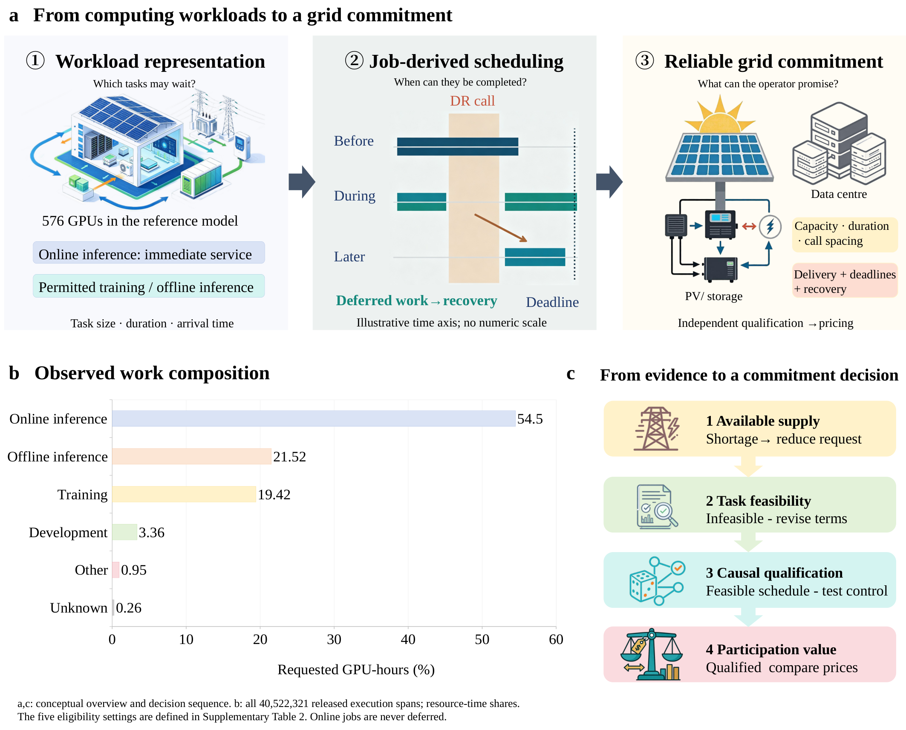
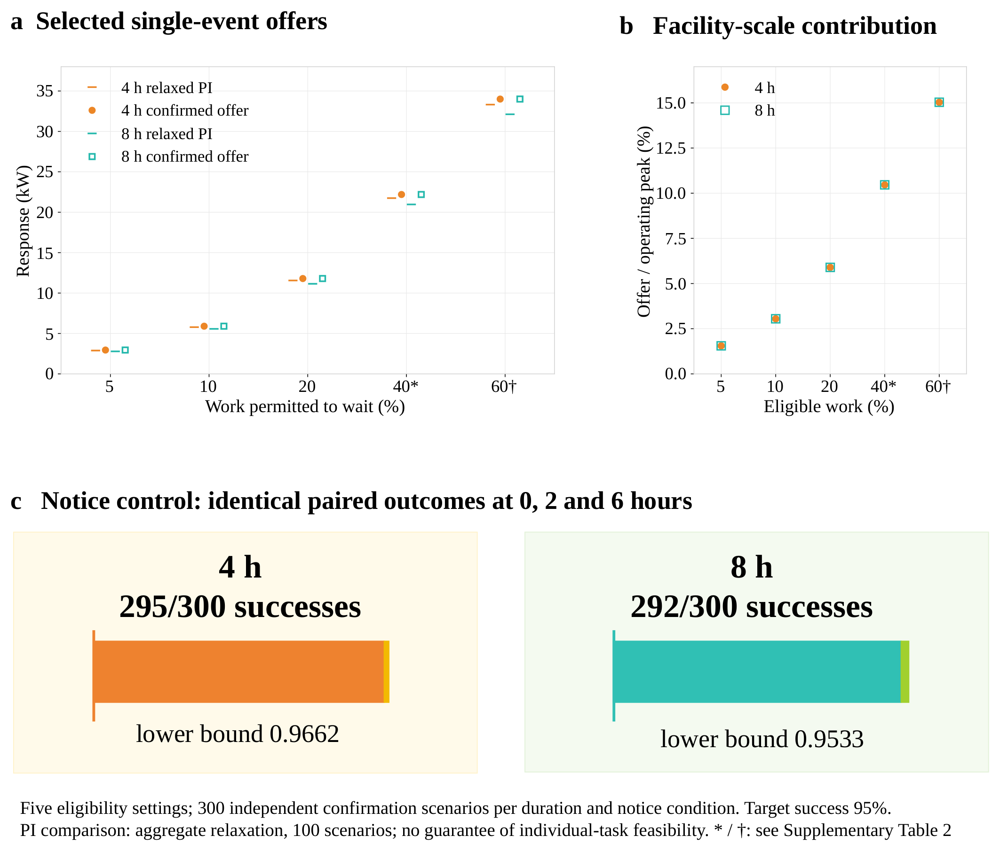
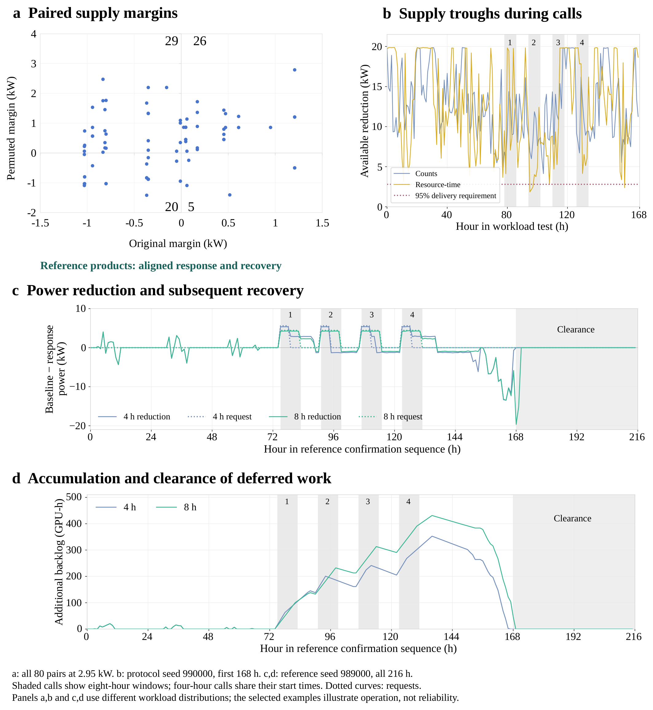
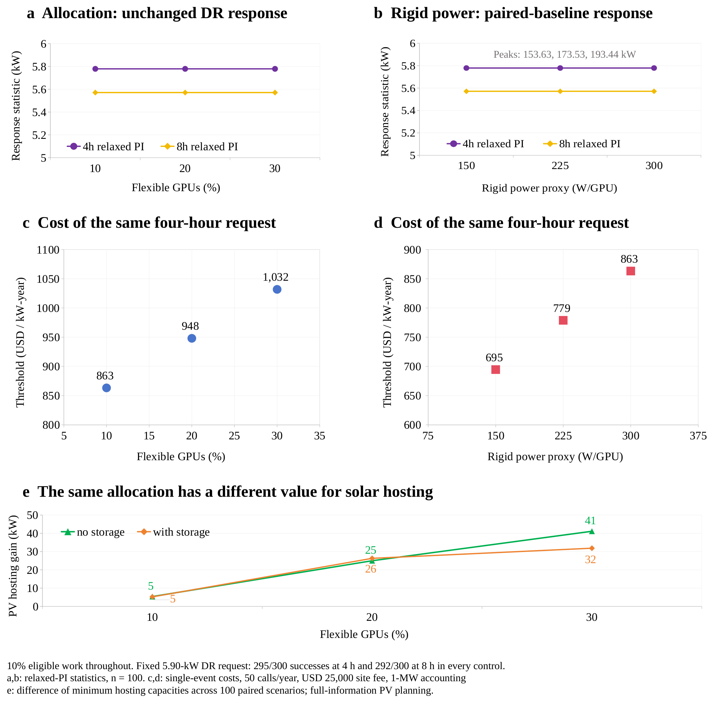

# Figure gallery

These are the existing **v0.27/R8** main figures. Click a preview for its full-size PNG. Read the paper captions for the definitions, units, sample sizes and conditions of each result. This gallery introduces the figures; it is not a replacement for their captions.

[Paper](../paper/v0.27/latex/main.pdf) · [Supplement](../paper/v0.27/latex/supplement.pdf) · [Editing guide](getting-started.md#redraw-a-figure)

## Figure 1 · Study overview

Workload composition, power modelling and the qualification process.

[PDF](../paper/v0.27/figures/main/01_FIGURES/AIDRBench_Figure_1.pdf) · [SVG](../paper/v0.27/figures/main/01_FIGURES/AIDRBench_Figure_1.svg) · [Panel data](../paper/v0.27/figures/main/02_PANEL_DATA/F01/)

## Figure 2 · Flexibility assumptions

Response offers and delivery outcomes under the tested workload assumptions.

[PDF](../paper/v0.27/figures/main/01_FIGURES/AIDRBench_Figure_2.pdf) · [SVG](../paper/v0.27/figures/main/01_FIGURES/AIDRBench_Figure_2.svg) · [Panel data](../paper/v0.27/figures/main/02_PANEL_DATA/F02/)

## Figure 3 · Workload realism and qualification

How workload representation and timing affect offers, confirmation and failure modes.

[PDF](../paper/v0.27/figures/main/01_FIGURES/AIDRBench_Figure_3.pdf) · [SVG](../paper/v0.27/figures/main/01_FIGURES/AIDRBench_Figure_3.svg) · [Panel data](../paper/v0.27/figures/main/02_PANEL_DATA/F03/)

## Figure 4 · Event and recovery behaviour

Paired outcomes and the hourly trajectories around response and recovery.

[PDF](../paper/v0.27/figures/main/01_FIGURES/AIDRBench_Figure_4.pdf) · [SVG](../paper/v0.27/figures/main/01_FIGURES/AIDRBench_Figure_4.svg) · [Panel data](../paper/v0.27/figures/main/02_PANEL_DATA/F04/)

## Figure 5 · Cost components

The cost assumptions and components associated with response participation.

[PDF](../paper/v0.27/figures/main/01_FIGURES/AIDRBench_Figure_5.pdf) · [SVG](../paper/v0.27/figures/main/01_FIGURES/AIDRBench_Figure_5.svg) · [Panel data](../paper/v0.27/figures/main/02_PANEL_DATA/F05/)

## Figure 6 · Participation thresholds

Waiting distributions, product thresholds and participation choices.

[PDF](../paper/v0.27/figures/main/01_FIGURES/AIDRBench_Figure_6.pdf) · [SVG](../paper/v0.27/figures/main/01_FIGURES/AIDRBench_Figure_6.svg) · [Panel data](../paper/v0.27/figures/main/02_PANEL_DATA/F06/)

## Supplementary figures

The [S1–S10 guide](../paper/v0.27/figures/supplement/README.md) maps each figure to its subject and ready-to-plot workbook. [English supplementary captions](../paper/v0.27/figures/supplement/FIGURE_LEGENDS_EN.md) describe the full comparisons.

The reference PDFs remain unchanged. Regenerating an image from supplied tables is a figure-level check, not a fresh execution of the study's simulations.
