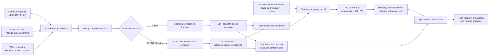

# AIDRBench Nature Communications 论文结构、当前结果与补充材料方案

> 状态：作者确认后的论文架构草案，不是投稿稿件，也不是预注册文件
>
> 更新日期：2026-08-20
>
> 当前代码分支：`codex/firm-flexibility-environment`
>
> 当前 sensitivity 分析代码提交：`45eeb58`
>
> Model A 冻结提交：`d03b44090b2c7ca6a5ae73bb2eb7a611f36a71e9`

## 1. 已确认的论文定位

### 1.1 一句话论点

> **AI data-centre demand flexibility is a finite, state-dependent grid resource: job constraints reduce nominal flexibility, compute debt limits repeated dispatch, and reliable workload shifting increases community hosting capacity while interacting non-additively with photovoltaic generation and battery storage.**

对应中文：

> **AI 数据中心需求柔性是一种有限且依赖运行状态的电网资源：任务约束使名义柔性折损，计算债务限制重复调用，而可靠的工作负荷移位能够提高社区数据中心接入容量，并与光伏和储能产生非简单叠加的相互作用。**

### 1.2 主次关系

论文必须按以下因果链展开：

1. 名义上可延迟的 AI 负荷并不等于可向电网承诺的可靠灵活性；
2. release time、GPU-hour、deadline、持续时间和可靠性共同形成 job-derived firm-flexibility envelope；
3. 一次需求响应会把未完成计算推向未来，形成 compute debt；
4. compute debt 会在重复事件中累积服务风险，即使瞬时功率交付尚未明显下降；
5. 这种可靠柔性可进一步转化为社区 PCC 下的数据中心 hosting value；
6. hosting value 是科学发现的系统后果，不是论文的第一出发点。

### 1.3 明确不作为主线的内容

- 不将论文写成 AIDRBench benchmark 或软件介绍论文；
- 不比较 DQN、PPO、SAC，也不把 reward 设计作为科学贡献；
- 不以“必须得到正 notice gain”为目标；零 notice gain 可以是结构性结果；
- 不把四卡服务器直接等同于 MW 级真实数据中心；
- 不在本篇主线进行 H100/H200 外推；
- 不把 development 结果写成 locked certificate 或现实因果效应。

## 2. 术语表

| 规范术语 | 首次定义 | 本文固定含义 |
|---|---|---|
| AIDRBench | AIDRBench research environment | 生成冻结场景、执行状态转移并评估可靠灵活性与社区接入价值的研究环境；不是论文的 headline contribution |
| firm flexibility | firm flexibility（可靠灵活性） | 在预声明服务与可靠性条件下可承诺的功率削减容量 |
| nominal flexibility | nominal flexibility（名义柔性） | 按数据中心峰值固定比例假设的柔性，不含任务可行性 |
| perfect information (PI) | perfect-information boundary | 已知完整未来时的物理规划上界 |
| restricted non-anticipative (NA) bound | restricted scenario-based non-anticipative bound | 在有限冻结场景和预声明信息结构内求得的非前视规划边界，不是独立证书 |
| causal certificate | independently tested causal capacity certificate | validation 选定后，在 locked-ID 上对固定因果实现进行的一次性可靠性检验 |
| compute debt | compute debt（计算债务） | 延迟任务形成的未来计算/能源义务；必须与普通 backlog 和 gross service energy 区分 |
| residual flexibility ratio | residual flexibility ratio | 重复事件相对同场景、同钟点 fresh-event counterfactual 的交付比 |
| joint-episode success | joint-episode success | 一个重复事件 episode 同时满足全部事件交付及全局服务约束 |
| hosting capacity | data-centre hosting capacity | 在 PCC、PV、BESS 和服务约束下可接入的数据中心容量 |
| PCC | point of common coupling | 社区与上级电网连接点及其容量约束 |
| development result | development-set diagnostic/planning result | 用于建立机制和冻结设计，不能称为最终独立验证 |

英文正文统一使用英式拼写 `data centre`；变量和代码字段保持仓库原名。

## 3. Nature Communications 篇幅与展示预算

文章类型按 Research Article 规划。当前建议控制在约 5,000 词以内，且该上限包含 Methods。

| 部分 | 建议词数 | 功能 |
|---|---:|---|
| Abstract | 150 | 单段，最后写，含至少一个定量结果 |
| Introduction | 650 | 重要性、缺口、科学问题和本文贡献 |
| Results | 2,100 | 五个结论导向的结果部分 |
| Discussion | 650 | 解释、边界、替代解释和系统意义 |
| Methods | 1,450 | 可复现定义、模型、统计与 provenance |
| 合计 | 约 5,000 | 不另设冗长 Conclusion |

主文采用 5 幅多面板图，不设置独立主文表格。Nature Communications 没有 Extended Data 层，额外证据进入 Supplementary Information。

## 4. 建议题目

首选：

> **Job-derived flexibility envelopes reveal compute-debt limits and community hosting value of AI data centres**

备选：

1. **Compute debt limits the firm grid flexibility of AI data centres**
2. **Job constraints shape firm flexibility and hosting value in community AI data centres**
3. **State-dependent workload flexibility increases community hosting capacity for AI data centres**

首选题目同时包含对象、核心机制和系统后果；不把 AIDRBench、MPC 或四卡硬件写进题目。

## 5. Abstract 结构合同

Abstract 在 locked-ID 结果完成后再写成最终英文。当前只冻结六个句子任务：

1. AI 数据中心快速增长使其电力需求既构成接入压力，也可能提供需求侧柔性；
2. 现有固定比例表示忽略任务期限、恢复义务和可靠性，因此不能直接解释可承诺容量；
3. 本文从 trace-calibrated 作业、实测锚定功率模型和社区负荷构建 job-derived firm-flexibility envelope；
4. 报告 duration–notice–reliability surface 的主结果和独立因果容量证书；
5. 报告 repeated-event compute debt 和 2 × 2 × 2 hosting 的关键定量结果；
6. 以“有限、状态依赖且需独立认证的电网资源”收束，并明确结果边界。

`[Evidence needed: locked-ID causal capacities and final primary quantitative statistic before drafting the abstract.]`

## 6. Introduction 结构

### Paragraph 1 — Field-scale need

说明 AI 计算负荷、配电/社区接入瓶颈与需求响应机会。此段回答“为什么相邻领域读者应关心”。

`[Citations needed: AI electricity-demand growth, data-centre interconnection constraints, demand-response value.]`

### Paragraph 2 — Physical representation gap

指出将数据中心柔性写成固定峰值比例会忽略 release time、工作量守恒、deadline、硬件类别功率和恢复阶段，因此 nominal flexibility 不是 firm flexibility。

`[Citations needed: existing data-centre flexibility models and workload-shifting studies.]`

### Paragraph 3 — Reliability and system-value gap

进一步指出：单次削峰不回答重复调用是否耗尽，也不回答柔性是否增加社区 hosting capacity、是否与 PV/BESS 互补或替代。

`[Citations needed: firm DR qualification, rebound/recovery, hosting-capacity and DER interaction literature.]`

### Paragraph 4 — Present study

用一个段落给出研究设计：job-derived PI/NA/causal layers、compute-debt exhaustion、2 × 2 × 2 hosting，以及硬件/工作负荷不确定性。AIDRBench 只作为实现这些层次的可复现环境出现。

## 7. Results 结构

### Result 1 — Job constraints convert nominal load flexibility into a firm-flexibility envelope

**问题**：固定比例的 nominal flexibility 与任务可行边界之间相差多少？

**段落任务**：

1. 定义从作业到达、deadline 和类别 GPU-hour 到数据中心功率的映射；
2. 说明四卡实验只提供 class-aware 功率参数的 measurement anchor；
3. 区分 nominal、PI、restricted NA 和 causal 四层容量；
4. 用 nominal–PI gap 展示任务约束造成的第一层折损。

**当前证据**：

- 功率 artifact 已锁定 training 和 offline-inference 的类别功率，并带 SHA-256；
- 100 个 development scenarios 的 class-aware PI frontier 已完成；
- PI 紧凑累计模型与旧 job-edge 模型在 18 个诊断点完全一致，最大绝对差为 0.0 kW。

**仍缺**：

- 对 nominal–PI physical gap 的最终主图和预声明统计汇总；
- locked 之前对硬件假设范围、PUE 和 workload mix 的 sensitivity；
- 文献定位与外部效度边界。

**Figure 1**：系统概念图、作业约束到功率的映射、四层容量定义和 nominal–job-derived 差距。四卡原始功率曲线全部移至 Supplementary。

### Result 2 — Duration and reliability shape firm flexibility, whereas notice alone may not

**问题**：事件持续时间 (H)、通知时间 (N) 和可靠性 (q) 如何共同决定容量？

**段落任务**：

1. 展示 (H=\{1,2,3,4,6,8\}\) h 下的 duration decline；
2. 比较 PI、同集合经验 PI、restricted NA 和 fixed causal realization；
3. 展示 (q=0.90,0.95,0.99) 的可靠性代价；
4. 把零 notice gain 解释为 Model A 下的结构性结果，而不是待修 bug；
5. 用 binding constraints、pre-execution eligibility、spare capacity 和 schedule divergence 解释 notice 条件。

**当前证据**：development q=0.95 的 restricted NA surface 已完成，0、2、6 h notice 在所有 duration 上相同；H=4 和 H=8 的 notice diagnostics 也显示 PI/NA notice gain 为 0。固定容量 robust MPC 在这两个诊断点的 development 成功率均为 0.92，interval delivery 为约束项。

**仍缺**：

- validation 上冻结 causal capacity；
- locked-ID 上一次性认证；
- 500 个 locked-ID episodes 才能支持预声明 q=0.99 设计；
- success-criterion sensitivities。

**Figure 2**：duration–notice–reliability surface、四层容量曲线、gap decomposition 和 notice-mechanism inset。

### Result 3 — Compute debt limits repeated dispatch before power delivery collapses

**问题**：为什么重复 DR 会累积风险，而更长的时间间隔不必然恢复灵活性？

**段落任务**：

1. 给出代表性 episode 中功率、backlog、slack 和 compute debt 轨迹；
2. 将每次重复事件与同场景、同钟点 fresh-event counterfactual 配对；
3. 分开报告 event-local delivery 与 joint-episode service success；
4. 展示 compute debt 先于瞬时交付能力恶化；
5. 说明只有 gap 内存在 spare compute headroom 时，时间才可偿还债务。

**当前证据**：100 个 development scenarios、1,000 个联合程序和 4,000 个事件结果已完成。第 4 次事件的平均配对 compute-debt increment 为 0.58–1.37 MWh，而 p05 residual flexibility ratio 仍为 0.9897–1.0000；joint success 为 0.00–0.94。H=8、gap=24 h 时联合服务 0/100 成功，但第 4 次事件的 p05 配对交付仍为 fresh event 的 98.97%。

**仍缺**：validation exhaustion 和预声明 robustness；当前结果不能称为 repeated-event firm-capacity certificate。

**Figure 3**：代表性轨迹、compute-debt growth、event-4 residual delivery、joint-success heatmap，以及 debt/headroom 与失败模式的关系。

### Result 4 — Workload flexibility increases community hosting capacity and changes distributed-energy value

**问题**：可靠工作负荷移位能增加多少社区数据中心接入容量，并如何改变 PV/BESS 的边际价值？

**段落任务**：

1. 说明 rigid/flexible × no/with PV × no/with BESS 的 2 × 2 × 2 配对设计；
2. 报告 100 个 frozen scenarios 上的 simultaneous scenario-feasible capacity；
3. 报告场景内 flexible–rigid paired effects 及 simultaneous intervals；
4. 报告 AI–BESS substitution 和 AI–PV complementarity；
5. 将结论限定为 Model A 下的 development planning bounds。

**当前证据**：800 个 portfolio optimizations 均完成。四种 DER 条件下，flexible capacity 均高于 rigid capacity；四个平均 paired AI gains 的 Bonferroni 95% simultaneous intervals 均高于 0。按预声明 10.05 kW equivalence margin，AI–BESS 在两个 PV strata 中为 substitution，AI–PV 在两个 BESS strata 中为 complementarity。

**仍缺**：validation/locked 外部检验、profile 和参数 sensitivities，以及对 planning bound 与可部署 causal hosting value 的严格区分。

**Figure 4**：八种 portfolio 的 hosting capacities、AI paired gains、AI–DER interactions 和不同社区 headroom 下的 regime map。原 README 的 Result 4 与 Result 5 合并到这一节，避免重复同一 2 × 2 × 2 证据。

### Result 5 — Independent evaluation defines robustness and generalization boundaries

**问题**：哪些结论在硬件功率、工作负荷和社区 profile 变化下保持，哪些只能在 Model A 内成立？

**段落任务**：

1. 展示 calibration lower/nominal/upper power cases；
2. 展示 flexible utilization、rigid utilization 和 deadline slack 的 sparse factorial sensitivities；
3. 报告 validation 冻结选择和 locked-ID causal certificate；
4. 将 locked-OOD 作为外推边界，而非替代 locked-ID；
5. 明确四卡 measurement anchor、fluid/preemptible workload 和 1 h resolution 的局限。

**当前证据**：三种功率 case 的 development PI sensitivity 已完成；绝对 kW 随功率斜率上升，但相对 operating peak 的容量比例下降。Sparse workload schema 的 27 个 no-DR gate evaluations 全部通过；完整配对 workload sensitivity 的 1,800/1,800 个 PI programs 为 optimal。提高 flexible arrival utilization 增大 H={4,8} 的 firm boundary，降低它则减小边界；预声明的 rigid-utilization、deadline-slack 和两个组合点未产生额外边界变化。独立的 1,800 个 one-factor-at-a-time success-criteria PI programs 也已完成；delivery threshold 改变容量，而 deadline、rebound 和 window-relief 阈值没有改变这两个 development 容量点。100 个 validation scenarios 上的 q={0.90,0.95,0.99} frozen robust-MPC selections 与 500 个不重叠 locked-ID episodes 的一次性 replay 已在同一提交 `5889405` 完成。headline q=0.95 在 H={2,3,4,6,8}、N={0,2,6} 的 15 个单元通过一侧 Wilson 门槛；H=1 的 55.16 kW 候选未通过。完整审计见 `data/manifests/nature_mainline_locked_id_results_v1.yaml`。

**仍缺**：locked-OOD 外推检验，以及硬件/社区 profile 变化下的独立 causal 证据。当前 locked-ID 只支持 Model A 主分布内的单事件结论；H=1 未通过候选不能写成 certified capacity，且单事件证书不能替代 repeated-event exhaustion 结论。

**Figure 5**：hardware/workload sensitivity、validation-to-locked workflow、locked-ID certificate 和 locked-OOD generalization boundary。

## 8. Discussion 结构

Discussion 不逐图复述，按五段组织：

1. **Central advance**：firm flexibility 必须从任务与状态推导，而不能从峰值功率直接假定；
2. **Mechanistic meaning**：compute debt 解释了为什么瞬时交付仍正常时，联合服务可靠性已经下降；
3. **System consequence**：job-derived flexibility 可转化为 hosting value，但与 PV/BESS 的关系不是简单相加；
4. **Alternative explanations and limits**：零 notice gain 可能来自充足 slack、有限 pre-execution headroom 或 binding delivery limit；结论受 fluid/preemptible jobs、1 h resolution、profile 和功率 artifact 限制；
5. **Bounded outlook**：未来工作才考虑 non-preemptive/gang scheduling、checkpoint overhead、HIL、其他 GPU 代际和在线算法比较。

不单设重复性的 Conclusion。Discussion 最后一段用“贡献—决定性证据—意义—边界”完成收束。

## 9. Methods 结构

### 9.1 Study design and evidence hierarchy

定义 nominal、PI、restricted NA、causal certificate、development/validation/locked-ID/locked-OOD，以及单事件和重复事件的不同统计单位。

### 9.2 Community, workload and event data

- 社区：NLR/NREL EULP 建模并经实测校验的 profile，不称为本项目采集的真实社区电表；
- 作业：Alibaba GPU 2026 trace-calibrated synthetic arrivals；deadline 由预声明 policy 生成；
- DR：从预声明峰时窗口抽样的配置事件，不称为真实 utility dispatch。

### 9.3 Workload and deadline model

定义 release、class、GPU-hour、deadline、EDF fluid queue、miss、terminal backlog、rigid/flexible fractions，以及 class-aware (x_{c,t})。

### 9.4 Hardware-anchored power model

定义固定功率、类别动态功率、PUE、reference-mix operating peak 和 worst-class peak。明确 independent workload run 是功率统计单位，node overhead 尚无整机电表测量。

### 9.5 Hourly environment and compute debt

定义 1 h 状态转移、arrivals-before-action 顺序、清空尾段、baseline counterfactual、compute debt 和 recovery/rebound。

### 9.6 Demand-response success criteria

同时使用 mean delivery、minimum interval delivery、deadline miss、rebound、window peak relief 和 terminal backlog。不得以事件总量 95% 代替逐时段 95%。

### 9.7 PI, restricted NA and causal implementation

说明 exact-binomial lower tolerance bound、matched empirical order statistic、non-anticipativity、冻结 robust MPC 规范和 fail-closed hash verification。

### 9.8 Repeated-event counterfactual design

说明同场景、同钟点 fresh-event 配对，event-local 指标与 joint-episode success 的分离，以及 recovery gap 不能自动等同于可用恢复算力。

### 9.9 Hosting-capacity optimization

定义 PCC、PV、BESS、八种 portfolios、simultaneous feasible minimum、场景内 paired effects 和 difference-in-differences interactions。

### 9.10 Statistical analysis and reproducibility

说明独立单位、bootstrap、Bonferroni simultaneous intervals、equivalence margin、seed ranges、solver、Git commit、source/config/data/calibration hashes 和 checkpointed resume。

## 10. 五幅主图规划

| 主图 | 主要结论 | 主文保留 | 移入 Supplementary |
|---|---|---|---|
| Fig. 1 | 名义柔性必须经任务约束转换为 firm envelope | 系统链、四层边界、nominal–PI gap | 四卡全部原始功率轨迹、每 GPU 细节、拟合诊断 |
| Fig. 2 | duration 和 reliability 塑造容量，notice 增益可为零 | surface、主要 gap、核心 notice diagnostic | 全部节点/约束诊断、完整 q 表 |
| Fig. 3 | compute debt 先于瞬时交付崩溃并限制重复调用 | 轨迹、joint success、debt/residual relation | 全 H × gap × event 表、逐场景分布 |
| Fig. 4 | 柔性提高 hosting capacity 并改变 DER 价值 | 2 × 2 × 2、paired gains、interaction | 每个 profile、solver 细节、完整 bootstrap |
| Fig. 5 | 独立检验限定稳健性与外推边界 | sensitivity、locked-ID、locked-OOD | 全参数组合和失败案例 |

## 11. 当前可报告结果

以下全部是 development evidence，除特别说明外都不能写成最终 certificate。

### 11.1 四卡功率测量锚点

硬件为 4 × NVIDIA RTX PRO 6000 Blackwell Max-Q Workstation Edition，节点拓扑记录为 PCIe、无 NVLink。artifact evidence class 为 `benchmark_anchored_synthetic`。

| 参数 | 当前估计 | 不确定性/边界 |
|---|---:|---|
| idle power | 13.94 W/GPU | 单次 node idle run 内 GPU 间范围 6.74–18.68 W；不是独立重复置信区间 |
| training active power | 259.08 W/GPU | 两个独立四卡 run 均值的 95% t interval：225.81–292.35 W |
| offline-inference active power | 300.02 W/GPU | 两个独立四卡 run 均值的 95% t interval：299.69–300.35 W |
| node fixed overhead | 300 W/node | 工程假设范围 150–450 W；没有整机电表测量 |
| held-out power MAE | 3.80 W | 一个 held-out run；仅支持当前拟合路径 |

这组实验的作用是锚定功率模型和不确定性范围，不是证明大规模数据中心的普遍硬件规律。

### 11.2 Development firm-flexibility surface

同一 100-scenario ensemble 上、允许 5 个经验失败的 q=0.95 restricted NA capacity：

| Duration | N=0 h | N=2 h | N=6 h |
|---:|---:|---:|---:|
| 1 h | 56.42 kW | 56.42 kW | 56.42 kW |
| 2 h | 53.49 kW | 53.49 kW | 53.49 kW |
| 3 h | 45.17 kW | 45.17 kW | 45.17 kW |
| 4 h | 44.00 kW | 44.00 kW | 44.00 kW |
| 6 h | 43.01 kW | 43.01 kW | 43.01 kW |
| 8 h | 41.19 kW | 41.19 kW | 41.19 kW |

同一表中的 NA 与 matched empirical PI order statistic 相同，因此描述性 information gap 为 0.0 kW。它们不带独立置信下界。

名义功率 case 下，q=0.95、confidence=0.95 的 PI nonparametric lower-tolerance capacities 为：

| Duration | PI tolerance capacity |
|---:|---:|
| 1 h | 53.01 kW |
| 2 h | 44.46 kW |
| 3 h | 41.19 kW |
| 4 h | 40.15 kW |
| 6 h | 40.15 kW |
| 8 h | 37.76 kW |

这两个表回答不同统计问题，不能相减为“information gap”。100 个 development episodes 也不足以在 95% confidence 下估计 q=0.99。

### 11.3 Notice mechanism diagnostic

在 H=4、8 h，N=0、6 h 的 development diagnostic 中：

- PI notice gain = 0；
- restricted NA notice gain = 0；
- frozen-spec robust MPC 在 44.00 和 41.19 kW 固定容量下的成功率均为 0.92；
- N=6 时平均 causal upper bound on eligible pre-execution work 约为 1,829 GPU-hour；
- no-control pre-event spare capacity 约为 133 GPU-hour；
- paired robust-MPC schedule 每个 event 前时段约改变 1.3 GPU-hour；
- 调度改变了，但 binding interval-delivery constraint 没有被放松。

因此当前最严谨的解释是：advance notice 在 Model A 中增加信息并改变调度，但没有提高 binding capacity；不能通过增加机制复杂度来制造正结果。

### 11.4 Repeated-event exhaustion

固定容量为 H=4 时 44.0003 kW，H=8 时 41.1908 kW。

| H / gap | Joint success | Event-4 p05 residual ratio | Event-4 mean paired debt increment |
|---|---:|---:|---:|
| 4 h / 2 h | 0.75 | 1.0000 | 578.9 kWh |
| 4 h / 4 h | 0.78 | 1.0000 | 665.9 kWh |
| 4 h / 8 h | 0.94 | 1.0000 | 693.1 kWh |
| 4 h / 12 h | 0.78 | 0.9994 | 845.1 kWh |
| 4 h / 24 h | 0.61 | 0.9959 | 1,034.7 kWh |
| 8 h / 2 h | 0.73 | 0.9911 | 1,057.9 kWh |
| 8 h / 4 h | 0.85 | 0.9984 | 1,064.1 kWh |
| 8 h / 8 h | 0.65 | 0.9939 | 1,174.9 kWh |
| 8 h / 12 h | 0.79 | 0.9986 | 1,085.8 kWh |
| 8 h / 24 h | 0.00 | 0.9897 | 1,372.8 kWh |

joint success 对 gap 并不单调，说明“墙上时钟经过了多久”不能替代“期间实际存在多少 spare compute headroom”。

### 11.5 Community hosting capacity

**同时对 100 个 scenarios 可行的 planning capacity：**

| PV | BESS | Rigid | Flexible | Difference of simultaneous minima |
|---|---|---:|---:|---:|
| 无 | 无 | 202.15 kW | 429.72 kW | 227.57 kW |
| 无 | 有 | 278.60 kW | 592.93 kW | 314.34 kW |
| 有 | 无 | 212.44 kW | 451.60 kW | 239.16 kW |
| 有 | 有 | 313.51 kW | 658.16 kW | 344.65 kW |

**场景内 flexible–rigid 平均 paired effects：**

| PV | BESS | Mean AI gain | Bonferroni 95% simultaneous CI |
|---|---|---:|---:|
| 无 | 无 | 282.90 kW | [270.28, 293.87] kW |
| 无 | 有 | 235.25 kW | [225.26, 245.17] kW |
| 有 | 无 | 346.50 kW | [330.58, 361.03] kW |
| 有 | 有 | 270.47 kW | [259.40, 281.28] kW |

第一张表是各组合 scenario minima 的规划容量，第二张表是先做场景内差值再求均值的 paired estimand；二者不能互换。

**预声明交互：**

| Interaction | Estimate | Simultaneous CI | Development interpretation |
|---|---:|---:|---|
| AI × BESS, no PV | −47.64 kW | [−55.47, −38.02] | substitution |
| AI × BESS, with PV | −76.03 kW | [−87.20, −61.18] | substitution |
| AI × PV, no BESS | +63.60 kW | [54.35, 72.15] | complementarity |
| AI × PV, with BESS | +35.22 kW | [26.78, 43.71] | complementarity |

这些标签只对当前预声明 10.05 kW equivalence margin 和 development ensemble 成立。

### 11.6 Success-criteria sensitivity

9 个预声明 workload cases × 3 个 development seeds 的 no-DR service gate 共 27 行，全部为零 baseline deadline miss、零 terminal backlog，因此允许后续 sensitivity 分析。

对 H={4,8}、q=0.95、confidence=0.95，使用 100 个 frozen scenarios 运行 9 个 one-factor-at-a-time criteria cases，共得到 1,800 个 `optimal` PI solves：

| Criteria case | H=4 h | H=8 h | 相对 reference 的解释 |
|---|---:|---:|---|
| reference | 40.15 kW | 37.76 kW | delivery 0.95、deadline miss 0.01、rebound 0.25、window relief 0.50 |
| delivery 0.90 | 42.38 kW | 39.86 kW | 放宽 linked mean/interval delivery 后分别增加 2.23、2.10 kW |
| delivery 0.98 | 38.92 kW | 36.60 kW | 收紧 linked mean/interval delivery 后分别降低 1.23、1.16 kW |
| deadline miss 0.00 / 0.02 | 40.15 kW | 37.76 kW | 容量不变 |
| rebound 0.10 / 0.50 | 40.15 kW | 37.76 kW | 容量不变 |
| window relief 0.25 / 0.75 | 40.15 kW | 37.76 kW | 容量不变 |

结果说明，在这两个 development PI 点上，linked interval-delivery definition 决定容量；其他阈值仍约束可行调度，但不是容量设置约束。它不能外推为 causal controller 或 locked scenarios 的 binding-constraint 结论。

### 11.7 Frozen causal selection and one-time locked-ID certificate

所有 selection 与 replay 均绑定提交 `5889405`、完整 robust-MPC specification、
controller/source hashes 和互不重叠的 scenario hashes。下表仅列 N=0；同一 H 下
N={0,2,6} 的 selected capacity、success count 与 certification decision 相同。

| q | H | Selected capacity | Locked success | One-sided 95% Wilson lower bound | Certified |
|---:|---:|---:|---:|---:|:---:|
| 0.95 | 1 h | 55.16 kW | 477/500 | 0.936 | 否 |
| 0.95 | 2 h | 45.74 kW | 491/500 | 0.969 | 是 |
| 0.95 | 3 h | 39.65 kW | 497/500 | 0.985 | 是 |
| 0.95 | 4 h | 39.65 kW | 492/500 | 0.972 | 是 |
| 0.95 | 6 h | 37.88 kW | 489/500 | 0.964 | 是 |
| 0.95 | 8 h | 36.71 kW | 492/500 | 0.972 | 是 |

headline q=0.95 因而是 15/18 个 H×N 单元通过，而不是整张 surface
simultaneously certified。H=1 的经验成功率为 0.954，但置信下界未达到 0.95；
该候选必须作为非认证边界保留，不能在看到 locked-ID 后向下重选。secondary
q=0.90 与 q=0.99 分别为 15/18 和 9/18 个单元通过，完整表进入 SI。所有失败
只由 mean/interval delivery 引起；deadline、rebound、window relief 和 terminal
backlog 均未成为失败标签。

逐场景 `recovery_time_h` 在大多数 rollout 中为 NaN，含义是 backlog 未在声明的
24 h recovery window 内回到 baseline tolerance；它不是当前单事件 certificate
success criterion，不能解释为零恢复时间。该观察应作为 repeated-event exhaustion
与恢复边界的限定证据，而不是用于事后修改单事件容量。

## 12. Supplementary Information 总体结构

建议补充材料采用以下目录：

1. **Supplementary Note 1 — Data provenance and temporal partitions**
2. **Supplementary Note 2 — AIDRBench environment and reproducibility interface**
3. **Supplementary Note 3 — Four-GPU power calibration and uncertainty**
4. **Supplementary Note 4 — Firm-flexibility definitions and certification statistics**
5. **Supplementary Note 5 — Notice-mechanism diagnostics**
6. **Supplementary Note 6 — Repeated-event exhaustion diagnostics**
7. **Supplementary Note 7 — Hosting-capacity optimization and paired inference**
8. **Supplementary Methods — Solver settings, hashes, resume semantics and test contracts**

如果补充 PDF 超过 10 页，应在开头提供目录。大规模逐场景结果应作为单独 CSV/Parquet source data，而不是压成不可读的 PDF 表格。

## 13. Supplementary Note 2：AIDRBench 环境展示方案

### 13.1 环境在论文中的角色

AIDRBench 是将外生社区/任务/事件数据转换为可复现实验状态转移、功率轨迹和服务结果的研究环境。它承担三项作用：

1. 让 online controller、PI、NA 和 hosting planner 共享同一工作量守恒、deadline 和 class-aware power 定义；online 环境使用 EDF queue，PI/NA 则使用经等价诊断的累计 release/deadline formulation；
2. 用冻结场景保证不同方法看到相同的外生过程和 baseline counterfactual；
3. 输出逐时段和逐事件指标，使 firm flexibility、compute debt、rebound 和 hosting value 可审计。

它不是主文中的新控制算法。主线规划结果也不通过 Gym reward 定义科学结论。

### 13.2 建议的 Supplementary Fig. 1

注：BESS 目前在 hosting-capacity optimization 中显式建模，不属于 online Gym action/state；图中不能暗示 Gym controller 正在控制电池。

### 13.3 环境接口

| 层 | 当前实现 | 论文应如何表述 |
|---|---|---|
| 时间分辨率 | 固定 1 h；非 1 h 配置 fail closed | hourly fluid environment，不声称支持分钟级 deadline aging |
| episode | 7 天主时域 + 48 h clearance tail（Nature development config） | 尾段停止新到达，用于评估恢复和 terminal backlog |
| 社区输入 | EULP profile，可启用 PV 后形成 net community load | 建模并校验的 profile，不称为项目实测电表 |
| 作业输入 | Alibaba 2026 trace-calibrated synthetic arrivals + policy deadlines | trace-calibrated process，不称为原始 trace 的逐任务真实重放 |
| 事件输入 | duration、notice、request、peak-window start | 配置/抽样 DR scenarios，不称为 utility dispatch 记录 |
| 在线 action | 连续 ([0,1]) 执行比例；或 5 档离散比例 | 聚合 flexible GPU-hour capacity fraction |
| 优化 action | class-aware (x_{c,t}) | PI/NA/hosting 的 training/offline-inference 调度变量 |
| 队列 | class-aware fluid EDF，整小时 deadline buckets | 工作量守恒、deadline miss 和 class accounting 可审计 |
| DC power | fixed DC + class-specific dynamic energy/power | calibration artifact 是参数锚点，PUE/overhead 单独说明 |
| PCC | online 环境为 community net load + DC power | BESS 只在 hosting planner 中扩展 PCC 方程 |
| baseline | 相同 arrivals 的 full-service causal counterfactual | delivery 和 rebound 都相对 matched baseline 计算 |
| outputs | power、delivery、interval metrics、backlog、miss、slack、debt、rebound | 科学结论由预声明 operational criteria 产生 |

### 13.4 `firm_v5` 归一化观测

当前 policy observation 是稳定顺序的 63 维 `float32` 向量。Nature development config 使用 8 个 deadline-feasibility buckets 和 6 h forecast。

| 观测组 | 维数 | 归一化依据 |
|---|---:|---|
| 时钟周期编码 | 4 | hour/day sin–cos |
| 当前社区、PV、PCC、DC 和请求功率 | 6 | PCC capacity 或 flexible power range |
| backlog、累计利用率、miss、terminal excess、slack | 9 | capacity × deadline horizon、累计 arrivals、最大 deadline |
| controlled deadline feasibility | 8 | 各 deadline 前累计 due work / 可用 GPU-hour capacity |
| excess deadline feasibility | 8 | controlled 相对 no-control baseline 的正向超额 |
| event、notice、recovery 和事件历史 | 10 | event/recovery duration 和 24 h history |
| running peak/rebound 和 previous action/PCC | 6 | request/PCC/action bounds |
| 未来 6 h community forecast | 6 | PCC capacity |
| 未来 6 h available-flexibility forecast | 6 | flexible power range |
| **合计** | **63** | 声明边界内逐元素裁剪并由 Gym space 验证 |

重要边界：显式 `compute_debt_kwh` 当前位于可审计的 `control_state`/`info` 输出中；63 维 policy vector 通过 backlog、deadline feasibility 和 slack 表示相关状态，但没有单独名为 `compute_debt_kwh` 的观测维度。正文与补充材料必须保持这一表述。

### 13.5 每小时状态转移顺序

一个 step 的顺序为：

1. 当前时段 arrivals 在 action 前加入 controlled 和 baseline queues；
2. controller/planner 选择本小时可执行 GPU-hour；
3. 队列按 earliest-deadline-first 执行；
4. 当前小时到期且未服务的 work 记为 deadline miss；
5. 剩余 deadline buckets 老化一小时；
6. 按执行类别计算 DC power 和 energy；
7. 与 community/PV 合成 PCC power，并结算 delivery、rebound 和 window metrics；
8. 更新 backlog、slack、compute debt、事件历史和下一时段观测。

该顺序必须与 planner snapshot 和 frozen replay 保持一致。

### 13.6 Reward 与论文证据的边界

环境保留 `firm_threshold_v2` reward，便于未来在线控制研究。其惩罚项包括 delivery、deadline feasibility、terminal deadline miss、rebound、window relief、terminal backlog、excess backlog 和 switching。

本篇论文遵循以下原则：

- firm-capacity success 由预声明 operational criteria 单独计算；
- PI、NA、hosting 和 repeated-event 主结果不通过 reward 优化获得；
- robust MPC 只作为冻结的 causal reference implementation，不训练 reward；
- DQN/PPO/SAC 和 CMDP reward variants 不作为本篇结果；
- reward 的存在只证明环境可供后续控制研究复用，不能作为环境物理合理性的证据。

### 13.7 可复现性与 fail-closed 机制

Supplementary 应列出：

- community、workload、calibration artifact 和 frozen-scenario SHA-256；
- independent community/workload/event random streams；
- observation version、config schema、protocol version 和 Git commit；
- robust-MPC normalized specification、raw YAML hash 和相关源码 hashes；
- locked selection/test mismatch 时 fail closed；
- checkpointed scenario execution 与 byte-identical aggregate replay；
- solver、线程数、容差、seed range 和输出 artifact hashes。

### 13.8 环境验证项目

补充材料不应只说“测试通过”，而应按物理合同分类展示：

| 验证合同 | 已有代码路径 |
|---|---|
| Gymnasium observation/action contract | continuous/discrete environment checks |
| 工作量守恒 | queue conservation and clearance-tail tests |
| deadline 老化和 EDF | deadline-bucket transition tests |
| class-aware power and compute debt | hourly power tests |
| PCC identity and active limit | hourly environment/power tests |
| notice masking | event forecast leakage tests |
| PI notice invariance | PI frontier tests |
| NA weak monotonicity | non-anticipative tests |
| frozen replay determinism | frozen scenario tests |
| calibration integrity | artifact hash and strict-field tests |
| controller specification integrity | frozen causal certificate mismatch tests |
| optimization software stack | HiGHS/Parquet clean-install smoke test |
| repeated-run resume | exhaustion and hosting checkpoint tests |

当前仓库的 mechanism-core 路径通过 214 项自动化测试；投稿前仍应在 clean environment 中保存完整 `pytest`、`ruff`、`mypy` 和 GitHub Actions 通过记录。

### 13.9 建议的环境补充图表

- **Supplementary Fig. 1**：上述 end-to-end environment flow；
- **Supplementary Fig. 2**：63 维 observation 分组、归一化和信息可见性时间线；
- **Supplementary Fig. 3**：一个代表性 frozen episode 的 arrivals → action → queue → power → metrics 轨迹；
- **Supplementary Fig. 4**：online aggregate action 与 class-aware planner action 的接口差异；
- **Supplementary Table 1**：全部 observation features、单位、上下界和是否对 controller 可见；
- **Supplementary Table 2**：action、transition、baseline 和 terminal semantics；
- **Supplementary Table 3**：数据/config/source/artifact hashes；
- **Supplementary Table 4**：环境验证合同与对应测试；
- **Supplementary Data 1**：machine-readable scenario and result schemas。

## 14. 主文与补充材料分配审计

| 结果/材料 | 分类 | 去向 | 原因 |
|---|---|---|---|
| job-derived firm envelope | core discovery | 主文 Result 1 | 建立核心对象 |
| duration/reliability surface | core discovery | 主文 Result 2 | 直接回答主科学问题 |
| zero notice gain及条件 | qualification/mechanism | 主文简述 + SI 诊断 | 改变对 (dF/dN\) 的解释，不能隐藏 |
| compute-debt exhaustion | core discovery | 主文 Result 3 | 核心机制 |
| 2 × 2 × 2 hosting gain | system consequence | 主文 Result 4 | 说明电网规划价值 |
| AI–PV/BESS interactions | mechanism/application | 主文 Result 4 | 与同一 hosting design 共用证据，应合并 |
| four-GPU raw curves | necessary support/provenance | SI | 锚定功率但不是主要创新 |
| AIDRBench 63-D interface | reproducibility detail | SI + Methods 一句 | 支持复现，不占用主论证链 |
| reward variants/RL curves | non-mainline extension | 不进入本篇 | 与主科学命题无关 |
| full solver diagnostics | provenance/robustness | SI | 支持可信度，不推进主结论 |
| locked-ID certificate | necessary support | 主文 Result 5 | 没有它不能声称 firm causal capacity |
| locked-OOD | qualification | 主文边界 + SI 细节 | 定义外推范围 |

## 15. 当前证据状态

| 证据层 | 状态 | 当前可用表述 |
|---|---|---|
| 四卡 calibration artifact | 已完成，样本量有限 | measured GPU-board-power anchor with bounded uncertainty and assumed node overhead |
| 100-scenario PI | 已完成 | development physical planning bounds |
| 100-scenario restricted NA q=0.95 | 已完成 | same-ensemble restricted scenario-based bound |
| notice diagnostic | 已完成 | development mechanism diagnostic; zero gain is allowed |
| Model A freeze | 已完成 | downstream development design fixed at `d03b440` |
| repeated-event exhaustion | development 已完成 | fixed-capacity mechanism diagnostic |
| 2 × 2 × 2 hosting | development 已完成 | planning bounds and paired development contrasts |
| sparse sensitivity service gate | 已完成 | 27/27 no-DR evaluations feasible，baseline miss/backlog 均为 0 |
| sparse workload PI sensitivity | 已完成 | 1,800/1,800 optimal；arrival utilization 改变容量，rigid/deadline 在测试点为零效应 |
| success-criteria PI sensitivity | 已完成 | 1,800/1,800 optimal；H={4,8} 仅 delivery threshold 改变容量 |
| validation scenario set | 已冻结并审计 | 100/100 scenario payload sets valid；与 locked-ID 无重叠 |
| validation causal selection | 已完成 | q={0.90,0.95,0.99}、18 cells/q、10-step binary search；provenance 绑定 `5889405` |
| locked-ID | 已一次性运行并消费授权 | 500/500 scenarios、2,000 payload hashes valid；q=0.95 为 15/18 cells certified |
| locked-OOD | 未打开 | 不能声称 generalization |
| q=0.99 certificate | locked-ID 已检验 | 9/18 cells certified；H={1,2,4} 的三个 notice cells 未达到 0.99 Wilson 门槛 |

当前最准确的总状态是：**科学模型、可复现环境、development mechanism/sensitivity evidence 和单次 locked-ID 因果检验均已形成；主分布内证书为部分 surface 成立，H=1 headline 候选明确未认证，locked-OOD generalization 仍未完成。**

## 16. Claim–evidence map

| Claim | Decisive evidence | Status |
|---|---|---|
| nominal flexibility overstates firm flexibility | nominal vs PI under job/deadline constraints | needs final summarized gap |
| duration reduces deliverable capacity | PI/NA frontiers over 1–8 h | supported on development |
| notice gain can be zero under Model A | PI invariance, NA equality and mechanism diagnostics | supported on development |
| compute debt limits repeated DR before delivery collapses | paired fresh-event exhaustion and joint service outcomes | supported on development |
| workload flexibility increases hosting capacity | paired 2 × 2 × 2 scenario optimizations | supported as development planning result |
| AI–BESS substitutes and AI–PV complements | predeclared interaction contrasts and simultaneous CIs | supported on development only |
| flexible workload arrival changes single-event firm capacity | paired sparse-workload PI sensitivity | supported at predeclared Model A development points |
| a fixed causal controller can certify firm capacity | validation selection + locked-ID Wilson lower bound | supported for q=0.95 at H={2,3,4,6,8}; H=1 candidate not certified |
| findings generalize beyond Model A | development sensitivities + locked-OOD | needs locked-OOD evidence |

## 17. 后续执行顺序

1. 冻结并提交本次 locked-ID receipt、通过/失败单元和恢复边界，不对 H=1 做事后重选；
2. 将 q=0.95 主结果与 H=1 non-certification 放主文，将 q={0.90,0.99} 和完整失败表放 SI；
3. 对照预声明协议完成 repeated-event exhaustion 的剩余 validation-level evidence，不把单事件恢复 NaN 当作证书失败；
4. 完成 2 × 2 × 2 hosting mainline 的正式结果整理；
5. 仅在另行明确授权后独立运行 locked-OOD，不用其替代 locked-ID；
6. 生成五幅主图和 Supplementary environment figures；
7. 按 Results → Introduction/Discussion → Methods → Title → Abstract 的顺序写英文稿；
8. 准备 Data Availability、Code Availability、Reporting Summary 和 Zenodo DOI。

## 18. 作者需要继续确认的边界

- 主文是否使用首选题目，还是进一步突出 `compute debt`；
- Fig. 4 是否将 hosting 与 DER interaction 做成一幅图，当前建议为“合并”；
- 是否接受将 q=0.95、H=1 的 non-certification 作为主文边界，而不新增 locked 数据或事后调低容量；
- AIDRBench 名称是否只在 Methods/Supplementary 出现，当前建议为“是”。

后续若需调整，请指定本文件中的 Result、Figure 或 Claim；只修改对应部分，避免重写已经确认的结构。
