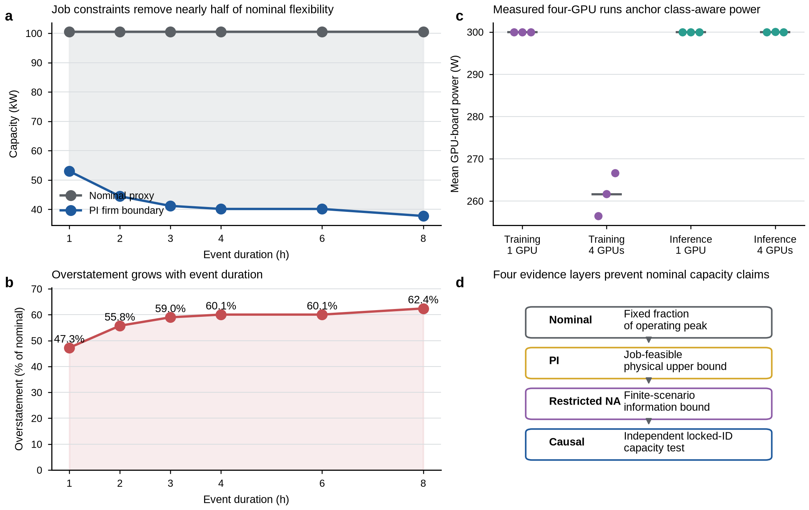
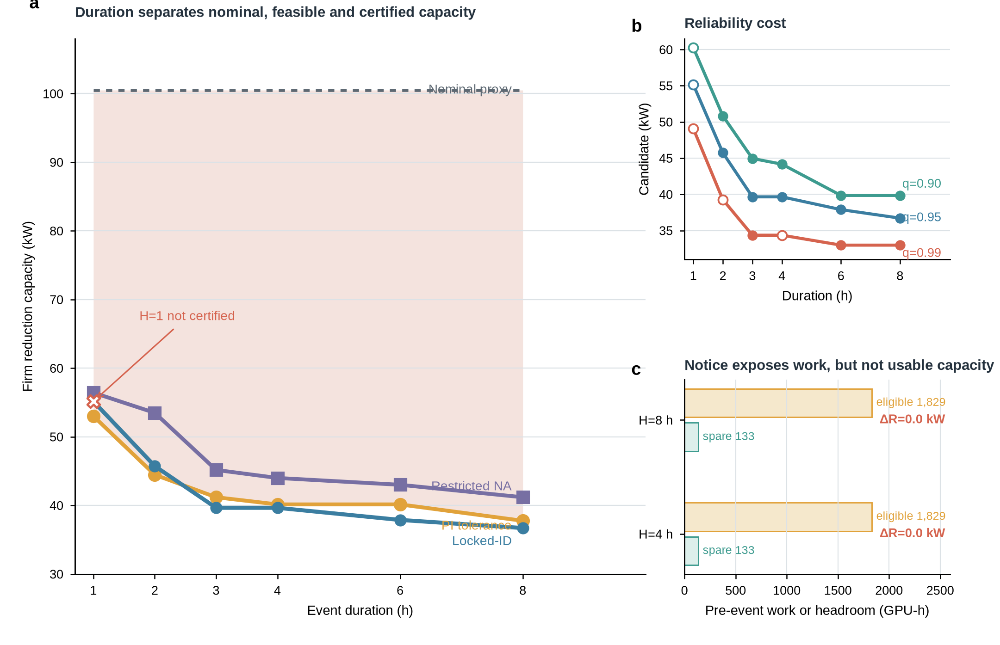
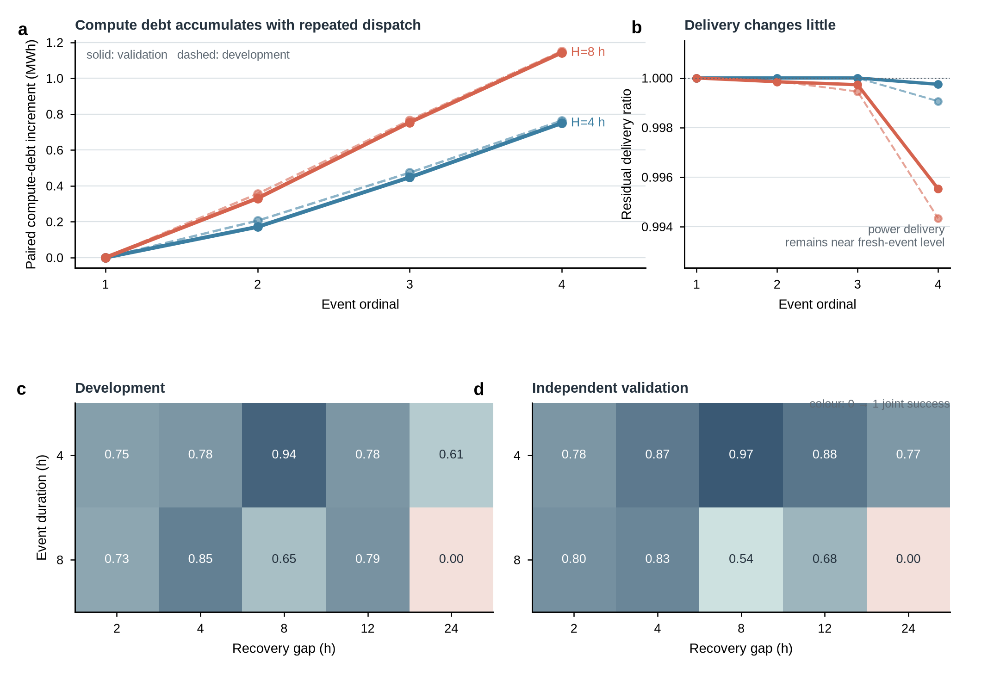
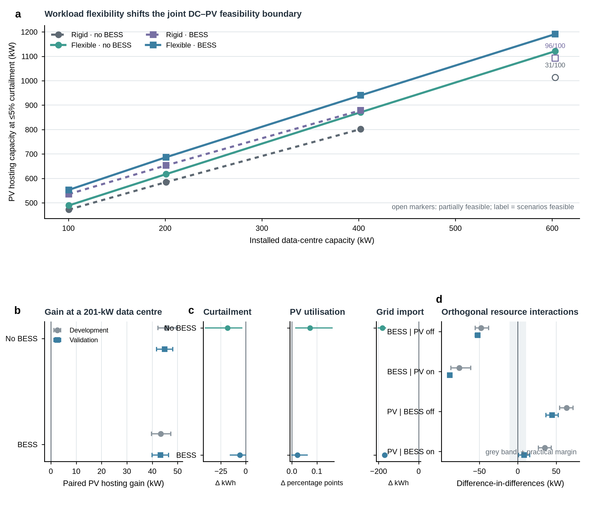
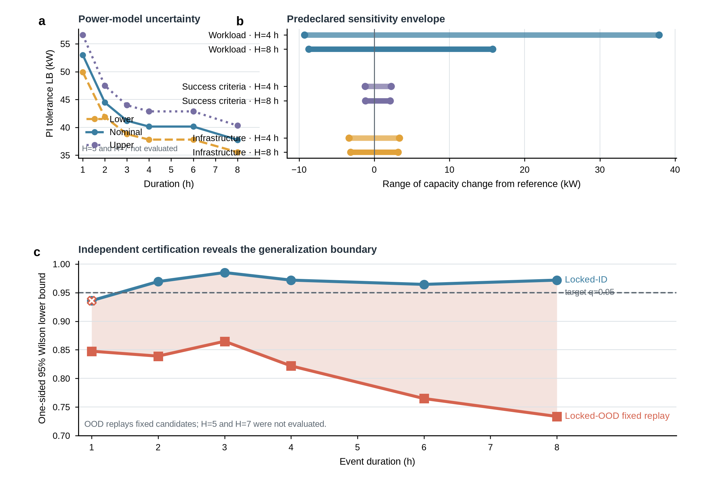

# Nature Communications reference-led mainline figure previews

> **Status:** reference-led manuscript-review previews generated from the hash-verified Source Data bundle. These PNG files are for rapid review on GitHub; the reproducible PDF, SVG and 600-dpi TIFF exports remain release artifacts rather than tracked repository files.

The figures below use an asymmetric Nature Communications visual grammar: one dominant narrative or quantitative panel, compact supporting evidence, low-saturation colour, direct labels and explicit white space. They report planning bounds, causal certification and mechanism diagnostics under different evidentiary meanings and should be interpreted together with the claim boundaries shown under each figure.

## Figure 1 | Nominal flexibility versus the job-derived boundary

**Main claim:** A fixed nominal flexibility fraction substantially overstates the job-derived firm boundary across all tested event durations.

**Boundary:** PI is a perfect-information planning upper bound, not an independently certified capacity. Four-GPU measurements anchor class-aware board power but do not directly represent a megawatt-scale data centre.

## Figure 2 | Duration, reliability and advance notice

**Main claim:** Selectable flexibility declines as event duration or reliability requirements increase, while advance notice does not change selected capacity in the frozen Model A scenarios.

**Boundary:** PI tolerance, restricted NA and locked-ID causal layers have different statistical meanings. The q=0.95, H=1 h candidate remains visibly not certified.

## Figure 3 | Repeated-event exhaustion and compute debt

**Main claim:** Repeated calls accumulate compute debt even when immediate power delivery remains close to the fresh-event counterfactual, and insufficient recovery can reduce joint-episode success.

**Boundary:** This is a fixed-capacity mechanism diagnostic, not a repeated-event firm-capacity certificate.

## Figure 4 | Firm demand response as a community renewable-integration resource

**Main claim:** Job-feasible workload flexibility expands the curtailment-constrained community DC–PV feasible set; its effect on utilisation of an already installed PV system is reported separately and may be profile- and storage-dependent.

**Boundary:** These are job-feasible planning ensembles rather than deployed causal effects. Partially feasible envelope cells are not zero-capacity points, fixed-PV energy effects do not imply lower PCC peak, and the allowed 1% flexible deadline-miss budget remains visible.

**QA:** The final-size panel audit, PDF glyph-floor check and output hashes are recorded in [figure4-renewable-integration-qa.md](figure4-renewable-integration-qa.md).

## Figure 5 | Sensitivity and out-of-distribution limits

**Main claim:** Firm-capacity bounds are most sensitive to workload arrivals and power-model assumptions, and the frozen main-distribution candidates do not retain their declared reliability under the joint OOD shift.

**Boundary:** Sensitivities are development PI planning bounds, not causal certificates. Zero certified locked-OOD cells does not establish zero OOD capacity because OOD capacity reselection was prohibited.

## Reproduction

The source-data and full-format figure bundle can be regenerated using the commands in [paper-packaging.md](paper-packaging.md). Per-figure and bundle manifests beside these previews record the exact source-data manifest hash and PNG SHA-256 values.
