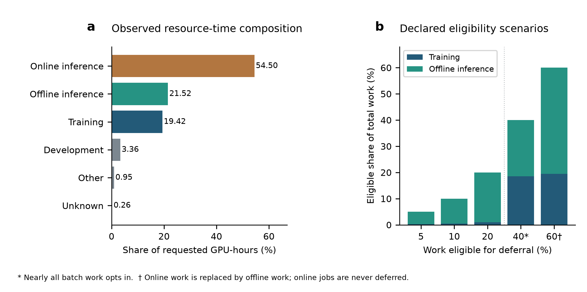
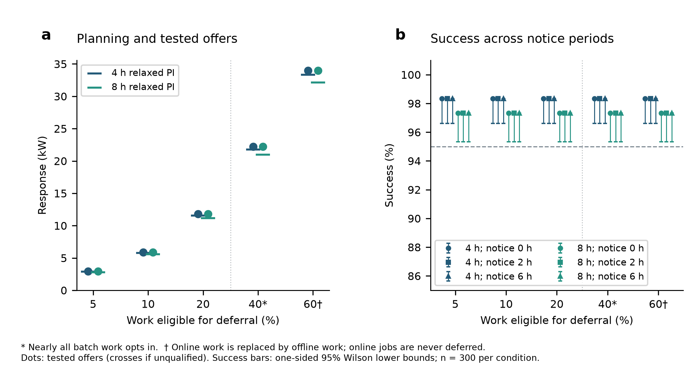
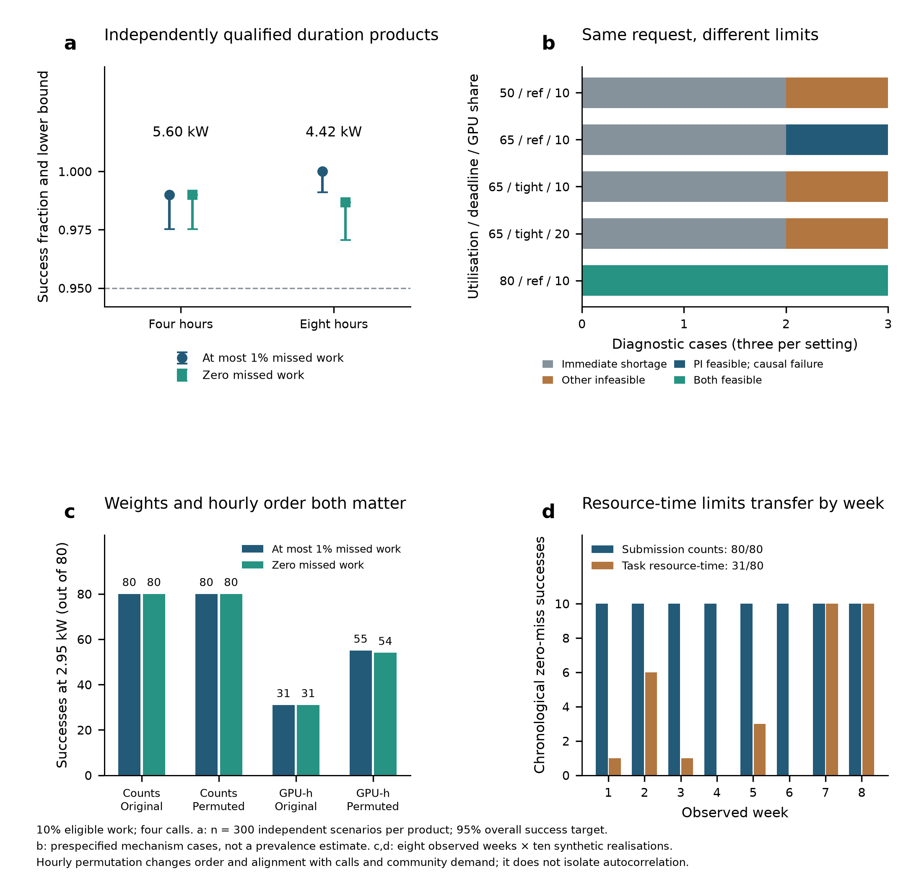
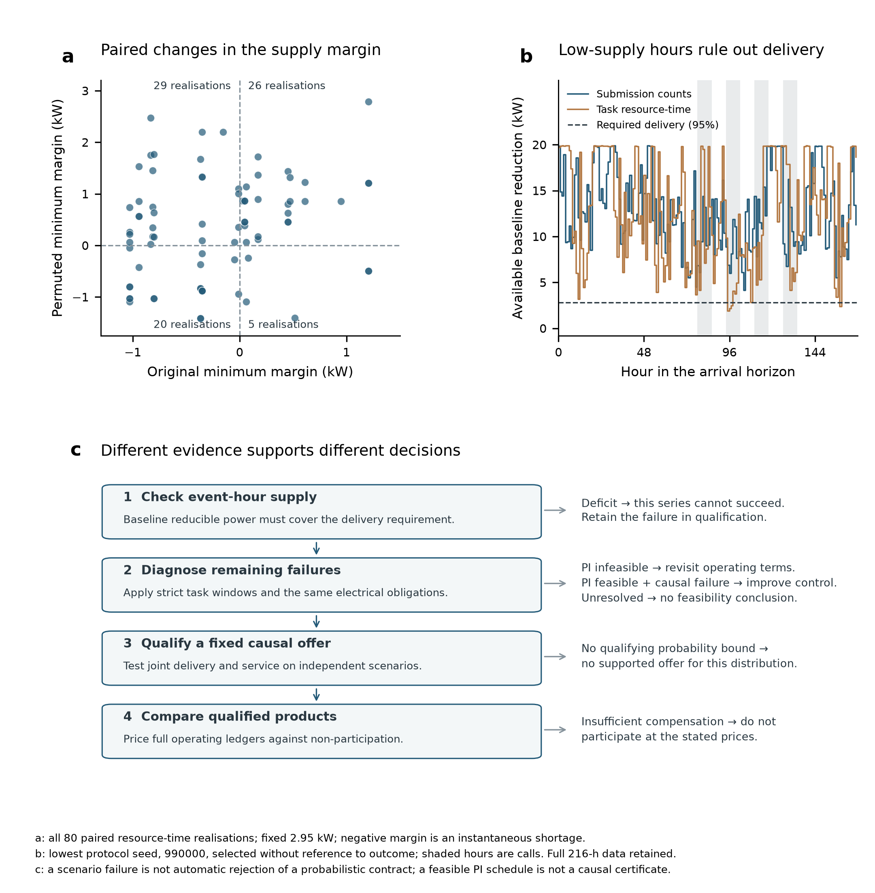
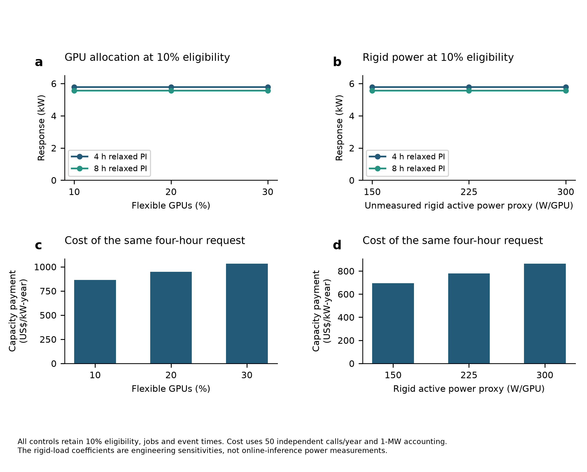
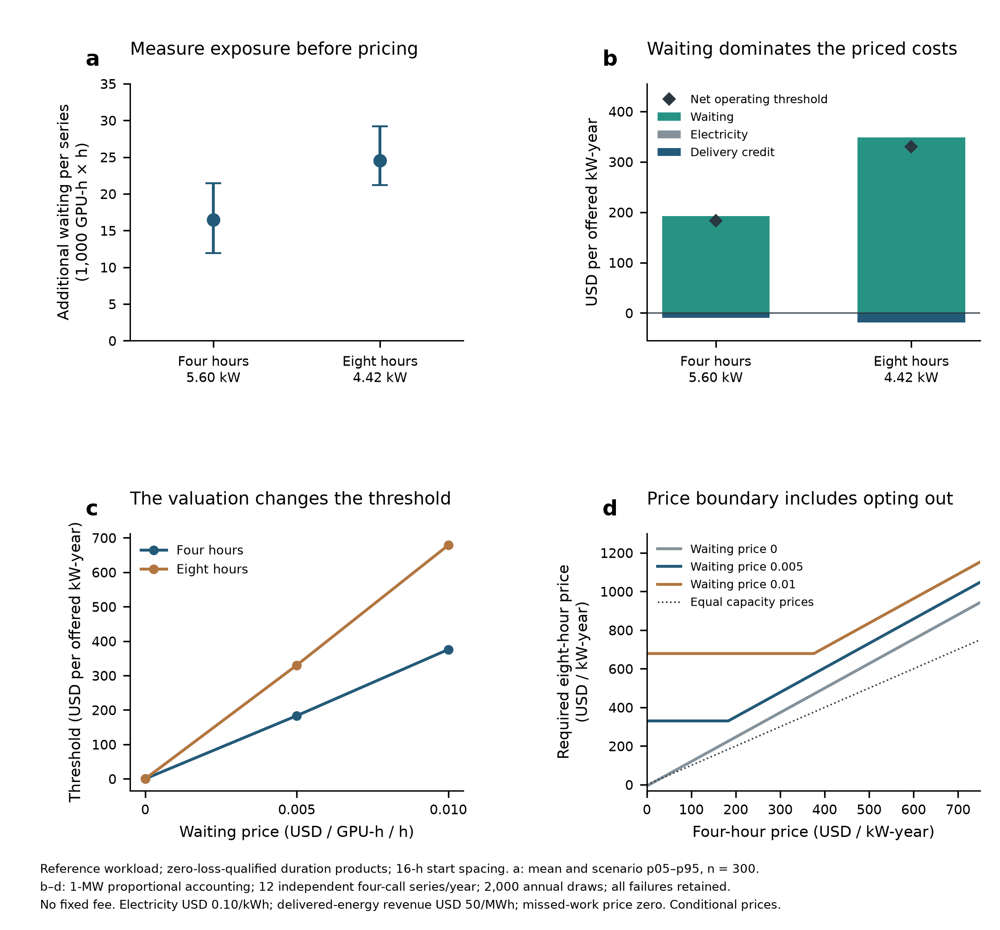

<!--
Working main, version 0.25, 2026-09-10.
Workload weighting, hourly order and commitment decisions. Existing frozen experiments.
Author metadata remain pending.
-->

# Workload timing limits reliable demand response from AI data centres

## Authors

[AUTHOR NAMES AND AFFILIATIONS]

*Correspondence: [CORRESPONDING AUTHOR EMAIL]*

## Abstract

Artificial-intelligence data centres could help electricity grids accommodate growing demand by postponing computing, but a response commitment must remain deliverable as workloads change. Here we test how workload representation affects this commitment in a trace-informed scheduling and electricity model. At 10% work eligibility, independent tests support four- and eight-hour offers of 5.60 and 4.42 kW at a 95% success-probability target, with zero missed work required for a successful series. Yet a fixed 2.95-kW request succeeds in 80/80 submission-count-weighted realisations and only 31/80 task-resource-time-weighted realisations across eight observed weeks with matched weekly work totals. Permuting hourly blocks raises resource-time success to 55/80 with a 1% missed-work allowance and 54/80 with zero missed work. Workload weighting and hourly order with call alignment therefore expose distinct limits. Immediate supply checks and strict task-window feasibility tests separate impossible delivery from failures with a feasible full-information schedule. Operating ledgers then compare compensation only for independently qualified products. This assessment identifies when a workload change invalidates a model-supported commitment, when controller improvement remains possible and when a price comparison is meaningful.

## Introduction

The global energy transition requires electricity systems to decarbonise supply while accommodating rising demand from electrification and artificial intelligence (AI).1 Data centres intensify this challenge where large computing loads are concentrated and their expansion outpaces the development of power infrastructure.1,2 In such regions, electricity availability can constrain AI deployment, while grid planners must accommodate new demand without compromising reliability or affordability.2,3 Adjusting when computing consumes power offers a way to make better use of existing infrastructure.3 For this flexibility to support grid planning, operators must be able to deliver repeated power reductions while meeting computing-service obligations at acceptable cost. Establishing dependable and economically viable commitments is therefore central to assessing how data centres can participate in the energy transition.

A field demonstration on 256 graphics processing units (GPUs) reduced power by 25% for three hours while meeting the tested quality-of-service requirements.3 Batch scheduling, server power management and workload migration have been used to reduce peaks and participate in demand response.4–8 Carbon-aware scheduling extends these controls to hours and locations with lower emissions or greater renewable availability.9–12 Other studies address pause-and-resume decisions and GPU power capping.13,14 Trace-based and planning studies connect workload flexibility to demand-response programmes, advance notice and grid interconnection.15–18 A recent preprint distinguishes eligible workload power from dependable relief through duration, reliability, portfolio structure and delivery and recovery requirements.19 These advances motivate a more specific commitment question: can a request that passes a simplified workload test still fail when task-size variation and hourly order are represented more faithfully?

The workload mix sets which computing may participate. Online inference must respond to user requests, whereas some training and offline-inference work can wait within an agreed deadline. Production traces distinguish these classes and their scheduling priorities,20 but priority is not permission to defer work for grid services. Even at fixed eligible work, job counts do not specify how much work arrives in each hour. Each job must fit between release and deadline, and postponement creates an additional processing obligation relative to operation without response, or compute debt.6,13,21,22 Thus, low-supply hours and recovery requirements can invalidate a request even when average workload and installed hardware appear sufficient.

Delivery and value also require different evidence. At a community point of common coupling (PCC), data-centre demand interacts with photovoltaic (PV) generation and battery energy storage systems (BESS).23–27 A hardware allocation that benefits PV hosting need not increase an independently tested response offer. For an operator, postponement creates waiting and service-loss exposure, while access charges affect whether participation is worthwhile. Valuing those quantities cannot make an undeliverable commitment feasible. A useful assessment must therefore establish what can be offered before comparing service products at stated prices.

Here we identify how a simplified workload representation can support the wrong commitment decision. AIDRBench combines trace-informed jobs, four-GPU board-power measurements and a modelled community electricity system. Production execution data inform plausible work-permission scenarios. We independently test causal-controller offers and compare matched submission-count and task-resource-time profiles in their observed and permuted hourly orders.28 An instantaneous supply condition and same-scenario perfect-information feasibility checks then distinguish why requests fail. Finally, complete operating ledgers compare qualified duration products with non-participation. Together, the tests connect workload characterisation to decisions about the request, controller and compensation.

## Results

### Workload composition limits which computing can support a commitment

We first examined what fraction of computing could plausibly enter the deferrable pool. Across 40.52 million execution spans in the released Alibaba summary,20 online inference accounted for 54.5% of requested GPU-hours, offline inference for 21.5% and training for 19.4% (Fig. 1a). Low-priority training and offline inference together accounted for 22.0%. These are descriptive resource-time shares, not measured energy shares or demand-response permissions. They provide a candidate pool from which an operator might authorise a smaller amount of work to wait.

The primary scenarios allowed 5%, 10% or 20% of total offered work to wait, preserving the observed class mix and varying permission within low-priority batch work. The 40% comparison required almost all training and offline inference to opt in. The 60% case additionally reassigned 19.1 percentage points of total work from online to offline inference (Fig. 1b). Online jobs remained ineligible; these larger fractions therefore describe additional business assumptions.

Each configuration retained 576 GPUs and 374.4 GPU-h of offered work per hour. Assigning approximately the same fraction of GPUs as eligible work kept mean utilisation near 65% in both pools. The primary comparison therefore changes permission together with supporting allocation; controls at 10% eligibility isolate allocation (Fig. 5). Four-GPU board-power calibration constrained the batch-work conversion, whereas rigid workloads used an engineering power proxy (Supplementary Fig. 2; Supplementary Tables 1–3).

### Smaller eligible pools support smaller independently tested offers

Development-selected single-event offers of 2.95, 5.90 and 11.80 kW qualified on 300 independent scenarios at 5%, 10% and 20% eligibility, respectively, corresponding to 1.6–5.9% of operating peak demand (Fig. 2a; Supplementary Table 4). The 40% and 60% comparisons qualified at 22.19 and 34.00 kW under their additional assumptions. The proportional low-share response follows the shared job-template scaling and allocation policy. Relaxed perfect-information (PI) tolerance statistics provide a planning comparison but do not guarantee individual work-group feasibility (Methods).

The same selected power qualified at four and eight hours on the tested grid, with success decreasing from 295/300 to 292/300 in every configuration; one-sided 95% probability lower bounds were 0.9662 and 0.9533. Zero-, two- and six-hour notice gave identical paired outcomes (Fig. 2b). Because jobs cannot execute before release and the baseline already processes available work eagerly, advance information created no extra pre-executable work in this setting.

### Workload timing determines whether a repeated commitment transfers

At 10% work eligibility, we tested four calls using a controller that enforces every overlapping recovery obligation. In the reference configuration—65% offered utilisation, reference deadlines and a 10% GPU pool—the four- and eight-hour offers were 5.60 and 4.42 kW, both with 16-h start spacing. When successful series required zero missed work, independent confirmation gave 297/300 and 296/300 successes, with one-sided 95% probability lower bounds of 0.9752 and 0.9706 (Fig. 3a). Both the 1% and zero-miss standards selected these capacities on the local grid (Supplementary Table 18). Their agreement provides no basis for applying a uniform capacity discount solely because the success criterion becomes stricter.

These reference offers did not establish transfer to a different workload representation. In eight observed weeks, the fixed 2.95-kW request passed 80/80 chronological submission-count-weighted realisations but only 31/80 matched task-resource-time-weighted realisations (Fig. 3c,d). Weekly class totals, synthetic service rules, community profiles and event clocks were held fixed. All no-response baselines met zero-miss service. The 49 resource-time failures therefore arose under response commitments in otherwise service-feasible scenarios, rather than from more total eligible work or an infeasible baseline.

Permuting whole hourly blocks separated workload weighting from the effect of hourly order and alignment. Count-weighted success remained 80/80, whereas resource-time success rose to 55/80 at the 1% standard and 54/80 at zero misses (Fig. 3c). Hourly rearrangement improved this comparison but did not restore count-weighted performance. It changes alignment with both calls and community demand, so the improvement cannot be assigned to autocorrelation alone. At the larger 4.42-kW request, all 80 chronological resource-time realisations failed; full cross-scores are retained in Supplementary Table 20.

### Supply and feasibility checks identify what a failed request requires

An instantaneous supply screen explained the electrical failures. For each event hour, we compared the matched baseline power available above community and idle-plus-rigid demand with 95% of the request. A deficit makes successful delivery impossible in that hour, even if all flexible execution stops. All 49 chronological resource-time failures at 2.95 kW met this condition; after permutation, it affected 25 realisations (Fig. 4a,b). The paired changes included both removal and creation of shortages. A non-negative margin is necessary but insufficient: one of the 55 permuted resource-time realisations without shortage still failed the zero-miss endpoint.

Strict task-window feasibility then distinguished failures beyond that supply condition. At a fixed 5.90-kW request, a reference scenario that passed the supply screen failed under causal control but admitted a full-information schedule meeting all electrical obligations with zero missed work (Fig. 3b; Supplementary Table 19). Halving its deadline slack made the request infeasible under the same delivery and recovery criteria; doubling GPU allocation did not restore feasibility. Each variant used its own matched baseline. The feasible reference case leaves room for controller improvement, whereas proven infeasibility calls for changing the request or operating terms. Neither finding follows from the causal failure alone.

These checks define different decisions (Fig. 4c). Supply deficits identify series that cannot succeed; strict-window tests diagnose whether the remaining constraints admit a schedule. A feasible PI schedule is a diagnostic opportunity, not a deployable controller. A fixed causal policy must still pass independent qualification for its declared scenario distribution before its operating ledger enters price comparison. A single failed series is not automatically a rejection of a probabilistic contract: qualification retains the complete success and failure sample. In the matched same-clock control, removing preceding calls left final-call electrical outcomes unchanged (Supplementary Table 15), further limiting explanations based only on accumulated call history.

### Allocation changes system value without necessarily increasing the offer

At fixed 10% work eligibility, increasing flexible GPU allocation from 10% to 20% or 30% left the tested 5.90-kW single-event offer at 295/300 four-hour and 292/300 eight-hour successes. The corresponding relaxed-PI tolerance statistics were also unchanged (Fig. 5a; Supplementary Fig. 4c). Reducing the rigid-class active-power proxy from 300 to 225 or 150 W per GPU preserved these baseline-relative responses but changed operating peak demand from 193.44 to 173.53 or 153.63 kW (Fig. 5b). Thus, eligible arrivals constrained this response, while rigid power remained relevant to facility demand and proportional cost accounting (Fig. 5c,d).

The same allocation could matter more for a different service. At 10% eligibility, raising the flexible GPU share from 10% to 20% increased the no-BESS PV hosting gain from 5.40 to 24.99 kW (Supplementary Fig. 4d). The primary 10% case nevertheless improved utilisation of a fixed 500-kW PV installation by only 0.0057 percentage points (95% paired interval, 0.0019–0.0106; Supplementary Fig. 4a,b). Hosting and utilisation therefore measure different benefits. All PV comparisons used separate full-information schedules; small storage contrasts remained limited by solver precision (Supplementary Table 6).

### Access fees and operating costs affect different participation decisions

Once a duration product qualified, its operating exposure and access charges could be valued separately. In the 10% eligibility single-event case, the assumed US$25,000 annual site fee accounted for about 95% of the US$863.26 per offered kW-year threshold (Supplementary Table 17). To distinguish fee allocation from operating consequences, we compared complete response-and-recovery ledgers for the qualified repeated products. All amounts use proportional 1-MW accounting and retain failed confirmation trajectories.

For the four- and eight-hour products qualified with a zero-miss success criterion, mean additional waiting exposure per four-call series was 16,491 and 24,509 GPU-h×h, respectively (Fig. 6a; Supplementary Table 21). At the illustrative waiting price of US$0.005/GPU-h/h and twelve independent series per year, the no-fixed-fee thresholds were US$183.30 and 330.11 per offered accounting kW-year (Fig. 6b,c). Their capacity difference and waiting exposure explain this conditional comparison; the valuations have not been measured as an operator’s willingness to accept.

At equal illustrative capacity prices of US$250 per kW-year and zero site fee, the four-hour product’s fifth-percentile annual net value was US$1,932, compared with −US$1,832 for eight hours. Conditional on participation, equal value requires an eight-hour price of 1.267 times the four-hour price plus US$97.93 per kW-year; the full boundary also requires non-negative net value (Fig. 6d). The coefficient is the ratio of the selected capacities. When waiting has no incremental price, the equal-price ranking reverses below approximately US$25.57 per kW-year (Supplementary Fig. 5). A shared fee can change whether either option beats non-participation, but a common fee cancels between participating products.

The economic result is a price-dependent choice among services qualified for the reference scenario distribution. The failed resource-time transfer prevents treating those prices as offers for the observed-week workload. Waiting and missed-work valuations are varied explicitly; contract penalties, application checkpoint costs and actual hardware ageing remain unpriced. Independent annual series provide a conditional accounting screen, rather than a continuous-year operating forecast.

## Discussion

The main finding is a failure of commitment transfer that a submission-count test did not reveal. Matching weekly work totals was insufficient when task resource-time exposed low-supply hours. Permuting hourly blocks improved delivery but left a substantial gap to count-weighted profiles. The comparison therefore separates the choice of workload weights from hourly order and alignment, while leaving their joint effect explicit. It identifies a concrete decision error: accepting a request on the basis of a simplified workload replay whose reducible-power supply does not represent the workload to which the commitment will apply. This connects production workload characterisation20,28 to the operational commitment question raised by field demonstrations3 and scheduling studies.5–19

The diagnosis also determines what can usefully change. An instantaneous deficit rules out successful delivery in the affected hour. If that condition passes, strict task-window infeasibility and a feasible PI schedule with causal failure require different responses: revise operating terms in the first case, investigate control and information limits in the second. These scenario-level findings must then be assessed through the declared probabilistic qualification rule. More GPUs, a stricter service label or a low estimated price cannot substitute for that sequence of evidence.

Economic assessment follows qualification and exposes quantities before assigning prices. Waiting and missed-work exposure remain inspectable independently of their valuations. The preferred duration can change when waiting is free, whereas a common access fee affects entry rather than the ranking of participating products. Comparing annual net values with non-participation avoids confusing a low unit-cost threshold with the most valuable contract. The capacity ratio and stated valuations determine the price boundary, whose use remains conditional on the workload for which delivery was qualified.

For planners and operators, the useful output is a conditional commitment with a declared workload, baseline, service standard, capacity and call arrangement. Its delivery evidence and operating ledger must be re-evaluated when the timing structure changes. This is consistent with capacity assessment for other resources whose decisions are coupled over time.29,30 A larger nominal flexible share, more recovery hardware or cheaper access cannot substitute for that assessment.

The evidence is conditional on hourly divisible work, synthetic deadlines and permissions, a fixed rigid-load proxy and a small board-power calibration. Observed task resource-time preserves submitted workload-size heterogeneity but is not sensor-measured GPU activity or application pause–checkpoint–restart validation. Hour permutation changes temporal dependence and alignment with calls and community demand together. Eight observed weeks with ten synthetic realisations each are not 80 independent production weeks. Relaxed-PI tolerance statistics do not guarantee work-group feasibility; exact-window diagnostics establish scenario-level possibilities and impossibilities, not causal capacity. Qualification bounds are pointwise, candidate grids are finite and annual accounts combine independent series. These conditions delimit the commitment and price comparisons.

## Methods

### Study design and capacity definition

The primary comparison followed five declared workload-eligibility scenarios through perfect-information (PI) planning, independent causal-controller testing, repeated programmes, PV integration and participation costs. Eligibility was the share of offered GPU-hours permitted to wait. Capacity was evaluated against the same delivery and service criteria within each declared call programme.

Let Z describe an episode's initial queue, community load, job arrivals and deadlines, hardware and event time, drawn from distribution \(\mathcal D\). For fixed policy \(\pi\), reduction R, duration H and notice N, \(I_\pi(R,H,N;Z)=1\) if all delivery and service criteria are met. Firm capacity was defined as

\[
F_q^{\pi}(H,N;\mathcal D)=
\sup\left\{R\geq0:\Pr_{Z\sim\mathcal D}
\left[I_\pi(R,H,N;Z)=1\right]\geq q\right\}.
\]

The primary reliability target was 0.95. Capacity was conditional on the controller, workload scenario and call schedule. We selected the largest qualifying candidate on a finite development grid and tested that candidate independently; this procedure does not estimate the continuous maximum of the capacity function. Pointwise probability lower bounds were used for individual offers, without a simultaneous guarantee over all configurations.

This extension was specified after the earlier benchmark. One hundred development seeds (930000–930099) selected offers, and 300 previously unexamined confirmation seeds (960000–960299) tested them without reselection. The delivered-power recovery guard and feasible-side action rounding were corrected on development data before this controller version was confirmed. Protocol, source, controller and scenario hashes identify the evidence; original locked certificates remain separate historical results.

### Community, jobs and event scenarios

Community demand used the End-Use Load Profiles for the US Building Stock,31,32 combining 75% detached-residence and 25% small-office demand in the mixed 3A profile. These are building-stock simulations calibrated against measurements. Fifteen-minute power was averaged to hourly intervals and scaled to an 800-kW background peak. All five configurations used a common 1,100-kW PCC import rating and prohibited exports. This rating accommodates the unchanged 576-GPU installation across the changing workload mixes; three initial development baselines exceeded the earlier 1,000-kW rating, so the common site rating was amended before formal PI optimisation or controller selection. Those baseline records were retained.

Job shapes came from the Alibaba Serverless Infrastructure execution summary,20 complementing an earlier public GPU trace.28 We audited all 40,522,321 released execution spans using requested GPU-equivalents multiplied by uncapped duration. This resource-time denominator retained every workload category; it measures neither energy nor permission to defer work. A reproducible, class-balanced 100,000-record subset supplied low-priority training and offline-inference job shapes. Its balanced record counts were not used to estimate the facility workload mix. Original temporal correlations and production deadlines were unavailable in this summary.

Each configuration contained 144 four-GPU nodes and offered 374.4 GPU-h per hour. Let s_c denote a class share and a_c its eligible fraction; total eligibility was \(f = \sum_c s_c a_c\). At f = 0.05, 0.10 and 0.20, a common permission multiplier was applied to the observed low-priority training and offline-inference resource-time shares, which together comprised 0.22028 of the source total. At f = 0.40, additional non-low-priority batch work was assumed to opt in. At f = 0.60, the source mix was explicitly changed by replacing 0.19058 of total work from online to offline inference. Online inference remained ineligible in every case. Flexible GPUs were round(576f), giving approximately 65% mean utilisation in both pools; rigid utilisation used the actual integer remainder.

A common job template was generated once per seed. Class-specific GPU-hours were scaled across configurations while release times, deadlines, community values and the event anchor were checked for equality. Arrivals covered seven days, followed by a 48-h clearance tail. Training deadlines were sampled at 2–6 times runtime and clipped to 6–48 h; offline-inference deadlines were 1.5–4 times runtime and clipped to 2–24 h. The sampling specification and all five baseline-service checks are recorded in Supplementary Methods 1–3. These synthetic deadlines do not establish production service permissions.

### Scheduling and power conversion

Each job had a release time, class, GPU-hour requirement and deadline. Released work entered an earliest-deadline-first fluid queue. For class c in hour t,

\[
B_{c,t+1}=B_{c,t}+A_{c,t}-X_{c,t}-M_{c,t},
\]

where B denotes backlog, A arrivals, X executed work and M unfinished work expiring at its deadline. Schedules respected hourly GPU capacity, work conservation, releases, deadlines, the allowed missed-work fraction and terminal backlog. Rigid and flexible work were represented separately. Work could be divided across hours; gang placement, non-pre-emptive execution and checkpoint latency were outside this abstraction. Each hourly step released arrivals before the control action, scheduled work, calculated power and advanced queue deadlines. Other time-step durations were rejected because the queue implementation advances one hourly bucket per step.

Data-centre power was calculated as

\[
P^{\mathrm{DC}}_t=P_{\mathrm{fixed}}+\sum_c e_cX_{c,t},
\]

where e_c is incremental energy per executed GPU-hour, obtained from class-specific active-minus-idle board power multiplied by power usage effectiveness (PUE). Calibration used four NVIDIA RTX PRO 6000 Blackwell Max-Q GPUs connected by PCIe without NVLink. Active training and offline-inference power averaged 259.08 and 300.02 W per GPU, and idle power averaged 13.94 W. Two independent runs per active class supplied the fit, and a third run was held out. Simultaneous GPU observations were averaged within each run; independent runs were the statistical units.

The model assumed PUE 1.2 and 300 W of fixed overhead per node. Training and offline-inference active board power used the measured coefficients of 259.08 and 300.02 W per GPU. Online, development, other and unknown rigid workloads used 300.02 W per active GPU as an engineering proxy, with separate 150- and 225-W controls. These coefficients are not measurements of online serving. Rigid demand was held fixed at its class-weighted mean, so online request latency and burst-level power were not simulated. The hardware measurements constrain the batch-work power conversion, not the representativeness of the workload mix.

### Baselines, compute debt and successful delivery

Every controlled episode had a no-demand-response baseline with the same community profile, jobs, deadlines and hardware. Compute debt measured the additional dynamic energy required to clear the controlled backlog relative to this baseline:

\[
D^{\mathrm{comp}}_t=\frac{\mathrm{PUE}}{1000}\sum_c\Delta B_{c,t}\left(p^{\mathrm{active}}_c-p^{\mathrm{idle}}\right).
\]

where \(\Delta B_{c,t}\) is controlled minus baseline backlog in GPU-h, board powers are in W and compute debt is in kWh. Recovery and rebound were evaluated over the declared post-event window, with the clearance tail used to assess terminal backlog. For requested reduction R, delivered power was \(\Delta P_t=\max(0,P^{\mathrm{baseline}}_t-P^{\mathrm{control}}_t)\). Mean event delivery, \(\sum_{t\in E}\min(\Delta P_t,R)/(R|E|)\), had to reach 0.95, and every event hour also had to satisfy

\[
P^{\mathrm{control}}_t \leq P^{\mathrm{baseline}}_t-0.95R.
\]

Success further required a deadline-miss fraction of eligible work no greater than 0.01, a rebound ratio no greater than 0.25, an event-plus-recovery peak-relief fraction of at least 0.50 and terminal backlog no greater than 0.02 of offered work. Rebound was the maximum positive controlled-minus-baseline PCC load in the 24-h recovery window, divided by peak event reduction. Mean and minimum interval delivery were reported separately. All criteria were fixed in the protocol; average delivered energy could not compensate for a failed hourly requirement.

The structural study additionally required zero total missed eligible work, allowing only 10−7 GPU-h for numerical round-off. Both response and no-response trajectories had to satisfy that zero criterion; all electrical and terminal-backlog thresholds were unchanged. The 0.1% allowance was a secondary reported endpoint without offer selection. Baseline failures remained failures rather than exclusions. Earlier selected offers were also rescored at zero loss, explicitly as a retrospective check.

### Relaxed planning and independent qualification

The aggregate PI programme maximised R under cumulative class-release and class-deadline constraints. These are necessary aggregate conditions, but are a relaxation when job windows cross: work executed for an earlier, later-deadline job can satisfy a cumulative due-work inequality for a different job. Its retained optima therefore define relaxed planning envelopes, not generally job-feasible capacities. Their second order statistic among 100 scenarios is a 95%/95% tolerance statistic of that relaxed quantity, with achieved confidence 0.96292.33 It does not guarantee feasible work scheduling. Controller offers instead use completed queue simulations on independent seeds; their joint delivery-and-service probability is assessed by a one-sided 95% Wilson lower bound, required to reach 0.95.34,35 The strict-window feasibility diagnostics use each work group’s own release and deadline.

The causal controller retained the six-hour robust MPC, historical-arrival uncertainty envelope and objective weights of the earlier implementation. It observed only released jobs, current queue state and the declared forecast. Its event cap required at least 95% delivery. Because the rebound criterion divides recovery overshoot by actual peak delivered power, the corrected recovery cap used 0.25 × 0.95 × requested power rather than 0.25 × requested power. Continuous actions were rounded towards the feasible side when converted to float32. This electrical cap does not guarantee deadline feasibility. Candidates at 50%, 75%, 90% and 100% of the development Relaxed PI statistic were evaluated separately; no monotonicity between candidates was assumed.

### Repeated commitments and structural controls

All new structural tests used the corrected MPC wrapper, which retains a separate ceiling for each observed event-and-recovery window and clips the proposal to the strictest live ceiling. It uses elapsed baseline peaks and current observations, without future jobs or unannounced calls. Earlier comparisons with the original implementation and guarded greedy policy are retained in Supplementary Methods 6. New candidates were 25%, 50%, 75% and 100% of the fixed 5.898243186-kW reference request. Selection was separate for the 1% and zero-miss endpoints and preceded independent confirmation; successful unselected comparators were not promoted.

At fixed 10% work eligibility and 576 GPUs, offered utilisation was total work divided by installed GPU-hours, set to 50%, 65% or 80%. Deadline slack was unchanged or halved with a one-hour floor; flexible GPU allocation was 10%, with 20% controls at 65% and 80% utilisation under tight deadlines. The final event started at hour 111 plus a seeded uniform integer from 0 to 23; preceding starts were spaced backwards by 16 or 24 h. All eight variants tested eight-hour calls, and the reference also tested four-hour calls at 16-h spacing. A fresh eight-hour final call at the same time removed the preceding calls. All recovery windows ended during 168 h of arrivals, followed by a 48-h clearance tail. Development seeds 984000–984099 and confirmation seeds 985000–985299 supplied 7,600 and 13,200 complete replays, respectively. Two pilot seeds were excluded.

For the external timing stress test, hourly submission counts from the Alibaba 2020 GPU trace28 supplied eight consecutive 168-h blocks. Counts set the hourly weights of synthetic class-specific work, preserving each class total and reference deadlines. The paired alternative permuted complete hourly blocks within the same week. Ten synthetic realisations per week crossed both orderings and 10%/20% GPU allocations with five frozen programme–request combinations, giving 1,600 replays without retuning. Results are reported by observed week and descriptively across 80 realisations per condition; they are not 80 independent production weeks.

### Photovoltaic hosting and utilisation

Community PCC power was

\[
P^{\mathrm{PCC}}_t=L_t+P^{\mathrm{DC}}_t+P^{\mathrm{ch}}_t-P^{\mathrm{dis}}_t-G^{\mathrm{PV}}_t,
\]

with imports capped at 1,100 kW and exports prohibited. For each scenario we fixed the GPU installation and maximised PV nameplate subject to at most 5% curtailment, zero missed GPU-hours and at most 2% terminal backlog. BESS supplied 100-kW charge/discharge power and 200-kWh energy, with 0.95 charge and discharge efficiencies and initial and terminal state of charge of 50%. A mixed-integer formulation prohibited simultaneous charging and discharging. All-scenario hosting was the minimum scenario capacity, reported only if every scenario was feasible.

The utilisation programme fixed PV at 500 kW and retained each configuration's own data-centre power model. Its lexicographic objective first preserved service feasibility and then maximised local PV use within a 10−5-kWh tolerance, followed by grid-import and battery-throughput objectives. Rigid and flexible operation were paired under both BESS conditions on the first 100 confirmation seeds. Mean utilisation contrasts used 10,000 paired bootstrap resamples and pointwise 95% intervals. HiGHS36 used one thread per solve, with independent scenarios parallelised externally. Storage problems retained HiGHS 1.15.1 default relative MIP gap 10−4 and absolute gap 10−6. The 10−5-kWh lexicographic lock is not the MIP optimality tolerance. Utilisation contrasts near the roughly 0.01-percentage-point scale associated with that relative gap are not interpreted as resolved storage benefits; paired sampling intervals exclude optimisation uncertainty.

### Economic participation

Economic screening used each configuration's development-selected, independently tested four- or eight-hour zero-notice offer. Controlled and no-response trajectories supplied paired energy, delay, deferred work and service outcomes from the first call through the 48-h clearance tail. Performance revenue used non-negative PCC reduction capped at the offer in each event hour. Annual net value retained the following accounting structure; inactive or unmeasured terms were stated explicitly rather than inferred from the hardware measurements:

\[
V_{\mathrm{annual}}(K)=R_{\mathrm{capacity}}+R_{\mathrm{performance}}+V_{\mathrm{energy}}+V_{\mathrm{connection}}-C_{\mathrm{enable}}-C_{\mathrm{reserve}}-C_{\mathrm{opportunity}}-C_{\mathrm{delay}}-C_{\mathrm{SLA}}-C_{\mathrm{checkpoint}}-C_{\mathrm{penalty}}.
\]

Reference prices were US$50 per MWh of capped delivered energy, US$0.10 per kWh of incremental electricity and US$0.005 per GPU-h per hour of additional waiting. We solved for the capacity payment making the fifth percentile of 2,000 bootstrap annual net values non-negative. This was a decision statistic, not a confidence interval. Natural-slack participation incurred no reserve or displacement charge. The reserve case annualised 0.15 abstract reserved PCC-side kW per offered kW at US$2,500 per reserved kW, four-year life, 8% discount, 10% salvage and 3% annual operation and maintenance. The displacement case added an assumed US$0.25 per deferred GPU-h; this exposure was distinct from delay cost and was not a measured revenue loss. Connection benefits and checkpoint costs were unpriced; the reference missed-work price was zero. Existing-GPU depreciation was not inferred as an incremental response cost, and the reserve-capital scenario did not model wear or ageing.

Enablement costs combined a site-wide annual charge with a variable per-kilowatt charge:

\[
C_{\mathrm{enable}}(K)=\mathbf 1[K>0]C_{\mathrm{fixed,site}}+c_{\mathrm{variable}}K.
\]

The fixed site charge was US$25,000 per year and the variable enablement charge was zero. For 1-MW accounting, offered power and physical ledger quantities were multiplied by 1000 divided by the configuration's own operating peak, with the fixed charge applied once and no diversification assumed. This does not certify a 1-MW installation. Annual draws sampled 50 independent single events or 12 independent complete four-call series, retaining failed trajectories. Reserve life, delay price, displaced-value exposure, missed-work price and fixed site cost were sensitivity inputs, not operator estimates. The original external-source register37–42 provides context for financial ranges, not validation of these scenario prices.

Repeated-programme costs were accumulated once per hour over the complete paired series. A programme that did not qualify was identified as such; its conditional cost did not create an eligible offer. Prices of US$0, 0.25 and 1 per missed GPU-h were separately evaluated, and contract-specific non-performance penalties were not priced. Independent annual draws do not reproduce a continuously operating year.

The fee decomposition used common annual draws and the same linear-interpolation weights at the total net-cost 95th percentile for every component; it did not add marginal component quantiles. Additional screens crossed site fees US$0, 1,000, 2,500, 5,000, 10,000 and 25,000, waiting prices US$0, 0.005 and 0.01 per GPU-h/h, and missed-work prices US$0 and 1 per GPU-h. Sharing a US$25,000 fee among ten or five resources gave US$2,500 or 5,000 without a diversification benefit. For qualified product j with accounting capacity K_j and annual net operating cost O_j at its 95th percentile, the fifth-percentile net value was P_j K_j − O_j − F. Duration-price boundaries compared these values and the zero value of not participating. They are algebraic consequences of the stated ledgers and prices, not estimated market tariffs.

### Sensitivity analysis and statistical reporting

The five eligibility scenarios used a declared matching rule for GPU allocation and therefore are not a one-factor experiment across the whole range. Two additional controls kept 10% eligibility and the same jobs while assigning 20% or 30% of GPUs to the flexible pool. Two further controls changed only the unmeasured rigid-class active-power proxy to 150 or 225 W. Each control repeated PI planning, the same development-selected fixed requests, PV analysis and economic accounting. Confirmation never retuned the controller or selected new offers for these controls. Earlier broader parameter, regional and joint-share studies are retained with their original workload scope in the archived v0.19 Supplementary Information.

Economic sensitivities recomputed payments from the fixed paired ledgers with common annual draws, without changing physical trajectories or offer selection. They crossed delay prices, site costs and assumed displaced-compute values, and separately varied missed-work prices. Hardware procurement, actual online-service costs and a continuous-year market simulation were not inferred from these screens.

Independent scenarios were the statistical units; multiple calls within a scenario were not independent replicates. Relaxed PI tolerance statistics, Wilson probability lower bounds and paired bootstrap intervals were pointwise. Notice comparisons used exact paired McNemar tests with Holm correction across the 20 comparisons. Hardware intervals retained the original independent-run analysis. Source Data contain per-scenario outcomes, development selection tables, complete paired ledgers and ready-to-plot summaries; hashes link them to the source, protocol and controller versions.

Structural contrasts resampled 300 complete paired scenario seeds 5,000 times. Exact McNemar tests were Holm-adjusted over the 36 binary structural contrasts; the 16 additional matched-target electrical contrasts formed a separate family. The zero-loss and 1% offer tests each retained the pointwise one-sided 95% Wilson lower-bound criterion of 0.95. Multiple successful selections do not create a simultaneous confidence guarantee. Submission-order comparisons retained the observed week as the external sampling unit and were not assigned binomial certificates from pooled synthetic realisations.

Local refinement fixed the reference workload and controller and tested fractions 0.50–0.75 for H8P16 and 0.75–1.00 for H4P16, in steps of 0.05 of the unchanged 5.898243186-kW request. H denotes duration and P start spacing. Seeds 988000–988099 supplied development; endpoint-specific selections were frozen before seeds 989000–989299 supplied confirmation. Only selected candidates and prespecified coarse comparators entered confirmation, with no reselection. The grid ceiling for eight hours was selected under both standards, so the test did not bracket a continuous maximum. Earlier seeds were not pooled with these data.

Perfect-information diagnostics fixed each request and its four event clocks, baseline and 24-h recovery windows. Non-negative execution variables existed only between each class/release/deadline work group’s own release and deadline; execution, misses and terminal work conserved every group. Constraints retained GPU and PCC limits, 95% hourly and capped-mean delivery, 25% rebound relative to actual peak event reduction, 50% full-window peak relief and the original terminal allowance. Binary peak selectors represented the rebound denominator exactly. HiGHS solved the resulting mixed-integer feasibility problem. Thirty-three prespecified structural cases comprised five configurations, three previously used seeds and two service standards, plus three reference 4.42-kW checks; five affected external weeks supplied an additional first-shortage diagnostic each. These mechanism-selected cases were not prevalence samples. All 11 feasible witnesses passed independent work-group and electrical checks. A 90-s unresolved solve was retained and resolved as infeasible after extending only its time limit to 600 s. Full-information feasibility was not treated as causal realizability.

The resource-time transfer test reconstructed each processed job’s GPU-seconds as the sum of requested GPU-equivalents × task launch-to-completion duration across its terminated positive-resource tasks.28 All 714,903 processed jobs matched the raw task reconstruction; multiplying total requested GPUs by job submission-to-completion time instead differed for 131,379 jobs. The test retained trace hours 168–1511, whose processed time origin is 542,323 s after the raw origin. Within each week, either job counts or submitted task resource-time set hourly weights; each class’s weekly work total was normalised to the reference total. Identical synthetic job classes, deadlines, community traces, event clocks and paired whole-hour permutations were used at each seed (990000 + 100w + r; eight weeks × ten realisations). Fixed 2.95- and 4.42-kW requests gave 640 complete replays. All 320 no-response input variants passed zero-loss service; no failed variant was excluded. Aggregate counts are descriptive. Allocated resource-time is not a sensor measurement of busy GPU time, and the test retains divisible work and synthetic service rules.

## Data Availability

Community demand was obtained from the NREL End-Use Load Profiles through the OEDI building-stock data lake.31,32 Workload records came from the official Alibaba cluster-trace-gpu-v2026 release,20 with the 2020 GPU trace supplying the separate chronological submission test.28 Retrieval locations, preprocessing records and original input hashes are listed in data/manifests/sources.yaml. Raw third-party releases are accessed from their original providers. The accompanying Source Data bundle contains the full class-composition audit, scenario and controller identities, development selection, all trial-level outcomes, complete development and confirmation trajectories and paired economic ledgers, renewable optimisation results, calibration inputs and ready-to-plot tables. CSV and Parquet files have data dictionaries and SHA-256 manifests. Earlier benchmark outputs are preserved in a separately labelled archive. Public archival deposition of this revised bundle remains pending at [ZENODO DOI TO BE ADDED]. Submission counts, processed submission-time records, frozen scenarios and all 22,400 new replays accompany the structural Source Data. The focused extension adds 3,040 full replays, 656,640 hourly rows, 38 resolved exact-window feasibility diagnoses and task-level resource-time reconstruction records.

## Code Availability

The AIDRBench project is hosted at https://github.com/daxiang415/AIDRBench. The accompanying revision bundle includes the exact study drivers, corrected-controller implementation, frozen protocols, analysis scripts and standalone Python redraw commands used here. Public archival release of the revised submission code and its software licence remain pending author confirmation; no new release DOI is claimed.

## References

1. International Energy Agency. *Energy and AI* (IEA, 2025). https://www.iea.org/reports/energy-and-ai

2. Lin, L. et al. Exploding AI power use: an opportunity to rethink grid planning and management. In *Proceedings of the 15th ACM International Conference on Future and Sustainable Energy Systems* 434–441 (ACM, 2024). https://doi.org/10.1145/3632775.3661959

3. Colangelo, P. et al. AI data centres as grid-interactive assets. *Nat. Energy* **11**, 254–261 (2026). https://doi.org/10.1038/s41560-025-01927-1

4. Wierman, A., Liu, Z., Liu, I. & Mohsenian-Rad, H. Opportunities and challenges for data center demand response. In *2014 International Green Computing Conference* 1–10 (IEEE, 2014). https://doi.org/10.1109/IGCC.2014.7039172

5. Li, J., Bao, Z. & Li, Z. Modeling demand response capability by Internet data centers processing batch computing jobs. *IEEE Trans. Smart Grid* **6**, 737–747 (2015). https://doi.org/10.1109/TSG.2014.2363583

6. Zhang, Y., Wilson, D. C., Paschalidis, I. Ch. & Coskun, A. K. HPC data center participation in demand response: an adaptive policy with QoS assurance. *IEEE Trans. Sustain. Comput.* **7**, 157–171 (2022). https://doi.org/10.1109/TSUSC.2021.3077254

7. Zhang, Y., Wilson, D. C., Paschalidis, I. Ch. & Coskun, A. K. A data center demand response policy for real-world workload scenarios in HPC. In *2021 Design, Automation & Test in Europe Conference & Exhibition* 282–287 (IEEE, 2021). https://doi.org/10.23919/DATE51398.2021.9474075

8. Liu, Z., Wierman, A., Chen, Y., Razon, B. & Chen, N. Data center demand response: avoiding the coincident peak via workload shifting and local generation. *Perform. Evaluation* **70**, 770–791 (2013). https://doi.org/10.1016/j.peva.2013.08.014

9. Radovanović, A. et al. Carbon-aware computing for datacenters. *IEEE Trans. Power Syst.* **38**, 1270–1280 (2023). https://doi.org/10.1109/TPWRS.2022.3173250

10. Riepin, I., Brown, T. & Zavala, V. M. Spatio-temporal load shifting for truly clean computing. *Adv. Appl. Energy* **17**, 100202 (2025). https://doi.org/10.1016/j.adapen.2024.100202

11. Zheng, J., Chien, A. A. & Suh, S. Mitigating curtailment and carbon emissions through load migration between data centers. *Joule* **4**, 2208–2222 (2020). https://doi.org/10.1016/j.joule.2020.08.001

12. Goiri, Í., Katsak, W., Le, K., Nguyen, T. D. & Bianchini, R. Parasol and GreenSwitch: managing datacenters powered by renewable energy. In *Proceedings of the Eighteenth International Conference on Architectural Support for Programming Languages and Operating Systems* 51–64 (ACM, 2013). https://doi.org/10.1145/2451116.2451123

13. Lechowicz, A. et al. The online pause and resume problem: optimal algorithms and an application to carbon-aware load shifting. *Proc. ACM Meas. Anal. Comput. Syst.* **7**, 1–32 (2023). https://doi.org/10.1145/3626776

14. Zhao, D. et al. Sustainable supercomputing for AI: GPU power capping at HPC scale. In *Proceedings of the 2023 ACM Symposium on Cloud Computing* 588–596 (ACM, 2023). https://doi.org/10.1145/3620678.3624793

15. Caprara, A., Yu, Y., Teng, F., Junyent-Ferré, A., Bullich-Massagué, E. & Aragüés-Peñalba, M. Data center workload flexibility for power system demand response: evidence from Alibaba traces. *Int. J. Electr. Power Energy Syst.* **178**, 111940 (2026). https://doi.org/10.1016/j.ijepes.2026.111940

16. Chen, Y. & Zheng, X. To defer or to shift? The role of AI data center flexibility on grid interconnection. In *Proceedings of the 2026 ACM Sustainability Week* 322–327 (ACM, 2026). https://doi.org/10.1145/3765611.3815593

17. Zhao, M., Wang, X. & Mo, J. Workload and energy management of geo-distributed datacenters considering demand response programs. *Sustain. Energy Technol. Assess.* **55**, 102851 (2023). https://doi.org/10.1016/j.seta.2022.102851

18. Wiesner, P., Behnke, I., Scheinert, D., Gontarska, K. & Thamsen, L. Let's wait awhile: how temporal workload shifting can reduce carbon emissions in the cloud. In *Proceedings of the 22nd International Middleware Conference* 260–272 (ACM, 2021). https://doi.org/10.1145/3464298.3493399

19. Li, M. Beyond Scalar Flexibility: From Eligible AI Workloads to Dependable Load Relief. Preprint at https://arxiv.org/abs/2609.05406 (2026).

20. Li, S. et al. Heterogeneity at hyperscale: characterization and scheduling of large production AI clusters at Alibaba. In *20th USENIX Symposium on Operating Systems Design and Implementation* 2187–2203 (USENIX Association, 2026).

21. Cioara, T. et al. Optimized flexibility management enacting data centres participation in smart demand response programs. *Future Gener. Comput. Syst.* **78**, 330–342 (2018). https://doi.org/10.1016/j.future.2016.05.010

22. Wang, W., Abdolrashidi, A., Yu, N. & Wong, D. Frequency regulation service provision in data center with computational flexibility. *Appl. Energy* **251**, 113304 (2019). https://doi.org/10.1016/j.apenergy.2019.05.107

23. Su, T. et al. Grid-enhancing technologies for clean energy systems. *Nat. Rev. Clean Technol.* **1**, 16–31 (2025). https://doi.org/10.1038/s44359-024-00001-5

24. Loji, K., Sharma, S., Sharma, G. & Rawat, T. Multiobjective distribution system operation with demand response to optimize solar hosting capacity, voltage deviation index and network loss. *Sci. Rep.* **15**, 300 (2025). https://doi.org/10.1038/s41598-024-82379-7

25. Fu, Y., Bai, H., Cai, Y., Yang, W. & Li, Y. Optimal configuration method of demand-side flexible resources for enhancing renewable energy integration. *Sci. Rep.* **14**, 7658 (2024). https://doi.org/10.1038/s41598-024-58266-6

26. Davies, D. M. et al. Combined economic and technological evaluation of battery energy storage for grid applications. *Nat. Energy* **4**, 42–50 (2019). https://doi.org/10.1038/s41560-018-0290-1

27. Li, K. et al. Facilitating megacity electricity decarbonization via grid-interactive demand-side resource management. *Nat. Commun.* (2026). https://doi.org/10.1038/s41467-026-76799-4

28. Weng, Q. et al. MLaaS in the wild: workload analysis and scheduling in large-scale heterogeneous GPU clusters. In *19th USENIX Symposium on Networked Systems Design and Implementation* 945–960 (USENIX Association, 2022).

29. Zhou, Y., Mancarella, P. & Mutale, J. Framework for capacity credit assessment of electrical energy storage and demand response. *IET Gener. Transm. Distrib.* **10**, 2267–2276 (2016). https://doi.org/10.1049/iet-gtd.2015.0458

30. Feng, J. et al. Evaluating demand response impacts on capacity credit of renewable distributed generation in smart distribution systems. *IEEE Access* **6**, 14307–14317 (2018). https://doi.org/10.1109/ACCESS.2017.2745198

31. Wilson, E. et al. *End-Use Load Profiles for the U.S. Building Stock: Methodology and Results of Model Calibration, Validation, and Uncertainty Quantification*. NREL/TP-5500-80889 (National Renewable Energy Laboratory, 2022). https://doi.org/10.2172/1854582

32. Parker, A. et al. *ComStock Reference Documentation: Version 1*. NREL/TP-5500-83819 (National Renewable Energy Laboratory, 2023). https://doi.org/10.2172/1967948

33. Vangel, M. G. One-sided nonparametric tolerance limits. *Commun. Stat. Simul. Comput.* **23**, 1137–1154 (1994). https://doi.org/10.1080/03610919408813222

34. Wilson, E. B. Probable inference, the law of succession, and statistical inference. *J. Am. Stat. Assoc.* **22**, 209–212 (1927). https://doi.org/10.1080/01621459.1927.10502953

35. Brown, L. D., Cai, T. T. & DasGupta, A. Interval estimation for a binomial proportion. *Stat. Sci.* **16**, 101–133 (2001). https://doi.org/10.1214/ss/1009213286

36. Huangfu, Q. & Hall, J. A. J. Parallelizing the dual revised simplex method. *Math. Program. Comput.* **10**, 119–142 (2018). https://doi.org/10.1007/s12532-017-0130-5

37. CoreWeave, Inc. *Annual Report (Form 10-K) for the Year Ended 31 December 2025*. US Securities and Exchange Commission (2026). https://www.sec.gov/Archives/edgar/data/1769628/000176962826000104/crwv-20251231.htm

38. Amazon.com, Inc. *Annual Report (Form 10-K) for the Year Ended 31 December 2025*. US Securities and Exchange Commission (2026). https://www.sec.gov/Archives/edgar/data/1018724/000101872426000004/amzn-20251231.htm

39. Microsoft Corporation. *Annual Report (Form 10-K) for the Fiscal Year Ended 30 June 2025*. US Securities and Exchange Commission (2025). https://www.sec.gov/Archives/edgar/data/789019/000095017025100235/msft-20250630.htm

40. National Renewable Energy Laboratory. *2024 Annual Technology Baseline: Financial Cases and Methods* (NREL, 2024). https://atb.nrel.gov/electricity/2024/financial_cases_%26_methods

41. Lawrence Berkeley National Laboratory. *Demand Response Advanced Controls Framework and Cost Assessment* (LBNL, 2017). https://eta-publications.lbl.gov/sites/default/files/demand_response_advanced_controls_framework_and_cost_assessment_final_published.pdf

42. PJM Interconnection. *2027/2028 Base Residual Auction Report* (PJM, 2025). https://www.pjm.com/-/media/DotCom/markets-ops/rpm/rpm-auction-info/2027-2028/2027-2028-bra-report.pdf

## Acknowledgements

[AUTHOR INPUT NEEDED: funding, facilities and non-author contributions.]

## Author Contributions

[AUTHOR INPUT NEEDED: CRediT-aligned author contributions.]

## Competing Interests

[AUTHOR INPUT NEEDED: competing-interests declaration.]

## Figure Legends

### Figure 1 | Workload composition and declared permission to defer

**a,** Requested GPU-hour shares from all 40,522,321 released execution spans, using uncapped duration. The denominator includes online inference, offline inference, training, development, other and unknown work. These are descriptive source totals, not energy shares or an industry estimate. **b,** Training and offline-inference contributions to each eligibility scenario. At 5–20%, a common fraction of low-priority batch work is permitted to wait. The 40% case assumes nearly all batch work opts in; the 60% case replaces 19.058 percentage points of online work with offline work before granting eligibility. Online jobs are never deferred. Source Data retain class-by-priority totals and full-precision scenario definitions.

### Figure 2 | Relaxed planning statistics and independently tested single offers

**a,** Relaxed PI tolerance statistics from 100 confirmation scenarios (95% reliability, at least 95% confidence; horizontal marks) and development-selected controller offers (circles; crosses would denote failure to qualify). The two statistics use different constructions and their relative ordering does not imply an information advantage. **b,** Success fractions at the same request under 0-, 2- and 6-h notice, with one-sided 95% Wilson lower limits and 300 independent seeds per condition. Dashed line, 95% qualification threshold. Blue and green identify four- and eight-hour events; shapes distinguish notice. Complete paired outcomes and Holm-adjusted exact McNemar tests are provided. In all ratio plots, * denotes nearly all-batch opt-in at 40%, and † denotes changed business composition at 60%. The retained PI values use aggregate release/deadline relaxations; they are not guaranteed work-group-feasible capacities (Methods).

### Figure 3 | Separate qualification, feasibility and workload transfer

**a,** Independently confirmed offers at 10% eligibility, 65% offered utilisation, reference deadlines, 10% GPU allocation and four calls at 16-h start spacing. Points and lower whiskers are success fractions and one-sided 95% Wilson lower bounds (300 scenarios); capacity labels apply to both service standards. Zero missed work defines a successful series under the zero-miss criterion; qualification targets a 95% success probability. **b,** Zero-miss diagnoses at 5.90 kW for three prespecified seeds per configuration. Categories separate instantaneous shortage, other strict-window infeasibility, PI feasibility with causal failure and feasibility with causal success; these are mechanism cases, not population frequencies. **c,** Matched submission-count and task-resource-time tests at 2.95 kW in chronological and permuted hourly order, scored at both service standards. GPU-h labels denote task-resource-time weights. **d,** Chronological zero-miss success by observed week for both weights. Panels c,d include eight observed weeks and ten synthetic realisations per week; pooled counts are descriptive and have no binomial confidence bars. Each comparison preserves weekly class totals and uses matched service rules, community and event clocks. Permutation changes hourly order and alignment together. All no-response baselines pass zero-miss service; all 49 chronological resource-time failures encounter instantaneous shortage.

### Figure 4 | Supply margins and the decisions behind a commitment

**a,** Paired minimum event-hour supply margins for all 80 task-resource-time realisations at 2.95 kW, comparing chronological and permuted orders. Margin is baseline PCC power minus community and fixed data-centre power minus 95% of the request, minimised over all four calls. Dashed zero lines separate scenarios with and without an instantaneous shortage; counts are descriptive, with no population-frequency inference. **b,** Available baseline reduction under chronological count and resource-time weighting for the lowest protocol seed (990000). The horizontal line is the 95% delivery requirement and shading marks the four calls. The displayed arrival horizon is 168 h; all 216 h remain in the data. Selection is by seed, not outcome. **c,** Evidence-to-decision sequence. A deficit identifies an impossible series, not automatic rejection of a probabilistic contract. Strict-window PI diagnoses distinguish infeasibility from a causal-control gap; an unresolved solve supplies no feasibility conclusion. Only a fixed causal offer that passes independent qualification enters the operating-price comparison. No supply screen or PI witness alone certifies causal reliability.

### Figure 5 | Separate controls for GPU allocation and rigid-load power

**a,b,** Four- and eight-hour relaxed-PI tolerance statistics across flexible GPU allocations or unmeasured rigid-class active-power proxies, retaining 10% eligibility, the same 576-GPU installation and paired jobs. Each statistic uses 100 confirmation scenarios and aggregate release/deadline constraints; it does not guarantee work-group-feasible capacity. Lines join evaluated settings. **c,d,** Conditional four-hour single-event participation costs at the unchanged primary offer, using all 300 confirmation ledgers, 50 independent calls per annual draw and proportional 1-MW accounting. Crosses would indicate an unqualified offer. Costs are 95th-percentile annual-net-cost thresholds, not confidence limits. Fixed-request success and PV allocation controls appear in Supplementary Fig. 4c,d. Rigid power proxies are not measurements of online inference.

### Figure 6 | Price the operating exposure of qualified commitments

**a,** Additional waiting exposure per complete four-call series for the refined four- and eight-hour products (300 confirmation scenarios each); points are means and whiskers are scenario 5th–95th percentiles, not confidence intervals. **b,** Net operating cost components at the total annual 95th-percentile rank, with no site fee and US$0.005/GPU-h/h waiting. **c,** Participation thresholds as waiting price varies. **d,** Minimum eight-hour capacity price that matches both the four-hour product and opting out, at three waiting prices. All panels use products qualified at a 95% success-probability target with zero missed work required for success: 5.60 and 4.42 model kW, reference deadlines and 16-h start spacing. Failed series remain in the ledgers. Monetary panels use proportional 1-MW accounting, twelve independent four-call series per year, US$0.10/kWh electricity, US$50/MWh capped delivered-energy revenue, zero missed-work price and 2,000 annual draws including failures. Price curves are conditional on the reference workload; they are not transferable offers for the failed resource-time tests.
