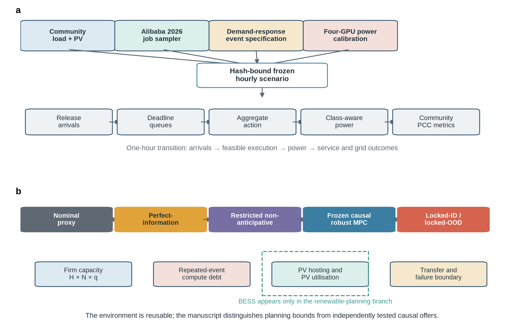
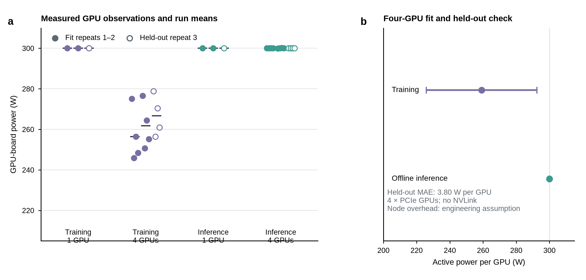
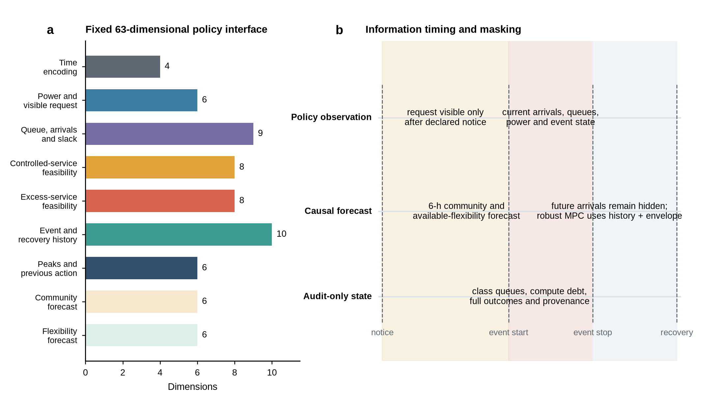
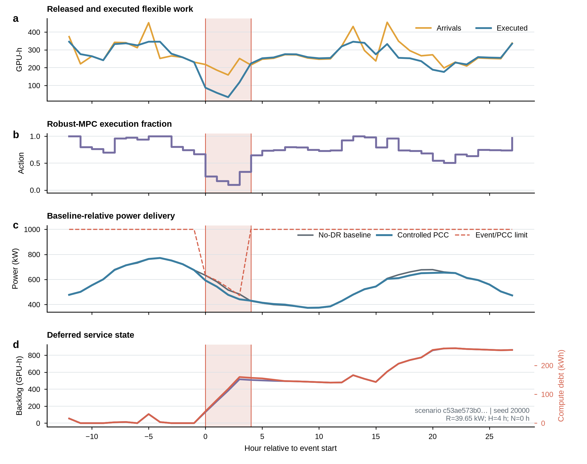

<!--
Working Supplementary Information, version 0.3.
Methods, audit rules and principal result-detail sections are drafted; figures and final release metadata retain explicit completion markers.
All terminology follows manuscript/terminology-ledger.md.
-->

# Supplementary Information

## Job constraints define firm data-centre demand response and photovoltaic hosting limits

[AUTHOR NAMES]

## Contents

1. Supplementary Methods
   - Hardware measurement and power-model calibration
   - Scaling from the four-GPU measurement node to Model A
   - AIDRBench environment and frozen scenario construction
   - Evidence partitions and one-time lock discipline
   - Workload, action and observation interfaces
   - Hourly state transition, baseline counterfactual and metrics
   - Firm-capacity decision rule and failure attribution
   - Frozen causal-controller specification
   - Planning programmes and numerical audit
   - Reward boundary and scope exclusions
2. Supplementary Results
   - Calibration uncertainty and topology interpretation
   - Environment validation contracts
   - Capacity-layer and notice diagnostics
   - Repeated-event exhaustion
   - Renewable-integration and sensitivity analyses
3. Supplementary Figures
4. Supplementary Tables

## Supplementary Methods

### Hardware measurement and power-model calibration

The hardware measurements were designed to anchor class-specific GPU-board power in the hourly model, rather than to characterise thermal control or dynamic voltage and frequency scaling. The measurement node contained four NVIDIA RTX PRO 6000 Blackwell Max-Q Workstation Edition GPUs, each reporting a 300-W power limit. `nvidia-smi topo` reported PCIe `NODE` paths among the GPUs and no NVLink connection. No clocks or power limits were changed.

Training measurements used BF16 8192 × 8192 forward and backward matrix operations. The four-GPU training condition additionally applied a NCCL gradient all-reduce, thereby including the synchronisation and PCIe communication behaviour of a multi-GPU training step. Offline inference used BF16 8192 × 8192 batched forward operations without inter-GPU communication. Each workload was run in one- and four-GPU conditions with three repeats. A 5-s warm-up preceded a 20-s measurement window, during which read-only GPU-board power and utilisation were sampled from `nvidia-smi` at 1-s resolution.

Repeats 1 and 2 were used for calibration and repeat 3 was held out. For a four-GPU repeat, the board-power readings were first averaged within each GPU over time and then averaged across the four GPUs to form one independent run mean. The four GPUs within a synchronised run were not treated as four independent replicates. The two calibration run means were used to estimate each class-specific active-power mean and its Student t 95% confidence interval. The held-out repeat was used only to calculate prediction error.

The calibration artifact recorded an idle estimate of 13.94 W per GPU. Because idle power was measured in one node-level run, its 6.74–18.68 W interval is the range across GPUs within that run, not an inferential confidence interval. Four-GPU active-power estimates were 259.08 W per GPU for training (95% t interval, 225.81–292.35 W) and 300.02 W per GPU for offline inference (299.69–300.35 W). The combined held-out active-power mean absolute error was 3.80 W per GPU; class-specific errors were 7.56 W for training and 0.03 W for offline inference.

The node exposed no accessible baseboard-management-controller or data-centre-management-interface power channel, and CPU package telemetry required privileged model-specific-register access that was unavailable. CPU, memory, fan and conversion losses were therefore not measured at the wall. The node fixed-overhead term was explicitly set to 300 W per node and varied from 150 to 450 W in sensitivity analysis. For this reason, the artifact evidence class is `benchmark_anchored_synthetic`, not `measured`. The public artifact contains raw-input SHA-256 values, fitted parameters, uncertainty definitions and the held-out error, and has SHA-256 `ef1e474a95b7139f6fd25b4deb733a81dfa0616c8245e101fcc62f437ffc5193`.

### Scaling from the four-GPU measurement node to Model A

The formal Model A configuration contained 144 four-GPU nodes (576 GPUs), a 1,000-kW community PCC limit and an 800-kW normalised community background peak. The reference workload mix produced a data-centre operating peak of 201.00 kW. This configuration was a controlled normalisation for comparing job-feasible and nominal flexibility; it was not intended to represent the nameplate design of a particular commercial data centre.

The power model preserved workload class. For hour t,

\[
P^{\mathrm{DC}}_t=P_{\mathrm{fixed}}+\sum_c e_cX_{c,t},
\]

where \(X_{c,t}\) was executed GPU-hours of class c and \(e_c\) was its incremental energy coefficient derived from active minus idle board power and the declared power-usage effectiveness (PUE). The nominal configuration used PUE = 1.20. The fixed component included idle GPU power and the assumed node overhead. Hardware lower, nominal and upper cases substituted the corresponding calibration intervals without changing the number of nodes, so the sensitivity isolated power-model uncertainty rather than silently resizing the fleet.

This scaling assumes that a node with the same four-GPU topology retains the measured class-specific board-power response and that aggregate facility power is the sum of node contributions multiplied by PUE. It does not claim identical throughput, communication efficiency or utilisation for H100, H200 or another GPU generation. No cross-generation capacity extrapolation is included in the study.

### AIDRBench environment and frozen scenario construction

AIDRBench converted exogenous community, workload and demand-response inputs into auditable hourly state transitions, power trajectories and service outcomes. The environment served three purposes. First, the causal controller and offline planning programmes used the same workload-conservation, deadline and class-aware power definitions. Second, frozen scenarios ensured that alternative schedules were evaluated against identical community demand, job arrivals and event timing. Third, step-, event- and episode-level outputs exposed delivery, deadline, backlog, rebound and compute-debt metrics without relying on a training reward.

Each Model A episode contained a 7-day main horizon followed by a 48-h clearance tail. New jobs arrived only during the main horizon; the tail allowed deferred work, rebound and terminal backlog to be evaluated. The environment used a fixed 1-h time step and rejected non-hourly configurations because deadline buckets age by one bucket per step. A 6-h environment forecast was available to the frozen causal controller under the declared information structure.

Community demand came from the selected NREL End-Use Load Profile and retained its temporal shape after normalisation. Model A used the `eulp_mixed_3a` profile for development, validation and locked-ID evaluation. Locked-OOD evaluation changed the community profile to `eulp_mixed_3c` and simultaneously changed the workload-arrival process from a non-homogeneous Poisson process to a block process. The locked-OOD set replayed validation-selected candidates and was not used to estimate new capacities.

Job arrivals were independently resampled for each episode from a sampler informed by the Alibaba GPU 2026 job-execution summary. The official 1.19-GB archive contained 40,522,321 rows after extraction and normalisation. To bound repeated experiment I/O, the project generated a deterministic 100,000-row sampler by streaming uniform random-key top-k sampling: 50,000 low-priority training records and 50,000 low-priority offline-inference records, using seed 2026. This “Lite” label denotes a project-made sampling artifact rather than an Alibaba release. The resulting arrival process was synthetic and preserved selected empirical job-characteristic distributions; it was not a literal replay of the original cluster timeline, and it did not recreate the pod-hourly archive's temporal correlations. Model A used a target total utilisation of 0.65, equal training and offline-inference class shares, and class flexible fractions of 1.00 and 0.50, respectively. The declared flexible GPU pool fraction was 0.60. Training deadline slack ranged from 2× to 6× runtime, bounded to 6–48 h, while offline-inference slack ranged from 1.5× to 4× runtime, bounded to 2–24 h. These deadlines were generated by policy because the source summary did not contain production deadlines.

A post-run, non-locked representativeness audit compared the formal sampler with a second 100,000-row reservoir drawn from the complete normalised summary using seed 20,260,824. Across the three numeric job-shape variables, the maximum two-sample Kolmogorov–Smirnov statistic was 0.00774; maximum absolute relative errors at the median and 95th percentile were 1.69% and 0.99%, and the maximum categorical total-variation distance was 0.00656. The complete engineering threshold suite nevertheless did not pass because the maximum Wasserstein distance normalised by the reference median was 0.218, above the diagnostic limit of 0.10; this arose for offline-inference requested GPU-hours, whose reference median was small relative to the tail. We therefore treat the sampler as close for the reported central and quantile summaries, but do not claim full-distribution equivalence or temporal equivalence to the pod-hourly data.

Single demand-response events were sampled from 24 declared start-hour candidates corresponding to 15:00–20:00 windows on episode days 3–6. Event duration and notice were replay overrides over H = {1, 2, 3, 4, 6, 8} h and N = {0, 2, 6} h. Community, workload and event randomness used independent child streams derived from the episode seed. The frozen scenario payload stored all exogenous inputs plus their hashes and rejected replay under an incompatible time horizon, forecast horizon, PCC capacity or power-model fingerprint.

### Evidence partitions and one-time lock discipline

The experiment used four disjoint episode-seed partitions, each assigned a role before the corresponding analysis. Development episodes were available for model construction, mechanism diagnostics and sparse sensitivity design. Validation episodes could be used to check whether a development pattern replicated and to select a fixed causal candidate, but not to report an independently locked certificate. Locked-ID episodes were opened once after the environment, success criteria, controller specification and candidate-selection procedure had been frozen. Locked-OOD episodes were opened only after the locked-ID receipt had been written and were used solely to replay the already selected candidates under a joint distribution shift.

| Partition | Episode seeds | Independent episodes | Community profile | Arrival process | Permitted use |
|---|---:|---:|---|---|---|
| Development | 10,000–10,099 | 100 | `eulp_mixed_3a` | non-homogeneous Poisson | model construction, diagnostics and sensitivity design |
| Validation | 20,000–20,099 | 100 | `eulp_mixed_3a` | non-homogeneous Poisson | replication and causal-capacity selection |
| Locked ID | 30,000–30,499 | 500 | `eulp_mixed_3a` | non-homogeneous Poisson | one-time in-distribution certificate |
| Locked OOD | 40,000–40,499 | 500 | `eulp_mixed_3c` | block arrivals | one-time fixed-candidate transfer stress test |

The seed determined independent child random streams for community-window selection, workload arrivals and event placement; it was not treated as a statistical replicate when the same episode was reused across paired portfolios. Each frozen episode carried a scenario hash derived from its canonical payload. The locked-ID receipt verified 500 unique hashes, zero overlap with validation and 2,000 payload files without a hash mismatch. The locked-OOD receipt likewise verified 500 unique hashes, zero overlap with validation or locked ID and 2,000 payload files without a mismatch. Both locked sets passed a no-DR service audit with zero deadline-missed GPU-hours and zero terminal backlog, ensuring that certificate failures were induced by dispatch rather than by an intrinsically infeasible workload sample.

Opening a locked partition changed the protocol status from not consumed to consumed and produced a post-run receipt. Capacity was never re-estimated from either locked partition. In particular, locked-OOD failure caused no controller modification and no lower-capacity search on the OOD episodes. This distinction is essential: the locked-ID result estimates reliability for the declared Model A distribution, whereas the OOD replay tests transfer of those fixed offers and does not estimate a new OOD capacity surface.

### Workload and action interfaces

Released jobs entered class-aware, earliest-deadline-first fluid queues. Each queue retained GPU-hour work in the deadline buckets {0, 1, 2, 3, 6, 12, 24, 48} h. Work could not execute before release, cumulative execution could not exceed cumulative arrival, and expired unfinished work was recorded as deadline miss. The baseline and controlled queues received the same arrivals.

The online environment exposed an aggregate execution action \(u_t\in[0,1]\), interpreted as the fraction of flexible GPU-hour capacity executed in hour t. A five-level discrete adapter {0, 0.25, 0.50, 0.75, 1.00} remained available for controller-development experiments, but the Nature mainline used the continuous interface. The queue allocated the selected aggregate work across classes by earliest deadline, retaining class identity for the power calculation.

Offline PI, restricted NA and renewable-integration programmes did not optimise this aggregate action. They used class-aware execution variables \(x_{c,t}\) with cumulative release and deadline constraints. Equivalence diagnostics showed that the compact cumulative PI formulation matched the earlier job-edge formulation at all 18 tested points. BESS charging and discharging were decision variables only in the renewable-integration planner; the online Gymnasium action did not control the battery.

### Normalised policy observation

The `firm_v5` policy observation was a stable 63-dimensional `float32` vector. Feature names and bounds were generated by the environment and checked against a Gymnasium `Box` space after every construction. Power variables were divided by PCC capacity or the flexible-power range, backlog variables by flexible GPU capacity multiplied by the 48-h deadline horizon, and temporal variables by their declared duration. Values were clipped only to declared feature-specific bounds; a value outside the observation space raised a runtime error.

| Observation group | Dimensions | Normalisation and information content |
|---|---:|---|
| Hour and weekday | 4 | sine–cosine encodings |
| Current community, PV, PCC, fixed DC, available flexible power and event request | 6 | PCC capacity or flexible-power range |
| Controlled/baseline backlog, excess backlog, arrivals, miss, terminal excess and slack | 9 | capacity×deadline horizon, cumulative arrivals or maximum deadline |
| Controlled deadline feasibility | 8 | cumulative due work divided by available GPU-hour capacity before each deadline bucket |
| Excess deadline feasibility | 8 | positive controlled-minus-baseline feasibility excess |
| Event, notice, recovery and event history | 10 | declared event/recovery scales and 24-h history |
| Running peak, relief, rebound, previous action and previous PCC | 6 | PCC, request and action scales |
| Future community forecast | 6 | PCC capacity |
| Future available-flexibility forecast | 6 | flexible-power range with notice masking |
| **Total** | **63** | fixed ordering, bounds checked each step |

Explicit `compute_debt_kwh` was included in the auditable control state and `info` outputs, but it was not a separately named element of the 63-dimensional policy vector. The observation represented related state through controlled and excess backlog, deadline-feasibility ratios and slack. This distinction prevents the scientific compute-debt diagnostic from being misdescribed as a privileged controller input.

### Hourly state transition, baseline counterfactual and metrics

Each hourly transition followed a fixed order: (1) arrivals for the current hour were added to controlled and baseline queues before the action; (2) the controller or planner selected executable GPU-hours; (3) controlled work was allocated by earliest deadline; (4) unserved work due in the current bucket was counted as a deadline miss; (5) remaining buckets aged by one hour; (6) class-specific execution was converted to data-centre power and energy; (7) community, PV and data-centre power were combined into PCC power; and (8) delivery, rebound, peak, backlog, slack, compute-debt and event-history variables were updated for the next observation.

The no-DR baseline was a full-service causal counterfactual driven by the same arrivals and exogenous community trajectory. Event delivery was calculated from controlled minus baseline PCC power. Mean delivery and minimum interval delivery were recorded separately. The firm-success criterion required both mean delivery of at least 0.95 and at least 0.95 of the request in every event hour, in addition to deadline-miss, rebound, recovery-window peak-relief and terminal-backlog criteria.

Compute debt was the additional dynamic energy obligation associated with controlled backlog relative to the matched baseline. It excluded idle-pool energy by applying class-specific active-minus-idle power and PUE to the excess class backlog. Repeated-event outcomes additionally compared each event with a same-scenario, same-clock-time fresh-event counterfactual, so residual delivery was not confounded by moving the event to a different community or arrival condition.

### Firm-capacity decision rule and failure attribution

For a fixed candidate reduction R, duration H, notice N and controller, one frozen episode produced one binary outcome. Success required all six predeclared criteria below. Failure labels were non-exclusive: an episode that failed both event-average and interval delivery was assigned the combined delivery label, while a delivery failure could additionally carry a rebound or window-relief label. This prevents a single episode with several operational violations from being reduced to an arbitrary first-failure code.

| Criterion | Headline threshold | Operational interpretation |
|---|---:|---|
| Mean delivery | ≥0.95 | mean capped baseline-relative reduction across all event intervals divided by R |
| Minimum interval delivery | ≥0.95 | every event hour delivers at least 0.95R |
| Deadline-miss fraction | ≤0.01 | expired GPU-hour work divided by offered work |
| Rebound ratio | ≤0.25 | largest post-event excess PCC load divided by peak event reduction |
| Recovery-window peak relief | ≥0.50 | retained peak reduction over the event plus 24-h recovery window |
| Terminal-backlog fraction | ≤0.02 | uncleared work at the end of the 48-h tail divided by offered work |

The PI surface first solved a maximum feasible reduction for each independent episode. The distribution-level boundary was then an exact-binomial nonparametric lower-tolerance order statistic at population coverage q and confidence 0.95. The order-statistic rank was determined by binomial inversion rather than by selecting an arbitrary percentile. If 100 episodes could not support the requested q and confidence combination, the corresponding boundary was reported as not estimable. The restricted NA result used the same empirical failure allowance for a matched comparison but carried no separate population confidence claim.

The causal procedure instead selected one fixed R on validation for every q × H × N cell using ten iterations of binary search over 0–100% of the declared reference reduction range. The fixed candidate was replayed on 500 locked-ID episodes. If s of n = 500 episodes succeeded, certification required the one-sided 95% Wilson lower bound for the binomial proportion to equal or exceed q. Decisions were interval-wise: the study did not claim simultaneous 95% coverage of all 54 q × H × N cells. A cell could therefore fail certification even when its empirical success fraction exceeded q, as occurred for q = 0.95, H = 1 h (477/500 successes; lower bound 0.936).

### Frozen causal-controller specification

The causal reference policy was a receding-horizon robust model-predictive controller, not a learned policy. At each hour it solved a 6-h programme from the current queue state, released work, an environment-provided community/limit forecast and an arrival envelope estimated from the previous 24 h. The arrival envelope added one empirical standard deviation and enforced a minimum safety fraction of 0.15. Demand-response limits beyond the notice boundary remained masked. The controller used a service envelope to avoid creating locally infeasible deadline states and executed only the first decision before advancing and resolving.

| Controller field | Frozen value |
|---|---:|
| Planning horizon | 6 h |
| Solver / threads | HiGHS / 1 |
| Warm start | enabled |
| Deadline penalty | 1,000.0 |
| PCC-limit penalty | 20.0 |
| Backlog penalty | 0.2 |
| Backlog normalisation | 48 h |
| Switching penalty | 0.02 |
| Arrival-history window | 24 h |
| Arrival safety multiplier / floor | 1.0σ / 0.15 |
| Service envelope | enabled |
| Infeasibility fallback | threshold controller |
| Information structure | causal state plus 6-h environment forecast |

The raw controller YAML had SHA-256 `73041f55b7ac4aab0a1f6fa799cfa94f0a8c71d6e6bb3a7f39eadda212839dcf`; its normalised specification had SHA-256 `ba530b8a622e5d621e6d005369a07db9db7a9e2e5cbf9aff4e73209d828abf02`. Validation selection recorded these hashes together with the exact Git commit, environment configuration, scenario hashes and hashes of controller-relevant source files. Locked replay reconstructed the normalised specification and stopped if any item differed. Thus a change to an otherwise implicit Python default could not silently alter a formal certificate.

### Planning programmes and numerical audit

The PI, restricted NA, hosting and renewable-integration layers shared class-aware hourly execution variables. For every class and time, cumulative execution could not exceed cumulative released work, and cumulative execution plus the allowed miss budget had to cover work whose deadline had passed. Aggregate execution was bounded by installed class-eligible GPU capacity. These cumulative constraints prevented the optimiser from using future arrivals or treating all GPU-hours as energetically interchangeable.

The renewable programme additionally used non-negative PV-use and curtailment variables whose sum equalled available PV in each hour. A no-export constraint imposed non-negative PCC import, and import could not exceed 1,000 kW. BESS state of charge followed the declared charge/discharge efficiencies, stayed between zero and 200 kWh, and returned to its 50% initial level at the end of the horizon. Charge and discharge power were each limited to 100 kW. A binary exclusivity variable prevented simultaneous charging and discharging in the headline mixed-integer programme. Across the validation renewable ensemble, the maximum simultaneous charge/discharge residual was 2.19 × 10−7 kW, maximum terminal-state deviation was zero, maximum curtailment residual was 1.19 × 10−11, and maximum PCC-constraint residual was 2.50 × 10−12 kW.

PV hosting was solved scenario by scenario. The reported simultaneous feasible capacity was the minimum scenario-specific feasible maximum across all 100 frozen scenarios, not the mean maximum and not a quantile. Paired mean gains and portfolio interactions were separate estimands computed from within-scenario differences. At the 5% curtailment threshold, all four 1× data-centre portfolios were feasible in all validation scenarios. At 3× the reference data-centre size, rigid/no-BESS, flexible/no-BESS, rigid/BESS and flexible/BESS portfolios were feasible in 31, 100, 96 and 100 scenarios, respectively; an infeasible scenario was retained as missing from the joint envelope rather than assigned zero capacity.

The repeated-event programme generated a distinct hash for each duration × recovery-gap schedule within an episode seed. Development-selected capacities were copied unchanged into validation. Checkpoint files stored both payload and identity hashes; replay of all 1,000 validation programmes resumed every checkpoint, recomputed none and produced byte-identical aggregates. The renewable validation rerun similarly resumed all 100 scenario checkpoints and produced byte-identical aggregate artifacts. These checks address deterministic reconstruction of the reported tables, not uncertainty in the underlying model assumptions.

### Reward boundary and scope exclusions

The environment retained the `firm_threshold_v2` scalar reward for future online-control studies. It combined threshold-normalised penalties for delivery, deadline feasibility, deadline miss, rebound, recovery-window relief, terminal backlog, excess backlog and action switching. None of the main PI, restricted NA, repeated-event or renewable-planning results was defined by this reward. The robust model-predictive controller used in causal certification was not trained on it, and DQN, PPO and SAC results were excluded from the manuscript.

The mainline therefore does not make an RL performance, sample-efficiency or reward-design claim. The continuous Gymnasium interface and reward are parts of the reusable environment, but the paper's capacity results come from optimisation bounds and a frozen, explicitly specified causal controller. Non-pre-emptive execution, gang scheduling, checkpoint overhead, thermal control and cross-GPU-generation extrapolation were also outside Model A. Adding any of these mechanisms would define a new model version requiring new validation and locked scenarios rather than an in-place reinterpretation of the present certificates.

## Supplementary Results

### Calibration uncertainty and topology interpretation

Single-GPU training remained near the 300-W board limit, whereas four-GPU training averaged 259.08 W per GPU. Offline inference remained near 300 W in both one- and four-GPU conditions. The training difference is consistent with the synchronised workload spending part of each step in PCIe/NCCL communication, but the calibration experiment was not designed to isolate communication energy from kernel occupancy. The measured value was therefore used as a topology-specific power anchor rather than as a general performance or scaling law.

The training confidence interval was wide because it was based on two independent fit runs, and the node-overhead range was an assumption rather than a measurement. The main PI sensitivity consequently substituted lower, nominal and upper active-power cases while leaving node count fixed. Absolute firm capacity changed with the dynamic power slope, whereas fixed node overhead changed the operating peak but cancelled from baseline-relative single-event reduction in kW. These sensitivities bound the declared Model A power representation; they do not support extrapolation to another GPU family.

### Environment validation contracts

Environment verification was organised around physical and information contracts rather than controller reward. Existing automated tests covered the following categories.

| Contract | Verified behaviour |
|---|---|
| Gymnasium interface | continuous and discrete actions; 63-dimensional observation within declared bounds |
| Work conservation | arrivals, execution, misses and terminal backlog reconcile |
| Deadline transition | arrivals precede actions; earliest-deadline-first execution; one-hour bucket ageing |
| Class-aware power | execution class changes dynamic power and compute-debt accounting |
| PCC identity | community net load plus data-centre power matches reported PCC power and limit |
| Notice masking | future event limits are hidden before the declared notice window |
| PI and NA information logic | PI notice invariance and NA weak monotonicity checks |
| Frozen replay | generated and replayed observations, rewards and metrics are identical |
| Calibration integrity | schema, unknown fields, artifact SHA-256 and required class parameters fail closed |
| Controller integrity | specification or source mismatch prevents locked evaluation |
| Optimisation stack | HiGHS, Parquet and clean-install smoke paths execute |
| Resume | exhaustion and hosting ensembles resume without changing aggregates |

These tests establish implementation consistency with the declared model. They do not demonstrate that the model captures every operational feature of a production data centre. In particular, 1-h fluid execution does not include non-pre-emptive job starts, gang placement, checkpoint overhead or rack-level network contention.

### Capacity layers and notice diagnostics

At q = 0.95 and 95% confidence, the nonparametric PI tolerance lower bound declined from 53.01 to 37.76 kW as duration increased from 1 to 8 h. The 100-scenario restricted NA programme used the same allowed empirical failures as a matched empirical PI order statistic. Both returned 56.42, 53.49, 45.17, 44.00, 43.01 and 41.19 kW for durations of 1, 2, 3, 4, 6 and 8 h, respectively, at every tested notice. These development values form the empirical PI/NA boundary and do not carry an independent confidence lower bound. They must not be subtracted from the population-level PI tolerance lower bound to estimate an information gap.

| Duration | PI tolerance lower bound, q = 0.95 (kW) | Empirical PI/NA, N = 0 h (kW) | N = 2 h (kW) | N = 6 h (kW) |
|---:|---:|---:|---:|---:|
| 1 h | 53.01 | 56.42 | 56.42 | 56.42 |
| 2 h | 44.46 | 53.49 | 53.49 | 53.49 |
| 3 h | 41.19 | 45.17 | 45.17 | 45.17 |
| 4 h | 40.15 | 44.00 | 44.00 | 44.00 |
| 6 h | 40.15 | 43.01 | 43.01 | 43.01 |
| 8 h | 37.76 | 41.19 | 41.19 | 41.19 |

For H = 4 and 8 h, 6 h notice exposed a mean 1,829.34 GPU-h of work eligible for pre-execution, compared with 133.05 GPU-h of no-control pre-event spare capacity. The paired robust-controller schedules changed by 1.33 and 1.30 GPU-h per pre-event interval, respectively. Despite this schedule divergence, both PI and restricted NA notice gains were 0.0 kW. At the fixed comparison capacities, the causal controller succeeded in 92 of 100 development episodes for both durations; interval delivery accounted for 22 of 23 binding counts at H = 4 h and all 24 counts at H = 8 h. Thus the notice diagnostic identified a lack of usable pre-event headroom and an unchanged binding delivery constraint, rather than absence of eligible work.

Validation selection froze one candidate for each q × H × N cell before locked-ID replay. At q = 0.95, H = {2, 3, 4, 6, 8} h passed at all three notice values, whereas H = 1 h failed at all notices, yielding 15/18 certified cells. The H = 1 h candidate achieved 477/500 successes, but its one-sided 95% Wilson lower bound was 0.936 and therefore remained below q = 0.95. Secondary q = 0.90 and q = 0.99 analyses certified 15/18 and 9/18 cells, respectively. Candidate failures were attributed to linked mean/interval delivery; the other declared service criteria did not appear as locked-ID failure labels.

The 186 failed q = 0.95 locked-ID episode–cell outcomes comprised 81 joint mean-and-interval delivery failures and 105 interval-only delivery failures. No locked-ID outcome was classified as a deadline-miss, rebound, window-peak-relief or terminal-backlog failure. This concentration supports the mechanistic interpretation that the frozen candidates were limited by instantaneous power delivery rather than by a reward trade-off. Recovery time nevertheless remained unresolved within 24 h for 8,953 of the 9,000 q = 0.95 episode–cell trajectories. Recovery-time non-resolution was retained as a diagnostic and was not silently converted to zero; it was not one of the certificate success criteria.

The secondary reliability surfaces behaved nonlinearly because each q selected a different validation candidate before locked replay. At q = 0.90, the 1-h offer failed despite 454/500 successes because its lower bound was 0.884, whereas all longer durations passed. At q = 0.99, the 3-, 6- and 8-h offers passed at all notices; the 4-h candidate achieved 498/500 successes but its lower bound of 0.988 remained just below 0.99. These boundary cases demonstrate why empirical success alone was not used as the certification decision.

### Repeated-event exhaustion

Repeated-event capacities were fixed at 44.0003 kW for H = 4 h and 41.1908 kW for H = 8 h. Each of the 20 development and 20 validation cells contained 100 independent four-event episodes. The full validation pattern reproduced debt accumulation and non-monotonic joint success observed in development.

| Duration / recovery gap | Development joint success | Validation joint success | Validation event-4 residual delivery | Validation event-4 paired debt increment (kWh) |
|---|---:|---:|---:|---:|
| 4 h / 2 h | 0.75 | 0.78 | 1.0000 | 554.5 |
| 4 h / 4 h | 0.78 | 0.87 | 1.0000 | 656.8 |
| 4 h / 8 h | 0.94 | 0.97 | 1.0000 | 693.2 |
| 4 h / 12 h | 0.78 | 0.88 | 1.0000 | 852.0 |
| 4 h / 24 h | 0.61 | 0.77 | 0.9987 | 992.0 |
| 8 h / 2 h | 0.73 | 0.80 | 0.9910 | 1,058.4 |
| 8 h / 4 h | 0.85 | 0.83 | 0.9975 | 1,088.1 |
| 8 h / 8 h | 0.65 | 0.54 | 0.9963 | 1,166.1 |
| 8 h / 12 h | 0.79 | 0.68 | 0.9995 | 1,019.6 |
| 8 h / 24 h | 0.00 | 0.00 | 0.9933 | 1,381.8 |

Power delivery remained close to the matched fresh-event counterfactual even in cells with poor joint success. Failures could instead arise from window relief or episode-level service feasibility after multiple deferrals. The best validation cell, H = 4 h with an 8-h gap, had empirical joint success of 0.97 but a one-sided 95% Wilson lower bound of 0.927. No cell was therefore labelled a q = 0.95 repeated-event capacity certificate.

### Perfect-information renewable planning and sensitivity analyses

The renewable analyses used perfect-information workload schedules and the declared maximum deadline-miss fraction of 0.01; they did not replay the locked causal controller. At the fixed 201-kW data centre, allowing more PV curtailment increased simultaneous PV hosting in all portfolios. Flexible operation retained a positive capacity difference at every declared curtailment threshold. Under the headline 5% condition, the capacity feasible in every validation scenario increased by 32.83 kW without BESS and 33.38 kW with BESS. The distinct scenario-paired mean gains were 44.85 and 43.20 kW, with Bonferroni 95% simultaneous confidence intervals of 41.68–48.08 and 39.99–46.46 kW.

| Maximum curtailment | Rigid, no BESS (kW) | Flexible, no BESS (kW) | Rigid, BESS (kW) | Flexible, BESS (kW) |
|---:|---:|---:|---:|---:|
| 0% | 353.87 | 444.51 | 445.39 | 511.68 |
| 5% | 584.69 | 617.52 | 653.39 | 686.77 |
| 10% | 674.84 | 709.34 | 739.73 | 770.78 |
| 20% | 838.58 | 885.17 | 909.14 | 954.46 |

For the fixed 500-kW PV system, validation flexible-minus-rigid PV-use effects were 18.37 kWh without BESS and 5.76 kWh with BESS. Renewable demand share increased by 0.0577 and 0.0443 percentage points, while grid import decreased by 180.32 and 168.98 kWh. The larger grid-energy changes were not equal to the PV-use effects because workload rescheduling also changed energy timing and service use. Flexible schedules used the full declared 1% deadline-miss allowance, while rigid schedules had zero misses; all four conditions ended with zero terminal backlog. Maximum PCC import did not decline consistently under flexibility.

To remove this service asymmetry, we repeated the reference-scale 5%-curtailment hosting problem and the fixed-500-kW-PV problem with the maximum deadline-miss fraction set to zero. The diagnostic covered 100 development and 100 validation scenarios, rigid and flexible operation, and both BESS conditions (1,600 rows). Every programme was optimal and the maximum observed deadline-missed work was 0 GPU-h. In validation, the PV capacity feasible in every scenario remained 584.69/617.52 kW for rigid/flexible operation without BESS and 653.39/686.77 kW with BESS, preserving gains of 32.825 and 33.377 kW. Scenario-paired mean hosting gains were 44.854 and 43.198 kW, differing from the 1% formulation by −0.000079 and −0.001031 kW. Fixed-500-kW-PV use gains were 18.366443 and 5.764980 kWh, changing by less than 0.000006 kWh. The headline renewable-planning effects were therefore not obtained by spending the deadline-miss allowance. This was a non-locked PI planning sensitivity, not a replay of the causal demand-response controller.

The validation 2 × 2 × 2 hosting analysis returned positive workload-flexibility effects in all PV/BESS portfolios. AI×BESS interactions were −52.31 kW without PV and −88.54 kW with PV, both beyond the ±10.05-kW practical margin in the substitution direction. The AI×PV interaction was +44.59 kW without BESS and therefore practically complementary. With BESS it was +8.36 kW with a 1.05–15.74 kW simultaneous confidence interval, so the direction was positive but the practical magnitude was indeterminate.

Predeclared sensitivity analyses identified workload arrival and dynamic power as the largest tested sources of variation in the PI tolerance lower bound. Reducing flexible-arrival utilisation from 0.65 to 0.50 changed the H = 4 and 8 h capacities by −9.26 and −8.71 kW; increasing it to 0.80 changed them by +37.84 and +15.73 kW. Rigid-utilisation and deadline-slack perturbations produced no additional change at the tested points. At q = 0.95, lower/nominal/upper power cases produced 37.81/40.15/42.87 kW at H = 4 h and 35.56/37.76/40.32 kW at H = 8 h. Changing PUE from 1.20 to 1.10 or 1.30 scaled absolute capacity, while changing the fixed node overhead from 150 to 450 W did not change baseline-relative single-event firm kW.

A controlled community-profile sensitivity separated the profile component from the joint locked-OOD shift. Three NREL End-Use Load Profiles archetypes—`eulp_mixed_3a`, `eulp_mixed_3c` and `eulp_mixed_5a`—retained the same 75% residential/25% small-office composition, 800-kW background-peak scaling, Alibaba-derived arrivals, deadlines, hardware, event stream and random seeds. A preliminary no-DR gate covered three seeds per case and returned zero deadline misses and zero terminal backlog in all nine evaluations. The formal development ensemble then froze 100 paired scenarios per profile. Every arrival-file hash, event signature, random stream and power-model hash matched its reference-profile counterpart; only the community-profile payload differed.

Across H = 1, 2, 3, 4, 6 and 8 h, the q = 0.95 PI tolerance lower bounds were 53.005, 44.464, 41.191, 40.147, 40.147 and 37.760 kW in all three profile cases. Profile-minus-reference boundary differences were zero to numerical precision. Scenario-level paired differences were also zero from H = 3 h onward; at shorter durations, isolated scenario differences occurred but did not change the population tolerance order statistic. Fixed validation-selected q = 0.95 controller candidates were replayed as a non-locked development diagnostic. Each profile returned 98/100 successes at the 39.651-kW, 4-h candidate and 97/100 successes at the 36.706-kW, 8-h candidate, with one-sided Wilson lower bounds of 0.941 and 0.927. The minimum recovery-window relief quantile varied across profiles, but the delivery-based success outcome did not. Thus community shape was non-binding for the tested job-derived capacity, while remaining relevant to PCC headroom and renewable integration. These are climate-zone profile archetypes, not site observations or a spatial sample.

The corresponding renewable slice solved rigid/flexible planning with BESS off/on at the reference data-centre scale and a 5% curtailment ceiling. All 1,200 programmes were optimal, the maximum reported deadline-miss fraction was 0.01000000000000016 from solver tolerance, and every terminal backlog was zero. The all-scenario feasible rigid/flexible PV-hosting boundaries without BESS were 430.448/525.741 kW in 3A, 603.524/667.040 kW in 3C and 506.168/585.413 kW in 5A. With BESS they were 482.655/585.914, 668.560/726.905 and 558.400/639.265 kW, respectively. Differences between the separate cell minima were therefore 95.293, 63.516 and 79.246 kW without BESS and 103.259, 58.345 and 80.866 kW with BESS. These differences describe a common-capacity boundary over each 100-scenario ensemble; they are not paired mean effects.

The six predeclared scenario-paired flexible-minus-rigid mean gains were 45.664 kW (3A, no BESS), 43.346 kW (3A, BESS), 42.879 kW (3C, no BESS), 42.353 kW (3C, BESS), 44.905 kW (5A, no BESS) and 42.949 kW (5A, BESS). Their Bonferroni 95% simultaneous bootstrap intervals were 41.654–50.170, 39.078–47.961, 39.967–46.093, 39.365–45.674, 39.500–50.781 and 37.529–49.062 kW, respectively. Community profile therefore changed absolute hosting and the all-scenario boundary increment while preserving a positive paired mean flexibility value in every tested stratum. This was a development perfect-information planning sensitivity, not a causal or geographically representative effect.

Among success-criterion perturbations, relaxing linked mean and interval delivery from 0.95 to 0.90 increased the H = 4 and 8 h PI tolerance lower bounds from 40.15 and 37.76 kW to 42.38 and 39.86 kW. Tightening delivery to 0.98 reduced them to 38.92 and 36.60 kW. Tested changes to deadline-miss, rebound and recovery-window-relief thresholds left these two development capacity points unchanged. This finding is local to the declared PI scenarios and is not evidence that those criteria can be removed from causal or repeated-event evaluation.

Locked-OOD replay jointly changed community profile and workload-arrival process. At q = 0.95, the H = 1, 2, 3, 4, 6 and 8 h candidates achieved 437, 433, 445, 425, 398 and 383 successes among 500 episodes, respectively; no duration passed at any notice. The q = 0.90 and q = 0.99 candidates also yielded 0/18 certified cells. Because candidate reselection was prohibited, this result establishes failure of transfer for the frozen Model A candidates, not zero available capacity in the OOD distribution.

Across all 18 q = 0.95 OOD duration–notice cells, recorded failure labels comprised 498 interval-only delivery failures, 828 combined mean-and-interval failures, 93 combined delivery-and-rebound failures, three combined delivery-and-window-relief failures and 15 window-relief-only failures. Notice outcomes remained identical within duration, so these counts include the three predeclared notice replays and should not be interpreted as 18 independent capacity estimates. The joint shift changed both the community profile and arrival process; the design therefore establishes a transfer boundary but cannot attribute the loss to one shifted component.

## Supplementary Figures

### Supplementary Figure 1 | AIDRBench environment and evidence flow

**Supplementary Fig. 1 | AIDRBench environment and evidence flow.** **a,** Community load and photovoltaic generation, the Alibaba 2026 job sampler, the declared demand-response event and the four-GPU calibration artifact are bound into a hash-identified hourly scenario. Released work enters deadline queues; the controller supplies an aggregate execution fraction; class-aware execution determines data-centre power and community point-of-common-coupling metrics. **b,** Evidence proceeds from the nominal proxy through perfect-information and restricted non-anticipative boundaries to the frozen causal robust model-predictive controller and independent locked testing. The resulting analyses quantify firm capacity, repeated-event compute debt, renewable hosting and the transfer boundary. Battery energy storage appears only in the renewable-planning branch and is not a hidden actuator in the demand-response certificate.

### Supplementary Figure 2 | Four-GPU power calibration

**Supplementary Fig. 2 | Four-GPU board-power calibration.** **a,** Per-GPU means from one- and four-GPU training and offline-inference measurements. Filled points denote calibration repeats 1–2 and open points denote held-out repeat 3; short horizontal marks show within-run means for every measurement condition. GPUs within a run are repeated observations and are not treated as independent replicates. **b,** Nominal active board power per GPU and 95% Student-*t* intervals derived from independent four-GPU run means (*n* = 2 runs per workload class). The held-out mean absolute error was 3.80 W per GPU. The four devices communicated through PCI Express without NVLink. The 300-W node overhead is an engineering assumption tested separately and is not inferred from board-power telemetry.

### Supplementary Figure 3 | Normalised observation and information timing

**Supplementary Fig. 3 | Normalised observation and causal information timing.** **a,** Allocation of the fixed 63-dimensional `firm_v5` policy interface across time, current power and request, workload-service state, history, previous-action and forecast groups. All policy features are bounded by the declared observation space before control. **b,** The demand-response request becomes visible only at its declared notice time. Current arrivals, queues, power and event state enter the policy observation; the six-hour forecast contains community conditions and available-flexibility envelopes, while future workload arrivals remain hidden. Class queues, compute debt, full outcomes and provenance are retained for audit but do not provide the causal controller with future information.

### Supplementary Figure 4 | Representative frozen episode transition

**Supplementary Fig. 4 | Representative transition under the frozen causal controller.** A deterministic rule selected the minimum episode seed from the non-locked validation set (seed 20,000; scenario SHA-256 prefix `c53ae573b0`), rather than selecting an episode by outcome. The frozen robust model-predictive controller was replayed at the validation-selected 39.65-kW candidate for a four-hour event with zero-hour notice. **a,** Released and executed flexible work. **b,** Aggregate execution fraction. **c,** No-demand-response and controlled point-of-common-coupling power together with the event-dependent limit. **d,** Backlog and compute debt. Shading marks the event interval. This descriptive trajectory had a minimum interval delivery ratio of 0.971, zero deadline-missed work, zero terminal backlog and a maximum event-rebound ratio of 0.112; certification uses the full independent episode ensemble rather than this example.

## Supplementary Tables

### Supplementary Table 1 | Hardware calibration parameters

| Parameter | Estimate | Uncertainty | Statistical unit |
|---|---:|---:|---|
| Idle board power | 13.94 W GPU⁻¹ | 6.74–18.68 W GPU⁻¹ within-run range | one node idle run |
| Training active board power | 259.08 W GPU⁻¹ | 225.81–292.35 W GPU⁻¹, 95% t interval | independent four-GPU run mean, n = 2 |
| Offline-inference active board power | 300.02 W GPU⁻¹ | 299.69–300.35 W GPU⁻¹, 95% t interval | independent four-GPU run mean, n = 2 |
| Node fixed overhead | 300 W node⁻¹ | assumed range 150–450 W node⁻¹ | engineering assumption |
| Held-out active-power MAE | 3.80 W GPU⁻¹ | one held-out run per class | held-out independent run |

### Supplementary Table 2 | Model A reference configuration

| Component | Declared value |
|---|---|
| Time resolution | 1 h |
| Main horizon / clearance tail | 7 days / 48 h |
| Forecast horizon | 6 h |
| PCC capacity / community peak | 1,000 kW / 800 kW |
| Data-centre fleet | 144 nodes × 4 GPUs |
| Reference-mix operating peak | 201.00 kW |
| Flexible GPU pool fraction | 0.60 |
| PUE / node overhead | 1.20 / 300 W node⁻¹ |
| Target workload utilisation | 0.65 |
| Workload classes | training 0.50; offline inference 0.50 |
| Class flexible fractions | training 1.00; offline inference 0.50 |
| Deadline buckets | 0, 1, 2, 3, 6, 12, 24, 48 h |
| Event durations / notices | 1, 2, 3, 4, 6, 8 h / 0, 2, 6 h |
| Recovery window | 24 h |

### Supplementary Table 3 | Provenance and release artifacts

| Artifact | Frozen identifier |
|---|---|
| Model A freeze commit | `d03b44090b2c7ca6a5ae73bb2eb7a611f36a71e9` |
| Model A environment YAML | `c48e70b46f82da4eed80e58b040aa95091dbc03497456745b1c370817bd032e5` |
| Community processed data | `daa513e8a6597232c47c5c0554fcf6723e59e785c3fe3c85c058ae54c6f235f0` |
| Workload sampler | `67e5cc0878e246e9de547cc838c6b0e3df5a25fcd52f043624235873ca2a0d66` |
| Calibration artifact payload | `ef1e474a95b7139f6fd25b4deb733a81dfa0616c8245e101fcc62f437ffc5193` |
| Robust-MPC YAML | `73041f55b7ac4aab0a1f6fa799cfa94f0a8c71d6e6bb3a7f39eadda212839dcf` |
| Robust-MPC normalised specification | `ba530b8a622e5d621e6d005369a07db9db7a9e2e5cbf9aff4e73209d828abf02` |
| Locked-ID ordered scenario-hash list | `e66a22ccac87bb36fe772b075a091f829dfacb30223a4632bf6479835797aa72` |
| Locked-OOD ordered scenario-hash list | `81c04e622ac4f44232d662dbf3a6e8b3245bbb727c4d133274897a0f159ce3a9` |
| Renewable-integration protocol | `8e4d290cc4a7c36e11a7ef4bf46746c8622038172bb08e51ced81cf45c843e11` |
| Submission release / software archive | [TO BE ADDED: immutable release commit, environment lock hash and DOI] |

Hashes are SHA-256 unless the row is explicitly identified as a Git commit. The final release row must be completed after manuscript, source data and code have been frozen together.

### Supplementary Table 4 | Locked-ID causal certificate by reliability and duration

Capacities and outcomes were identical across N = 0, 2 and 6 h within each duration; each row therefore represents three predeclared notice cells. Certification used a one-sided 95% Wilson lower bound from 500 independent locked-ID episodes.

| q | H (h) | Fixed capacity (kW) | Successes / 500 | Wilson lower bound | Certified at every notice |
|---:|---:|---:|---:|---:|---|
| 0.90 | 1 | 60.261 | 454 | 0.884 | no |
| 0.90 | 2 | 50.839 | 473 | 0.927 | yes |
| 0.90 | 3 | 44.950 | 477 | 0.936 | yes |
| 0.90 | 4 | 44.165 | 462 | 0.902 | yes |
| 0.90 | 6 | 39.847 | 473 | 0.927 | yes |
| 0.90 | 8 | 39.847 | 465 | 0.909 | yes |
| 0.95 | 1 | 55.157 | 477 | 0.936 | no |
| 0.95 | 2 | 45.736 | 491 | 0.969 | yes |
| 0.95 | 3 | 39.651 | 497 | 0.985 | yes |
| 0.95 | 4 | 39.651 | 492 | 0.972 | yes |
| 0.95 | 6 | 37.884 | 489 | 0.964 | yes |
| 0.95 | 8 | 36.706 | 492 | 0.972 | yes |
| 0.99 | 1 | 49.072 | 493 | 0.974 | no |
| 0.99 | 2 | 39.258 | 497 | 0.985 | no |
| 0.99 | 3 | 34.351 | 499 | 0.991 | yes |
| 0.99 | 4 | 34.351 | 498 | 0.988 | no |
| 0.99 | 6 | 32.977 | 499 | 0.991 | yes |
| 0.99 | 8 | 32.977 | 499 | 0.991 | yes |

### Supplementary Table 5 | Locked-OOD replay of q = 0.95 candidates

The joint OOD shift replaced `eulp_mixed_3a`/non-homogeneous-Poisson inputs with `eulp_mixed_3c`/block arrivals. Fixed-candidate outcomes were identical across the three notice values within duration. No OOD capacity reselection was permitted.

| H (h) | Fixed capacity (kW) | Successes / 500 | Wilson lower bound | q = 0.95 certified |
|---:|---:|---:|---:|---|
| 1 | 55.157 | 437 | 0.848 | no |
| 2 | 45.736 | 433 | 0.839 | no |
| 3 | 39.651 | 445 | 0.865 | no |
| 4 | 39.651 | 425 | 0.822 | no |
| 6 | 37.884 | 398 | 0.765 | no |
| 8 | 36.706 | 383 | 0.733 | no |

### Supplementary Table 6 | Validation 2 × 2 × 2 hosting capacities and paired AI-flexibility effects

Simultaneous feasible capacity is the minimum scenario-feasible maximum over 100 frozen validation scenarios. Paired effects are means of within-scenario flexible-minus-rigid differences with Bonferroni 95% simultaneous intervals.

| PV | BESS | Rigid capacity (kW) | Flexible capacity (kW) | Paired AI effect (kW) | Simultaneous 95% interval (kW) |
|---|---|---:|---:|---:|---:|
| absent | absent | 361.44 | 668.33 | 326.02 | 319.33–332.81 |
| absent | present | 418.64 | 685.84 | 273.71 | 267.33–280.04 |
| present | absent | 460.58 | 869.53 | 370.61 | 362.74–378.28 |
| present | present | 556.03 | 875.10 | 282.07 | 273.84–290.47 |

The AI×BESS interactions were −52.31 kW without PV and −88.54 kW with PV. The AI×PV interactions were +44.59 kW without BESS and +8.36 kW with BESS. The last interval was positive but crossed the predeclared 10.05-kW practical-effect threshold and was therefore not labelled practically complementary.
