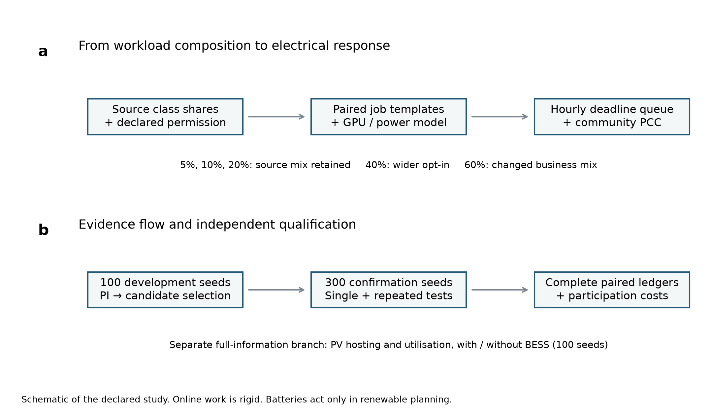
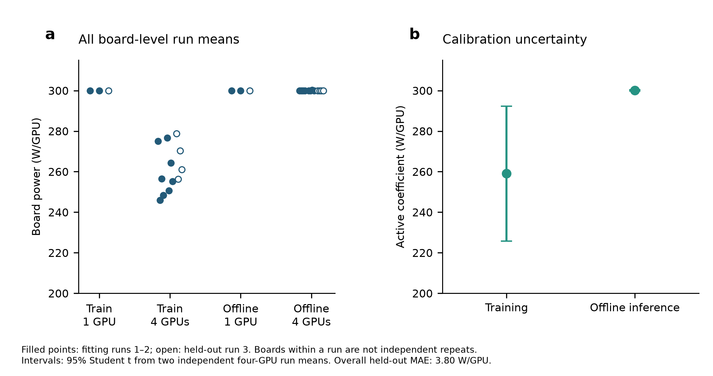
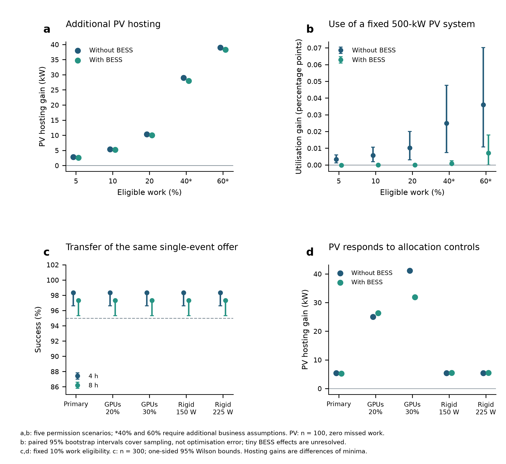
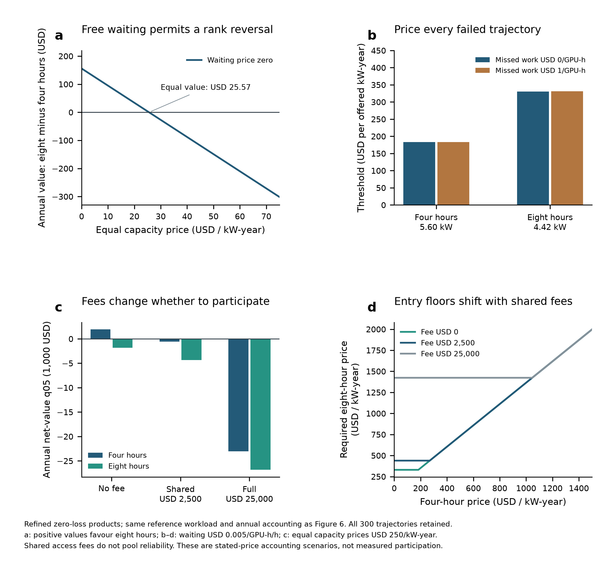
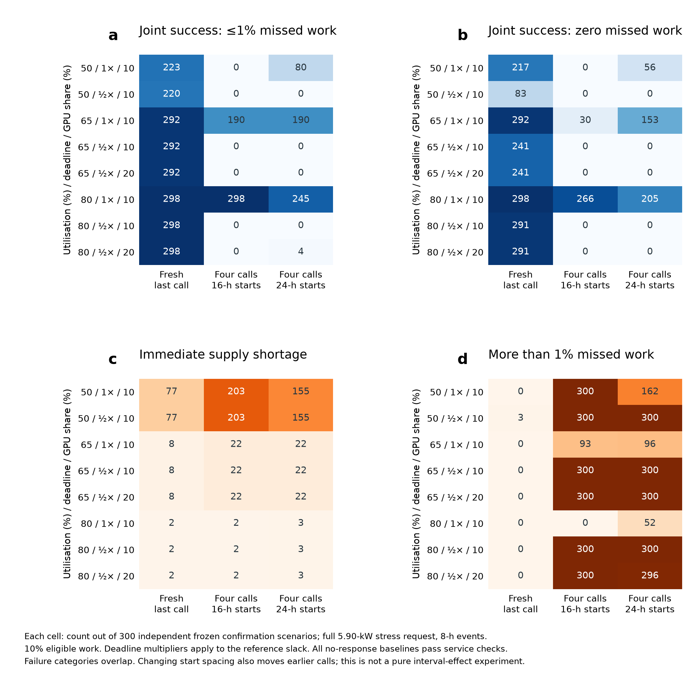
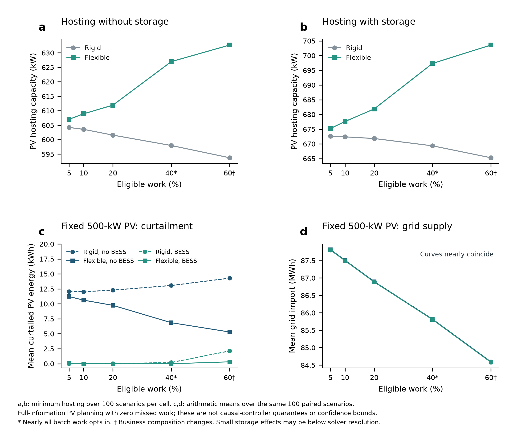
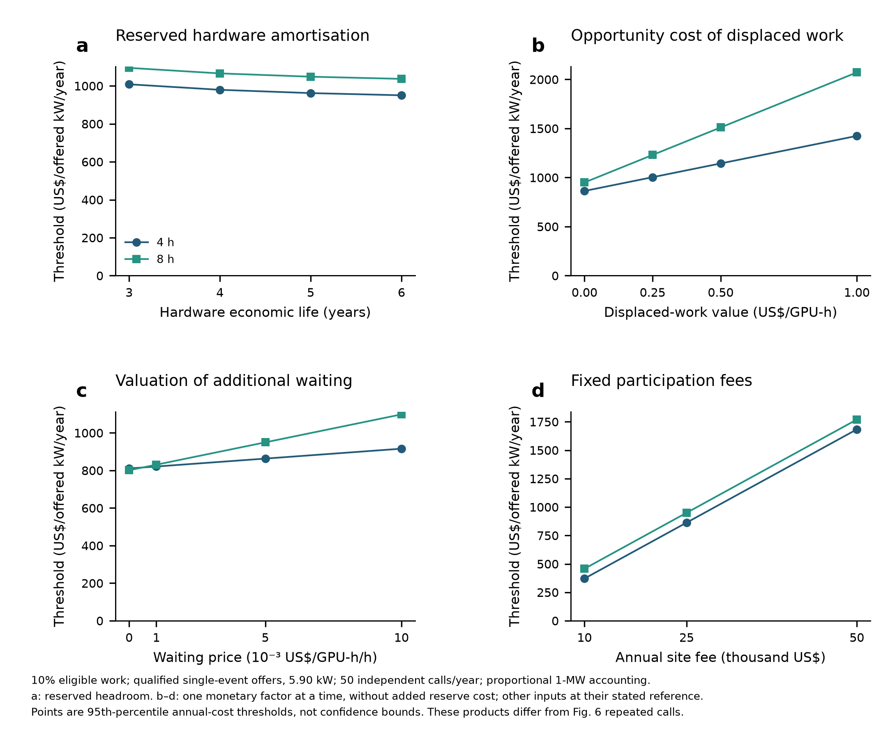
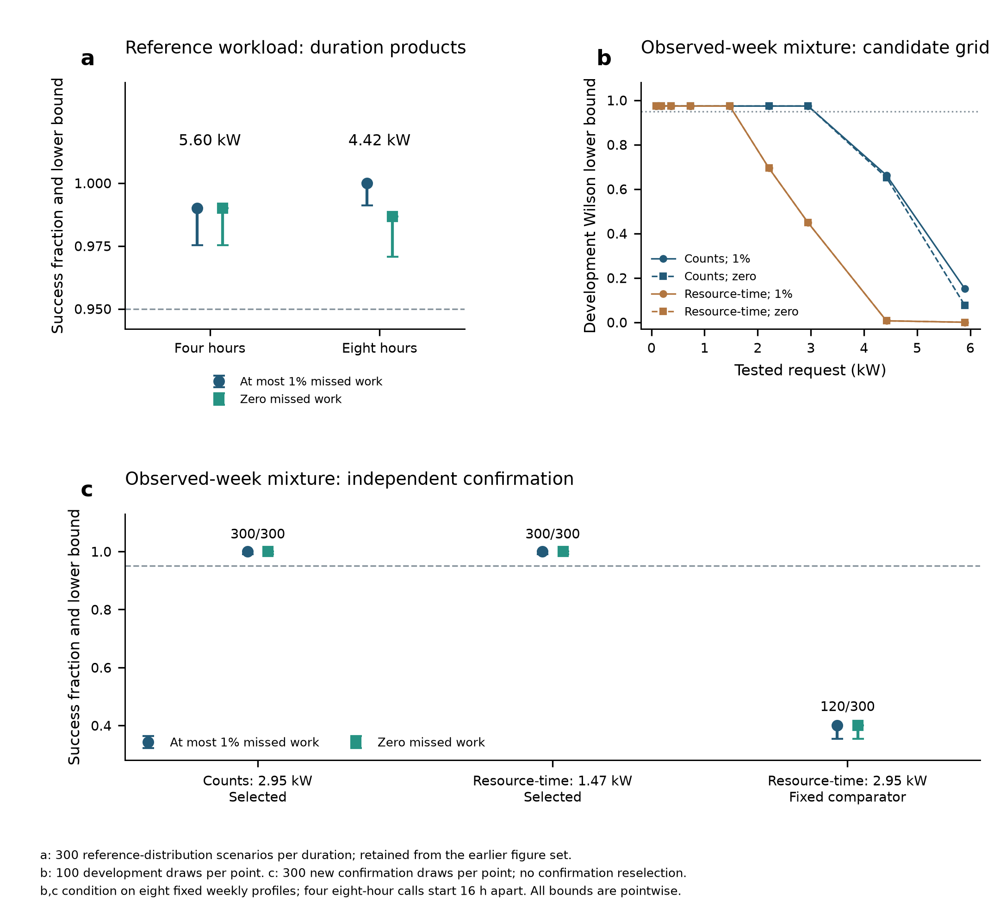
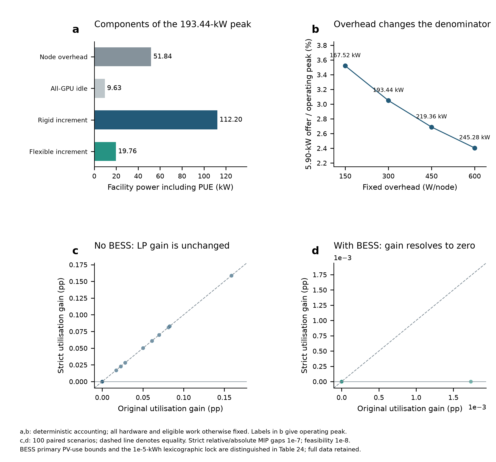

对应英文 v0.27；2026-09-12 改写补充材料说明，保留全部结果、参数、图表编号和 R7 图件。

<!-- S20_001 -->
# Supplementary Information

# 补充材料

<!-- S20_002 -->
## Reliable demand-response commitments from AI data centres under service constraints

## 服务约束下人工智能数据中心的可靠需求响应承诺

<!-- S20_003 -->
[AUTHOR NAMES]

[作者姓名待定]

<!-- S20_004 -->
## Reader guide

## 阅读指南

<!-- S20_005 -->
The supplement explains how we constructed the workloads, tested power-reduction requests and calculated participation costs. An offer is the power reduction promised to the grid, in kW. Work eligibility specifies which computing work may wait; offer qualification tests whether a selected request meets both delivery and service requirements.

For the main findings, read Table 22 for the capacity supported by each workload representation, then Table 20 for the weight and hourly-order comparisons. Table 19 distinguishes insufficient available load, infeasible task schedules and failures of the tested controller. Table 21 prices the separately qualified reference products. Tables 23–24 check facility-power accounting and optimisation precision. Note 7 identifies earlier comparisons retained for reproducibility.

补充材料说明三件事：如何构造计算任务，如何检验向电网承诺的功率削减，以及如何计算参与成本。文中的“报价”指承诺削减多少 kW，不是电价。“工作可参与”指运营者允许哪些任务等待；“报价通过资格检验”则指选定的削减请求同时满足交付和计算服务要求。

核对主要结果时，可以先看表 22：两种工作量表示方式各自支持多大的报价。再看表 20，判断工作量权重和小时顺序如何影响交付。表 19 进一步区分可削减负荷不足、任务安排本身不可行，以及当前控制器没有实现可行调度三种情况。表 21 计算另行通过检验的参考产品所需的补偿。表 23–24 分别核对设施功率和优化求解精度；说明 7 解释为何保留较早的对照结果。

<!-- S20_006 -->
| Question | Methods | Displays |
|---|---|---|
| Which work may wait and how power is calculated | 1–3, 8 | Fig. 1; Supplementary Figs. 2, 10; Tables 1–3, 23 |
| How much a single call can request and whether notice helps | 4–5 | Fig. 2; Table 4 |
| Whether the reference workload supports repeated calls | 6 | Fig. 4c,d; Supplementary Fig. 9a; Table 18 |
| What to offer after changing the workload representation | 6 | Fig. 3a; Supplementary Fig. 9b,c; Table 22 |
| How task size and hourly order affect delivery | 6 | Fig. 3d,e; Fig. 4a,b; Table 20 |
| Whether failure comes from supply, deadlines or control | 6 | Fig. 3c; Fig. 4; Table 19 |
| How utilisation, deadlines and preceding calls affect delivery | 6 | Supplementary Figs. 3, 6; Tables 5, 10–16 |
| How GPU allocation affects solar benefits | 7–8 | Fig. 5; Supplementary Figs. 4, 7, 10; Tables 6, 8, 24 |
| How much extra waiting occurs and what payment is required | 9 | Fig. 6; Supplementary Figs. 5, 8; Tables 7, 9, 12, 17, 21 |

| 问题 | 方法 | 图表 |
|---|---|---|
| 哪些工作允许延期，功率怎样计算 | 1–3、8 | 图 1；补充图 2、10；表 1–3、23 |
| 单次可承诺多少，通知是否改变结果 | 4–5 | 图 2；表 4 |
| 参考工作负载能否完成多次调用 | 6 | 图 4c,d；补充图 9a；表 18 |
| 改变工作量表示后应报多少 | 6 | 图 3a；补充图 9b,c；表 22 |
| 任务规模与小时顺序如何影响结果 | 6 | 图 3d,e；图 4a,b；表 20 |
| 失败来自供给、期限还是控制器 | 6 | 图 3c；图 4；表 19 |
| 利用率、期限与前序调用有什么影响 | 6 | 补充图 3、6；表 5、10–16 |
| GPU 分配改变哪些光伏收益 | 7–8 | 图 5；补充图 4、7、10；表 6、8、24 |
| 多等了多久，需要补偿多少 | 9 | 图 6；补充图 5、8；表 7、9、12、17、21 |

<!-- S20_007 -->
## Supplementary Notes

## 补充说明

<!-- S20_008 -->
### 1. Which computing work may be deferred

### 1. 哪些工作允许推迟，比例怎样确定

<!-- S20_009 -->
We describe workload composition using requested GPU-equivalents multiplied by each execution span's full duration. Development, other and unknown jobs remain in the denominator. Offline inference accounts for 79.45% of records but 21.52% of requested resource-time: counting jobs and measuring their requested computing work answer different questions.

Low priority identifies a potential source of deferrable work, but the production records do not grant permission to delay it or specify production deadlines. The 5%–20% scenarios authorise the same fraction of low-priority training and offline inference, preserving their relative contributions. The 40% scenario includes additional batch work, and the 60% scenario also changes the business mix. These are stated operator-permission assumptions, rather than measured participation rates.

工作组成按“申请的 GPU 当量 × 每段执行记录的完整持续时间”计算。开发、其他和未知类别也计入总工作量。离线推理占记录条数的 79.45%，但只占请求资源时间的 21.52%：前者回答有多少条任务记录，后者回答这些任务申请了多少计算工作。

低优先级任务可能允许等待，但生产记录本身没有给出延期许可或实际完成期限。5%–20% 情景对低优先级训练和离线推理采用相同的许可比例，保持两者的相对组成。40% 情景还需要其他批处理任务同意参与；60% 情景进一步改变业务组成。因此，这些比例是明确设定的运营条件，不是数据中心实际参与需求响应比例的测量值。

<!-- S20_010 -->
### 2. Planning estimates and independently tested offers

### 2. 规划计算得到的数值，为什么还要经过交付检验

<!-- S20_011 -->
We use two different calculations. The aggregate perfect-information (PI) programme searches for the largest request R while enforcing cumulative arrivals and due work within each class. It assumes that future inputs are known. However, these aggregate constraints can credit work completed for an early-arriving, late-deadline job towards another job's earlier deadline. They therefore relax the requirement that every job execute within its own time window.

The retained PI values describe this relaxed planning model. Sorting the values from 100 scenarios and taking the second smallest gives the reported 95%/95% tolerance statistic, with achieved confidence 0.96292.34 The two percentages specify scenario coverage and the confidence required for that coverage statement. That statistical statement concerns the relaxed quantity; it does not establish a feasible schedule for every job.

We test controller offers separately by replaying the complete queue on independent seeds. An offer qualifies when the one-sided 95% Wilson lower bound on joint delivery-and-service success reaches 0.95.35,36 The strict feasibility checks additionally restrict each work group's execution to its own release-to-deadline window.

这里使用两种不同的计算。第一种是完美信息（PI）规划：假定未来输入已知，在每类工作的累计到达量和累计到期量约束下，寻找最大的削减请求 R。但累计约束可能把某个早到达、晚到期作业已完成的工作，计作另一个早到期作业已经完成。因此，这种模型放宽了“每项作业必须在自己的允许时段内执行”的要求。

文中保留的 PI 数值描述的是这个放松后的规划模型。将 100 个情景的结果从小到大排序，取第二小的值，得到文中标为 95%/95% 的容忍统计量；实际达到的置信度为 0.96292。34 前一个百分比指定希望覆盖的情景比例，后一个指定对该覆盖结论的置信要求。这个统计结论针对放松模型的数值，不能单独证明每项作业都存在可行安排。

第二种计算是实际重放控制器和完整任务队列。我们在独立种子上同时检查功率交付与按期完成情况；两者共同成功的概率，其单侧 95% Wilson 下界达到 0.95 时，报价才通过资格检验。35,36 另行开展的严格可行性检查，则明确限制每组工作只能在自身的到达至截止时段内执行。

<!-- S20_012 -->
### 3. Testing all calls and the work left between them

### 3. 多次调用为什么必须连同剩余任务一起检验

<!-- S20_013 -->
A call leaves a queue that affects subsequent calls, so four calls in one evolving queue are evaluated as one sequence. The comparison runs each call separately at the same clock time and asks whether all four separate runs succeed. Both conditions therefore use the same all-four-success outcome. Their difference measures the effect of preceding calls under the specified workload and schedule.

Repeated offers selected during development receive a separate independent test. If no tested candidate qualifies, the result applies to that search grid. It does not exclude every positive request. Every replay retains failed sequences and the work-clearance period after the last call.

前一次调用留下的待处理任务会进入下一次调用。因此，同一队列中的四次调用按一个完整序列评价。对照条件则把每次调用放回相同钟点单独运行，再判断四个单独运行是否全部成功。两组都要求“四次全通过”，它们的差异反映指定工作负载和安排下，前序调用带来的影响。

开发阶段选出的重复响应报价，还要接受独立检验。如果所有已测试候选都未通过，只能说明该搜索网格没有找到合格报价。每次重放都保留失败序列，以及最后一次调用后的任务清空阶段。

<!-- S21_note3 -->
Overlapping recovery windows impose more than one power ceiling. The earlier controller tracked the live window with the smallest achieved peak-relief ratio, which need not have the lowest allowable power. Limiting power for that window could therefore violate another active window. The revised controller retains a ceiling for every observed call.

We compare the two MPC implementations at the same request and use a greedy-controller check to determine whether improvement depends on MPC's proposed actions. Deadline failures are reported separately because tighter power ceilings can also reduce the processing capacity available to urgent jobs. Operational conclusions use independently tested offers, alongside these failure diagnoses.

恢复窗口可能相互重叠，同时约束当前功率。旧控制器只跟踪已实现削峰比例最小的那个窗口，但它不一定具有最低的允许功率上限。满足这个窗口的限制，仍可能违反另一个窗口。修正后的控制器为每次已观察到的调用分别保留功率上限。

我们在相同请求下比较两种 MPC 实现，并加入贪心控制器对照，检查改善是否依赖 MPC 提出的调度动作。更严格的功率上限也可能减少紧急任务可用的处理能力，所以期限失败单独报告。运行能力的结论以独立检验过的报价为依据，失败诊断用于解释原因。

<!-- S23_note3 -->
The utilisation, deadline and allocation tests start from the corrected controller. They distinguish an event-hour shortage of reducible load from insufficient time to complete jobs; both can occur in one scenario. Requiring zero missed work is stricter than allowing 1%, so offers are selected separately under each rule.

At matched final-call times, the tested electrical outcomes were identical with and without preceding calls. Thus, sequence failures cannot all be attributed to impaired recovery. Reordering the observed hourly submission blocks preserves class totals but changes their timing and alignment with calls; neither order is assumed to be universally harder.

利用率、期限和 GPU 分配对照都从修正后的控制器开始。我们分别检查调用时可削减负荷是否足够，以及剩余时间是否足以完成任务；同一情景可能同时遇到这两种困难。零漏期比允许 1% 工作漏期更严格，因此两种标准分别选择报价。

在末次调用钟点完全相同的对照中，有无前序调用的电力结果一致，所以不能把整个序列的失败都解释为恢复能力下降。将观测到的小时提交记录重新排序，保留了类别总工作量，却改变了工作到达时刻及其与调用的对齐。两种顺序谁更困难，需要由对应请求下的结果判断。

<!-- S20_014 -->
### 4. Installed solar capacity and use of a fixed solar system

### 4. 能接入多少光伏，与已有光伏能用多少，是两个问题

<!-- S20_015 -->
PV hosting capacity is the largest rated solar capacity allowed by the model while the GPU facility remains fixed. We optimise each of 100 scenarios and report the smallest capacity for each scheduling mode. The hosting gain is min(flexible) minus min(rigid), rather than the minimum or mean of paired gains.

PV utilisation instead fixes the solar system at 500 kW and divides locally used solar energy by available solar generation. We report the paired change in percentage points and its bootstrap interval. Both analyses require zero missed GPU-hours and use full future information with separately optimised schedules. Their gains therefore describe the planning model, not the causal demand-response controller.

光伏接纳容量回答：GPU 设施规模不变时，最多能安装多大额定容量的光伏。我们分别优化 100 个情景，再对每种调度方式取其中最小的容量。接纳增益为 min(灵活调度) 减 min(刚性调度)，不能换成各情景增益的最小值或平均值。

光伏利用率回答：已有一套 500 kW 光伏时，其可发电量有多大比例在本地被使用。我们报告灵活与刚性调度的配对差异，以百分点表示，并给出自助法区间。两类光伏优化都要求零漏期，且使用完整未来信息分别安排任务；这些收益属于规划计算，不能直接归给需求响应的因果控制器。

<!-- S20_016 -->
### 5. Separating permission to defer work from GPU allocation

### 5. 允许多少工作等待，与给这些工作分配多少 GPU，要分别比较

<!-- S20_017 -->
The primary scenarios increase the GPU allocation alongside the permitted-work share, keeping average utilisation similar in both pools. They consequently change both permission and allocation. To isolate allocation, we keep work eligibility at 10% and assign 10%, 20% or 30% of GPUs to the flexible pool. Total work, installed hardware, release times and deadlines remain matched.

Separate power controls retain the same allocation and set the unmeasured rigid-class active-power proxy to 150 or 225 W per GPU. All controls use the request previously selected for the reference 10% configuration. We assess planning statistics and whether that fixed request still succeeds, without selecting a new optimal controller offer for each control.

主体情景在提高允许延期的工作比例时，也增加灵活池的 GPU 数，使两个工作池的平均利用率相近。因此，五档情景同时改变了延期许可和硬件分配。为单独检查分配的作用，我们固定 10% 工作允许延期，把灵活池 GPU 比例设为 10%、20% 或 30%；总工作量、已安装硬件、到达时刻和期限保持配对。

另一组功率对照保持相同分配，只把未实测的刚性类别活动功率设为每 GPU 150 W 或 225 W。所有对照沿用参考 10% 配置事先选定的请求。我们检查规划统计量，以及原请求在新条件下能否继续交付，并没有为每个对照重新寻找最优报价。

<!-- S20_018 -->
### 6. From operating records to a required participation payment

### 6. 如何把额外等待和用电变化换算成所需补偿

<!-- S20_019 -->
For each simulation we compare demand-response operation with the matched no-response run. The operating ledger records their hourly differences in waiting work, energy use, missed work and remaining backlog. Additional waiting exposure sums positive excess backlog over time. Work delayed during calls is kept distinct from work that misses its deadline, and each hour is counted once within a repeated sequence.

Delivery revenue credits only non-negative reductions capped at the requested amount. Work, energy and offered capacity are scaled in proportion to a 1-MW operating peak, after which the annual fixed site fee is added once. Dividing that fee by a small offered capacity can produce a high payment per offered kW. The participation threshold uses the 95th percentile of annual net cost as a stated risk criterion. A low calculated cost cannot make an unqualified request deliverable.

每次模拟都将需求响应运行与相同输入下的无响应运行比较。文中的“运行账本”就是逐小时记录两者在待处理工作、用电、漏期工作和期末积压上的差异。“额外等待暴露”是把正的额外积压量随时间累加，用来表示多少计算工作多等了多久。调用时推迟的工作与最终漏期的工作分别记录；重复序列中的每个小时只计一次。

交付收入只计算非负削减量，且最多按请求容量计费。工作、电量和报价按运行峰值比例换算到 1 MW 后，年度固定场站费再计入一次。若报价容量较小，分摊到每个报价 kW 的固定费就可能较高。参与门槛采用年度净成本的第 95 百分位，代表本研究选定的成本风险要求；成本低也不能使未通过交付检验的请求变得可交付。

<!-- S23_note6 -->
In the reference single-event case, the fixed site fee accounts for about 95% of the participation threshold. To separate that assumption from operating effects, we attribute costs at the same rank in the total-net-cost distribution. The components then add back to the reported total.

Sharing an access fee changes the comparison with not participating. A fee common to two participating products cancels when those products are compared with each other. We therefore show operating costs separately and compare qualified products under explicitly stated duration-specific prices and zero, low or shared fees.

参考单次事件中，固定场站费约占参与门槛的 95%。为看清哪些费用来自运行、哪些来自接入假设，我们按年度总净成本的同一个排序位置分解各成本项，使各项相加能够还原总数。

分摊接入费会改变“参与还是不参与”的判断。如果四小时和八小时产品承担相同固定费，这笔费用在两种参与产品相互比较时会抵消。因此，我们分别展示运行成本，并在明确的分时长价格及零、低或共享费用条件下比较已经通过资格检验的服务。

<!-- S25_note7_heading -->
### 7. How the retained earlier comparisons relate to the final results

### 7. 较早的对照结果与当前结论如何对应

<!-- S25_note7_text -->
Tables 14 and 17 retain requests selected on the earlier coarse grid and their associated costs. Tables 18 and 21 use a finer reference grid with new development and confirmation seeds. At 4.423682 kW, the earlier zero-miss development sample had 98/100 successes and the later sample had 99/100. These counts fall on opposite sides of the fixed Wilson selection threshold. The earlier selection of 2.95 instead of 4.42 kW therefore does not establish a stable physical penalty from the stricter service rule.

In Table 18, both service rules select 5.603331 kW for four hours and 4.423682 kW for eight hours. Their capacity ratio is 19/15; the earlier coarse-grid ratio was 1.5. The eight-hour selection is the highest tested candidate, so the continuous maximum remains undetermined.

表 14、17 保留较早粗网格选出的请求及其成本；表 18、21 使用更细的参考网格，并换用新的开发和确认种子。在 4.423682 kW 下，较早零漏期开发样本成功 98/100，较晚样本成功 99/100，恰好位于固定 Wilson 选值门槛的两侧。因此，早期从 4.42 kW 改选为 2.95 kW，不能证明严格服务规则稳定地造成了这部分物理容量损失。

表 18 中，两种服务规则都选中四小时 5.603331 kW 和八小时 4.423682 kW，容量比为 19/15；早期粗网格之比是 1.5。八小时选中的是最高已测试候选，连续最大容量仍未确定。

<!-- S25_note7_scores -->
The 986000-series test uses chronological submission counts. At 4.423682 kW it succeeds in 63/80 runs under either service rule, with all 17 failures encountering immediate shortage. At 2.949122 kW both rules give 80/80 successes (Supplementary Fig. 3d; Table 16). Thus, changing the service score at a fixed request does not explain the difference between those requests.

The 990000-series test in Table 20 instead pairs workload weights and hourly orders. Its results are kept separate from the earlier series and do not select a new workload-specific offer. Figures 2 and 5 and Tables 4 and 8 retain the aggregate PI relaxation described in Note 2. Table 19 uses execution variables restricted to each work group's own time window. This distinction leaves the independently replayed causal queues and the solar optimiser's separate execution variables unchanged.

986000 系列使用原始小时顺序下的作业提交数。4.423682 kW 请求按两种服务规则都成功 63/80，全部 17 次失败都有即时供给不足；2.949122 kW 请求则都成功 80/80（补充图 3d；表 16）。这说明，固定请求后改用另一种服务评分，不能解释两个请求之间的差异。

表 20 的 990000 系列另行配对比较工作量权重与小时顺序，结果不与早期系列合并，也不用于重新选定适用于新工作负载的报价。图 2、5 和表 4、8 保留说明 2 中的累计 PI 放松模型；表 19 则限制每组工作在自己的时间窗内执行。区分这两种 PI 计算，并不改变独立重放的因果队列，也不改变光伏优化器单独设置的执行变量。

<!-- S20_020 -->
## Supplementary Methods

## 补充方法

<!-- S20_021 -->
### 1. Measuring workload composition and assigning deferral permission

### 1. 统计工作组成并设置允许延期的比例

<!-- S20_022 -->
The local jobs_summary.parquet contained 40,522,321 execution-span records. Streaming batches of one million rows were aggregated by workload class and priority, using requested GPU-equivalents times the original duration. The total was 254,980,926.33 requested GPU-h. The audit checked the stored raw work against this product and retained all classes. The source SHA-256 was `95c91a8035197e15f29e9c1d15a9147d07b2a6959b2bb08322cb9f033b029124`. The [production study](https://www.usenix.org/system/files/osdi26-li-suyi.pdf) and [official schema](https://github.com/alibaba/clusterdata/blob/master/cluster-trace-gpu-v2026/docs/schema.md) define the infrastructure scope and execution-span fields. The reported infrastructure excludes dedicated hyperscale foundation-model pretraining clusters.

本地 jobs_summary.parquet 含 40,522,321 条执行区段记录。按每批 100 万行流式读取，以申请 GPU 等效数量乘原始持续时间，按工作类别和优先级聚合，总计 254,980,926.33 申请 GPU 小时。审计核对存储的原始工作量与该乘积一致，并保留所有类别。源 SHA-256 为 `95c91a8035197e15f29e9c1d15a9147d07b2a6959b2bb08322cb9f033b029124`。[生产研究](https://www.usenix.org/system/files/osdi26-li-suyi.pdf)和[官方字段说明](https://github.com/alibaba/clusterdata/blob/master/cluster-trace-gpu-v2026/docs/schema.md)界定基础设施范围及执行区段字段。该基础设施不包括专用的超大规模基础模型预训练集群。

<!-- S20_023 -->
We allocate deferral permission in stages. Let s_c be class c's share of all requested resource-time, and l_c its low-priority batch share with the same denominator. Low-priority training and offline inference together contribute L = Σl_c = 0.2202814. For f ≤ L, the permitted share in class c is l_c f/L.

Above L, permission extends proportionally to the remaining training and offline-inference work. With B = s_training + s_offline = 0.4094199 and L < f ≤ B, the permitted share is l_c + (s_c − l_c)(f − L)/(B − L). The 60% scenario additionally reallocates f − B = 0.1905801 from online to offline inference and permits all training and offline inference to wait. Other classes remain in the denominator and cannot be deferred. Simulations use the full-precision shares in case_definitions.json rather than the rounded entries in Table 2.

延期许可分阶段分配。s_c 表示类别 c 占全部请求资源时间的比例，l_c 表示其中低优先级批处理工作占全部请求资源时间的比例。低优先级训练和离线推理合计为 L = Σl_c = 0.2202814。当允许延期的总比例 f ≤ L 时，每个类别获准延期的比例为 l_c f/L。

当 f 超过 L 后，再按比例纳入其余训练和离线推理工作。令这两类的总比例 B = s_training + s_offline = 0.4094199；当 L < f ≤ B 时，类别 c 获准延期的比例为 l_c + (s_c − l_c)(f − L)/(B − L)。60% 情景还将 f − B = 0.1905801 的工作从在线推理改为离线推理，并允许全部训练和离线推理等待。其他类别始终计入总工作量，且不允许延期。模拟使用 case_definitions.json 中的完整精度，表 2 的舍入值仅供阅读。

<!-- S20_024 -->
### 2. Matching task inputs and checking operation without demand response

### 2. 让对照使用相同任务，并先检查无响应运行是否正常

<!-- S20_025 -->
The five configurations share task timing so that changes in eligibility do not introduce different arrival or deadline samples. Development uses seeds 930000–930099 and confirmation uses 960000–960299. Each seed creates a common template at the 60% setting; scaling class-specific GPU-hours produces the other configurations without changing record counts, release times or deadlines. The template samples the existing low-priority training and offline-inference job shapes, including for the explicitly assumed 40% and 60% cases.

Work arrives at 374.4 GPU-hours per hour for 168 h, followed by 48 h without new arrivals. The flexible pool contains round(576f) GPUs; rigid-pool utilisation is 374.4(1 − f)/(576 − round(576f)). Before subsequent analysis, the no-response run must satisfy both task-service requirements and the power limit at the point of common coupling (PCC).

五档配置共用任务时序，避免改变延期比例时又换了一批到达时刻和期限。开发使用种子 930000–930099，独立确认使用 960000–960299。每个种子先生成 60% 设置下的共同模板，再缩放各类别的 GPU-h 工作量得到其他配置；记录条数、到达时刻和期限完全相同。模板抽取已有低优先级训练和离线推理的作业形状，明确作为业务假设的 40% 和 60% 情景也沿用这些形状。

前 168 h 每小时到达 374.4 GPU-h 工作，之后 48 h 不再有新任务。灵活池 GPU 数为 round(576f)，刚性池利用率为 374.4(1 − f)/(576 − round(576f))。进入后续分析前，先检查无响应运行能否按要求完成任务，并满足公共耦合点（PCC，即与上级电网连接处）的功率限制。

<!-- S20_026 -->
Training deadlines were 2–6 times runtime, clipped to 6–48 h; offline-inference deadlines were 1.5–4 times runtime, clipped to 2–24 h. These are synthetic service rules. Single events began at one of 24 hours between 63 and 140, sampled before testing; exact starts are stored with each scenario. Community demand used a 75:25 residential/office mixed-3A profile, scaled to an 800-kW peak. A common 1,100-kW import rating and no-export rule applied to all cases. Initial development baselines under a 1,000-kW rating exceeded it in three cases at seed 930096; the common rating was raised before PI optimisation or offer selection, and the initial gate results were preserved.

训练截止时间为运行时长的 2–6 倍，限制在 6–48 小时；离线推理为 1.5–4 倍，限制在 2–24 小时。这些均为合成服务规则。单次事件在第 63 至 140 小时之间的 24 个候选时刻中抽样，测试前固定，各情景保存精确起点。社区需求采用住宅/办公 75:25 的混合 3A 曲线，缩放到 800 kW 峰值。所有情景采用共同的 1,100 kW 进口限制并禁止反送。在初始 1,000 kW 限制下，开发种子 930096 的三项配置无响应基准超限，因此在 PI 优化或选值前提高共同容量，并保存了初始门槛结果。

<!-- S20_027 -->
### 3. Measuring GPU power and converting task execution into facility demand

### 3. 测量 GPU 功率，并把任务执行量换算为设施用电

<!-- S20_028 -->
Training and offline-inference loads each run on one GPU and on four GPUs, with three repeated runs per condition. After a 5-s warm-up, read-only nvidia-smi telemetry samples board power and utilisation once per second for 20 s. Runs 1–2 fit the power coefficients; run 3 is withheld to test prediction error.

Within a four-GPU run, we first average each board's time series and then average the four board means. This run mean, rather than each board or each telemetry sample, is the independent observation. Student-t 95% intervals use the two calibration-run means for each workload class. Prediction errors use only the held-out run (Supplementary Table 1).

训练和离线推理负载分别在单 GPU、四 GPU 条件下运行，每种条件重复三次。预热 5 s 后，使用只读 nvidia-smi 遥测，每秒采样一次板卡功率和利用率，持续 20 s。运行 1–2 用于拟合功率系数，运行 3 保留到拟合完成后检验预测误差。

对于一次四 GPU 运行，先分别计算每块板卡的时间平均功率，再对四块板卡取平均。统计中的独立观测是这个运行均值，同次运行的板卡和每秒采样点不能当作额外独立重复。每类负载的 95% Student-t 区间使用两次拟合运行的均值；预测误差只用留出运行计算（补充表 1）。

<!-- S20_029 -->
Facility power retained the execution class,

设施功率计算保留作业执行类别：

<!-- S20_030 -->
$$
\begin{aligned}
P^{\mathrm{DC}}_t=\frac{\mathrm{PUE}}{1000}\Big[&N_{\mathrm{node}}p_{\mathrm{node}}+N_{\mathrm{GPU}}p_{\mathrm{idle}}\\
&+N_{\mathrm{rigid}}u_{\mathrm{rigid}}(\bar p_{\mathrm{rigid}}-p_{\mathrm{idle}})
+\sum_c(p_c-p_{\mathrm{idle}})\frac{X_{c,t}}{\Delta t}\Big].
\end{aligned}
$$

$$
\begin{aligned}
P^{\mathrm{DC}}_t=\frac{\mathrm{PUE}}{1000}\Big[&N_{\mathrm{node}}p_{\mathrm{node}}+N_{\mathrm{GPU}}p_{\mathrm{idle}}\\
&+N_{\mathrm{rigid}}u_{\mathrm{rigid}}(\bar p_{\mathrm{rigid}}-p_{\mathrm{idle}})
+\sum_c(p_c-p_{\mathrm{idle}})\frac{X_{c,t}}{\Delta t}\Big].
\end{aligned}
$$

<!-- S20_031 -->
where power p is in watts, X is executed flexible GPU-hours and Δt = 1 h. Node overhead applies to all 144 nodes and idle power to all 576 GPUs. The rigid pool contains 518 GPUs at utilisation 0.65050193; its class-weighted active power is 291.42199 W/GPU. The reference flexible mix has 297.90848 W/GPU active power. At PUE 1.2 and idle power 13.935625 W/GPU, the operating peak is 51.840000 + 9.632304 + 112.202165 + 19.764511 = 193.438980 kW: node overhead, all-GPU idle draw, rigid increment and full flexible-pool reference increment, respectively. Thus the compact form $P^{\mathrm{DC}}_t=P_{\mathrm{fixed}}+\sum_c e_cX_{c,t}$ uses $P_{\mathrm{fixed}}=173.674469$ kW and $e_c=\mathrm{PUE}(p_c-p_{\mathrm{idle}})/(1000\Delta t)$.

式中功率 p 的单位为 W，X 为已执行的灵活 GPU-h，Δt = 1 h。节点开销计入全部 144 个节点，空闲功率计入全部 576 块 GPU。刚性池包含 518 卡，利用率为 0.65050193，按工作类别加权的活动功率为 291.42199 W/GPU。参考灵活工作组合的活动功率为 297.90848 W/GPU。PUE 为 1.2、空闲功率为 13.935625 W/GPU 时，运行峰值为 51.840000 + 9.632304 + 112.202165 + 19.764511 = 193.438980 kW，依次对应节点开销、全部 GPU 空闲功率、刚性增量和满灵活池参考增量。因此，简写 $P^{\mathrm{DC}}_t=P_{\mathrm{fixed}}+\sum_c e_cX_{c,t}$ 中的 $P_{\mathrm{fixed}}$ 为 173.674469 kW，$e_c=\mathrm{PUE}(p_c-p_{\mathrm{idle}})/(1000\Delta t)$。

<!-- S20_032 -->
Jobs were stored by class and remaining deadline at one-hour resolution, up to 48 h. The labels {0, 1, 2, 3, 6, 12, 24, 48} h grouped this state for reporting and observation; they were not the queue's internal time resolution. Execution followed earliest deadline first, could not precede release and could not exceed cumulative arrivals. Work remaining when its deadline expired was counted as missed. Controlled and no-response queues received identical arrivals.

作业按类别和剩余截止时间存储，内部时间分辨率为 1 h，最长为 48 h。{0、1、2、3、6、12、24、48} h 标签用于对状态进行报告和观测汇总，并不是队列内部的时间分辨率。执行按最早截止时间优先安排，既不能早于作业到达，也不能超过累计到达工作量。截止时仍未完成的工作记为逾期。受控队列和无响应队列接收完全相同的到达工作。

<!-- S20_033 -->
Idle board power is 13.935625 W/GPU, and node overhead is assumed to be 300 W. Online, development, other and unknown work use an engineering active-power proxy of 300.022174 W/GPU, with separate 150-W and 225-W controls. Rigid demand uses the class-weighted mean. Online response latency is not simulated, so the batch deadline check does not test online-service latency requirements.

The controller retains the 63-dimensional firm_v5 observation interface. Its six-hour forecast and queue features expose only causally available information. In saved outputs, compute_debt_kwh describes the whole controlled queue, whereas excess_queue_energy_kwh subtracts the paired no-response queue. Only the latter directly measures extra queued work relative to that baseline.

每块 GPU 的空闲板卡功率为 13.935625 W，节点开销假定为 300 W。在线、开发、其他和未知工作采用每活动 GPU 300.022174 W 的工程功率代理，另设 150 W 和 225 W 对照。刚性需求按类别加权平均计算。模型没有单独模拟在线请求的响应延迟，因此批处理任务按期完成，并不能证明在线服务的延迟要求也已得到实测验证。

控制器沿用 63 维 firm_v5 观测接口，六小时预测和队列特征只包含当时能够获得的信息。保存字段 compute_debt_kwh 描述整个受控队列；excess_queue_energy_kwh 则减去配对的无响应队列，明确表示相对于基线多出的排队工作。

<!-- S20_034 -->
### 4. Deciding whether a response succeeds and whether an offer qualifies

### 4. 怎样判定一次响应成功，以及一个报价是否通过检验

<!-- S20_035 -->
A simulation succeeds only when it satisfies all six electrical-delivery and computing-service criteria below. Capacity, event duration, advance notice and controller are fixed before testing. Delivered power is the non-negative PCC reduction relative to the matched no-response run, capped at the request. Both average delivery and delivery in every event hour must pass. Peak relief is evaluated across the event and its following 24-h recovery window.

容量、时长、提前通知和控制器在测试前固定。一个模拟情景必须同时满足下列六项电力交付和计算服务要求，才记为成功。交付功率按相对于无响应基线的非负 PCC 削减量计算，且最多计到请求容量。平均交付和每个事件小时的交付都必须达标；削峰效果还要覆盖事件及其后 24 h 恢复窗口。

<!-- S20_036 -->
| Criterion | Headline threshold | Operational interpretation |
|---|---:|---|
| Mean delivery | ≥0.95 | mean capped baseline-relative reduction across all event intervals divided by R |
| Minimum interval delivery | ≥0.95 | every event hour delivers at least 0.95R |
| Deadline-miss fraction | ≤0.01 | expired eligible GPU-hour work divided by total arriving eligible work |
| Rebound ratio | ≤0.25 | largest post-event excess PCC load divided by peak event reduction |
| Event-and-recovery peak relief | ≥0.50 | baseline peak minus controlled peak over the event plus 24-h recovery window, divided by R |
| Terminal-backlog fraction | ≤0.02 | positive controlled-minus-baseline backlog at the end of the 48-h tail divided by total eligible arrivals |

| 标准 | 主要阈值 | 运行含义 |
|---|---:|---|
| 平均交付 | ≥0.95 | 所有事件时段内、相对基线且经封顶的削减量均值除以 R |
| 最小时段交付 | ≥0.95 | 每个事件小时的交付量均至少为 0.95R |
| 截止时间未完成比例 | ≤0.01 | 到期未完成的 GPU-hour 工作量除以提供的工作量 |
| 反弹比 | ≤0.25 | 事件后最大超额 PCC 负荷除以事件峰值削减量 |
| 事件及恢复窗口削峰 | ≥0.50 | 在事件及其后 24 h 恢复窗口内，基线峰值减受控峰值，再除以 R |
| 期末积压比例 | ≤0.02 | 48 h 尾段结束时受控减基线积压的正值除以总到达工作量 |

漏期与期末积压比例的分母均为全部到达的可参与工作 GPU 小时量。

<!-- S20_037 -->
We record every criterion that fails in a scenario. For example, low average delivery can occur together with an inadequate event hour, and either can accompany excessive rebound or insufficient window-wide peak relief. These categories can overlap. Failure to identify a recovery time within the window is retained as an additional diagnostic, not a seventh qualification criterion.

每个情景都记录全部未满足的条件。平均交付不足可能与某个小时交付不足同时发生，也可能伴随恢复反弹过大或整个窗口削峰不足，因此失败类别可以重叠。若无法在窗口内确定恢复完成时间，则另作诊断记录，不增加为第七项资格判据。

<!-- S023_zero_methods -->
The utilisation, deadline and allocation tests also require zero missed eligible work, allowing only a numerical tolerance of 10−7 GPU-h. Both response and no-response runs must meet this rule; electrical criteria and the terminal-backlog threshold are unchanged. A no-response baseline failure counts as failure and is retained. We also report a 0.1% missed-work threshold without using it for offer selection. Rescoring previously selected offers under the zero-miss rule is labelled retrospective because it adds no new qualification sample.

利用率、期限和分配对照还采用零漏期要求：全部可参与工作都必须按期完成，仅允许 10−7 GPU-h 的数值容差。响应运行和无响应运行都必须满足该要求，电力判据和期末积压阈值保持不变。无响应基线不合格也计为失败，不能剔除。0.1% 漏期阈值仅作为补充结果，不用于选报价。对既有报价按零漏期规则重新评分，只属于回顾性核对，没有增加独立检验样本。

<!-- S20_038 -->
For the relaxed PI calculation, binomial inversion at q = 0.95 and confidence 0.95 selects the second-smallest of 100 optima. Controller tests use a one-sided 95% Wilson lower bound with z = 1.6448536. The same lower-bound threshold, 0.95, applies during development and confirmation. Each condition has 100 development or 300 confirmation seeds; extra notice settings and calls reuse those seeds rather than add independent observations.

All 20 notice comparisons have identical paired success flags, so we report that agreement directly. Repeated-minus-separate-call differences use 10,000 paired bootstrap resamples of 300 seeds. Renewable mean differences use 10,000 paired resamples of 100 seeds. Each interval or qualification statement applies to its specified comparison or offer, rather than simultaneously to every reported condition.

放松 PI 计算采用二项分布反演：在 q = 0.95、置信度 0.95 时，取 100 个最优值中第二小的值。控制器检验采用单侧 95% Wilson 下界，z = 1.6448536；开发和确认都要求该下界至少达到 0.95。每种条件包含 100 个开发种子或 300 个确认种子。增加通知设置或调用次数，仍然使用这些种子，不会增加独立观测数。

20 项通知比较的配对成功标记逐一相同，直接报告这一结果。重复调用与相同时刻单独调用的差异，使用 300 个种子进行 10,000 次配对自助重采样；可再生能源的平均差异，使用 100 个种子进行 10,000 次配对重采样。每个区间或资格结论只对应指定比较或报价，不表示所有条件同时获得相同的置信保证。

<!-- S20_039 -->
### 5. Controller information, recovery limits and single-offer selection

### 5. 控制器使用什么信息，以及怎样选择单次报价

<!-- S20_040 -->
The robust model predictive controller (MPC) plans over six hours using its existing historical-arrival uncertainty range, objective weights and information on released jobs. Development identified a mismatch between its recovery cap and the scoring rule. The old cap allowed power to exceed baseline by 0.25R, but scoring divided rebound by the actual peak reduction, which could be only 0.95R.

The corrected cap uses 0.25 × 0.95R and retains the event-delivery and full-window peak-relief limits. If converting an action to float32 would cross an electrical limit, the action is rounded towards zero. Regression checks cover the rebound denominator, rounding at event boundaries and unchanged actions outside event and recovery windows. This correction creates a new controller version, evaluated independently of the original frozen results.

鲁棒模型预测控制器（MPC）向前规划六小时，使用既有的历史到达不确定性范围、目标权重和已到达任务信息。开发阶段发现，恢复功率上限与评分规则的分母不一致：旧上限允许功率高于基线 0.25R，但评分用实际最大削减量作分母，而实际削减量可能只有 0.95R。

修正后的上限采用 0.25 × 0.95R，并保留事件交付和整个窗口削峰限制。如果把动作转成 float32 会使功率越过限制，就向零舍入。回归检查覆盖反弹分母、事件边界舍入，以及事件和恢复窗口之外的动作是否保持不变。修正后的控制器单独检验，原控制器的锁定结果仍按原版本保留。

<!-- S20_041 -->
For each duration, development tests requests at 50%, 75%, 90% and 100% of the development relaxed-PI statistic. The largest candidate meeting the Wilson rule is fixed before confirmation. After the final controller correction, 300 previously unseen seeds test that fixed offer. Earlier controller outputs remain diagnostic records. Confirmation results are never used to replace a failed offer with a smaller one.

每种时长在开发集检验放松 PI 统计量的 50%、75%、90% 和 100% 四档请求。满足 Wilson 规则的最大候选，在确认前固定下来。控制器完成最后修正后，用此前未查看的 300 个种子检验这个报价。更早的控制器结果保留作诊断；若确认失败，也不能再用同一确认集挑一个较小报价替代。

<!-- S20_042 -->
### 6. Repeated-call tests, workload comparisons and failure diagnosis

### 6. 重复调用、工作量表示方式与失败原因的检验

<!-- S20_043 -->
#### 6.1 Call timing and the comparison without preceding calls

H denotes event duration and G the gap from one event's end to the next event's start. In the original-controller study, four calls started at 63 + j(H + G), j = 0, 1, 2, 3, with (H,G) = (4,8) or (8,12) h. Development tested 25%, 50%, 75% and 100% of the selected single-event offer, without assuming monotonic success as the request increased.

Confirmation seeds 960000–960299 tested the original single-event offer repeated four times and four separate calls at the same clock times. Each comparison used the same full-capacity no-response schedule. The protocol also provided for independent confirmation of a repeated offer selected during development, but no candidate passed that development screen. This study evaluates two specified programmes; it does not establish performance for every recovery gap or continuous operation throughout a year.

#### 6.1 调用怎样安排，如何构造没有前序调用的对照

H 表示一次调用持续多久，G 表示这次调用结束到下次开始之间的空档。原控制器研究中，四次调用从 63 + j(H + G) 时开始，j = 0、1、2、3；(H,G) 取 (4,8) 或 (8,12) h。开发阶段检验已选单次报价的 25%、50%、75% 和 100%，不预先假定请求越小就一定更容易成功。

确认种子 960000–960299 检验两组运行：把原单次报价连续调用四次，以及在相同钟点分别单独调用。每项比较都使用相同的全容量无响应调度。协议还规定，如果开发集选出了重复响应报价，就另作独立确认；这批开发检验没有候选通过。该研究只覆盖两种指定安排，不能据此保证所有恢复空档或全年连续运行。

<!-- S21_recovery_methods -->
The recovery-controller comparison uses (H,G) = (4,8), (8,8), (8,12) and (8,16) h, again starting at hour 63. Each call has a 24-h recovery window. When a later call ends, the preceding call's recovery constraint remains active for max(0, 24 − H − G) h. This overlap is zero at H = 8 h and G = 16 h.

Changing G also shifts later calls to different clock times. These comparisons therefore change both spacing and alignment with the workload. The final recovery ends by hour 167, before arrivals stop at hour 168. Every replay continues through all 216 h, including the period used to clear remaining work.

恢复控制器对照使用 (H,G) = (4,8)、(8,8)、(8,12) 和 (8,16) h，首次调用仍从第 63 小时开始。每次调用之后有 24 h 恢复窗口。后一次调用结束时，前一次调用的恢复约束仍可能继续生效 max(0, 24 − H − G) h；H = 8、G = 16 h 时，这段重叠为零。

改变 G 也会把后续调用移到不同钟点，所以这些对照同时改变了间隔和工作负载对齐。最终恢复最晚在第 167 小时结束，工作到达在第 168 小时停止。所有模拟都继续运行到 216 h，保留之后清理剩余任务的阶段。

<!-- S21_recovery_guard -->
#### 6.2 Enforcing every recovery window that is still active

For call j, B_j(t) is the largest baseline PCC power observed so far within its event-and-recovery window, and R_j is the request. Before applying a proposed control action, the power-limit layer checks all active ceilings B_j(t) − 0.5R_j and uses the lowest. It also enforces event delivery and the recovery rebound ceiling baseline(t) + 0.25 × 0.95R_j.

Let F(t) be PCC demand excluding flexible execution, and A(t) the power added when the flexible pool receives its full allocation. The extra allocation cap is clip[(min_j(B_j(t) − 0.5R_j) − F(t))/A(t), 0, 1]. Here clip limits the calculated fraction to the allowed range. Actions are rounded towards the feasible side. The controller obtains remaining call duration from the current observation and removes a call only after its 24-h recovery ends.

The running baseline peak may still be below its eventual value, so this rule can be conservative. If the required ceiling is below F(t), stopping all flexible work cannot meet it. Conversely, satisfying a power ceiling does not establish that urgent jobs will meet their deadlines.

#### 6.2 同时执行所有尚未结束的恢复约束

对调用 j，B_j(t) 是其事件和恢复窗口内截至当前已观测到的最大基线 PCC 功率，R_j 是削减请求。控制器先提出动作，外层功率限制模块再检查所有尚在生效的上限 B_j(t) − 0.5R_j，并采用其中最低的值。同时保留事件交付限制，以及恢复期间 baseline(t) + 0.25 × 0.95R_j 的反弹上限。

令 F(t) 为不执行灵活工作时仍需承担的 PCC 功率，A(t) 为灵活池获得全部分配时增加的功率。新增的分配比例上限为 clip[(min_j(B_j(t) − 0.5R_j) − F(t))/A(t), 0, 1]，其中 clip 把结果限制在允许的比例范围内。动作向满足约束的一侧舍入。控制器从当前观测读取调用剩余时长，直到该调用的 24 h 恢复窗口结束后才删除记录。

当前已观测到的基线峰值可能低于整个窗口最终的峰值，因此这一规则可能偏保守。如果要求的上限已低于 F(t)，即使停止全部灵活工作也无法满足。反过来，满足功率上限也不能单独证明紧急任务能够按期完成。

<!-- S21_recovery_design -->
The extension reused 100 previously examined development seeds (930000–930099); four of these also informed an exploratory pilot. The frozen protocol then enumerated 10,100 development replays: five workload configurations, two MPC versions, four programmes, a full-only four-hour candidate and 50%, 75% and 100% eight-hour candidates, plus 100 full-request greedy diagnostics at 10% eligibility and (8,12). The largest candidate with one-sided 95% Wilson lower bound at least 0.95 was selected. The frozen selection scheduled 13,800 replays on 300 new confirmation seeds (970000–970299). For each configuration, method and programme, confirmation tested the selected offer or the full-request comparator if none was selected. Full-request comparisons for both MPC versions at (8,12) and the greedy diagnostic were additionally retained. No confirmation result was pooled with the earlier 960000–960299 set or used for reselection. Every full series, including all failures, was analysed.

扩展复用了 100 个已检查过的开发种子（930000–930099），其中四个还用于探索性试跑。随后冻结的协议列出了 10,100 次开发回放：五档工作配置、两种 MPC、四种调用安排，四小时仅检验全额候选，八小时检验 50%、75%、100% 候选，另加 10% 工作延期许可、(8,12) 安排下的 100 次全额贪心诊断。选择单侧 95% Wilson 下界至少为 0.95 的最大候选。冻结选值安排了 300 个新确认种子（970000–970299）上的 13,800 次回放。每个配置、方法和安排确认所选承诺；若未选出候选则确认全额比较方案。另外保留两种 MPC 在 (8,12) 下的全额比较和贪心诊断。确认结果不与此前 960000–960299 集合合并，也不用于重新选值。包括全部失败在内的每条完整序列均纳入分析。

<!-- S21_recovery_stats -->
The primary intervention contrast is the full-request original versus per-call-recovery MPC at 10% eligibility and (8,12). Paired success differences use 10,000 resamples of complete seeds; exact McNemar tests receive Holm correction across all controller contrasts reported in the source table. Non-exclusive failure families and paired rescue/loss counts are also retained. Qualification is pointwise for each frozen candidate. A selected candidate that fails confirmation would remain failed, with no test-set replacement. The illustrated trace is the lowest development seed for which the full-request original fails and the revised MPC passes; this transparent illustrative selection is separate from inference on all confirmation seeds.

主要干预比较为 10% 工作延期许可、(8,12) 安排下的全额原 MPC 与逐次恢复约束 MPC。配对成功率差异采用 10,000 次完整种子重采样；精确 McNemar 检验在源表报告的全部控制器比较中进行 Holm 校正。同时保留可以重叠的失败类别，以及配对挽救和损失计数。每个冻结候选分别进行资格检验；若确认失败，则保留失败结论，不从测试集中另选替代容量。示例轨迹按规则选择全额原方案失败而新 MPC 成功的最小开发种子。这种透明的说明性选择与使用全部确认种子的统计推断分开。

<!-- S023_structural_methods -->
#### 6.3 Changing utilisation, task deadlines and GPU allocation

These tests keep 10% work eligibility and 576 installed GPUs. Offered utilisation, defined as total work divided by installed GPU-hours, is 50%, 65% or 80%. Deadline slack is retained or halved, with a one-hour floor. The flexible pool receives 10% of GPUs; tight-deadline controls also allocate 20% at 65% and 80% utilisation.

The final call starts at hour 111 plus a seeded uniform integer from 0 to 23. Earlier calls are placed 16 or 24 h apart going backwards from that time. All eight variants test eight-hour calls; the reference also tests four-hour calls at 16-h start spacing. A separate run retains only the eight-hour final call at the same clock time. All recovery windows finish within the 168-h arrival period, followed by 48 h for clearance.

Development seeds 984000–984099 and confirmation seeds 985000–985299 produce 7,600 and 13,200 full replays, respectively. Two pilot seeds are excluded from these analyses.

#### 6.3 改变利用率、任务期限和 GPU 分配

这些检验固定 10% 工作允许延期、已安装 GPU 数为 576。工作供给利用率定义为总工作量除以已安装 GPU 能提供的 GPU-h，设为 50%、65% 或 80%。任务期限余量保持原值或减半，下限为一小时。灵活池默认获得 10% GPU；在 65% 和 80% 利用率的紧期限条件下，还比较 20% GPU 分配。

末次调用从第 111 小时加一个由种子在 0–23 之间均匀抽取的整数开始。前三次调用从这一时刻向前推，开始间隔为 16 或 24 h。八个配置都测试八小时调用；参考配置还测试开始间隔 16 h 的四小时调用。另一次运行只保留相同钟点的八小时末次调用，移除前三次。所有恢复窗口都在 168 h 工作到达阶段内结束，之后再留 48 h 清理任务。

开发种子 984000–984099 和确认种子 985000–985299 分别产生 7,600 和 13,200 次完整重放。两项试跑种子不计入这些分析。

<!-- S023_stats -->
Structural contrasts resampled 300 complete paired scenario seeds 5,000 times. Exact McNemar tests were Holm-adjusted over the 36 binary structural contrasts; the 16 additional matched-target electrical contrasts formed a separate family. The zero-miss and 1% offer tests each retained the pointwise one-sided 95% Wilson lower-bound criterion of 0.95. Multiple successful selections do not create a simultaneous confidence guarantee. Submission-order comparisons retained the observed week as the external sampling unit and were not assigned binomial certificates from pooled synthetic realisations.

结构对照对 300 个完整配对情景种子进行 5,000 次重抽样。精确 McNemar 检验在 36 个二元结构对照之间使用 Holm 校正；额外 16 个末次调用电力对照构成单独的检验族。零漏期与 1% 报价检验均保留逐点单侧 95% Wilson 概率下界不低于 0.95 的规则。多个选择成功不构成同时置信保证。提交顺序比较保留真实周作为外部抽样单位，不把合并的合成实现赋予二项资格证明。

<!-- S23_supply_method -->
The available-load check asks whether the baseline contains enough flexible power to deliver the request in every event hour. We subtract community demand and idle-plus-rigid data-centre demand from matched baseline PCC power, then compare the remainder with 0.95 times the request. A smaller remainder proves that stopping all flexible execution would still be insufficient. Passing this check leaves deadlines and other constraints to be tested.

Deadline and terminal-backlog criteria apply to the full 216-h episode. For the final-call comparison alone, we score only electrical conditions, align the clock time exactly and use event 0 in the separately run call. All 16 paired electrical differences are zero. This call-specific comparison is kept distinct from success of the entire sequence, which also includes task service.

可用负荷检查回答：基线中的灵活功率，是否足以在每个调用小时交付请求。具体做法是从配对基线 PCC 功率中，减去社区需求、数据中心空闲功率和刚性功率，再与请求的 0.95 倍比较。剩余值更小时，即使停止全部灵活任务也不够；剩余值足够时，还要继续检查期限等其他条件。

期限和期末积压按完整 216 h 运行评价。单独比较末次调用时，只计算该次调用的电力结果，严格对齐钟点，并使用单独运行中重新编号的事件 0。全部 16 个配对电力差值均为零。这一局部比较与整个序列是否成功分开，因为后者还要求完成计算服务。

<!-- S023_temporal_methods -->
#### 6.4 Using observed hourly submissions and changing their order

The first workload-timing test uses hourly submission counts from eight consecutive 168-h blocks of the Alibaba 2020 GPU trace.28 Those counts determine how each week's synthetic class-specific work is distributed across hours. Weekly class totals and the reference deadlines remain fixed. A paired input reorders complete hourly blocks within the same week.

Ten synthetic realisations per week cross the two orders, 10%/20% GPU allocations and five prespecified programme–request combinations, giving 1,600 replays without retuning. Results are shown by observed week, with descriptive totals across 80 realisations per condition. The observed production records cover eight weeks, rather than 80 newly observed weeks.

#### 6.4 使用真实逐小时提交记录，并改变小时顺序

第一组工作时序检验取 Alibaba 2020 GPU 轨迹中连续八个 168 h 区块的每小时作业提交数。28 提交数决定每类合成工作在一周各小时之间怎样分配；每类的周总工作量和参考期限保持不变。配对输入则在同一周内重新排列完整小时块。

每周生成十次合成任务实现，交叉比较两种顺序、10%/20% GPU 分配和五个预先指定的“调用安排—请求”组合，共 1,600 次重放，不根据结果重新调参。结果先按观测周展示，再对每种条件的 80 次实现作描述性汇总。生产记录覆盖的是八周，不能把合成重复当作新观测到的 80 周。

<!-- S23_temporal_detail -->
The timing input was the processed Alibaba 2020 job-submission table (714,903 GPU jobs), using trace hours 168–1511 inclusive. The eight 168-h weeks supplied hourly counts; each week’s class-specific synthetic total was normalised to the unchanged offered work. A whole-hour permutation preserved the marginal hourly volumes and the exact class–deadline totals. Seeds 986000 + 100w + r, for week w = 0,…,7 and realisation r = 0,…,9, generated paired inputs. Frozen tests used request fractions 0.5, 0.75 and 1 at eight-hour/16-h spacing, and 0.5 and 1 at eight-hour/24-h spacing. No external result selected a new fraction. Submission counts preserve one observed temporal feature; they do not supply real GPU-hour volumes, deadlines or job dependencies. All 320 timing input variants passed the baseline service gate.

时序输入为处理后的 Alibaba 2020 作业提交表，共 714,903 个 GPU 作业，使用轨迹第 168–1511 小时（含端点）。八个 168 h 周提供逐小时计数，各周各类合成总量归一至不变的供给工作量。完整小时置乱保留小时量的边际分布及精确的“类别—期限”总量。种子为 986000 + 100w + r，其中周 w = 0,…,7、实现 r = 0,…,9，生成配对输入。冻结检验在八小时/16 h 开始间隔采用请求比例 0.5、0.75、1，在八小时/24 h 采用 0.5、1。没有根据外部结果选择新比例。提交计数保留了一种真实时间特征，不提供真实 GPU 小时量、期限或作业依赖。全部 320 个时序输入变体通过基线服务门槛。

<!-- S024_refinement -->
#### 6.5 Refining the reference four- and eight-hour offers

The reference workload and corrected controller are fixed while the request grid is made finer. H denotes event duration and P the interval between event starts. Relative to the unchanged 5.898243186-kW request, H8P16 tests fractions 0.50–0.75 and H4P16 tests 0.75–1.00, both in steps of 0.05.

Seeds 988000–988099 select an offer separately for each service criterion. Those choices are fixed before confirmation on seeds 989000–989299. Confirmation tests only the selected candidates and prespecified coarse-grid comparators; it does not select replacements. Both service criteria select the highest tested eight-hour candidate, so this grid does not locate the continuous maximum. Earlier seeds are kept separate.

#### 6.5 用更细的容量网格选择参考四小时和八小时报价

这一组固定参考工作负载和修正后的控制器，只把候选请求的间距缩小。H 表示调用时长，P 表示相邻调用的开始间隔。以原有 5.898243186 kW 请求为基准，H8P16 测试 0.50–0.75 倍，H4P16 测试 0.75–1.00 倍，步长都为 0.05。

种子 988000–988099 用于分别按两种服务标准选择报价；选值固定后，再使用种子 989000–989299 确认。确认只检验选中候选和预先指定的粗网格对照，不重新选择替代报价。两种标准都选中了八小时网格的最高候选，所以只能报告已测试报价，不能据此确定连续最大容量。较早的种子不并入本批结果。

<!-- S024_pi_methods -->
#### 6.6 Checking whether any schedule can satisfy the request

The strict perfect-information test asks whether a feasible schedule exists when all future inputs are known. It fixes the request, four call times, baseline and 24-h recovery windows. Execution variables are allowed only between each class/release/deadline work group's own release and deadline. Executed, missed and terminal work must sum to each group's supplied work.

The model retains GPU and PCC limits, 95% hourly and capped-mean delivery, 25% rebound relative to actual peak event reduction, 50% full-window peak relief and the original terminal allowance. Binary peak selectors represent the rebound denominator exactly. HiGHS solves the resulting mixed-integer feasibility problem.

The 33 prespecified structural cases cover five configurations, three previously used seeds and two service standards, plus three reference 4.42-kW checks. Five affected external weeks each supply an additional first-shortage case. These selected cases diagnose mechanisms rather than estimate failure prevalence. All 11 feasible schedules pass independent work-group and electrical checks. One solve unresolved at 90 s is retained and classified as infeasible after extending only its time limit to 600 s. Existence of a full-information schedule does not establish that the causal controller can implement it.

#### 6.6 检查是否存在任何满足请求的任务安排

严格完美信息检验回答：如果掌握全部未来输入，是否存在一个可行调度。请求、四次调用时刻、基线和 24 h 恢复窗口全部固定。每组具有相同类别、到达时刻和期限的工作，只能在自己的到达至截止时段内执行；已完成、漏期和期末剩余工作之和必须等于该组供给量。

模型保留 GPU 和 PCC 限制、95% 的逐时及封顶平均交付、相对实际事件峰值削减的 25% 反弹、整个窗口 50% 削峰，以及原期末积压容忍度。二进制峰值选择变量准确表示反弹分母，由 HiGHS 求解混合整数可行性问题。

预先指定的 33 个结构条件包含五种配置、三个已用种子、两种服务标准，以及三个参考 4.42 kW 检查。另从五个受影响的外部周，各取首个供给不足案例。这些案例用于查明机制，不用于估计失败发生率。全部 11 个可行调度都通过独立的工作组和电力约束核验。一次在 90 s 内未解决的求解保留原记录，仅将时限延至 600 s 后判为不可行。存在完整信息下的可行安排，仍不代表当前因果控制器能够实现它。

<!-- S024_workload_methods -->
#### 6.7 Comparing job counts with task resource-time

For each processed job, we reconstruct requested GPU-seconds by summing requested GPU-equivalents × launch-to-completion duration over its terminated tasks with positive resource requests.28 This matches all 714,903 processed jobs. By contrast, multiplying the job's total requested GPUs by its submission-to-completion time disagrees for 131,379 jobs. Job duration includes waiting before execution and does not replace the sum of task-level resource-time.

The comparison uses trace hours 168–1511; the processed time origin is 542,323 s after the raw origin. Within each week, we allocate the same class-specific work total across hours using either submitted job counts or submitted task resource-time. Each seed uses matching synthetic job classes, deadlines, community demand, call times and whole-hour permutations. Seeds are 990000 + 100w + r, with eight weeks and ten realisations per week.

Fixed 2.95- and 4.42-kW requests produce 640 complete replays. All 320 no-response input variants pass zero-miss service, and none is excluded. Pooled counts remain descriptive. Requested resource-time measures allocated work rather than sensor-observed busy GPU time; task divisibility and synthetic service rules remain model assumptions.

#### 6.7 比较按作业数量和按任务资源时间分配工作量

对每个处理后的作业，我们把其已结束且资源请求为正的任务逐一相加：请求 GPU 当量 × 任务启动至完成时长，得到该作业的请求 GPU 秒数。28 重建值与全部 714,903 个处理后作业一致。若改用作业总请求 GPU 数乘以提交至完成时长，就有 131,379 个作业不一致。作业历时包含执行前等待，也不能替代逐任务资源时间相加。

比较使用轨迹第 168–1511 小时，处理后时间原点比原始原点晚 542,323 s。每周每类的总工作量相同，只改变各小时如何分配：一种按该小时提交的作业数，另一种按所提交任务的资源时间。每个种子匹配相同的合成类别、期限、社区需求、调用时刻和完整小时重排。种子为 990000 + 100w + r，八周各有十次实现。

固定 2.95 和 4.42 kW 请求，共产生 640 次完整重放。全部 320 个无响应输入变体都通过零漏期要求，没有剔除任何变体。合并计数只作描述。请求资源时间表示分配的计算工作，并非传感器记录的 GPU 实际忙碌时间；工作可拆分和合成服务规则仍属于模型假设。

<!-- S27_capacity_methods -->
#### 6.8 Selecting and independently testing an offer for each workload representation

This experiment asks which request each workload representation can support within the fixed eight-week dataset. Each new seed independently selects one week with equal probability. Fresh job templates, community conditions and a random final-call phase are paired between submission-count and task-resource-time weights. Four eight-hour calls start 16 h apart, with zero advance notice.

Development seeds 1010000–1010099 test 1/64, 1/32, 1/16, 1/8, 1/4, 3/8, 1/2, 3/4 and 1 times 5.898243186 kW. For each weighting and service criterion, the largest candidate with a one-sided 95% Wilson lower bound ≥0.95 is fixed. Confirmation seeds 1011000–1011299 then test that offer and a prespecified 1/2-request comparator, retaining any baseline failures.

The 1,800 development and 900 confirmation replays do not reuse the earlier 80 realisations to choose offers. The probability statements apply to independent model draws from the fixed eight-week empirical mixture, rather than additional observed production weeks.

#### 6.8 为每种工作量表示选择报价，再用新模拟独立检验

这一组回答：在已有的八周数据范围内，每种工作量表示究竟支持多大的请求。每个新种子独立、等概率抽取一周，再生成新的任务模板、社区条件和随机末次调用时刻。按提交数量与按任务资源时间加权的两组输入相互配对。每次运行包含四次八小时调用，开始间隔 16 h，提前通知为零。

开发种子 1010000–1010099 检验 5.898243186 kW 的 1/64、1/32、1/16、1/8、1/4、3/8、1/2、3/4 和 1 倍。每种加权方式和服务标准分别选取单侧 95% Wilson 下界 ≥0.95 的最大候选，并固定下来。确认种子 1011000–1011299 随后检验该报价和预先指定的 1/2 请求对照；若基线失败也保留。

1,800 次开发和 900 次确认重放没有拿早先的 80 次实现来选报价。这里的概率结论针对固定八周经验分布中的独立模型抽样，不代表又观测到了更多生产周。

<!-- S20_044 -->
### 7. Calculating solar hosting capacity and use of a fixed solar system

### 7. 计算光伏接纳容量和固定光伏系统的利用率

<!-- S20_045 -->
We use each configuration's own power model at its original facility size. The hosting calculation maximises rated PV capacity subject to the following limits: curtailment must be ≤5%, missed work zero, terminal backlog ≤2% and grid imports ≤1,100 kW, with no exports. A separate calculation fixes PV capacity at 500 kW. It prioritises service, then local solar use, grid imports and battery throughput, retaining a 10−5-kWh tolerance for solar use.

The battery has 100-kW charge/discharge power and 200-kWh energy capacity. Charge and discharge efficiency are each 0.95, and initial and final state of charge are both 50%. Binary constraints prevent simultaneous charging and discharging. The first 100 confirmation seeds are paired across rigid and flexible scheduling, with and without the battery. All solution statuses and missed work are retained when reporting the capacity supported across all scenarios.

每种配置使用自身的功率模型，按原设施规模计算。接纳容量计算寻找满足以下约束的最大光伏额定容量：弃光率 ≤5%、漏期工作为零、期末积压 ≤2%、购电功率 ≤1,100 kW，并禁止向上级电网反送。另一项计算把光伏固定为 500 kW，依次优先满足服务、提高本地光伏使用量、减少购电和减少储能吞吐，光伏使用量允许 10−5 kWh 的优化容差。

电池充放电功率为 100 kW、容量为 200 kWh；充电和放电效率均为 0.95，初末荷电状态均为 50%。二进制约束禁止同时充放电。前 100 个确认种子在刚性与灵活调度、有储能与无储能条件之间配对。报告覆盖全部情景的接纳容量时，保留所有求解状态和漏期工作记录，不只保留容易求解的情景。

<!-- S20_046 -->
For the fixed 500-kW system, objectives are solved in priority order: maximise local PV use, then minimise grid imports, then minimise battery throughput. Each later step keeps the preceding optimum within 10−5 kWh. Rigid and flexible schedules share 100 inputs; mean utilisation gains use 10,000 paired bootstrap resamples with seed 20260911.

Without storage these models are continuous linear programmes, so a relative mixed-integer programming (MIP) gap does not determine their precision. The stricter numerical check repeats all 800 primary 10% PV optimisations and 200 no-storage GPU20 hosting optimisations. HiGHS37 uses relative and absolute MIP gaps of 10−7, with primal, dual and MIP feasibility tolerances of 10−8. Each solve has one thread and a 120-s limit.

All fixed-PV problems finish. Of the flexible-storage hosting problems, 34 reach the time limit. Their feasible capacities and upper bounds are retained; none changes the minimum hosting boundary across the 100 scenarios. Table 24 reports these optimisation bounds separately from sampling uncertainty.

固定 500 kW 光伏时，按优先级分步求解：先最大化本地光伏使用量，再最小化购电量，最后最小化电池吞吐。后一步必须把前一步的最优值保持在 10−5 kWh 容差内。刚性和灵活调度共用 100 个输入；平均利用率增益使用种子 20260911 进行 10,000 次配对自助重采样。

无储能模型是连续线性规划，所以混合整数规划的相对最优间隙（MIP gap）不决定其精度。为检查微小差异是否来自求解误差，我们按更严格设置重算主 10% 情景的全部 800 项光伏优化，以及 GPU20 无储能接纳的 200 项优化。HiGHS37 的相对和绝对 MIP gap 都设为 10−7，原始、对偶和 MIP 可行性容差都为 10−8；每次使用一个线程，时限 120 s。

所有固定光伏问题都完成求解。灵活调度且有储能的接纳问题中，34 项达到时限；其可行容量和最优值上界完整保留，均不改变 100 个情景中的最小接纳边界。表 24 将这些求解界与抽样不确定性分别报告。

<!-- S20_047 -->
### 8. Changing GPU allocation, rigid power and fixed node overhead

### 8. 分别改变 GPU 分配、刚性功率和节点固定开销

<!-- S20_048 -->
Four controls are specified before their results are examined, all around the 10% eligible-work configuration. Two allocate 20% or 30% of GPUs to the flexible pool; two change the rigid-class active-power proxy to 150 or 225 W. Other inputs, seeds and event times are matched.

Each control includes 300 no-response service checks, 100 PI scenarios at each duration, 300 fixed-offer tests at each duration and 100 paired renewable scenarios. Costs use the same fixed requests. These controls isolate selected assumptions; together with the five eligible-work scenarios, they do not vary all model parameters jointly.

在查看结果前，围绕 10% 工作允许延期的配置指定四个对照：两个把灵活池 GPU 分配改为 20% 或 30%，另外两个把刚性类别活动功率改为 150 W 或 225 W。其他输入、种子和事件时刻保持配对。

每个对照包括 300 次无响应服务检查、每种时长 100 个 PI 情景、每种时长 300 次固定报价检验，以及 100 个配对可再生能源情景。成本仍按同一个固定请求计算。这些对照分别检查选定假设；连同五档工作比例情景，也没有构成所有模型参数同时变化的全局敏感性分析。

<!-- S27_overhead_methods -->
Node overhead is set to 150, 300, 450 or 600 W/node, giving operating peaks of 167.52, 193.44, 219.36 and 245.28 kW (Supplementary Fig. 10; Table 23). We retain all 600 independently confirmed reference schedules. For each overhead setting, PUE × 144 × (p_node − 300)/1000 is added to both response and no-response power, and electrical and PCC constraints are rescored.

This calculation tests whether the existing schedules remain feasible after the same constant power offset is added to both runs. It does not rerun the controller or select new offers. Baseline-relative reductions, task backlog and waiting remain unchanged; absolute PCC headroom and the conversion to a 1-MW accounting scale change.

节点固定开销取 150、300、450 或 600 W/node，对应运行峰值为 167.52、193.44、219.36 和 245.28 kW（补充图 10；表 23）。保留全部 600 条已独立确认的参考调度，在响应和无响应功率上同时加 PUE × 144 × (p_node − 300)/1000，再检查交付与 PCC 约束。

这个计算回答：两条功率曲线同时增加相同常数后，原调度还能否满足限制。它没有重新运行控制器或选择新报价。两条曲线之差不变，因此相对基线削减、任务积压和等待不变；绝对 PCC 功率余量及按 1 MW 进行的比例换算会改变。

<!-- S20_049 -->
### 9. Recording operating differences and calculating participation payments

### 9. 记录运行差异，并计算参与所需的补偿

<!-- S20_050 -->
We record hourly differences between response and matched no-response operation from the first event to the end of the simulation. Additional waiting exposure sums positive excess backlog multiplied by the one-hour time step. It measures how much work waits longer and for how long. Incremental energy is the signed difference in PCC electricity use, so energy reductions retain a negative sign.

Deferred work sums positive execution shortfalls during event hours. It is recorded separately from work that misses its deadline. Every hour appears once in a repeated-call sequence. Failed sequences remain in the records, including their extra missed work and terminal backlog.

从首次事件开始到模拟结束，逐小时记录响应运行与配对无响应运行的差异。把正的额外积压量乘以一小时，再对时间求和，得到额外等待暴露；它表示多少工作额外等了多久。额外电量是两种运行的 PCC 用电差，保留正负号，用电减少时为负。

调用时各小时少执行的正工作量相加，得到推迟工作量；它与最终漏期工作分别记录。一次重复调用序列中的每小时只出现一次。失败序列同样保留，包括额外漏期量和期末积压。

<!-- S20_051 -->
One annual draw samples 50 complete confirmation episodes for single-event service, or 12 complete four-call sequences for repeated service. Every price setting uses the same 2,000 bootstrap draws. All 300 available trajectories enter the sampling pool, including failures.

Work, energy and offered capacity are multiplied by 1000 divided by the configuration's operating peak. This is proportional accounting at a 1-MW peak, not a new facility simulation. The US$25,000 annual site fee is then added once. For each draw we calculate annual net cost, sort those costs and use their 95th percentile. The required payment is max(0, that percentile divided by accounting offered kW).

Reference prices are US$0.10/kWh for electricity, US$50/MWh for delivered energy capped at the request, and US$0.005/GPU-h/h for additional waiting.

每次年度抽样，单次事件服务抽取 50 个完整确认情景，重复服务抽取 12 个完整四调用序列。各价格设置共用 2,000 次自助抽样。抽样池保留全部 300 条轨迹，包括失败轨迹。

工作、电量和报价都乘以“1000 除以该配置运行峰值”，按峰值为 1 MW 的规模作比例核算，而不是另行模拟一座设施。随后只计入一次每年 25,000 美元的固定场站费。每次抽样先算出全年净成本，再将这些成本排序，取第 95 百分位。所需补偿为 max(0，该分位成本除以换算后的报价 kW)。

参考价格为电价 0.10 美元/kWh、按请求封顶的交付电量收入 50 美元/MWh，以及额外等待 0.005 美元/GPU-h/h。

<!-- S20_052 -->
The reserve-cost scenario assumes 0.15 kW of reserved PCC capacity per offered kW. Annualisation uses US$2,500 per reserved kW, an 8% discount rate, four-year economic life, 10% salvage value and 3% annual operation and maintenance. This prices an assumed reserve allowance; it is not a GPU purchase or wear estimate.

We compare incremental costs of demand response and matched no-response operation using the same installed, powered GPU fleet over the same evaluation period. GPU quantity, depreciation method, expected useful life and salvage value are held fixed, so existing-fleet depreciation cancels in the paired comparison. Task delay, recovery-period operating differences and service losses are evaluated separately under the stated valuation assumptions. Long-term thermal cycling and hardware degradation are outside the model. The short-duration power measurements do not assess these effects on GPU lifetime. Economic results therefore remain conditional on assigning no additional hardware-degradation cost to demand response.

Displaced-work scenarios separately value deferred work at US$0.25 or 0.50/GPU-h, with 0.25 used as the main illustration. Sensitivity grids cover waiting prices 0, 0.001, 0.005 and 0.01; fixed site fees 10,000, 25,000 and 50,000; displaced-work values 0, 0.25, 0.5 and 1; missed-work prices 0, 0.25 and 1; and reserve lives of 3–6 years. Contract-specific non-performance penalties are not priced. The original price-source register is archived, and all these amounts remain scenario assumptions rather than observed operator accounts.

预留成本情景假定：每个报价 kW 需要保留 0.15 kW 的 PCC 容量余量。按每预留 kW 2,500 美元、8% 折现率、四年经济寿命、10% 残值和每年 3% 运维费用换算成年成本。这是在给假定的预留余量计价，不是估计 GPU 采购价格或磨损。

本研究比较同一已安装且保持通电的 GPU 机群在同一评价期内参与和不参与需求响应的增量成本。在设备数量、折旧方法、预期使用寿命及残值不变的假设下，既有硬件折旧在配对比较中抵消，因此不作为额外需求响应成本重复计入。任务延迟、恢复期运行差异及服务损失按照所述估值假设分别核算。需求响应可能引起的长期温度循环与硬件退化未在本研究中评估，短时功率测量也未检验这些因素对 GPU 寿命的影响。因此，经济性结果以不计额外硬件退化成本为条件。

另设推迟工作占用其他业务机会的成本，按每 GPU-h 0.25 或 0.50 美元估值，主要示例采用 0.25。敏感性范围为：等待价格 0、0.001、0.005、0.01；固定场站费 10,000、25,000、50,000；被替代工作价值 0、0.25、0.5、1；漏期工作价格 0、0.25、1；预留经济寿命 3–6 年。合同特定的不履约罚款尚未计价。原价格来源登记表保留在归档中，这些金额都属于情景假设，不是实测运营账目。

<!-- S21_economics -->
The recovery-controller comparison uses the same hourly cost definitions, with twelve independent four-call sequences per year and 2,000 common annual draws from the new confirmation set. All 300 sequences are retained. The crossed price grid combines waiting prices 0, 0.005 and 0.01, annual site fees US$10,000, 25,000 and 50,000, and displaced-work values US$0, 0.25 and 0.50 per deferred GPU-h.

Reserved-capacity costs retain the four-year reference assumptions. This comparison does not repeat the earlier missed-work-price or reserve-life screens. Source tables distinguish offers selected during development and passing independent qualification from failed or unselected comparators, even when a comparator has low calculated cost.

恢复控制器比较沿用相同的逐小时成本定义，假定每年十二个独立四调用序列，并从新确认集中进行 2,000 次共同年度抽样。全部 300 条序列都保留。组合价格网格包括等待价格 0、0.005、0.01，年度场站费 10,000、25,000、50,000 美元，以及每推迟 GPU-h 0、0.25、0.50 美元的被替代工作价值。

预留成本保持四年参考假设。这一比较没有重做较早的漏期价格和预留寿命分析。源表明确区分开发选出且独立确认通过的报价，与失败或未选中的对照，即使某个对照计算出的成本很低也不会将它列为可提供的服务。

<!-- S023_cost_method -->
Cost components are evaluated at the same annual draws and the same interpolation weights used for the 95th percentile of total net cost. We do not add the separate 95th percentiles of individual components, which need not occur in the same annual draw.

The fee comparison combines annual site fees US$0, 1,000, 2,500, 5,000, 10,000 and 25,000; waiting prices US$0, 0.005 and 0.01/GPU-h/h; and missed-work prices US$0 and 1/GPU-h. Sharing a US$25,000 fee among ten or five resources gives US$2,500 or 5,000 per resource. This shares the fee only; no reliability or diversification benefit is added.

For qualified product j, K_j is its offered capacity after scaling and O_j its 95th-percentile annual net operating cost. At capacity price P_j and fixed fee F, its fifth-percentile annual net value is P_j K_j − O_j − F. We compare this value across qualified duration products and against zero for not participating. The price boundaries are calculated from these costs and assumptions, rather than estimated from market tariffs.

分解成本时，各项使用与年度总净成本第 95 百分位相同的抽样记录和插值权重。不能把各项成本各自的第 95 百分位直接相加，因为它们可能出现在不同的年度抽样中。

费用比较组合了年度场站费 0、1,000、2,500、5,000、10,000、25,000 美元，等待价格 0、0.005、0.01 美元/GPU-h/h，以及漏期价格 0、1 美元/GPU-h。将 25,000 美元由十个或五个资源分摊，每个资源分别承担 2,500 或 5,000 美元。这里只分摊费用，没有另外加入聚合可靠性或分散风险收益。

对已合格产品 j，K_j 表示比例换算后的报价容量，O_j 表示年度净运行成本的第 95 百分位。容量价格为 P_j、固定费为 F 时，年度净收益第五百分位为 P_j K_j − O_j − F。将两种合格时长产品的这个值相互比较，再与不参与的零收益比较，就得到服务选择和价格边界。这些是成本假设下的计算结果，不是从市场观测估计的实际电价。

<!-- S20_053 -->
## Supplementary Figures

## 补充图

<!-- S20_054 -->
### Supplementary Figure 1 | From production records and power measurements to response qualification, solar analysis and economic accounting

### 补充图 1 | 生产记录与功率测量进入响应资格检验、光伏分析和经济核算的流程

<!-- S20_055 -->

<!-- S20_056 -->
**a,** Observed workload shares and the assumed permission to defer tasks determine the synthetic job templates and GPU allocation. An hourly queue then tracks arrivals, execution and deadlines, and the power model combines data-centre and community demand at the PCC. **b,** Development simulations select a request; a separate confirmation set tests it. Hourly operating records supply the participation-cost calculation. Solar and storage planning is a separate optimisation with full future information. Arrows indicate inputs passed between calculations.

**a，** 观测工作组成和设定的延期许可共同确定合成任务模板及 GPU 分配。逐小时队列记录任务到达、执行与期限，功率模型再把数据中心和社区需求合并到 PCC。**b，** 开发模拟先选择请求，再用独立确认集检验。逐小时运行记录用于计算参与成本。光伏与储能属于另一项掌握完整未来信息的规划优化。箭头表示不同计算之间传递的输入。

<!-- S20_057 -->
### Supplementary Figure 2 | GPU board-power measurements, calibration and held-out validation for training and offline inference

### 补充图 2 | 训练与离线推理的 GPU 板卡功率测量、参数拟合和留出验证

<!-- S20_058 -->

<!-- S20_059 -->
**a,** All 30 per-board run averages from one- and four-GPU training and offline inference. Filled points are fitting runs 1–2; open points are held-out run 3. Boards in one run are not independent replicates. **b,** Active-power estimates and 95% Student-t intervals from two independent four-GPU run means per class. Held-out overall MAE is 3.80 W/GPU. Node overhead and online-serving power were not measured by this calibration.

**a，**单 GPU 与四 GPU 训练及离线推理的全部 30 个逐板卡运行均值。实心点为拟合运行 1–2，空心点为留出运行 3。同次运行中的板卡不是独立重复。**b，**各类两个独立四 GPU 运行均值所得的活动功率估计及 95% Student-t 区间。整体留出 MAE 为每 GPU 3.80 W。本校准未测量节点开销或在线服务功率。

<!-- S20_060 -->
### Supplementary Figure 3 | Local offer-grid screening, supply and deadline failures, and the earlier weekly workload-transfer comparison

### 补充图 3 | 重复响应报价的局部网格筛选、供给与期限失败，以及早期周序列对照

<!-- S20_061 -->

<!-- S20_062 -->
**a,b,** Development success-probability lower bounds for each four- and eight-hour request on the finer reference grid. Each point uses 100 scenarios under both service rules and a one-sided 95% Wilson bound. The dashed line is the 0.95 selection threshold. The largest tested eight-hour request is selected, leaving the continuous maximum undetermined. **c,** Counts of immediate supply shortage and more than 1% missed work in 300 full-request control scenarios; the two failures can occur together. **d,** The earlier 986000-series test using observed submission counts in their original hourly order. Bars separate success from immediate shortage at 4.42 kW; markers show successes at 2.95 kW. The two service rules give identical scores at each request. Each of eight observed weeks has ten synthetic realisations, so pooled counts are descriptive. Note 7 explains the earlier design. Table 15 and Source Data retain the identical paired final-call outcomes.

**a,b，** 参考四小时和八小时请求在更细网格上的开发结果。每个点使用 100 个情景，按两种服务规则计算单侧 95% Wilson 成功概率下界；虚线为 0.95 选值门槛。八小时选中的是最高已测试请求，连续最大容量仍未确定。**c，** 全额请求下 300 个对照情景中，可削减负荷不足和超过 1% 工作漏期的次数；两种失败可能同时发生。**d，** 较早的 986000 系列检验，保留观测提交数的原始小时顺序。柱形区分 4.42 kW 下的成功与即时供给不足，标记显示 2.95 kW 下的成功数。每个请求按两种服务规则评分的结果相同。八个观测周各有十次合成实现，因此合并计数只作描述。说明 7 解释这一较早设计；表 15 和源数据保留了结果相同的末次调用配对对照。

<!-- S20_063 -->
### Supplementary Figure 4 | Solar gains and fixed-request delivery across workload eligibility, GPU allocation and rigid-load power assumptions

### 补充图 4 | 可延期工作比例、GPU 分配与刚性功率假设下的光伏收益和固定请求交付

<!-- S20_064 -->

<!-- S20_065 -->
**a,** Flexible minus rigid all-scenario PV hosting capacity across the five eligibility scenarios, with and without BESS; each capacity is the minimum over 100 scenarios. **b,** Paired gain in utilisation of a fixed 500-kW PV system; points are means and whiskers are 95% paired bootstrap intervals. The intervals cover sampling, not optimisation error; small storage contrasts remain unresolved at solver precision. **c,** Four- and eight-hour success at unchanged primary single-event requests across allocation and rigid-power controls, with one-sided 95% Wilson lower bounds from 300 scenarios. **d,** Corresponding gains in all-scenario PV hosting over 100 paired scenarios. Panels c,d retain 10% eligibility and vary only GPU allocation or the stated rigid-power proxy. PV schedules use full information and zero missed work; hosting differences are differences of minima, not mean effects or confidence intervals. The 10% primary points and no-BESS GPU20 hosting point use the strict repeat audit; other points retain the original settings (Table 24).

**a，** 五档工作参与比例下，有无储能时灵活运行减刚性运行的全情景光伏接纳容量；各容量为 100 个情景中的最小值。**b，** 固定 500 kW 光伏系统利用率的配对增益；点为均值，误差线为 95% 配对自助法区间。区间涵盖抽样而非优化误差；微小储能差异在求解精度下仍未分辨。**c，** 分配与刚性功率对照在不变主要单次报价下的四小时与八小时成功情况，附 300 个情景的单侧 95% Wilson 下界。**d，** 相应的全情景光伏接纳增益，采用 100 个配对情景。c,d 保持 10% 工作参与，仅改变 GPU 分配或声明的刚性功率代理。光伏调度使用完整信息且零漏期；接纳差异是两个最小值之差，不是均值效应或置信区间。 主 10% 数据点和 GPU20 无储能接纳点采用严格重算；其他点保留原设置（表 24）。

<!-- S20_066 -->
### Supplementary Figure 5 | Four- versus eight-hour service choice under waiting and missed-work valuations and access fees

### 补充图 5 | 等待与漏期成本估值、接入费用对四小时和八小时响应服务选择的影响

<!-- S20_067 -->

<!-- S20_068 -->
**a,** Difference in fifth-percentile annual net value between the eight- and four-hour products when capacity prices are equal and waiting and access fees are zero. Zero marks equal value for the two participating products. **b,** Required compensation when missed work is valued at zero or US$1/GPU-h, with the reference waiting price and zero site fee. These refined offers were qualified using zero missed work as the success criterion, but qualification permits occasional failed scenarios; their costs remain included. **c,** Fifth-percentile annual net value at US$250/kW-year and the reference waiting price, with zero, shared or full access fees. **d,** Eight-hour price needed to be at least as valuable as both four-hour participation and not participating. All panels use 300 confirmation sequences, 10% eligible work, 65% offered utilisation, reference deadlines and 16-h start spacing. Annual accounting and energy prices follow Fig. 6. Fee sharing adds no assumption about pooled reliability.

**a，** 容量价格相同、等待价格和接入费均为零时，八小时产品减去四小时产品的年度净收益第五百分位；零表示两种参与产品价值相同。**b，** 漏期工作按零或每 GPU-h 1 美元计价时的补偿门槛，采用参考等待价格、零场站费。这些细网格报价以零漏期作为成功要求通过资格检验，但仍可能出现少量失败情景，其成本继续计入。**c，** 容量价格为每 kW 每年 250 美元、采用参考等待价格时，零、共享或全额接入费下的年度净收益第五百分位。**d，** 八小时产品要同时不劣于“四小时参与”和“不参与”，至少需要多高的价格。全部面板使用 300 条确认序列，固定 10% 工作允许延期、65% 工作供给利用率、参考期限和 16 h 开始间隔。年度核算和能源价格同图 6；费用分摊没有附加聚合可靠性假设。

<!-- S26_6_title -->
### Supplementary Figure 6 | Response delivery and deadline compliance across utilisation, task deadlines, GPU allocation and call schedules

### 补充图 6 | 利用率、任务期限、GPU 分配与调用安排变化下的响应交付和按期完成情况

<!-- S26_6_image -->

<!-- S26_6_caption -->
**a,b,** Numbers of scenarios satisfying all delivery and service criteria when the missed-work limit is 1% or zero. **c,d,** Numbers encountering an event-hour supply shortage or more than 1% missed work. Each cell contains 300 confirmation scenarios at 10% work eligibility and the same 5.898243-kW, eight-hour request. Columns compare a separate final call at the matched clock time with four-call sequences starting 16 or 24 h apart. Rows change utilisation, deadline slack and flexible GPU allocation. Each setting has its own matched baseline, and all no-response runs pass service checks. Numerals are counts; blue or orange intensity increases from zero to 300. Failure types can overlap. The fixed request is a common stress test, not a separately selected offer for each row. Changing spacing also moves preceding calls to different times. Tables 14–15 and Source Data retain complete outcomes and selected-offer tests.

**a,b，** 漏期上限为 1% 或零时，同时满足全部交付和服务条件的情景数。**c,d，** 至少一个调用小时供给不足，或超过 1% 工作漏期的情景数。每格包含 300 个确认情景，固定 10% 工作允许延期和同一个 5.898243 kW、八小时请求。各列比较相同钟点的单独末次调用，以及开始间隔为 16 或 24 h 的四次连续调用。各行改变利用率、期限余量和灵活池 GPU 分配；每种设置使用自身的配对基线，全部无响应运行都通过服务检查。格内数字为计数，蓝色或橙色随零至 300 加深。不同失败可以重叠。同一个固定请求用于施加共同压力，不是逐行重新选出的合格报价。改变间隔还会改变前序调用钟点。表 14–15 和源数据保留完整结果及已选报价的检验。

<!-- S26_7_title -->
### Supplementary Figure 7 | Solar hosting capacity, curtailment and grid imports under rigid and flexible scheduling, with and without storage

### 补充图 7 | 有无储能时刚性与灵活调度的光伏接纳容量、弃光电量和电网购电量

<!-- S26_7_image -->

<!-- S26_7_caption -->
**a,b,** Absolute PV hosting capacities without and with BESS, for rigid and flexible schedules. Each point is the minimum over 100 scenarios. **c,d,** Arithmetic mean curtailed PV energy and grid imports per modelled horizon for a fixed 500-kW PV installation, over the same 100 paired scenarios. Blue and green identify no BESS and BESS; dashed circles and solid squares identify rigid and flexible operation. Grid-import curves nearly coincide at the displayed scale; no uncertainty or significance is inferred from their separation. These absolute outcomes complement the paired gains and bootstrap intervals in Supplementary Fig. 4a,b. Lines connect evaluated eligibility fractions only. The 40% and 60% cases retain the additional business assumptions listed in Supplementary Table 2; configuration-dependent demand also changes across fractions, so within-case rigid–flexible comparisons isolate scheduling. All schedules use full information and zero missed work. Means and minima are descriptive summaries, and do not establish the delivery reliability of a causal controller; small storage contrasts remain limited by optimisation precision. All scenario values are retained in Source Data.

**a,b，** 无储能和有储能时，刚性与灵活调度的绝对光伏接纳容量。每个点为 100 个情景中的最小值。**c,d，** 固定 500 kW 光伏系统在每个模型时域内的弃光电量与电网购电量，采用相同 100 个配对情景的算术均值。蓝色与绿色分别表示无储能和有储能；虚线圆点与实线方点分别表示刚性和灵活运行。购电曲线在所示尺度下几乎重合，不能根据其分离程度推断不确定性或显著性。这些绝对结果补充了补充图 4a,b 的配对增益与自助法区间。连线仅连接已计算的参与比例。40% 和 60% 情景保留补充表 2 列出的额外业务假设；不同配置的用电需求也随比例改变，因此应在同一配置内用刚性—灵活配对比较识别调度影响。所有调度使用完整未来信息并要求零漏期。均值与最小值是描述性汇总，不能证明实时控制器的交付可靠性；微小储能差异仍受优化精度限制。源数据保留所有情景数值。

<!-- S26_8_title -->
### Supplementary Figure 8 | Single-event participation thresholds across hardware economic lifetime, work value, waiting costs and site fees

### 补充图 8 | 硬件经济寿命、工作价值、等待成本与场站费用对单次响应参与门槛的影响

<!-- S26_8_image -->

<!-- S26_8_caption -->
**a,** Reserved-headroom cost with a hardware economic life of three to six years. **b–d,** Effective displaced-work value, waiting valuation and fixed site fee varied separately without an added reserve cost. All panels retain the 10% eligibility single-event four- and eight-hour offers of 5.898243 kW, supported by 295/300 and 292/300 joint successes under the 1% missed-work standard. Annual accounting draws 50 independent complete event-and-recovery ledgers with replacement, scales proportionally to 1 MW and retains failures. Unvaried prices are US$0.005/GPU-h/h waiting, US$25,000/year site fee, zero displaced-work value and zero missed-work price; electricity and delivered-energy prices follow Table 9. Points are 95th-percentile annual-net-cost thresholds, not confidence limits. Lines join evaluated values without added observations. Economic life affects assumed reserve amortisation, not measured hardware ageing or failure. These single-event scenarios must not be substituted for the independently qualified repeated products and twelve-series accounting in Fig. 6. Source Data also retain the missed-work-price check, which does not visibly change these single-event thresholds.

**a，** 硬件经济寿命为三至六年时的预留余量成本。**b–d，** 分别改变有效被替代工作价值、等待估值和固定场站费用，不另加预留成本。全部面板保持 10% 工作参与下四小时与八小时单次报价 5.898243 kW，在允许 1% 漏期的标准下分别由 295/300 和 292/300 联合成功支持。年度核算有放回抽取 50 条独立的完整事件—恢复账本，按比例缩放至 1 MW，并保留失败。未改变的价格为等待 0.005 美元/GPU-h/h、场站费用 25,000 美元/年、被替代工作价值为零、漏期工作价格为零；电价与交付电量价格见表 9。点为年度净成本的第 95 百分位门槛，不是置信界限。连线只连接已计算数值，不添加观测。经济寿命影响假定的预留成本摊销，不代表实测硬件老化或故障。这些单次事件情景不能替代图 6 的独立合格重复产品及十二序列年度核算。源数据还保留了漏期工作定价检查，其对这些单次门槛没有可见影响。

<!-- S27_F9_title -->
### Supplementary Figure 9 | Offer selection and independent delivery qualification under reference workloads and the eight-week empirical distribution

### 补充图 9 | 参考工作负载与八个观测周分布下的报价选择及独立交付资格检验

<!-- S27_F9_image -->

<!-- S27_F9_caption -->
**a,** Independent confirmation of the reference four- and eight-hour offers, 5.60 and 4.42 kW, with 300 scenarios each. **b,** Development lower bounds for all candidate requests under submission-count and task-resource-time weighting, using 100 new model draws per point. Solid circles use the 1% missed-work criterion and dashed squares use zero missed work. Both criteria select the same offer within each weighting scheme. **c,** Independent confirmation of those selected offers and the fixed 2.95-kW resource-time comparator, with 300 new draws each. Points show success fractions and lower whiskers the one-sided 95% Wilson bounds; the dashed line is the 0.95 qualification threshold. Panels b,c draw from an equal mixture of eight fixed observed weeks, with paired synthetic tasks and call phases. The calls last eight hours and start 16 h apart. Panel a uses a separate reference workload distribution; model draws in b,c do not add observed production weeks.

**a，** 参考四小时和八小时报价 5.60、4.42 kW 的独立确认，每种使用 300 个情景。**b，** 按提交数量和按任务资源时间加权时，全部候选请求在开发集上的概率下界，每个点使用 100 次新模型抽样。实线圆点采用 1% 漏期标准，虚线方点采用零漏期标准；同一加权方式下，两种标准选中的报价相同。**c，** 这些已选报价及资源时间加权下固定 2.95 kW 对照的独立确认，每组使用 300 次新抽样。点为成功比例，下方误差线为单侧 95% Wilson 下界，虚线为 0.95 资格门槛。b,c 从八个固定观测周的等权混合分布抽样，任务模板和调用时刻配对；调用持续八小时，开始间隔 16 h。a 使用另一种参考工作负载分布；b,c 的模型抽样没有增加实际观测周数。

<!-- S27_F10_title -->
### Supplementary Figure 10 | Data-centre peak-power decomposition, fixed node-overhead sensitivity and solar solver-precision checks

### 补充图 10 | 数据中心峰值功率分解、节点固定开销敏感性与光伏求解精度核验

<!-- S27_F10_image -->

<!-- S27_F10_caption -->
**a,** Exact components of the 193.438980-kW primary operating peak; PUE applies to all components. **b,** The unchanged 5.898243-kW single-event offer as a share of peak as node overhead varies. Points are deterministic accounting values, not replicate estimates. Re-scoring all 600 reference repeated schedules preserves their success flags at each overhead; Table 23 gives PCC headroom. **c,d,** Each point compares the original and strictly solved flexible-minus-rigid utilisation contrast for one of 100 paired primary scenarios, without and with BESS. The dashed diagonal marks equality, not a fitted model. c is a continuous LP and its tiny gain is unchanged; d resolves to numerical zero after tightening MIP and feasibility tolerances. The final lexicographic difference and primary objective bounds are reported separately in Table 24. No statistical inference is assigned to pointwise solver agreement.

**a，** 主情景 193.438980 kW 运行峰值的精确分项，全部分项均计入 PUE。**b，** 节点开销变化时，保持 5.898243 kW 单次报价的峰值占比。点为确定性核算值，不是重复估计。对全部 600 条参考重复调度重新评分后，各档开销均保留原成功标记；表 23 给出接入余量。**c,d，** 每个点比较一个主情景的原始与严格求解“灵活减刚性”利用率差异，无储能和有储能各 100 个配对情景。虚线表示相等，而非拟合模型。c 是连续线性规划，其微小增益保持不变；d 在收紧 MIP 和可行性容差后归于数值零。最终分步优化结果的差异与主目标界在表 24 分别报告。逐点求解一致性不赋予统计推断。

<!-- S20_069 -->
## Supplementary Tables

## 补充表

<!-- S20_070 -->
### Supplementary Table 1 | Power coefficients and measurement scope

### 补充表 1 | 功率系数与测量范围

<!-- S20_071 -->
| Input | Estimate | Evidence |
|---|---|---|
| Training active power | 259.08 W/GPU | 2 independent fitting runs; 1 held out |
| Offline inference active power | 300.02 W/GPU | 2 independent fitting runs; 1 held out |
| Idle power | 13.935625 W/GPU | Existing calibration |
| Node overhead | 300 W/node | Engineering assumption |
| PUE | 1.2 | Engineering assumption |
| Other rigid active power | 300.022174 W/GPU | Proxy; controls at 150 and 225 W |

| 输入 | 估计值 | 证据 |
|---|---|---|
| 训练活动功率 | 259.08 W/GPU | 2 次独立拟合；1 次留出 |
| 离线推理活动功率 | 300.02 W/GPU | 2 次独立拟合；1 次留出 |
| 空闲功率 | 13.935625 W/GPU | 既有校准 |
| 节点开销 | 300 W/节点 | 工程假设 |
| PUE | 1.2 | 工程假设 |
| 其他刚性活动功率 | 300.022174 W/GPU | 代理；150、225 W 对照 |

<!-- S20_072 -->
### Supplementary Table 2 | Five workload configurations

### 补充表 2 | 五档工作负载配置

<!-- S20_073 -->
| Work permitted to wait (%) | Online work (%) | Eligible training (%) | Eligible offline (%) | Flexible GPUs | Operating peak (kW) |
|---|---|---|---|---|---|
| 5 | 54.50 | 0.26 | 4.74 | 29 | 189.94 |
| 10 | 54.50 | 0.52 | 9.48 | 58 | 193.44 |
| 20 | 54.50 | 1.03 | 18.97 | 115 | 200.10 |
| 40 | 54.50 | 18.51 | 21.49 | 230 | 212.16 |
| 60 | 35.44 | 19.42 | 40.58 | 346 | 226.17 |

| 允许延期工作 (%) | 在线工作 (%) | 允许延期的训练 (%) | 允许延期的离线推理 (%) | 灵活 GPU 数 | 运行峰值 (kW) |
|---|---|---|---|---|---|
| 5 | 54.50 | 0.26 | 4.74 | 29 | 189.94 |
| 10 | 54.50 | 0.52 | 9.48 | 58 | 193.44 |
| 20 | 54.50 | 1.03 | 18.97 | 115 | 200.10 |
| 40 | 54.50 | 18.51 | 21.49 | 230 | 212.16 |
| 60 | 35.44 | 19.42 | 40.58 | 346 | 226.17 |

<!-- S20_074 -->
All workload percentages use total offered GPU-hours as denominator. Total work is 374.4 GPU-h/h and installed hardware is 576 GPUs. The 40% case expands batch permission; 60% changes business composition. Mean utilisation is approximately 65% in each primary pool; operating peak is a model coefficient, not an observed event peak.

所有工作百分比均以总投入 GPU 小时为分母。总工作量为每小时 374.4 GPU 小时，硬件为 576 张 GPU。40% 扩大批处理授权，60% 改变业务构成。主体两池平均利用率均约 65%；运行峰值是模型系数，不是观察到的事件峰值。

<!-- S20_075 -->
### Supplementary Table 3 | Simulation seeds, run counts and hourly records for each analysis

### 补充表 3 | 各批分析使用的随机种子、运行次数和逐小时记录

<!-- S20_076 -->
| Analysis | Independent seeds | Runs or results |
|---|---|---|
| Primary no-response gates | 100 development + 300 confirmation | 2000 |
| Single development | 100 | 4000 |
| Single confirmation | 300 | 9000 |
| Repeated development | 100 | 4000 |
| Repeated confirmation | 300 | 15000 |
| Fixed-request controls | 300 | 2400 |
| PI optima, including controls | 100 per partition and configuration | 2800 |
| Renewable comparisons, including controls | 100 | 7200 |
| Full controller hourly rows | Repeated rows are dependent | 7430400 |

| 分析 | 独立种子 | 运行或结果数 |
|---|---|---|
| 主体无响应门槛 | 100 个开发 + 300 个确认 | 2000 |
| 单次开发 | 100 | 4000 |
| 单次确认 | 300 | 9000 |
| 重复方案开发 | 100 | 4000 |
| 重复方案确认 | 300 | 15000 |
| 固定请求对照 | 300 | 2400 |
| PI 最优值（含对照） | 每个分区和配置 100 个 | 2800 |
| 可再生能源比较（含对照） | 100 | 7200 |
| 完整控制器小时记录 | 同一种子的多行相互依赖 | 7430400 |

<!-- S21_provenance -->
| Recovery extension | Independent seeds per condition | Complete replays | Hourly rows |
|---|---|---|---|
| Development | 100 reused | 10,100 | 2,181,600 |
| Independent confirmation | 300 new | 13,800 | 2,980,800 |
| Total | Paired across conditions | 23,900 | 5,162,400 |

| 恢复扩展 | 每条件独立种子 | 完整回放数 | 小时行数 |
|---|---|---|---|
| 开发 | 复用 100 个 | 10,100 | 2,181,600 |
| 独立确认 | 新增 300 个 | 13,800 | 2,980,800 |
| 合计 | 条件间配对 | 23,900 | 5,162,400 |

<!-- S20_077 -->
For the original controller study (confirmation seeds 960000–960299): Development seeds are 930000–930099; confirmation seeds are 960000–960299. Repeat-duration runtime checks verify all four- and eight-hour calls. Earlier one-hour repeat diagnostics are excluded. Protocols, controller and runner hashes, scenario identities, all trial outcomes and hourly manifests accompany Source Data. No run count should replace the number of independent seeds in statistical inference.

对于原控制器研究（确认种子 960000–960299）：开发种子为 930000–930099，确认种子为 960000–960299。重复方案通过运行时检查核实所有四小时和八小时调用，更早的一小时重复诊断予以排除。源数据附协议、控制器及运行程序哈希、情景标识、全部试验结果与小时清单。统计推断不能用运行次数替代独立种子数。

<!-- S20_078 -->
### Supplementary Table 4 | Relaxed planning statistics and independent single-event qualification

### 补充表 4 | 放松规划统计量与独立单次事件资格检验

<!-- S20_079 -->
| Permitted work (%) | Duration (h) | Relaxed PI statistic (kW) | Offer (kW) | Success | Wilson lower | Qualifies |
|---|---|---|---|---|---|---|
| 5 | 4 | 2.89 | 2.95 | 295/300 | 0.9662 | Yes |
| 5 | 8 | 2.79 | 2.95 | 292/300 | 0.9533 | Yes |
| 10 | 4 | 5.78 | 5.90 | 295/300 | 0.9662 | Yes |
| 10 | 8 | 5.57 | 5.90 | 292/300 | 0.9533 | Yes |
| 20 | 4 | 11.56 | 11.80 | 295/300 | 0.9662 | Yes |
| 20 | 8 | 11.14 | 11.80 | 292/300 | 0.9533 | Yes |
| 40 | 4 | 21.75 | 22.19 | 295/300 | 0.9662 | Yes |
| 40 | 8 | 20.96 | 22.19 | 292/300 | 0.9533 | Yes |
| 60 | 4 | 33.31 | 34.00 | 295/300 | 0.9662 | Yes |
| 60 | 8 | 32.12 | 34.00 | 292/300 | 0.9533 | Yes |

| 可延期工作 (%) | 时长 (h) | 放松 PI 统计量 (kW) | 承诺 (kW) | 成功 | Wilson 下界 | 合格 |
|---|---|---|---|---|---|---|
| 5 | 4 | 2.89 | 2.95 | 295/300 | 0.9662 | 是 |
| 5 | 8 | 2.79 | 2.95 | 292/300 | 0.9533 | 是 |
| 10 | 4 | 5.78 | 5.90 | 295/300 | 0.9662 | 是 |
| 10 | 8 | 5.57 | 5.90 | 292/300 | 0.9533 | 是 |
| 20 | 4 | 11.56 | 11.80 | 295/300 | 0.9662 | 是 |
| 20 | 8 | 11.14 | 11.80 | 292/300 | 0.9533 | 是 |
| 40 | 4 | 21.75 | 22.19 | 295/300 | 0.9662 | 是 |
| 40 | 8 | 20.96 | 22.19 | 292/300 | 0.9533 | 是 |
| 60 | 4 | 33.31 | 34.00 | 295/300 | 0.9662 | 是 |
| 60 | 8 | 32.12 | 34.00 | 292/300 | 0.9533 | 是 |

<!-- S20_080 -->
PI uses 100 confirmation scenarios; controller testing uses 300. Each offer was fixed on development data. Notice 0, 2 and 6 h is retained separately in Source Data, together with all paired binary outcomes, which coincide across notice settings. Qualification is pointwise at 95% reliability and 95% one-sided confidence.

PI 使用 100 个确认情景，控制器使用 300 个。各承诺在开发数据上固定。20 项通知比较的成功标记均无不一致配对，直接报告逐一相同。资格是可靠性 95%、单侧置信度 95% 下的逐项结论。

<!-- S20_081 -->
### Supplementary Table 5 | Original-controller success for repeated calls and separate calls at matched times

### 补充表 5 | 原控制器下连续调用与相同时刻单独调用的成功率

<!-- S20_082 -->
| Permitted work (%) | Call/gap (h) | Fresh/repeated successes | Repeated − fresh (pp), 95% interval | Original repeated lower | Development-selected kW |
|---|---|---|---|---|---|
| 5 | 4/8 | 300/300 | 0.0 [0.0, 0.0] | 0.9911 | None |
| 5 | 8/12 | 297/268 | -9.7 [-13.0, -6.3] | 0.8604 | None |
| 10 | 4/8 | 300/300 | 0.0 [0.0, 0.0] | 0.9911 | None |
| 10 | 8/12 | 297/256 | -13.7 [-17.7, -9.7] | 0.8166 | None |
| 20 | 4/8 | 300/300 | 0.0 [0.0, 0.0] | 0.9911 | None |
| 20 | 8/12 | 297/250 | -15.7 [-19.7, -11.7] | 0.7950 | None |
| 40 | 4/8 | 300/300 | 0.0 [0.0, 0.0] | 0.9911 | None |
| 40 | 8/12 | 297/249 | -16.0 [-20.3, -12.0] | 0.7914 | None |
| 60 | 4/8 | 300/300 | 0.0 [0.0, 0.0] | 0.9911 | None |
| 60 | 8/12 | 297/241 | -18.7 [-23.0, -14.3] | 0.7629 | None |

| 可延期工作 (%) | 调用/间隔 (h) | 新事件/重复成功数 | 重复减新事件 (百分点)，95% 区间 | 原重复承诺下界 | 开发选出 kW |
|---|---|---|---|---|---|
| 5 | 4/8 | 300/300 | 0.0 [0.0, 0.0] | 0.9911 | 无合格开发候选 |
| 5 | 8/12 | 297/268 | -9.7 [-13.0, -6.3] | 0.8604 | 无合格开发候选 |
| 10 | 4/8 | 300/300 | 0.0 [0.0, 0.0] | 0.9911 | 无合格开发候选 |
| 10 | 8/12 | 297/256 | -13.7 [-17.7, -9.7] | 0.8166 | 无合格开发候选 |
| 20 | 4/8 | 300/300 | 0.0 [0.0, 0.0] | 0.9911 | 无合格开发候选 |
| 20 | 8/12 | 297/250 | -15.7 [-19.7, -11.7] | 0.7950 | 无合格开发候选 |
| 40 | 4/8 | 300/300 | 0.0 [0.0, 0.0] | 0.9911 | 无合格开发候选 |
| 40 | 8/12 | 297/249 | -16.0 [-20.3, -12.0] | 0.7914 | 无合格开发候选 |
| 60 | 4/8 | 300/300 | 0.0 [0.0, 0.0] | 0.9911 | 无合格开发候选 |
| 60 | 8/12 | 297/241 | -18.7 [-23.0, -14.3] | 0.7629 | 无合格开发候选 |

<!-- S20_083 -->
For the original controller study (confirmation seeds 960000–960299): Each success count is out of 300 complete programmes and requires all four calls to pass. The comparison reuses the Table 4 single-event offer. A selected repeated offer is the largest qualifying development-grid candidate; its separate confirmation lower bound determines qualification. None denotes no qualifying development candidate, not zero true capacity. All original four-hour repeated offers passed confirmation (300/300; lower 0.9911), whereas the eight-hour originals did not. None passed the separate development selection rule. Paired intervals resample complete seeds.

对于原控制器研究（确认种子 960000–960299）：各成功数分母均为 300 个完整方案，并要求四次全通过。比较复用表 4 的单次承诺。已选重复承诺是满足开发门槛的最大网格候选，其独立确认下界决定是否合格。None 表示开发无合格候选，不是实际容量为零。原四小时重复承诺均通过确认（300/300；下界 0.9911），八小时原承诺则未通过；另行开展的开发选值规则没有选中候选。配对区间按完整种子重采样。

<!-- S20_084 -->
### Supplementary Table 6 | PV hosting and fixed-PV utilisation

### 补充表 6 | 光伏承载与固定光伏利用率

<!-- S20_085 -->
| Permitted work (%) | BESS | Rigid PV kW | Flexible PV kW | Boundary gain kW | Utilisation gain (pp), 95% interval |
|---|---|---|---|---|---|
| 5 | No | 604.21 | 607.03 | 2.82 | 0.0034 [0.0012, 0.0060] |
| 5 | Yes | 672.63 | 675.22 | 2.60 | -0.0002 [-0.0004, 0.0000] |
| 10 | No | 603.55 | 608.95 | 5.40 | 0.0057 [0.0019, 0.0106] |
| 10 | Yes | 672.39 | 677.61 | 5.22 | 0 (numerical; Table 24) |
| 20 | No | 601.56 | 611.92 | 10.36 | 0.0102 [0.0030, 0.0201] |
| 20 | Yes | 671.83 | 681.87 | 10.04 | 0.0000 [-0.0000, 0.0000] |
| 40 | No | 597.97 | 626.96 | 28.99 | 0.0249 [0.0074, 0.0476] |
| 40 | Yes | 669.34 | 697.34 | 28.00 | 0.0008 [-0.0000, 0.0024] |
| 60 | No | 593.74 | 632.69 | 38.95 | 0.0360 [0.0108, 0.0701] |
| 60 | Yes | 665.29 | 703.58 | 38.28 | 0.0072 [-0.0000, 0.0179] |

| 可延期工作 (%) | 储能 | 刚性光伏 kW | 灵活光伏 kW | 边界增量 kW | 利用率增量 (百分点)，95% 区间 |
|---|---|---|---|---|---|
| 5 | 否 | 604.21 | 607.03 | 2.82 | 0.0034 [0.0012, 0.0060] |
| 5 | 是 | 672.63 | 675.22 | 2.60 | -0.0002 [-0.0004, 0.0000] |
| 10 | 否 | 603.55 | 608.95 | 5.40 | 0.0057 [0.0019, 0.0106] |
| 10 | 是 | 672.39 | 677.61 | 5.22 | 0（数值零；表 24） |
| 20 | 否 | 601.56 | 611.92 | 10.36 | 0.0102 [0.0030, 0.0201] |
| 20 | 是 | 671.83 | 681.87 | 10.04 | 0.0000 [-0.0000, 0.0000] |
| 40 | 否 | 597.97 | 626.96 | 28.99 | 0.0249 [0.0074, 0.0476] |
| 40 | 是 | 669.34 | 697.34 | 28.00 | 0.0008 [-0.0000, 0.0024] |
| 60 | 否 | 593.74 | 632.69 | 38.95 | 0.0360 [0.0108, 0.0701] |
| 60 | 是 | 665.29 | 703.58 | 38.28 | 0.0072 [-0.0000, 0.0179] |

<!-- S20_086 -->
Each hosting capacity is the minimum over all 100 confirmation scenarios at ≤5% curtailment. Utilisation uses a fixed 500-kW PV installation; means and pointwise paired bootstrap intervals are in percentage points. All current renewable solutions are retained and checked for zero deadline misses. The corresponding conditional mean hosting effects are separately available in Source Data.

各承载容量为弃光 ≤5% 时全部 100 个确认情景的最小值。利用率采用固定 500 kW 光伏，均值及逐项配对自助区间以百分点计。保留全部当前可再生能源解，并核对漏期工作量为零。相应的条件平均承载效应另列于源数据。

<!-- S27_pv_note -->
The 10% entries use the strict precision audit in Table 24; other eligibility cases retain their original solver settings. The no-BESS utilisation gain is an LP result, unchanged to 2.9 × 10−14 percentage points in the paired contrast after tightening tolerances. In the primary BESS case, the optimal PV-use contrasts are zero to numerical precision; tiny final signed differences arise within the lexicographic lock.

10% 行采用表 24 的严格精度核查；其他参与情景保留原求解设置。无储能利用率增益来自线性规划，收紧容差后配对差异的最大变化为 2.9 × 10−14 个百分点。主储能情景的最优 PV 利用对比在数值精度内为零；最终微小的有符号差异位于前序最优值保留容差范围内。

<!-- S20_087 -->
### Supplementary Table 7 | Conditional participation payments for original single and repeated offers

### 补充表 7 | 原单次与重复报价在不同成本假设下的参与门槛

<!-- S20_088 -->
| Permitted work (%) | Call (h) | Single slack | Single reserve | Single displacement | Repeated original, slack | Repeated confirmation passes |
|---|---|---|---|---|---|---|
| 5 | 4 | 1653.07 | 1769.22 | 1793.29 | 1768.26 | Yes |
| 5 | 8 | 1739.11 | 1855.26 | 2019.54 | 1881.22 | No |
| 10 | 4 | 863.26 | 979.40 | 1003.51 | 978.16 | Yes |
| 10 | 8 | 949.73 | 1065.88 | 1230.15 | 1091.58 | No |
| 20 | 4 | 468.04 | 584.19 | 608.28 | 582.75 | Yes |
| 20 | 8 | 556.08 | 672.23 | 836.42 | 696.75 | No |
| 40 | 4 | 320.26 | 436.41 | 476.98 | 468.71 | Yes |
| 40 | 8 | 435.52 | 551.67 | 747.71 | 639.18 | No |
| 60 | 4 | 235.38 | 351.53 | 386.32 | 366.09 | Yes |
| 60 | 8 | 342.36 | 458.51 | 643.43 | 518.89 | No |

| 可延期工作 (%) | 调用 (h) | 单次空闲 | 单次预留 | 单次被替代工作成本 | 重复原承诺，空闲 | 重复确认通过 |
|---|---|---|---|---|---|---|
| 5 | 4 | 1653.07 | 1769.22 | 1793.29 | 1768.26 | 是 |
| 5 | 8 | 1739.11 | 1855.26 | 2019.54 | 1881.22 | 否 |
| 10 | 4 | 863.26 | 979.40 | 1003.51 | 978.16 | 是 |
| 10 | 8 | 949.73 | 1065.88 | 1230.15 | 1091.58 | 否 |
| 20 | 4 | 468.04 | 584.19 | 608.28 | 582.75 | 是 |
| 20 | 8 | 556.08 | 672.23 | 836.42 | 696.75 | 否 |
| 40 | 4 | 320.26 | 436.41 | 476.98 | 468.71 | 是 |
| 40 | 8 | 435.52 | 551.67 | 747.71 | 639.18 | 否 |
| 60 | 4 | 235.38 | 351.53 | 386.32 | 366.09 | 是 |
| 60 | 8 | 342.36 | 458.51 | 643.43 | 518.89 | 否 |

<!-- S20_089 -->
For the original controller study (confirmation seeds 960000–960299): All payments are US$ per offered accounting kW-year at a proportional 1-MW operating peak. Single events use 50 independent calls/year; repeated programmes use 12 independent four-call series/year. The site charge is US$25,000 once yearly. The displacement illustration assumes US$0.25 per deferred GPU-h. The repeated-pass column applies the confirmation Wilson criterion only; the separate development rule selected no repeated candidate. Conditional costs do not change either outcome. All price-grid rows and failed-trajectory service losses are retained in Source Data.

对于原控制器研究（确认种子 960000–960299）：所有补偿单位为每个比例换算后的报价 kW 每年的美元，按运行峰值比例缩放到 1 MW。单次为每年 50 个独立调用，重复为每年 12 个独立四调用序列，站点费每年只计一次 25,000 美元。被替代工作成本示例假设每推迟 GPU 小时 0.25 美元。重复通过列仅采用确认集 Wilson 标准，另行开展的开发规则没有选出重复候选。条件成本不改变这两项结果。全部价格网格及失败轨迹的服务损失均保留在源数据中。

<!-- S20_090 -->
### Supplementary Table 8 | Fixed-offer tests across GPU allocations and rigid-power assumptions

### 补充表 8 | GPU 分配与刚性功率变化时的固定报价检验

<!-- S20_091 -->
| Control | Hours | Relaxed PI kW | Fixed offer kW | Success | Wilson lower | Slack payment |
|---|---|---|---|---|---|---|
| f10_g20 | 4 | 5.78 | 5.90 | 295/300 | 0.9662 | 948.10 |
| f10_g20 | 8 | 5.57 | 5.90 | 292/300 | 0.9533 | 1028.31 |
| f10_g30 | 4 | 5.78 | 5.90 | 295/300 | 0.9662 | 1031.87 |
| f10_g30 | 8 | 5.57 | 5.90 | 292/300 | 0.9533 | 1112.09 |
| f10_rigid150 | 4 | 5.78 | 5.90 | 295/300 | 0.9662 | 694.54 |
| f10_rigid150 | 8 | 5.57 | 5.90 | 292/300 | 0.9533 | 781.01 |
| f10_rigid225 | 4 | 5.78 | 5.90 | 295/300 | 0.9662 | 778.88 |
| f10_rigid225 | 8 | 5.57 | 5.90 | 292/300 | 0.9533 | 865.36 |

| 对照 | 小时 | 放松 PI 统计量 kW | 固定承诺 kW | 成功 | Wilson 下界 | 空闲补偿 |
|---|---|---|---|---|---|---|
| f10_g20 | 4 | 5.78 | 5.90 | 295/300 | 0.9662 | 948.10 |
| f10_g20 | 8 | 5.57 | 5.90 | 292/300 | 0.9533 | 1028.31 |
| f10_g30 | 4 | 5.78 | 5.90 | 295/300 | 0.9662 | 1031.87 |
| f10_g30 | 8 | 5.57 | 5.90 | 292/300 | 0.9533 | 1112.09 |
| f10_rigid150 | 4 | 5.78 | 5.90 | 295/300 | 0.9662 | 694.54 |
| f10_rigid150 | 8 | 5.57 | 5.90 | 292/300 | 0.9533 | 781.01 |
| f10_rigid225 | 4 | 5.78 | 5.90 | 295/300 | 0.9662 | 778.88 |
| f10_rigid225 | 8 | 5.57 | 5.90 | 292/300 | 0.9533 | 865.36 |

<!-- S20_092 -->
All controls retain 10% eligibility and the same work. g20/g30 change flexible GPU allocation to 20%/30%; rigid150/rigid225 change only unmeasured rigid-class active power to 150/225 W. Payment units and annual assumptions match Table 7. Full renewable and paired economic controls are provided in Source Data.

全部对照保持 10% 工作允许延期和相同工作。g20/g30 将灵活 GPU 分配改为 20%/30%；rigid150/rigid225 仅把未测刚性类别活动功率改为 150/225 W。补偿单位及年度假设同表 7。完整可再生能源和配对经济对照见源数据。

<!-- S20_093 -->
### Supplementary Table 9 | Monetary assumptions and sensitivity ranges

### 补充表 9 | 货币假设与敏感性范围

<!-- S20_094 -->
| Input | Reference | Evaluated values |
|---|---|---|
| Delay, US$/GPU-h/h | .005 | 0, .001, .005, .01 |
| Fixed site, US$/year | 25,000 | 0; 1,000; 2,500; 5,000; 10,000; 25,000; 50,000 |
| Displaced value, US$/deferred GPU-h | .25 | 0, .25, .5, 1 |
| Missed work, US$/GPU-h | 0 | 0, .25, 1 |
| Reserve economic life, years | 4 | 3, 4, 5, 6 |
| Electricity, US$/kWh | .10 | Held fixed |
| Delivered energy, US$/MWh | 50 | Held fixed |
| Independent annual draws | 2,000 | Common draws at each price |

| 输入 | 参考值 | 检验值 |
|---|---|---|
| 延迟（美元/GPU 小时/小时） | .005 | 0, .001, .005, .01 |
| 站点固定费（美元/年） | 25,000 | 0; 1,000; 2,500; 5,000; 10,000; 25,000; 50,000 |
| 被替代工作价值（美元/推迟 GPU 小时） | .25 | 0, .25, .5, 1 |
| 未完成工作（美元/GPU 小时） | 0 | 0, .25, 1 |
| 预留经济寿命（年） | 4 | 3, 4, 5, 6 |
| 用电（美元/kWh） | .10 | 固定 |
| 交付电量（美元/MWh） | 50 | 固定 |
| 独立年度抽样 | 2,000 | 各价格使用相同抽样 |

<!-- S20_095 -->
The main economic comparison uses the reference prices and reports the 95th percentile of net annual cost. Delay/site/displacement prices are crossed; missed-work prices are varied at the reference delay/site setting with no displacement charge; reserve life is varied separately. These are scenario inputs, not empirical distributions or a joint global uncertainty model. No actual GPU procurement price, ageing hazard or contract-specific failure tariff is inferred.

主体经济比较采用参考价格，报告年度净成本第 95 百分位。延迟、站点和被替代工作估值交叉；未完成工作价格在参考延迟/站点设置且不计被替代工作成本时变化；预留寿命另行变化。这些是情景输入，不是经验分布或联合全局不确定性模型，未据此推断真实 GPU 采购价、老化风险或合同特定违约价格。

<!-- S21_T10 -->
### Supplementary Table 10 | Repeated-offer selection and confirmation with individual recovery-window constraints

### 补充表 10 | 逐次保留恢复约束后的重复报价选择与独立确认

<!-- S21_T10_data -->
| Permitted work (%) | H/G (h) | Controller | Selected fraction | kW | Successes | Wilson lower | Outcome |
|---|---|---|---|---|---|---|---|
| 5 | 4/8 | Per-call MPC | 100% | 2.95 | 300/300 | 0.9911 | Pass |
| 5 | 4/8 | Original | — | — | — | — | Not selected |
| 5 | 8/8 | Per-call MPC | 75% | 2.21 | 300/300 | 0.9911 | Pass |
| 5 | 8/8 | Original | — | — | — | — | Not selected |
| 5 | 8/12 | Per-call MPC | 75% | 2.21 | 300/300 | 0.9911 | Pass |
| 5 | 8/12 | Original | — | — | — | — | Not selected |
| 5 | 8/16 | Per-call MPC | 75% | 2.21 | 299/300 | 0.9852 | Pass |
| 5 | 8/16 | Original | 75% | 2.21 | 299/300 | 0.9852 | Pass |
| 10 | 4/8 | Per-call MPC | 100% | 5.90 | 300/300 | 0.9911 | Pass |
| 10 | 4/8 | Original | — | — | — | — | Not selected |
| 10 | 8/8 | Per-call MPC | 75% | 4.42 | 300/300 | 0.9911 | Pass |
| 10 | 8/8 | Original | — | — | — | — | Not selected |
| 10 | 8/12 | Per-call MPC | 75% | 4.42 | 300/300 | 0.9911 | Pass |
| 10 | 8/12 | Original | — | — | — | — | Not selected |
| 10 | 8/16 | Per-call MPC | 75% | 4.42 | 299/300 | 0.9852 | Pass |
| 10 | 8/16 | Original | 75% | 4.42 | 299/300 | 0.9852 | Pass |
| 20 | 4/8 | Per-call MPC | 100% | 11.80 | 300/300 | 0.9911 | Pass |
| 20 | 4/8 | Original | — | — | — | — | Not selected |
| 20 | 8/8 | Per-call MPC | 75% | 8.85 | 300/300 | 0.9911 | Pass |
| 20 | 8/8 | Original | — | — | — | — | Not selected |
| 20 | 8/12 | Per-call MPC | 75% | 8.85 | 300/300 | 0.9911 | Pass |
| 20 | 8/12 | Original | — | — | — | — | Not selected |
| 20 | 8/16 | Per-call MPC | 75% | 8.85 | 299/300 | 0.9852 | Pass |
| 20 | 8/16 | Original | 75% | 8.85 | 299/300 | 0.9852 | Pass |
| 40 | 4/8 | Per-call MPC | 100% | 22.19 | 300/300 | 0.9911 | Pass |
| 40 | 4/8 | Original | — | — | — | — | Not selected |
| 40 | 8/8 | Per-call MPC | 75% | 16.65 | 300/300 | 0.9911 | Pass |
| 40 | 8/8 | Original | — | — | — | — | Not selected |
| 40 | 8/12 | Per-call MPC | 75% | 16.65 | 300/300 | 0.9911 | Pass |
| 40 | 8/12 | Original | — | — | — | — | Not selected |
| 40 | 8/16 | Per-call MPC | 75% | 16.65 | 299/300 | 0.9852 | Pass |
| 40 | 8/16 | Original | 75% | 16.65 | 299/300 | 0.9852 | Pass |
| 60 | 4/8 | Per-call MPC | 100% | 34.00 | 300/300 | 0.9911 | Pass |
| 60 | 4/8 | Original | — | — | — | — | Not selected |
| 60 | 8/8 | Per-call MPC | 75% | 25.50 | 300/300 | 0.9911 | Pass |
| 60 | 8/8 | Original | — | — | — | — | Not selected |
| 60 | 8/12 | Per-call MPC | 75% | 25.50 | 300/300 | 0.9911 | Pass |
| 60 | 8/12 | Original | — | — | — | — | Not selected |
| 60 | 8/16 | Per-call MPC | 75% | 25.50 | 299/300 | 0.9852 | Pass |
| 60 | 8/16 | Original | 75% | 25.50 | 299/300 | 0.9852 | Pass |

| 工作可延期工作 (%) | H/G (h) | 控制器 | 选出比例 | kW | 成功次数 | Wilson 下界 | 结果 |
|---|---|---|---|---|---|---|---|
| 5 | 4/8 | Per-call MPC | 100% | 2.95 | 300/300 | 0.9911 | Pass |
| 5 | 4/8 | Original | — | — | — | — | Not selected |
| 5 | 8/8 | Per-call MPC | 75% | 2.21 | 300/300 | 0.9911 | Pass |
| 5 | 8/8 | Original | — | — | — | — | Not selected |
| 5 | 8/12 | Per-call MPC | 75% | 2.21 | 300/300 | 0.9911 | Pass |
| 5 | 8/12 | Original | — | — | — | — | Not selected |
| 5 | 8/16 | Per-call MPC | 75% | 2.21 | 299/300 | 0.9852 | Pass |
| 5 | 8/16 | Original | 75% | 2.21 | 299/300 | 0.9852 | Pass |
| 10 | 4/8 | Per-call MPC | 100% | 5.90 | 300/300 | 0.9911 | Pass |
| 10 | 4/8 | Original | — | — | — | — | Not selected |
| 10 | 8/8 | Per-call MPC | 75% | 4.42 | 300/300 | 0.9911 | Pass |
| 10 | 8/8 | Original | — | — | — | — | Not selected |
| 10 | 8/12 | Per-call MPC | 75% | 4.42 | 300/300 | 0.9911 | Pass |
| 10 | 8/12 | Original | — | — | — | — | Not selected |
| 10 | 8/16 | Per-call MPC | 75% | 4.42 | 299/300 | 0.9852 | Pass |
| 10 | 8/16 | Original | 75% | 4.42 | 299/300 | 0.9852 | Pass |
| 20 | 4/8 | Per-call MPC | 100% | 11.80 | 300/300 | 0.9911 | Pass |
| 20 | 4/8 | Original | — | — | — | — | Not selected |
| 20 | 8/8 | Per-call MPC | 75% | 8.85 | 300/300 | 0.9911 | Pass |
| 20 | 8/8 | Original | — | — | — | — | Not selected |
| 20 | 8/12 | Per-call MPC | 75% | 8.85 | 300/300 | 0.9911 | Pass |
| 20 | 8/12 | Original | — | — | — | — | Not selected |
| 20 | 8/16 | Per-call MPC | 75% | 8.85 | 299/300 | 0.9852 | Pass |
| 20 | 8/16 | Original | 75% | 8.85 | 299/300 | 0.9852 | Pass |
| 40 | 4/8 | Per-call MPC | 100% | 22.19 | 300/300 | 0.9911 | Pass |
| 40 | 4/8 | Original | — | — | — | — | Not selected |
| 40 | 8/8 | Per-call MPC | 75% | 16.65 | 300/300 | 0.9911 | Pass |
| 40 | 8/8 | Original | — | — | — | — | Not selected |
| 40 | 8/12 | Per-call MPC | 75% | 16.65 | 300/300 | 0.9911 | Pass |
| 40 | 8/12 | Original | — | — | — | — | Not selected |
| 40 | 8/16 | Per-call MPC | 75% | 16.65 | 299/300 | 0.9852 | Pass |
| 40 | 8/16 | Original | 75% | 16.65 | 299/300 | 0.9852 | Pass |
| 60 | 4/8 | Per-call MPC | 100% | 34.00 | 300/300 | 0.9911 | Pass |
| 60 | 4/8 | Original | — | — | — | — | Not selected |
| 60 | 8/8 | Per-call MPC | 75% | 25.50 | 300/300 | 0.9911 | Pass |
| 60 | 8/8 | Original | — | — | — | — | Not selected |
| 60 | 8/12 | Per-call MPC | 75% | 25.50 | 300/300 | 0.9911 | Pass |
| 60 | 8/12 | Original | — | — | — | — | Not selected |
| 60 | 8/16 | Per-call MPC | 75% | 25.50 | 299/300 | 0.9852 | Pass |
| 60 | 8/16 | Original | 75% | 25.50 | 299/300 | 0.9852 | Pass |

<!-- S21_T10_note -->
The 40 method–programme–workload configurations yielded 25 development selections; 25/25 passed their new independent tests. Per-call MPC denotes MPC with a separate guard for every observed live recovery window. Each success requires all four calls to satisfy every criterion. Fractions are relative to the corresponding selected single-event offer. A dash means no qualifying development candidate, not zero capacity. Results use 100 development and 300 new confirmation seeds per condition; all bounds are pointwise.

40 个方法—调用安排—工作配置组合产生 25 个开发候选，其中 25/25 通过新的独立检验。Per-call MPC 表示为每个已观察到的尚未结束的恢复窗口分别保留约束的 MPC。每次成功要求四次调用均满足全部标准。比例相对于对应的单次事件承诺。横线表示未选出合格开发候选，不代表容量为零。每种条件使用 100 个开发种子和 300 个新确认种子；下界均为逐项结果。

<!-- S21_T11 -->
### Supplementary Table 11 | Paired effects of recovery constraints at the same full eight-hour request

### 补充表 11 | 同一八小时全额请求下，恢复约束修正带来的配对变化

<!-- S21_T11_data -->
| Permitted work (%) | Revised controller | Original/revised successes | Difference (pp), 95% interval | Window-only rescues | New deadline failures | Holm P |
|---|---|---|---|---|---|---|
| 5 | Per-call MPC | 262/294 | 10.7 [7.3, 14.3] | 32 | 0 | 5.12e-09 |
| 10 | Per-call greedy | 252/294 | 14.0 [10.3, 18.0] | 42 | 0 | 5.91e-12 |
| 10 | Per-call MPC | 252/294 | 14.0 [10.3, 18.0] | 42 | 0 | 5.91e-12 |
| 20 | Per-call MPC | 243/294 | 17.0 [13.0, 21.3] | 51 | 0 | 1.24e-14 |
| 40 | Per-call MPC | 240/294 | 18.0 [13.7, 22.3] | 54 | 0 | 1.67e-15 |
| 60 | Per-call MPC | 224/294 | 23.3 [18.7, 28.0] | 70 | 0 | 2.71e-20 |

| 工作可延期工作 (%) | 新控制器 | 原/新成功次数 | 差异 (百分点)，95% 区间 | 仅窗口失败被挽救数 | 新增期限失败数 | Holm P |
|---|---|---|---|---|---|---|
| 5 | Per-call MPC | 262/294 | 10.7 [7.3, 14.3] | 32 | 0 | 5.12e-09 |
| 10 | Per-call greedy | 252/294 | 14.0 [10.3, 18.0] | 42 | 0 | 5.91e-12 |
| 10 | Per-call MPC | 252/294 | 14.0 [10.3, 18.0] | 42 | 0 | 5.91e-12 |
| 20 | Per-call MPC | 243/294 | 17.0 [13.0, 21.3] | 51 | 0 | 1.24e-14 |
| 40 | Per-call MPC | 240/294 | 18.0 [13.7, 22.3] | 54 | 0 | 1.67e-15 |
| 60 | Per-call MPC | 224/294 | 23.3 [18.7, 28.0] | 70 | 0 | 2.71e-20 |

<!-- S21_T11_note -->
All contrasts use the same full request, eight-hour calls, twelve-hour gaps and 300 paired new seeds. The primary contrast is 10% eligibility with per-call MPC. Intervals resample complete seeds 10,000 times; exact McNemar P values are adjusted across all 16 reported controller contrasts, including unchanged comparisons in Source Data. Window-only rescues require original failure confined to window peak relief and revised success on all criteria. New deadline failures identify seeds without an original deadline failure but with one under the revised controller. These counts are paired classifications, not independent samples or a complete decomposition of every gain and loss.

全部比较使用相同全额请求、八小时调用、十二小时间隔和 300 个新配对种子。主要比较为 10% 工作延期许可下的逐次恢复约束 MPC。区间采用 10,000 次完整种子重采样；精确 McNemar P 值在报告的全部 16 个控制器比较中校正，包括源数据中没有差异的比较。仅窗口失败被挽救数要求原方案仅因窗口峰值减负不足失败，而新方案全部标准通过。新增期限失败表示原方案没有期限失败而新控制器有期限失败的种子。这些计数是配对分类，不是独立样本，也不是所有收益与损失的完整互斥分解。

<!-- S21_T12 -->
### Supplementary Table 12 | Required payments for selected repeated offers under alternative operating costs

### 补充表 12 | 已选重复报价在不同运行成本假设下的所需补偿

<!-- S21_T12_data -->
| Permitted work (%) | H/G (h) | Controller | kW | Slack | Reserve | Displacement | Confirmation |
|---|---|---|---|---|---|---|---|
| 5 | 4/8 | Per-call MPC | 2.95 | 1774.02 | 1890.17 | 1909.23 | Pass |
| 5 | 8/8 | Per-call MPC | 2.21 | 2461.22 | 2577.37 | 2733.14 | Pass |
| 5 | 8/12 | Per-call MPC | 2.21 | 2424.90 | 2541.05 | 2697.67 | Pass |
| 5 | 8/16 | Per-call MPC | 2.21 | 2401.01 | 2517.16 | 2671.96 | Pass |
| 5 | 8/16 | Original | 2.21 | 2401.01 | 2517.16 | 2671.96 | Pass |
| 10 | 4/8 | Per-call MPC | 5.90 | 983.87 | 1100.02 | 1119.07 | Pass |
| 10 | 8/8 | Per-call MPC | 4.42 | 1408.00 | 1524.14 | 1679.89 | Pass |
| 10 | 8/12 | Per-call MPC | 4.42 | 1371.25 | 1487.40 | 1644.07 | Pass |
| 10 | 8/16 | Per-call MPC | 4.42 | 1348.78 | 1464.93 | 1619.66 | Pass |
| 10 | 8/16 | Original | 4.42 | 1348.78 | 1464.93 | 1619.66 | Pass |
| 20 | 4/8 | Per-call MPC | 11.80 | 588.41 | 704.56 | 723.65 | Pass |
| 20 | 8/8 | Per-call MPC | 8.85 | 881.08 | 997.23 | 1152.92 | Pass |
| 20 | 8/12 | Per-call MPC | 8.85 | 843.51 | 959.66 | 1116.47 | Pass |
| 20 | 8/16 | Per-call MPC | 8.85 | 823.39 | 939.53 | 1094.30 | Pass |
| 20 | 8/16 | Original | 8.85 | 823.39 | 939.53 | 1094.30 | Pass |
| 40 | 4/8 | Per-call MPC | 22.19 | 475.49 | 591.64 | 629.88 | Pass |
| 40 | 8/8 | Per-call MPC | 16.65 | 783.53 | 899.68 | 1104.54 | Pass |
| 40 | 8/12 | Per-call MPC | 16.65 | 764.19 | 880.33 | 1091.70 | Pass |
| 40 | 8/16 | Per-call MPC | 16.65 | 760.33 | 876.47 | 1075.55 | Pass |
| 40 | 8/16 | Original | 16.65 | 760.33 | 876.47 | 1075.55 | Pass |
| 60 | 4/8 | Per-call MPC | 34.00 | 372.58 | 488.73 | 520.16 | Pass |
| 60 | 8/8 | Per-call MPC | 25.50 | 628.07 | 744.21 | 931.51 | Pass |
| 60 | 8/12 | Per-call MPC | 25.50 | 602.82 | 718.96 | 910.81 | Pass |
| 60 | 8/16 | Per-call MPC | 25.50 | 599.38 | 715.53 | 898.97 | Pass |
| 60 | 8/16 | Original | 25.50 | 599.38 | 715.53 | 898.97 | Pass |

| 工作可延期工作 (%) | H/G (h) | 控制器 | kW | 现有余量 | 预留容量 | 挤出价值 | 确认 |
|---|---|---|---|---|---|---|---|
| 5 | 4/8 | Per-call MPC | 2.95 | 1774.02 | 1890.17 | 1909.23 | Pass |
| 5 | 8/8 | Per-call MPC | 2.21 | 2461.22 | 2577.37 | 2733.14 | Pass |
| 5 | 8/12 | Per-call MPC | 2.21 | 2424.90 | 2541.05 | 2697.67 | Pass |
| 5 | 8/16 | Per-call MPC | 2.21 | 2401.01 | 2517.16 | 2671.96 | Pass |
| 5 | 8/16 | Original | 2.21 | 2401.01 | 2517.16 | 2671.96 | Pass |
| 10 | 4/8 | Per-call MPC | 5.90 | 983.87 | 1100.02 | 1119.07 | Pass |
| 10 | 8/8 | Per-call MPC | 4.42 | 1408.00 | 1524.14 | 1679.89 | Pass |
| 10 | 8/12 | Per-call MPC | 4.42 | 1371.25 | 1487.40 | 1644.07 | Pass |
| 10 | 8/16 | Per-call MPC | 4.42 | 1348.78 | 1464.93 | 1619.66 | Pass |
| 10 | 8/16 | Original | 4.42 | 1348.78 | 1464.93 | 1619.66 | Pass |
| 20 | 4/8 | Per-call MPC | 11.80 | 588.41 | 704.56 | 723.65 | Pass |
| 20 | 8/8 | Per-call MPC | 8.85 | 881.08 | 997.23 | 1152.92 | Pass |
| 20 | 8/12 | Per-call MPC | 8.85 | 843.51 | 959.66 | 1116.47 | Pass |
| 20 | 8/16 | Per-call MPC | 8.85 | 823.39 | 939.53 | 1094.30 | Pass |
| 20 | 8/16 | Original | 8.85 | 823.39 | 939.53 | 1094.30 | Pass |
| 40 | 4/8 | Per-call MPC | 22.19 | 475.49 | 591.64 | 629.88 | Pass |
| 40 | 8/8 | Per-call MPC | 16.65 | 783.53 | 899.68 | 1104.54 | Pass |
| 40 | 8/12 | Per-call MPC | 16.65 | 764.19 | 880.33 | 1091.70 | Pass |
| 40 | 8/16 | Per-call MPC | 16.65 | 760.33 | 876.47 | 1075.55 | Pass |
| 40 | 8/16 | Original | 16.65 | 760.33 | 876.47 | 1075.55 | Pass |
| 60 | 4/8 | Per-call MPC | 34.00 | 372.58 | 488.73 | 520.16 | Pass |
| 60 | 8/8 | Per-call MPC | 25.50 | 628.07 | 744.21 | 931.51 | Pass |
| 60 | 8/12 | Per-call MPC | 25.50 | 602.82 | 718.96 | 910.81 | Pass |
| 60 | 8/16 | Per-call MPC | 25.50 | 599.38 | 715.53 | 898.97 | Pass |
| 60 | 8/16 | Original | 25.50 | 599.38 | 715.53 | 898.97 | Pass |

<!-- S21_T12_note -->
Payments are US$ per offered accounting kW-year, at a proportional 1-MW operating peak, twelve independent four-call series per year, US$25,000 annual site cost and US$0.005/GPU-h/h waiting price. Displacement assumes US$0.25 per deferred GPU-h; reserve uses the stated reference capital assumptions. Each estimate uses every complete confirmation trajectory and 2,000 common annual draws. Source Data additionally retain prices for unselected or failed full-request comparators and the crossed price grid. No continuous-year guarantee or observed operator profitability is inferred.

补偿单位为每个报价核算千瓦每年美元，采用 1 MW 运行峰值比例核算、每年十二组独立四调用序列、25,000 美元年度场地成本和每 GPU 小时每小时 0.005 美元等待价格。被挤出价值假设为每延后 GPU 小时 0.25 美元；预留容量使用所述参考资本假设。每项估计均使用全部完整确认轨迹和 2,000 次共同年度抽样。源数据另保留未选出或失败的全额比较方案价格，以及交叉价格网格。这不代表连续全年保证或实测运营者盈利。

<!-- S23_T13 -->
### Supplementary Table 13 | Rechecking existing offers under the zero-missed-work criterion

### 补充表 13 | 按零漏期要求重新检查既有报价

<!-- S23_T13_data -->
| Study | Case | Programme | Fraction | Selected | 1% success | Zero success | Zero lower |
|---|---|---|---|---|---|---|---|
| single | f05 | H4 | 1 | Yes | 295/300 | 295/300 | 0.9662 |
| single | f05 | H8 | 1 | Yes | 292/300 | 292/300 | 0.9533 |
| single | f10 | H4 | 1 | Yes | 295/300 | 295/300 | 0.9662 |
| single | f10 | H8 | 1 | Yes | 292/300 | 292/300 | 0.9533 |
| single | f20 | H4 | 1 | Yes | 295/300 | 295/300 | 0.9662 |
| single | f20 | H8 | 1 | Yes | 292/300 | 292/300 | 0.9533 |
| single | f40 | H4 | 1 | Yes | 295/300 | 295/300 | 0.9662 |
| single | f40 | H8 | 1 | Yes | 292/300 | 292/300 | 0.9533 |
| single | f60 | H4 | 1 | Yes | 295/300 | 295/300 | 0.9662 |
| single | f60 | H8 | 1 | Yes | 292/300 | 292/300 | 0.9533 |
| repeated | f05 | H4G8 | 1 | Yes | 300/300 | 300/300 | 0.9911 |
| repeated | f05 | H8G12 | 0.75 | Yes | 300/300 | 300/300 | 0.9911 |
| repeated | f05 | H8G12 | 1 | No | 294/300 | 289/300 | 0.9409 |
| repeated | f05 | H8G16 | 0.75 | Yes | 299/300 | 299/300 | 0.9852 |
| repeated | f05 | H8G8 | 0.75 | Yes | 300/300 | 300/300 | 0.9911 |
| repeated | f10 | H4G8 | 1 | Yes | 300/300 | 300/300 | 0.9911 |
| repeated | f10 | H8G12 | 0.75 | Yes | 300/300 | 300/300 | 0.9911 |
| repeated | f10 | H8G12 | 1 | No | 294/300 | 288/300 | 0.9369 |
| repeated | f10 | H8G16 | 0.75 | Yes | 299/300 | 299/300 | 0.9852 |
| repeated | f10 | H8G8 | 0.75 | Yes | 300/300 | 300/300 | 0.9911 |
| repeated | f20 | H4G8 | 1 | Yes | 300/300 | 300/300 | 0.9911 |
| repeated | f20 | H8G12 | 0.75 | Yes | 300/300 | 300/300 | 0.9911 |
| repeated | f20 | H8G12 | 1 | No | 294/300 | 289/300 | 0.9409 |
| repeated | f20 | H8G16 | 0.75 | Yes | 299/300 | 299/300 | 0.9852 |
| repeated | f20 | H8G8 | 0.75 | Yes | 300/300 | 300/300 | 0.9911 |
| repeated | f40 | H4G8 | 1 | Yes | 300/300 | 300/300 | 0.9911 |
| repeated | f40 | H8G12 | 0.75 | Yes | 300/300 | 300/300 | 0.9911 |
| repeated | f40 | H8G12 | 1 | No | 294/300 | 294/300 | 0.9618 |
| repeated | f40 | H8G16 | 0.75 | Yes | 299/300 | 299/300 | 0.9852 |
| repeated | f40 | H8G8 | 0.75 | Yes | 300/300 | 300/300 | 0.9911 |
| repeated | f60 | H4G8 | 1 | Yes | 300/300 | 300/300 | 0.9911 |
| repeated | f60 | H8G12 | 0.75 | Yes | 300/300 | 300/300 | 0.9911 |
| repeated | f60 | H8G12 | 1 | No | 294/300 | 293/300 | 0.9575 |
| repeated | f60 | H8G16 | 0.75 | Yes | 299/300 | 299/300 | 0.9852 |
| repeated | f60 | H8G8 | 0.75 | Yes | 300/300 | 300/300 | 0.9911 |

| 研究 | 情景 | 方案 | 比例 | 已选 | 1% 成功 | 零漏期成功 | 零漏期下界 |
|---|---|---|---|---|---|---|---|
| single | f05 | H4 | 1 | Yes | 295/300 | 295/300 | 0.9662 |
| single | f05 | H8 | 1 | Yes | 292/300 | 292/300 | 0.9533 |
| single | f10 | H4 | 1 | Yes | 295/300 | 295/300 | 0.9662 |
| single | f10 | H8 | 1 | Yes | 292/300 | 292/300 | 0.9533 |
| single | f20 | H4 | 1 | Yes | 295/300 | 295/300 | 0.9662 |
| single | f20 | H8 | 1 | Yes | 292/300 | 292/300 | 0.9533 |
| single | f40 | H4 | 1 | Yes | 295/300 | 295/300 | 0.9662 |
| single | f40 | H8 | 1 | Yes | 292/300 | 292/300 | 0.9533 |
| single | f60 | H4 | 1 | Yes | 295/300 | 295/300 | 0.9662 |
| single | f60 | H8 | 1 | Yes | 292/300 | 292/300 | 0.9533 |
| repeated | f05 | H4G8 | 1 | Yes | 300/300 | 300/300 | 0.9911 |
| repeated | f05 | H8G12 | 0.75 | Yes | 300/300 | 300/300 | 0.9911 |
| repeated | f05 | H8G12 | 1 | No | 294/300 | 289/300 | 0.9409 |
| repeated | f05 | H8G16 | 0.75 | Yes | 299/300 | 299/300 | 0.9852 |
| repeated | f05 | H8G8 | 0.75 | Yes | 300/300 | 300/300 | 0.9911 |
| repeated | f10 | H4G8 | 1 | Yes | 300/300 | 300/300 | 0.9911 |
| repeated | f10 | H8G12 | 0.75 | Yes | 300/300 | 300/300 | 0.9911 |
| repeated | f10 | H8G12 | 1 | No | 294/300 | 288/300 | 0.9369 |
| repeated | f10 | H8G16 | 0.75 | Yes | 299/300 | 299/300 | 0.9852 |
| repeated | f10 | H8G8 | 0.75 | Yes | 300/300 | 300/300 | 0.9911 |
| repeated | f20 | H4G8 | 1 | Yes | 300/300 | 300/300 | 0.9911 |
| repeated | f20 | H8G12 | 0.75 | Yes | 300/300 | 300/300 | 0.9911 |
| repeated | f20 | H8G12 | 1 | No | 294/300 | 289/300 | 0.9409 |
| repeated | f20 | H8G16 | 0.75 | Yes | 299/300 | 299/300 | 0.9852 |
| repeated | f20 | H8G8 | 0.75 | Yes | 300/300 | 300/300 | 0.9911 |
| repeated | f40 | H4G8 | 1 | Yes | 300/300 | 300/300 | 0.9911 |
| repeated | f40 | H8G12 | 0.75 | Yes | 300/300 | 300/300 | 0.9911 |
| repeated | f40 | H8G12 | 1 | No | 294/300 | 294/300 | 0.9618 |
| repeated | f40 | H8G16 | 0.75 | Yes | 299/300 | 299/300 | 0.9852 |
| repeated | f40 | H8G8 | 0.75 | Yes | 300/300 | 300/300 | 0.9911 |
| repeated | f60 | H4G8 | 1 | Yes | 300/300 | 300/300 | 0.9911 |
| repeated | f60 | H8G12 | 0.75 | Yes | 300/300 | 300/300 | 0.9911 |
| repeated | f60 | H8G12 | 1 | No | 294/300 | 293/300 | 0.9575 |
| repeated | f60 | H8G16 | 0.75 | Yes | 299/300 | 299/300 | 0.9852 |
| repeated | f60 | H8G8 | 0.75 | Yes | 300/300 | 300/300 | 0.9911 |

<!-- S23_T13_note -->
These are unchanged historical ledgers rescored at total missed work ≤1e−7 GPU-h, without reselection or new reliability samples. All 30 originally selected offers retain their success counts. The five unselected full H8G12 comparators remain comparators; the 10% case falls to 288/300 with lower bound 0.9369. Programme G denotes the gap after the event, unlike P (start spacing) in the new study. Yes/No identifies prior development selection.

这些是原有账本按总漏期工作 ≤1e−7 GPU-h 重评分，没有重新选值或新增可靠性样本。原 30 个已选报价的成功计数均不变。五个未选的全额 H8G12 请求仍为对照；10% 情景降至 288/300，下界 0.9369。G 指事件结束后的间隙，区别于新研究中表示开始间隔的 P。Yes/No 表示此前开发是否选中。

<!-- S23_T14 -->
### Supplementary Table 14 | Coarse-grid selection and confirmation across utilisation, deadlines and GPU allocation

### 补充表 14 | 不同利用率、期限与 GPU 分配下的粗网格选值和确认

<!-- S23_T14_data -->
| Variant | Programme | Loss rule | kW | Development | Confirmation | Lower |
|---|---|---|---|---|---|---|
| u50d100g10 | H8P16 | 1% | 2.95 | 100/100 | 300/300 | 0.9911 |
| u50d100g10 | H8P16 | zero | 2.95 | 100/100 | 300/300 | 0.9911 |
| u50d100g10 | H8P24 | 1% | 2.95 | 99/100 | 300/300 | 0.9911 |
| u50d100g10 | H8P24 | zero | 1.47 | 100/100 | 300/300 | 0.9911 |
| u50d50g10 | H8P16 | 1% | 1.47 | 100/100 | 300/300 | 0.9911 |
| u50d50g10 | H8P16 | zero | NS | — | — | — |
| u50d50g10 | H8P24 | 1% | NS | — | — | — |
| u50d50g10 | H8P24 | zero | NS | — | — | — |
| u65d100g10 | H4P16 | 1% | 4.42 | 100/100 | 300/300 | 0.9911 |
| u65d100g10 | H4P16 | zero | 4.42 | 100/100 | 300/300 | 0.9911 |
| u65d100g10 | H8P16 | 1% | 4.42 | 100/100 | 299/300 | 0.9852 |
| u65d100g10 | H8P16 | zero | 2.95 | 100/100 | 300/300 | 0.9911 |
| u65d100g10 | H8P24 | 1% | 2.95 | 100/100 | 300/300 | 0.9911 |
| u65d100g10 | H8P24 | zero | 2.95 | 100/100 | 300/300 | 0.9911 |
| u65d50g10 | H8P16 | 1% | 1.47 | 100/100 | 300/300 | 0.9911 |
| u65d50g10 | H8P16 | zero | 1.47 | 99/100 | 300/300 | 0.9911 |
| u65d50g10 | H8P24 | 1% | 1.47 | 100/100 | 300/300 | 0.9911 |
| u65d50g10 | H8P24 | zero | NS | — | — | — |
| u65d50g20 | H8P16 | 1% | 1.47 | 100/100 | 300/300 | 0.9911 |
| u65d50g20 | H8P16 | zero | NS | — | — | — |
| u65d50g20 | H8P24 | 1% | 1.47 | 100/100 | 300/300 | 0.9911 |
| u65d50g20 | H8P24 | zero | NS | — | — | — |
| u80d100g10 | H8P16 | 1% | 5.90 | 99/100 | 298/300 | 0.9801 |
| u80d100g10 | H8P16 | zero | 4.42 | 100/100 | 300/300 | 0.9911 |
| u80d100g10 | H8P24 | 1% | 4.42 | 100/100 | 300/300 | 0.9911 |
| u80d100g10 | H8P24 | zero | 2.95 | 100/100 | 300/300 | 0.9911 |
| u80d50g10 | H8P16 | 1% | 1.47 | 100/100 | 300/300 | 0.9911 |
| u80d50g10 | H8P16 | zero | 1.47 | 100/100 | 300/300 | 0.9911 |
| u80d50g10 | H8P24 | 1% | 1.47 | 100/100 | 300/300 | 0.9911 |
| u80d50g10 | H8P24 | zero | NS | — | — | — |
| u80d50g20 | H8P16 | 1% | 1.47 | 100/100 | 300/300 | 0.9911 |
| u80d50g20 | H8P16 | zero | 1.47 | 100/100 | 300/300 | 0.9911 |
| u80d50g20 | H8P24 | 1% | 1.47 | 100/100 | 300/300 | 0.9911 |
| u80d50g20 | H8P24 | zero | NS | — | — | — |

| 变体 | 方案 | 损失规则 | kW | 开发 | 确认 | 下界 |
|---|---|---|---|---|---|---|
| u50d100g10 | H8P16 | 1% | 2.95 | 100/100 | 300/300 | 0.9911 |
| u50d100g10 | H8P16 | zero | 2.95 | 100/100 | 300/300 | 0.9911 |
| u50d100g10 | H8P24 | 1% | 2.95 | 99/100 | 300/300 | 0.9911 |
| u50d100g10 | H8P24 | zero | 1.47 | 100/100 | 300/300 | 0.9911 |
| u50d50g10 | H8P16 | 1% | 1.47 | 100/100 | 300/300 | 0.9911 |
| u50d50g10 | H8P16 | zero | NS | — | — | — |
| u50d50g10 | H8P24 | 1% | NS | — | — | — |
| u50d50g10 | H8P24 | zero | NS | — | — | — |
| u65d100g10 | H4P16 | 1% | 4.42 | 100/100 | 300/300 | 0.9911 |
| u65d100g10 | H4P16 | zero | 4.42 | 100/100 | 300/300 | 0.9911 |
| u65d100g10 | H8P16 | 1% | 4.42 | 100/100 | 299/300 | 0.9852 |
| u65d100g10 | H8P16 | zero | 2.95 | 100/100 | 300/300 | 0.9911 |
| u65d100g10 | H8P24 | 1% | 2.95 | 100/100 | 300/300 | 0.9911 |
| u65d100g10 | H8P24 | zero | 2.95 | 100/100 | 300/300 | 0.9911 |
| u65d50g10 | H8P16 | 1% | 1.47 | 100/100 | 300/300 | 0.9911 |
| u65d50g10 | H8P16 | zero | 1.47 | 99/100 | 300/300 | 0.9911 |
| u65d50g10 | H8P24 | 1% | 1.47 | 100/100 | 300/300 | 0.9911 |
| u65d50g10 | H8P24 | zero | NS | — | — | — |
| u65d50g20 | H8P16 | 1% | 1.47 | 100/100 | 300/300 | 0.9911 |
| u65d50g20 | H8P16 | zero | NS | — | — | — |
| u65d50g20 | H8P24 | 1% | 1.47 | 100/100 | 300/300 | 0.9911 |
| u65d50g20 | H8P24 | zero | NS | — | — | — |
| u80d100g10 | H8P16 | 1% | 5.90 | 99/100 | 298/300 | 0.9801 |
| u80d100g10 | H8P16 | zero | 4.42 | 100/100 | 300/300 | 0.9911 |
| u80d100g10 | H8P24 | 1% | 4.42 | 100/100 | 300/300 | 0.9911 |
| u80d100g10 | H8P24 | zero | 2.95 | 100/100 | 300/300 | 0.9911 |
| u80d50g10 | H8P16 | 1% | 1.47 | 100/100 | 300/300 | 0.9911 |
| u80d50g10 | H8P16 | zero | 1.47 | 100/100 | 300/300 | 0.9911 |
| u80d50g10 | H8P24 | 1% | 1.47 | 100/100 | 300/300 | 0.9911 |
| u80d50g10 | H8P24 | zero | NS | — | — | — |
| u80d50g20 | H8P16 | 1% | 1.47 | 100/100 | 300/300 | 0.9911 |
| u80d50g20 | H8P16 | zero | 1.47 | 100/100 | 300/300 | 0.9911 |
| u80d50g20 | H8P24 | 1% | 1.47 | 100/100 | 300/300 | 0.9911 |
| u80d50g20 | H8P24 | zero | NS | — | — | — |

<!-- S23_T14_note -->
u is offered utilisation in percent; d100 is reference deadline slack and d50 is halved slack with a one-hour minimum; g is flexible GPU allocation in percent. Eligibility remains 10% and installed hardware remains 576 GPUs. H is duration and P is start spacing, so H8P16 has an 8-h gap. Fractions 0.25, 0.5, 0.75 and 1 multiply the fixed 5.898243186-kW request. All 26 positive endpoint-specific selections passed pointwise confirmation; eight decisions selected no candidate (NS), not zero physical capacity. Bounds are one-sided 95% Wilson limits from 300 new complete scenarios. All 3,200 development/confirmation input variants passed the no-response zero-service gate. The 1% and zero selections are separate and can coincide. These are the earlier coarse-grid selections. The reference four-hour/16-h and eight-hour/16-h products are subsequently refined with new seeds in Table 18.

u 为工作供给利用率百分数；d100 为参考期限余量，d50 为减半且至少一小时；g 为灵活 GPU 分配百分数。工作可参与比例固定 10%，安装硬件固定 576 个 GPU。H 为时长，P 为开始间隔，因此 H8P16 的间隙为 8 h。0.25、0.5、0.75、1 乘以固定 5.898243186 kW 请求。26 个按服务标准选择的正容量候选全部通过逐点确认，八个决策没有选出候选（NS），不表示物理容量为零。概率界为 300 个新完整情景的单侧 95% Wilson 下界。全部 3,200 个开发/确认输入变体通过无响应零违约服务门槛。1% 与零漏期分别选择，可以相同。 此处为早期粗网格选择。参考四小时/16 h 与八小时/16 h 产品随后用新种子加密，见表 18。

<!-- S23_T15 -->
### Supplementary Table 15 | Supply shortages and deadline failures at a fixed full request

### 补充表 15 | 固定全额请求下的供给不足和期限失败

<!-- S23_T15_data -->
| Variant | Programme | Success | Supply shortage | Deadline >1% | Mean missed GPU-h |
|---|---|---|---|---|---|
| u50d100g10 | H8P16 | 0/300 | 203 | 300 | 152.04 |
| u50d100g10 | H8P24 | 80/300 | 155 | 162 | 115.98 |
| u50d50g10 | H8P16 | 0/300 | 203 | 300 | 383.46 |
| u50d50g10 | H8P24 | 0/300 | 155 | 300 | 333.47 |
| u65d100g10 | H4P16 | 288/300 | 12 | 0 | 0.00 |
| u65d100g10 | H8P16 | 190/300 | 22 | 93 | 46.96 |
| u65d100g10 | H8P24 | 190/300 | 22 | 96 | 59.15 |
| u65d50g10 | H8P16 | 0/300 | 22 | 300 | 347.27 |
| u65d50g10 | H8P24 | 0/300 | 22 | 300 | 303.06 |
| u65d50g20 | H8P16 | 0/300 | 22 | 300 | 344.90 |
| u65d50g20 | H8P24 | 0/300 | 22 | 300 | 296.45 |
| u80d100g10 | H8P16 | 298/300 | 2 | 0 | 2.37 |
| u80d100g10 | H8P24 | 245/300 | 3 | 52 | 27.76 |
| u80d50g10 | H8P16 | 0/300 | 2 | 300 | 318.65 |
| u80d50g10 | H8P24 | 0/300 | 3 | 300 | 295.44 |
| u80d50g20 | H8P16 | 0/300 | 2 | 300 | 305.47 |
| u80d50g20 | H8P24 | 4/300 | 3 | 296 | 258.87 |

| 变体 | 方案 | 成功 | 供给不足 | 漏期 >1% | 平均违约 GPU-h |
|---|---|---|---|---|---|
| u50d100g10 | H8P16 | 0/300 | 203 | 300 | 152.04 |
| u50d100g10 | H8P24 | 80/300 | 155 | 162 | 115.98 |
| u50d50g10 | H8P16 | 0/300 | 203 | 300 | 383.46 |
| u50d50g10 | H8P24 | 0/300 | 155 | 300 | 333.47 |
| u65d100g10 | H4P16 | 288/300 | 12 | 0 | 0.00 |
| u65d100g10 | H8P16 | 190/300 | 22 | 93 | 46.96 |
| u65d100g10 | H8P24 | 190/300 | 22 | 96 | 59.15 |
| u65d50g10 | H8P16 | 0/300 | 22 | 300 | 347.27 |
| u65d50g10 | H8P24 | 0/300 | 22 | 300 | 303.06 |
| u65d50g20 | H8P16 | 0/300 | 22 | 300 | 344.90 |
| u65d50g20 | H8P24 | 0/300 | 22 | 300 | 296.45 |
| u80d100g10 | H8P16 | 298/300 | 2 | 0 | 2.37 |
| u80d100g10 | H8P24 | 245/300 | 3 | 52 | 27.76 |
| u80d50g10 | H8P16 | 0/300 | 2 | 300 | 318.65 |
| u80d50g10 | H8P24 | 0/300 | 3 | 300 | 295.44 |
| u80d50g20 | H8P16 | 0/300 | 2 | 300 | 305.47 |
| u80d50g20 | H8P24 | 4/300 | 3 | 296 | 258.87 |

<!-- S23_T15_note -->
Every row uses the prespecified 5.90-kW comparator, independently of selection. Failure counts are non-exclusive and use 300 complete programmes. Supply shortage means at least one event hour fails the necessary zero-flexible-execution envelope; passing it does not guarantee feasibility. Mean missed work uses the entire episode. The corresponding same-clock final-call electrical outcomes coincide with the fresh-call outcomes in all 16 eight-hour comparisons. Full trial and event tables retain all failure combinations, including 0.1% and zero-miss secondary scores.

每行均为预先指定的 5.90 kW 对照，与是否被选中无关。失败计数可重叠，单位为 300 个完整方案。供给不足指至少一个事件小时不满足灵活工作执行为零时的必要功率包络；通过不保证可行。平均漏期量按整个运行阶段计。全部 16 个八小时比较中，相同末次时刻的电力结果均与孤立调用一致。完整试验及事件表保留所有失败组合，也保留 0.1% 与零漏期评分。

<!-- S23_T16 -->
### Supplementary Table 16 | Repeated-call outcomes before and after reordering hourly submissions

### 补充表 16 | 每周小时提交顺序重排前后的重复调用结果

<!-- S23_T16_data -->
| Order | GPU % | Programme | kW | 1% success | Zero success |
|---|---|---|---|---|---|
| chronological | 10 | H8P16 | 2.95 | 80/80 | 80/80 |
| chronological | 10 | H8P16 | 4.42 | 63/80 | 63/80 |
| chronological | 10 | H8P16 | 5.90 | 21/80 | 15/80 |
| chronological | 10 | H8P24 | 2.95 | 80/80 | 80/80 |
| chronological | 10 | H8P24 | 5.90 | 30/80 | 29/80 |
| chronological | 20 | H8P16 | 2.95 | 80/80 | 80/80 |
| chronological | 20 | H8P16 | 4.42 | 63/80 | 63/80 |
| chronological | 20 | H8P16 | 5.90 | 22/80 | 17/80 |
| chronological | 20 | H8P24 | 2.95 | 80/80 | 80/80 |
| chronological | 20 | H8P24 | 5.90 | 30/80 | 29/80 |
| permuted | 10 | H8P16 | 2.95 | 80/80 | 80/80 |
| permuted | 10 | H8P16 | 4.42 | 76/80 | 70/80 |
| permuted | 10 | H8P16 | 5.90 | 14/80 | 2/80 |
| permuted | 10 | H8P24 | 2.95 | 80/80 | 80/80 |
| permuted | 10 | H8P24 | 5.90 | 23/80 | 21/80 |
| permuted | 20 | H8P16 | 2.95 | 80/80 | 80/80 |
| permuted | 20 | H8P16 | 4.42 | 76/80 | 71/80 |
| permuted | 20 | H8P16 | 5.90 | 16/80 | 4/80 |
| permuted | 20 | H8P24 | 2.95 | 80/80 | 80/80 |
| permuted | 20 | H8P24 | 5.90 | 20/80 | 19/80 |

| 顺序 | GPU % | 方案 | kW | 1% 成功 | 零漏期成功 |
|---|---|---|---|---|---|
| chronological | 10 | H8P16 | 2.95 | 80/80 | 80/80 |
| chronological | 10 | H8P16 | 4.42 | 63/80 | 63/80 |
| chronological | 10 | H8P16 | 5.90 | 21/80 | 15/80 |
| chronological | 10 | H8P24 | 2.95 | 80/80 | 80/80 |
| chronological | 10 | H8P24 | 5.90 | 30/80 | 29/80 |
| chronological | 20 | H8P16 | 2.95 | 80/80 | 80/80 |
| chronological | 20 | H8P16 | 4.42 | 63/80 | 63/80 |
| chronological | 20 | H8P16 | 5.90 | 22/80 | 17/80 |
| chronological | 20 | H8P24 | 2.95 | 80/80 | 80/80 |
| chronological | 20 | H8P24 | 5.90 | 30/80 | 29/80 |
| permuted | 10 | H8P16 | 2.95 | 80/80 | 80/80 |
| permuted | 10 | H8P16 | 4.42 | 76/80 | 70/80 |
| permuted | 10 | H8P16 | 5.90 | 14/80 | 2/80 |
| permuted | 10 | H8P24 | 2.95 | 80/80 | 80/80 |
| permuted | 10 | H8P24 | 5.90 | 23/80 | 21/80 |
| permuted | 20 | H8P16 | 2.95 | 80/80 | 80/80 |
| permuted | 20 | H8P16 | 4.42 | 76/80 | 71/80 |
| permuted | 20 | H8P16 | 5.90 | 16/80 | 4/80 |
| permuted | 20 | H8P24 | 2.95 | 80/80 | 80/80 |
| permuted | 20 | H8P24 | 5.90 | 20/80 | 19/80 |

<!-- S23_T16_note -->
Chronological preserves hourly submission counts in eight observed weeks; permuted shuffles whole hours within each week. Each aggregate comprises ten synthetic realisations per week, not 80 independent production weeks. All observed-week results are supplied in temporal_week_summary.csv and Supplementary Fig. 3d displays the chronological primary requests. Work sizes, class allocation and deadlines remain synthetic. No external result retunes a request or independently qualifies an offer; the direction of permutation effects varies with the request.

Chronological 保留八个真实周的逐小时提交计数，permuted 在每周内置乱完整小时。每个汇总由每周十次合成实现组成，不是 80 个独立生产周。逐周结果完整提供于 temporal_week_summary.csv，补充图 3d 展示原序主要请求的对照。工作量、类别分配和期限仍为合成。没有根据外部结果调整请求或建立新的概率资格证明；置乱的影响方向随请求变化。

<!-- S23_T17 -->
### Supplementary Table 17 | Operating costs and access-fee shares for the earlier reference offers

### 补充表 17 | 较早参考报价的运行成本与固定接入费分解

<!-- S23_T17_data -->
| Programme | Selected rule | Model kW | Accounting kW | Operating US$/yr | No fee | Shared 2,500 | Full 25,000 |
|---|---|---|---|---|---|---|---|
| H4P16 | 1% + zero | 4.42 | 22.869 | 3991.53 | 174.54 | 283.86 | 1267.74 |
| H8P16 | zero | 2.95 | 15.246 | 4895.28 | 321.09 | 485.07 | 1960.89 |
| H8P16 | 1% | 4.42 | 22.869 | 7471.19 | 326.70 | 436.02 | 1419.90 |
| H8P24 | 1% + zero | 2.95 | 15.246 | 6124.52 | 401.72 | 565.70 | 2041.52 |

| 方案 | 所选规则 | 模型 kW | 核算 kW | 运行美元/年 | 无费用 | 共享 2,500 | 全额 25,000 |
|---|---|---|---|---|---|---|---|
| H4P16 | 1% + zero | 4.42 | 22.869 | 3991.53 | 174.54 | 283.86 | 1267.74 |
| H8P16 | zero | 2.95 | 15.246 | 4895.28 | 321.09 | 485.07 | 1960.89 |
| H8P16 | 1% | 4.42 | 22.869 | 7471.19 | 326.70 | 436.02 | 1419.90 |
| H8P24 | 1% + zero | 2.95 | 15.246 | 6124.52 | 401.72 | 565.70 | 2041.52 |

<!-- S23_T17_note -->
New reference workload: 10% eligibility, 65% offered utilisation, reference deadlines and corrected MPC. Twelve complete four-call series/year, 2,000 common annual draws, waiting US$0.005/GPU-h/h and missed-work price zero. The last three columns are US$ per offered accounting kW-year at a proportional 1-MW operating peak. Shared fees do not imply risk pooling. In the earlier single-event f10/H4 ledger, net operating exposure 43.3554 plus fixed allocation 819.9008 reproduces 863.2562 exactly; the fixed share is 94.9777%. All 30 earlier thresholds reconcile within 1e−9. Full component attribution, price grids, annual choices and duration-price boundaries are delivered as ready CSV tables; failed unselected comparators retain diagnostic costs only. This table prices the earlier coarse-grid selections. Table 21 and Figs. 6 and S5 price the later refined products using their own new confirmation ledgers.

新参考工作条件为 10% 可参与、65% 工作供给利用率、参考期限与修正 MPC。每年十二组完整四次调用，2,000 次共同年度抽样，等待价格每 GPU-h 每小时 0.005 美元，漏期工作价格为零。末三列单位为按比例折算至 1 MW 运行峰值后的每报价千瓦每年美元。共享费用不表示风险组合。此前单次 f10/H4 账本中，净运行项 43.3554 加固定分摊 819.9008 准确还原 863.2562，固定项占 94.9777%；此前 30 个门槛的对账误差均小于 1e−9。完整成本分解、价格网格、年度选择及分时长价格边界以直接使用的 CSV 交付；未合格未选对照仅保留诊断成本。 本表定价早期粗网格选择；表 21、图 6 和补充图 5 使用较新加密产品自身的新确认账本定价。

<!-- S24_T18 -->
### Supplementary Table 18 | Finer-grid selection and independent confirmation of reference duration offers

### 补充表 18 | 参考四小时和八小时报价的细网格选值与独立确认

<!-- S24_T18_data -->
| Program | kW | Dev 1% | Dev zero | Confirm 1% | Confirm zero | Selected |
|---|---|---|---|---|---|---|
| H4P16 | 4.4237 | 100/100 | 100/100 | 300/300 | 300/300 | No |
| H4P16 | 4.7186 | 100/100 | 100/100 | — | — | No |
| H4P16 | 5.0135 | 100/100 | 100/100 | — | — | No |
| H4P16 | 5.3084 | 100/100 | 100/100 | — | — | No |
| H4P16 | 5.6033 | 100/100 | 100/100 | 297/300 | 297/300 | Both |
| H4P16 | 5.8982 | 95/100 | 95/100 | — | — | No |
| H8P16 | 2.9491 | 100/100 | 100/100 | 300/300 | 300/300 | No |
| H8P16 | 3.2440 | 100/100 | 100/100 | — | — | No |
| H8P16 | 3.5389 | 100/100 | 100/100 | — | — | No |
| H8P16 | 3.8339 | 100/100 | 100/100 | — | — | No |
| H8P16 | 4.1288 | 100/100 | 100/100 | — | — | No |
| H8P16 | 4.4237 | 100/100 | 99/100 | 300/300 | 296/300 | Both |

| 方案 | kW | 1% 开发 | 零漏期开发 | 1% 确认 | 零漏期确认 | 选中 |
|---|---|---|---|---|---|---|
| H4P16 | 4.4237 | 100/100 | 100/100 | 300/300 | 300/300 | 否 |
| H4P16 | 4.7186 | 100/100 | 100/100 | — | — | 否 |
| H4P16 | 5.0135 | 100/100 | 100/100 | — | — | 否 |
| H4P16 | 5.3084 | 100/100 | 100/100 | — | — | 否 |
| H4P16 | 5.6033 | 100/100 | 100/100 | 297/300 | 297/300 | 两者 |
| H4P16 | 5.8982 | 95/100 | 95/100 | — | — | 否 |
| H8P16 | 2.9491 | 100/100 | 100/100 | 300/300 | 300/300 | 否 |
| H8P16 | 3.2440 | 100/100 | 100/100 | — | — | 否 |
| H8P16 | 3.5389 | 100/100 | 100/100 | — | — | 否 |
| H8P16 | 3.8339 | 100/100 | 100/100 | — | — | 否 |
| H8P16 | 4.1288 | 100/100 | 100/100 | — | — | 否 |
| H8P16 | 4.4237 | 100/100 | 99/100 | 300/300 | 296/300 | 两者 |

<!-- S24_T18_note -->
Each grid step is 0.294912159 kW. Both standards selected 5.603331 kW (H4P16) and 4.423682 kW (H8P16). Their confirmation lower bounds are 0.975244 for both four-hour scores, and 0.991062 / 0.970633 for the eight-hour 1% / zero scores. Unselected coarse comparators were prespecified; a dash means not tested on confirmation. The eight-hour upper grid point does not establish a continuous maximum. No confirmatory outcome was used to reselect. These fresh seeds are distinct from Table 14.

每级网格为 0.294912159 kW。两种标准均选择四小时 H4P16 的 5.603331 kW 与八小时 H8P16 的 4.423682 kW。四小时两种评分的确认下界均为 0.975244，八小时 1% / 零评分分别为 0.991062 / 0.970633。未选中的粗网格对照为预先指定；横线表示未在确认集测试。八小时上端网格点不确定连续最大值，确认结果未用于重新选择。本次新种子与表 14 不同。

<!-- S24_T19 -->
### Supplementary Table 19 | Schedule feasibility under each work group’s release and deadline constraints

### 补充表 19 | 满足每组工作到达时刻与期限限制的调度可行性

<!-- S24_T19_data -->
| Variant | Request kW | Miss allowance | Cases | Supply impossible | Other infeasible | PI feasible | PI rescue |
|---|---|---|---|---|---|---|---|
| u50d100g10 | 5.8982 | 0 | 3 | 2 | 1 | 0 | 0 |
| u50d100g10 | 5.8982 | 1% | 3 | 2 | 1 | 0 | 0 |
| u65d100g10 | 4.4237 | 0 | 3 | 0 | 0 | 3 | 0 |
| u65d100g10 | 5.8982 | 0 | 3 | 2 | 0 | 1 | 1 |
| u65d100g10 | 5.8982 | 1% | 3 | 2 | 0 | 1 | 1 |
| u65d50g10 | 5.8982 | 0 | 3 | 2 | 1 | 0 | 0 |
| u65d50g10 | 5.8982 | 1% | 3 | 2 | 1 | 0 | 0 |
| u65d50g20 | 5.8982 | 0 | 3 | 2 | 1 | 0 | 0 |
| u65d50g20 | 5.8982 | 1% | 3 | 2 | 1 | 0 | 0 |
| u80d100g10 | 5.8982 | 0 | 3 | 0 | 0 | 3 | 0 |
| u80d100g10 | 5.8982 | 1% | 3 | 0 | 0 | 3 | 0 |
| Week 1 | 4.4237 | 0 | 1 | 1 | 0 | 0 | 0 |
| Week 2 | 4.4237 | 0 | 1 | 1 | 0 | 0 | 0 |
| Week 4 | 4.4237 | 0 | 1 | 1 | 0 | 0 | 0 |
| Week 6 | 4.4237 | 0 | 1 | 1 | 0 | 0 | 0 |
| Week 7 | 4.4237 | 0 | 1 | 1 | 0 | 0 | 0 |

| 配置 | 请求 kW | 漏期容忍度 | 条件数 | 即时不足 | 其他不可行 | PI 可行 | PI 补救 |
|---|---|---|---|---|---|---|---|
| u50d100g10 | 5.8982 | 0 | 3 | 2 | 1 | 0 | 0 |
| u50d100g10 | 5.8982 | 1% | 3 | 2 | 1 | 0 | 0 |
| u65d100g10 | 4.4237 | 0 | 3 | 0 | 0 | 3 | 0 |
| u65d100g10 | 5.8982 | 0 | 3 | 2 | 0 | 1 | 1 |
| u65d100g10 | 5.8982 | 1% | 3 | 2 | 0 | 1 | 1 |
| u65d50g10 | 5.8982 | 0 | 3 | 2 | 1 | 0 | 0 |
| u65d50g10 | 5.8982 | 1% | 3 | 2 | 1 | 0 | 0 |
| u65d50g20 | 5.8982 | 0 | 3 | 2 | 1 | 0 | 0 |
| u65d50g20 | 5.8982 | 1% | 3 | 2 | 1 | 0 | 0 |
| u80d100g10 | 5.8982 | 0 | 3 | 0 | 0 | 3 | 0 |
| u80d100g10 | 5.8982 | 1% | 3 | 0 | 0 | 3 | 0 |
| Week 1 | 4.4237 | 0 | 1 | 1 | 0 | 0 | 0 |
| Week 2 | 4.4237 | 0 | 1 | 1 | 0 | 0 | 0 |
| Week 4 | 4.4237 | 0 | 1 | 1 | 0 | 0 | 0 |
| Week 6 | 4.4237 | 0 | 1 | 1 | 0 | 0 | 0 |
| Week 7 | 4.4237 | 0 | 1 | 1 | 0 | 0 | 0 |

<!-- S24_T19_note -->
The structural cases use seeds 985000–985002 and H8P16. Immediate shortage means that baseline flexible power is analytically insufficient even if all flexible execution stops. Other infeasibility means the supply check passes but the HiGHS mixed-integer model finds no schedule satisfying the remaining constraints. PI rescue means the tested controller failed while an independently checked full-information schedule meets the same service rule.

In reference seed 985002, such a feasible schedule exists. Halving its deadline slack makes the request infeasible at either 10% or 20% GPU allocation. The five external rows use the first shortage in each affected week, rather than random cases. All 38 diagnoses are resolved. The original 90-s unresolved run and its 600-s continuation are both archived. Execution remains restricted to each release–deadline group, and rebound uses the actual event peak reduction.

结构案例使用种子 985000–985002 和 H8P16。“即时不足”表示直接计算就能证明：即使停止全部灵活工作，基线中可削减的功率仍不够。“其他不可行”表示供给检查通过，但 HiGHS 混合整数模型找不到满足其余约束的任务安排。“PI 补救”表示原控制器失败，而经过独立核验的完整信息调度能满足同一服务规则。

参考种子 985002 存在这种可行安排；把其期限余量减半后，无论 GPU 分配为 10% 还是 20%，请求都不可行。五个外部案例取自各受影响周的首个供给不足，并非随机抽样。全部 38 项诊断均已解决，原 90 s 未解决记录与延至 600 s 的记录一起保留。严格模型始终按每组工作的到达至期限限制执行，反弹分母仍使用事件实际峰值削减。

<!-- S24_T20 -->
### Supplementary Table 20 | Delivery under count and task-resource-time weights with matched weekly work

### 补充表 20 | 周总工作量相同时，提交数量与任务资源时间加权的交付比较

<!-- S24_T20_data -->
| Weight | Order | Request kW | Success 1% | Success zero | Shortage | Baseline failures |
|---|---|---|---|---|---|---|
| job_count | chronological | 2.9491 | 80/80 | 80/80 | 0 | 0 |
| job_count | chronological | 4.4237 | 61/80 | 60/80 | 19 | 0 |
| job_count | permuted | 2.9491 | 80/80 | 80/80 | 0 | 0 |
| job_count | permuted | 4.4237 | 72/80 | 66/80 | 8 | 0 |
| resource_gpu_h | chronological | 2.9491 | 31/80 | 31/80 | 49 | 0 |
| resource_gpu_h | chronological | 4.4237 | 0/80 | 0/80 | 80 | 0 |
| resource_gpu_h | permuted | 2.9491 | 55/80 | 54/80 | 25 | 0 |
| resource_gpu_h | permuted | 4.4237 | 11/80 | 9/80 | 69 | 0 |

| 权重 | 顺序 | 请求 kW | 1% 成功 | 零漏期成功 | 即时不足 | 基线失败 |
|---|---|---|---|---|---|---|
| 提交次数 | 原序 | 2.9491 | 80/80 | 80/80 | 0 | 0 |
| 提交次数 | 原序 | 4.4237 | 61/80 | 60/80 | 19 | 0 |
| 提交次数 | 置乱 | 2.9491 | 80/80 | 80/80 | 0 | 0 |
| 提交次数 | 置乱 | 4.4237 | 72/80 | 66/80 | 8 | 0 |
| 任务资源时间 | 原序 | 2.9491 | 31/80 | 31/80 | 49 | 0 |
| 任务资源时间 | 原序 | 4.4237 | 0/80 | 0/80 | 80 | 0 |
| 任务资源时间 | 置乱 | 2.9491 | 55/80 | 54/80 | 25 | 0 |
| 任务资源时间 | 置乱 | 4.4237 | 11/80 | 9/80 | 69 | 0 |

<!-- S24_T20_note -->
Eight observed weeks × ten synthetic realisations per week; 80 is not a count of independent production weeks. All baseline variants had zero missed work. The eight-hour calls have 16-h start spacing. Weekly class totals, synthetic deadlines, community, phase and within-week permutation are matched across weights. Resource time is reconstructed from task resource allocations and launch/completion intervals, not job sojourn time. At 2.949122 kW under chronological resource-time weighting, weekly successes are 1, 6, 1, 0, 3, 0, 10 and 10. All 49 failures trigger immediate shortage; at 4.423682 kW all 80 do. The earlier 986000-series count test is separate: its 4.423682-kW request has 63/80 successes under either score, with weekly shortages 6, 2, 0, 2, 0, 3, 4 and 0. Full per-week cross-scores and every input are delivered.

八个观察周，每周十次合成实现；80 并非独立生产周数。全部基线变体均为零漏期。八小时调用的开始间隔为 16 h。权重对照匹配类别周总量、合成期限、社区、事件相位及周内置乱。资源时间由任务资源分配与启动/完成区间重建，并非作业逗留时间。在 2.949122 kW 原序资源时间加权下，各周成功数为 1、6、1、0、3、0、10、10；49 次失败全部触发即时不足，4.423682 kW 下则全部 80 次均触发不足。早期 986000 系列次数测试独立保留：其 4.423682 kW 请求按两种评分均成功 63/80，各周不足数为 6、2、0、2、0、3、4、0。完整逐周交叉评分与每份输入均交付。

<!-- S24_T21 -->
### Supplementary Table 21 | Additional waiting, missed work and required payments for qualified reference repeated offers

### 补充表 21 | 已合格参考重复产品的额外等待、漏期工作和参与门槛

<!-- S24_T21_data -->
| Program | Model kW | Mean waiting GPU-h×h/series | Mean excess missed GPU-h/series | Annual q95 USD | USD/offered kW-year |
|---|---|---|---|---|---|
| H4P16 | 5.6033 | 16491.33 | 0.0000 | 5309.65 | 183.30 |
| H8P16 | 4.4237 | 24509.47 | 0.1996 | 7549.21 | 330.11 |

| 方案 | 模型 kW | 平均等待 GPU-h×h/序列 | 平均额外漏期 GPU-h/序列 | 年度 q95 美元 | 美元/报价 kW·年 |
|---|---|---|---|---|---|
| H4P16 | 5.6033 | 16491.33 | 0.0000 | 5309.65 | 183.30 |
| H8P16 | 4.4237 | 24509.47 | 0.1996 | 7549.21 | 330.11 |

<!-- S24_T21_note -->
Means use all 300 confirmation sequences, including failures under the zero-miss criterion. Residual missed work within the 1e−7 GPU-h numerical tolerance does not count as operational failure. Qualification is probabilistic, so the eight-hour product can qualify while its full sample still has mean additional missed work of 0.1996 GPU-h per sequence.

Costs use US$0.005/GPU-h/h for waiting, zero missed-work charge, zero fixed fee and twelve independently sampled four-call sequences per year, scaled proportionally to a 1-MW operating peak. Separate CSV files retain physical quantiles, price combinations and cost components. At these prices, equal value between participating products occurs at P8 = (19/15)P4 + 97.931286. The eight-hour participation threshold relative to not participating is P8 = 330.112105. Changing the waiting price requires recalculating the total-cost quantile, rather than adding separate component quantiles.

均值使用全部 300 条确认序列，包括未满足零漏期要求的失败序列。1e−7 GPU-h 数值容差以内的微小残差不算运行失败。报价资格检验要求的是成功概率，因此八小时产品即使通过检验，完整样本仍可有每序列 0.1996 GPU-h 的平均额外漏期量。

成本采用等待价格 0.005 美元/GPU-h/h、零漏期收费、零固定费，假定每年独立抽取十二个四调用序列，并按峰值 1 MW 比例核算。独立 CSV 保留运行量的分位数、价格组合和成本分项。在这些价格下，两种参与产品价值相等时满足 P8 = (19/15)P4 + 97.931286；八小时服务相对于不参与的价格门槛为 P8 = 330.112105。改变等待价格后，需要重新计算总成本分位数，不能把各分项自己的分位数相加。

<!-- S27_T22 -->
### Supplementary Table 22 | Selected offers and new independent confirmation for each workload representation

### 补充表 22 | 两种工作量表示各自选择的报价及新模拟确认结果

<!-- S27_T22_data -->
| Weight | Role | Request (kW) | Development | Confirmation (both rules) | Lower (both rules) |
|---|---|---|---|---|---|
| Submission counts | Selected | 2.9491 | 100/100 | 300/300 | 0.991062 |
| Task resource-time | Selected | 1.4746 | 100/100 | 300/300 | 0.991062 |
| Task resource-time | Fixed comparator | 2.9491 | 53/100 | 120/300 | 0.354570 |

| 权重 | 用途 | 请求（kW） | 开发 | 确认（两种标准） | 下界（两种标准） |
|---|---|---|---|---|---|
| 提交次数 | 选定 | 2.9491 | 100/100 | 300/300 | 0.991062 |
| 任务资源时间 | 选定 | 1.4746 | 100/100 | 300/300 | 0.991062 |
| 任务资源时间 | 固定比较 | 2.9491 | 53/100 | 120/300 | 0.354570 |

<!-- S27_T22_note -->
Four eight-hour calls, 16-h start spacing, zero notice, 10% eligible work and 58 flexible GPUs. All 800 count/resource-time input baselines pass zero-miss service. Development and confirmation seeds are disjoint; the latter never reselects an offer. Each model draw independently samples one of eight fixed weeks with equal probability. The ratio 2.0 compares independently confirmed finite-grid offers; the 180 failed comparator draws all encounter instantaneous shortage. All nine candidate values and outcomes are in Source Data.

四次八小时调用，开始间隔 16 h，通知为零，10% 工作参与，58 块灵活 GPU。800 个次数/资源时间输入基线全部通过零漏期服务。开发与确认种子分离，确认集不重新选报价。每次模型抽样独立、等概率选择八个固定周之一。2.0 是独立确认的有限网格报价之比；比较请求的 180 次失败全部遇到即时供给不足。源数据包含全部九个候选值和结果。

<!-- S27_T23 -->
### Supplementary Table 23 | Delivery outcomes and grid headroom after changing fixed node power

### 补充表 23 | 节点固定功率变化后原调度的交付结果与电网接入余量

<!-- S27_T23_data -->
| W/node | Peak (kW) | 5.90 kW / peak (%) | 4 h zero successes | 8 h zero successes | Minimum PCC headroom (kW) |
|---|---|---|---|---|---|
| 150 | 167.52 | 3.52 | 297/300 | 296/300 | 297.25 |
| 300 | 193.44 | 3.05 | 297/300 | 296/300 | 271.33 |
| 450 | 219.36 | 2.69 | 297/300 | 296/300 | 245.41 |
| 600 | 245.28 | 2.40 | 297/300 | 296/300 | 219.49 |

| W/node | 峰值（kW） | 5.90 kW / 峰值（%） | 4 h 零漏期成功 | 8 h 零漏期成功 | 最小接入余量（kW） |
|---|---|---|---|---|---|
| 150 | 167.52 | 3.52 | 297/300 | 296/300 | 297.25 |
| 300 | 193.44 | 3.05 | 297/300 | 296/300 | 271.33 |
| 450 | 219.36 | 2.69 | 297/300 | 296/300 | 245.41 |
| 600 | 245.28 | 2.40 | 297/300 | 296/300 | 219.49 |

<!-- S27_T23_note -->
The repeated schedules retain requests of 5.603331 kW for four hours and 4.423682 kW for eight hours. The 5.898243-kW column is a separate single-event accounting comparison. For each row, the same constant power offset is added to response and baseline trajectories for all 600 retained schedules, then the outcomes are rescored. This checks those schedules at the stated requests without new controller selection or independent trials. Original success and failure flags are unchanged. The PCC import rating remains 1,100 kW.

重复调度的请求始终为四小时 5.603331 kW、八小时 4.423682 kW；5.898243 kW 一列单独用于比较单次报价占峰值的比例。每行都对相同 600 条已保存调度的响应与基线功率加上同一个常数，再重新检查运行结果。这样核对的是这些已有调度在原请求下能否继续满足约束，没有增加控制器选值或独立试验。原来的成功和失败标记全部保持不变。PCC 购电限额仍为 1,100 kW。

<!-- S27_T24 -->
### Supplementary Table 24 | Solar results and optimisation bounds after tightening solver tolerances

### 补充表 24 | 提高求解精度后的光伏结果与最优值上下界

<!-- S27_T24_data -->
| Quantity | Strict result | Numerical evidence |
|---|---|---|
| 10%, no BESS, hosting gain | 5.395897 kW | LP; all 200 solves optimal |
| 10%, BESS, hosting gain | 5.222051 kW | Minimum-bound interval width <0.000001 kW |
| GPU20, no BESS, hosting gain | 24.987573 kW | LP; all 200 solves optimal |
| 10%, no BESS, mean utilisation gain | 0.005716203 pp; 95% paired interval [0.001893867, 0.010571870] | Maximum paired change 2.84 × 10−14 pp |
| 10%, BESS, mean utilisation gain | Numerical zero; final signed mean −7.09 × 10−10 pp | Mean primary-objective contrast bounds [−8.53 × 10−16, 8.53 × 10−16] pp |

| 指标 | 严格结果 | 数值证据 |
|---|---|---|
| 10%, 无储能, 接纳增益 | 5.395897 kW | 线性规划，200 次均最优 |
| 10%, 储能, 接纳增益 | 5.222051 kW | 最小边界区间宽度 <0.000001 kW |
| GPU20, 无储能, 接纳增益 | 24.987573 kW | 线性规划，200 次均最优 |
| 10%, 无储能, 平均利用率增益 | 0.005716203 pp; 95% 配对区间 [0.001893867, 0.010571870] | 最大配对变化 2.84 × 10−14 pp |
| 10%, 储能, 平均利用率增益 | 数值零；最终有符号均值 −7.09 × 10−10 pp | 平均主目标差异界 [−8.53 × 10−16, 8.53 × 10−16] pp |

<!-- S27_T24_note -->
The strict settings use relative and absolute MIP gaps of 1e−7, primal/dual/MIP feasibility tolerances of 1e−8, one thread and 120 s per solve. All 400 fixed-PV and 400 no-storage hosting problems finish. Among 200 storage-hosting problems, 166 finish and 34 flexible cases reach the limit.

For maximisation, a feasible solution is a lower bound on the optimum and the dual bound is an upper bound. Taking the minimum of each bound over all 100 scenarios brackets the capacity supported across the scenarios. Every unfinished case has a feasible capacity above the solved limiting case, so all cases are retained. The primary-objective bounds assess uncertainty in PV-use differences; final utilisation also reflects the 1e−5-kWh tolerance used to preserve earlier objectives during later optimisation steps. Sampling intervals do not include this numerical uncertainty.

严格设置采用相对和绝对 MIP gap 1e−7、原始/对偶/MIP 可行性容差 1e−8、一个线程及每次 120 s 时限。400 项固定光伏和 400 项无储能接纳问题全部完成；200 项储能接纳问题中，166 项完成，34 项灵活调度情景达到时限。

对于最大化容量的问题，已找到的可行容量给出最优值下界，对偶界给出上界。分别对全部 100 个情景的上下界取最小值，就能限定全情景接纳容量的范围。所有未完成情景已经找到的可行容量都高于限制最终结果的已解情景，因此无需删去它们。光伏使用差异的求解不确定性按主目标上下界评价；最终利用率还包含后续分步优化为保留前面最优值而允许的 1e−5 kWh 容差。抽样区间与这种数值误差分别报告。
